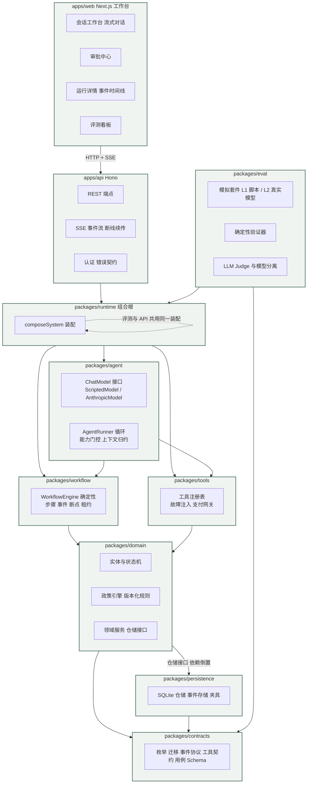
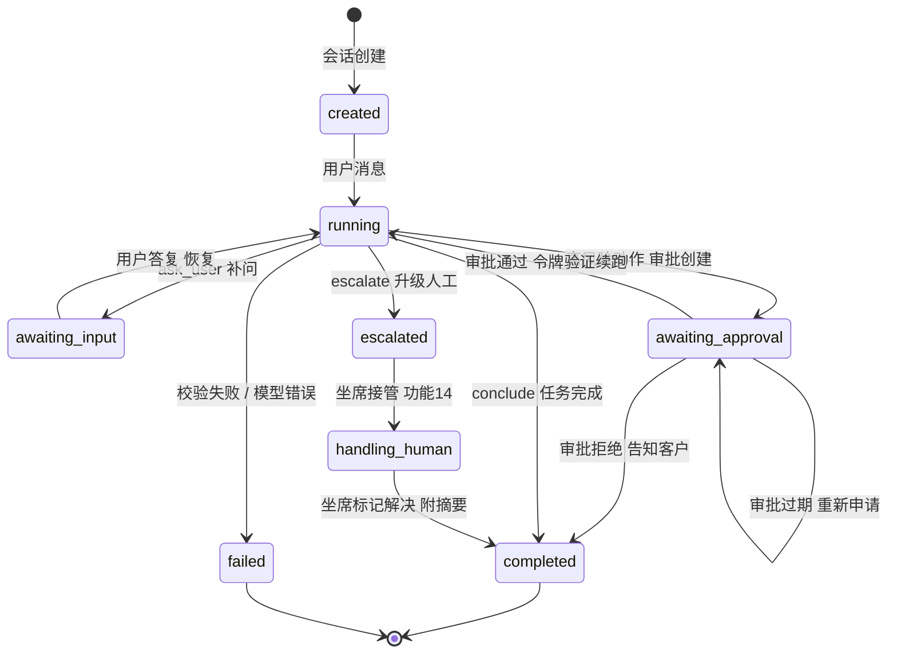
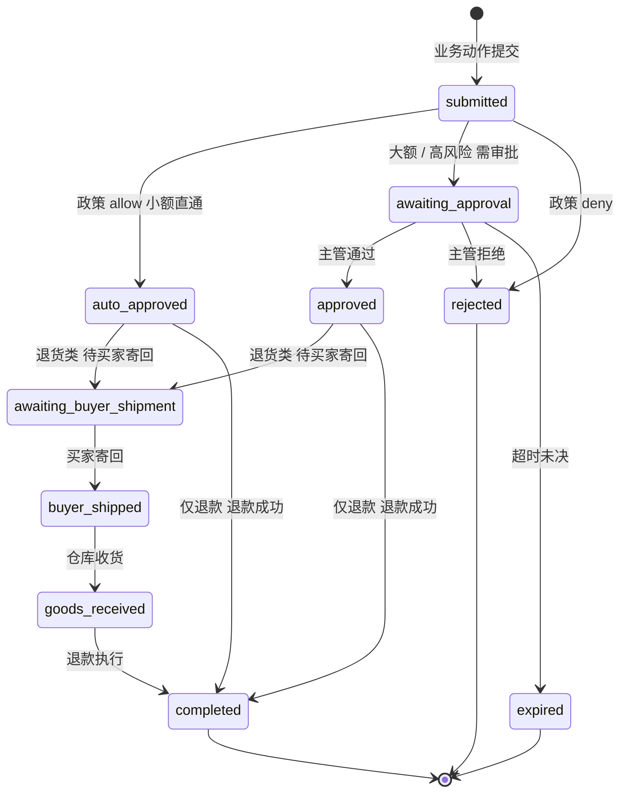

# 架构图与状态机图

mermaid 版本 与 [architecture.md](architecture.md) 的 text-art 图互补 本文渲染为图形 状态枚举与迁移以 contracts/enums.ts 为权威源

## 系统架构图

依赖规则 单向向下 domain 不依赖 persistence 由仓储接口倒置 评测与运行时共用同一组合根 评测环境即运行环境

## Agent 运行状态机图

任何状态随时可从事件表重建上下文 断点续跑跳过已完成步骤 审批通过后模型可见摘要必须显式置为 approved

## 售后单状态机图

退款单状态 created → executing → succeeded / failed 由审批环节把关 created 到 executing 之间必须持有效审批令牌 执行前幂等记录与令牌双重校验
