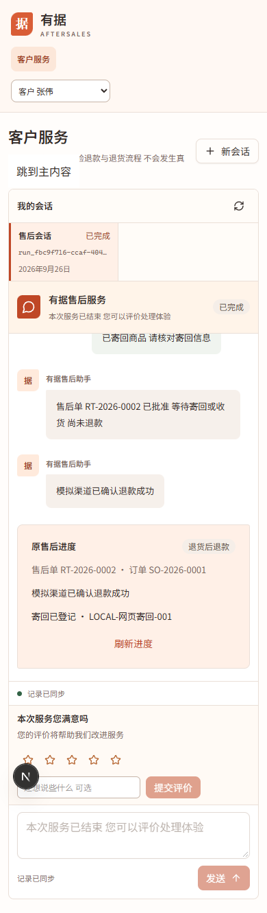
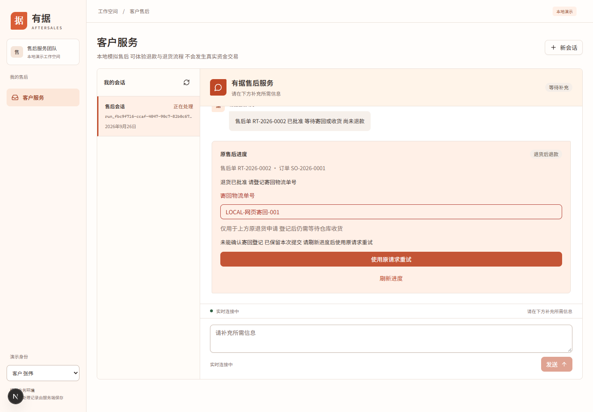
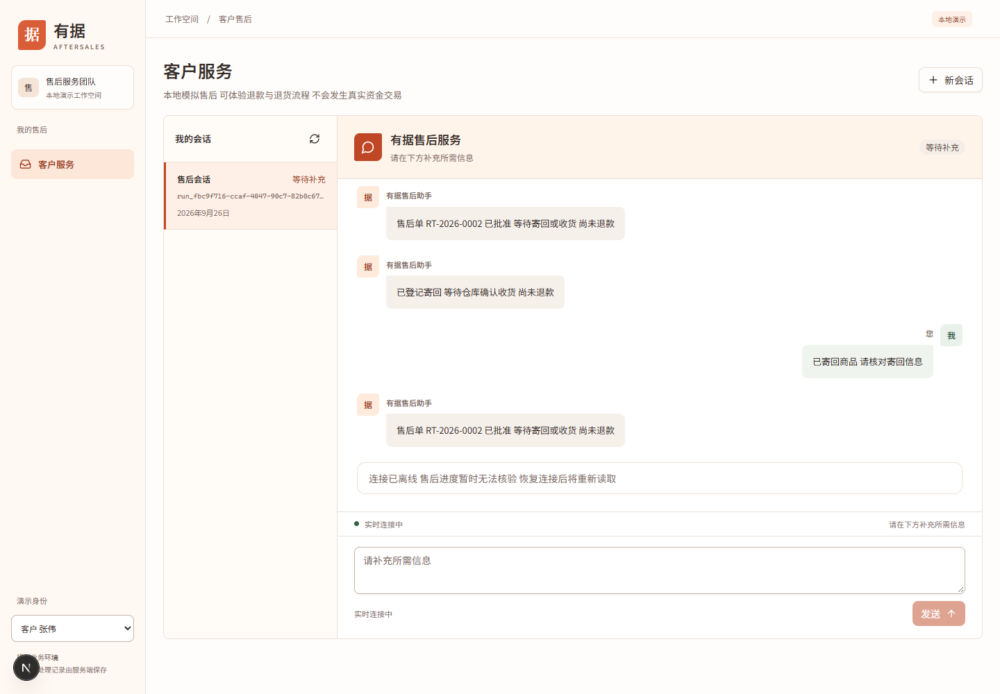

# 客户寄回网页产品验收

本记录属于任务 B 产品补齐 不属于 P8 模型实验

采用独立临时目录 数据库 本机随机端口 确定性离线模型协议及独立本地模拟资金渠道 不读取环境文件或真实密钥 不启停 8787 8790 不默认 build

验证流程为正式客户网页发起退货诉求 主管批准 客户结构化寄回 运营收货 客户查看模拟退款确认 刷新及 SSE 重连保持一致 同时核对 HTTP 请求键 数据库状态 渠道 submissions charges 和客户完成事件数

## 环境与证据

验收日期 2026-09-26

本次 API http://127.0.0.1:59135 前端 http://127.0.0.1:59130 模拟渠道 http://127.0.0.1:51472 均为随机本机端口 首次 C 盘副本前端端口 59136 因跨盘解析失败不计通过

API 直接启动项目 apps/api/src/main.ts 设置 P6_BUSINESS_MODE=simulation 与独立 DB_PATH P6_PAYMENT_SIMULATOR_URL 通过显式环境传入 非模型凭据没有从用户环境文件加载 前端正式源码复制到同盘独立临时目录 独立 .next 开发缓存 没有修改 Next 配置或共享数据库 没有 build

独立运行目录 C:/Users/htlocal/AppData/Local/Temp/customer-return-ui-20260926-124648 前端临时副本 D:/project/agent-new/.tmp-customer-return-ui-20260926 最终数据库用 SQLite backup 一致性归档 没有直接复制未合并的 WAL 主文件

浏览器工具首次调用失败 `Codex auth token is unavailable` 当前会话没有 Browser 技能 可用的项目浏览器工作流为已安装 puppeteer-core 与 Chrome 因此沿用现有依赖验证 没有安装新浏览器框架

组件文档 CLI 因本机 realpath EPERM 不可用 外部文档工具也不可用 本次依据已有 Button Input Field Alert Badge 本地实现复用 没有引入新组件框架

[全部证据摘要及源码哈希](customer-return-shipment-ui-evidence/summary.json) [开始工作树](customer-return-shipment-ui-evidence/start-status.txt) [未跟踪文件初始哈希](customer-return-shipment-ui-evidence/start-untracked-hashes.json)

## 首次失败与修复

| 首次结果 | 处理与证据 |
| --- | --- |
| API 类型失败 | 原仓储未从包入口导出 改为现有源码导入 不修改共享 exports 见 first-api-types.log |
| API 首轮 24 失败 10 通过 | 23 项由原测试证据目录写入 EPERM 引起 一项为新接管夹具前置状态错误 见 first-api-tests.log |
| 重试 33 通过 1 失败 | 原领域不允许 awaiting_input 直接 escalated 测试按允许的 running 再 escalated 再人工接管建立夹具 未改业务状态机 见 api-tests-retry.log |
| 本地格式化 EPERM | 对本任务文件申请沙箱写入后完成 没有批量格式化历史文件 |
| 浏览器初次启动超时 | 使用已授权的独立浏览器进程验证 不访问真实支付或模型 |
| 跨盘 Next 开发页面 500 | 前端副本从 C 盘调整到 D 盘独立目录 依赖同盘 原项目配置不变 见 browser-web.log 和 browser-failure-first.png |
| 首次页面身份尚未初始化 | 测试等待真实身份控件再操作 没有伪造页面状态 |
| 模拟断网后未出现错误提示 | Query 暂停不等于 isError 新增 fetchStatus paused 的离线提示 见 browser-evidence-before-offline-fix.json |
| 窄屏终态内容挤压 | 固定外框被评价与禁用输入区挤占 调整窄屏高度为自动并保留至少 320px 会话区 最终截图完整展示进度卡 |

首次失败全部保留 没有把中途测试当成最终通过 没有弱化业务断言

## 定向检查

从 aftersales 目录运行

```powershell
pnpm --config.verify-deps-before-run=false --filter @aftersales/api exec vitest run test/customer-progress.test.ts test/customer-events.test.ts test/conversation-refund.test.ts test/p6-sse-reconnect.test.ts
pnpm --config.verify-deps-before-run=false --filter web test
pnpm --config.verify-deps-before-run=false --filter @aftersales/api --filter web --filter @aftersales/contracts exec tsc --noEmit --incremental false
pnpm --config.verify-deps-before-run=false exec eslint apps/api/src/customer-progress.ts apps/api/src/app.ts apps/api/test/customer-progress.test.ts packages/contracts/src/agent.ts apps/web/src/components/customer apps/web/src/lib/api.ts apps/web/src/lib/types.ts apps/web/test/return-shipment.test.ts apps/web/src/app/eval/page.tsx
git diff --check -- apps/api/src/app.ts packages/contracts/src/agent.ts apps/web/src/lib/api.ts apps/web/src/lib/types.ts apps/web/src/app/eval/page.tsx
```

| 检查 | 最终实测 |
| --- | --- |
| API 定向 | 34/34 通过 新增 8 项包含其中 |
| Web | 32/32 通过 新增 4 项包含其中 |
| API Web contracts 类型 | 退出码 0 |
| 相关 ESLint | 退出码 0 |
| 修改范围差异检查 | 退出码 0 |

日志 [API](customer-return-shipment-ui-evidence/api-tests-final-all.log) [Web](customer-return-shipment-ui-evidence/web-tests-final.log) [类型](customer-return-shipment-ui-evidence/types-final.log) [规范](customer-return-shipment-ui-evidence/lint-final.log)

并行任务尚未统一合并 不宣称全仓最终验收完成 没有运行 P8 或正式模型质量实验

## 浏览器真实流程

1. 打开正式 workbench 切换客户张伟 输入 SO-2026-0001 商品质量问题退货诉求 使用 Enter 发送
2. 等待审批页面不存在寄回输入 通过真实主管 HTTP 审批原单
3. 页面读取正确原售后关联 键盘提交空单号显示校验 输入 LOCAL-网页寄回-001
4. 注入一次真实请求网络失败 页面没有假成功 将同次提交保存在 sessionStorage 刷新恢复原单号与原幂等键 再次提交到本地 API
5. 页面显示等待仓库收货 后端重复相同请求仅一条命令及寄回审计 收货前渠道调用为零
6. 切换 390px 窄屏 无水平溢出 切换其他客户看不到原售后 再返回恢复原会话
7. 浏览器离线显示无法核验提示 恢复联网重新查询 再停止本次 API 实际断开 SSE 重启相同库同端口 自动续传
8. 客户调用运营收货返回 403 运营通过真实 HTTP 收货 页面仅在已确认业务后显示模拟退款成功
9. 刷新后公开进度一致 客户成功消息和 run.completed 事件各一次 联查数据库 渠道和页面
10. 另用客户李娜 SO-2026-0009 未发货仅退款从正式页面发起 确认没有寄回入口
11. 使用独立实验订单 SO-2026-0006 检查同事件循环双提交 只发一次请求 实际本地 API 受理后延迟交还真实响应 切新会话再换身份 不串数据 返回原会话正确显示已登记

第 11 项只延迟实际 HTTP 响应交付 没有伪造 DTO 或资金结果 初始只调整该独立测试订单的配送日期 不预置售后 审批或退款任务

脚本归档 [主流程](customer-return-shipment-ui-evidence/browser-check.mjs) [断线与完成](customer-return-shipment-ui-evidence/finish-check.mjs) [最终布局与仅退款](customer-return-shipment-ui-evidence/final-ui-check.mjs) [双提交与迟到响应](customer-return-shipment-ui-evidence/pending-switch-check.mjs) 脚本记录本机绝对路径 重放时应创建新的临时目录并调整路径 不直接复用已完成售后的实验库

| 浏览器检查 | 结果 |
| --- | --- |
| 页面 URL 和标题 | workbench 与有据售后标题匹配 |
| 非空页面和框架覆盖层 | 正式应用正常渲染 最终无错误覆盖层 |
| JavaScript 错误 | 最终布局及补充流程 pageerror 为空 |
| 网络错误 | 主流程只有主动注入失败 离线 API 停止产生的 ERR_FAILED ERR_INTERNET_DISCONNECTED ERR_CONNECTION_RESET ERR_CONNECTION_REFUSED 已保留 不算无错误日志 |
| 桌面与窄屏 | 1440×1000 390×844 通过 窄屏进度卡完整可读 |
| 键盘与表单反馈 | Enter 发起诉求 空单号错误关联输入 同键重试只读原单号 |
| SSE | 实际 API 重启断流 自动续传 成功结果不重复 |
| 页面及身份隔离 | 迟到读取及迟到提交响应均未污染新页面 |

## HTTP 数据库 渠道联合证据

主流程请求幂等键 `c6617833-a656-49ef-a238-7e9f5236d561` 失败前与刷新后的请求体和键完全一致 浏览器请求原文见 [完整证据](customer-return-shipment-ui-evidence/browser-evidence-final.json)

| 场景 | 售后 | 退款 | submissions | charges | 寄回审计 | 完成事件 |
| --- | --- | --- | ---: | ---: | ---: | ---: |
| 核心退货 RT-2026-0002 | completed | succeeded | 1 | 1 | 1 | 1 |
| 仅退款 RT-2026-0003 | completed | succeeded | 1 | 1 | 0 | 1 |
| 切页中寄回 RT-2026-0004 | buyer_shipped | created | 0 | 0 | 1 | 0 |

最后一例仅验证寄回与切页 不执行收货 不宣称退款成功 因此归档库总计两笔模拟退款 核心退货自身始终只有一笔

[业务数据库](customer-return-shipment-ui-evidence/application.db) [独立渠道数据库](customer-return-shipment-ui-evidence/channel.db) [分流程查询及源码哈希](customer-return-shipment-ui-evidence/summary.json) [仅退款与最终布局](customer-return-shipment-ui-evidence/final-ui-evidence.json) [双提交及迟到响应](customer-return-shipment-ui-evidence/pending-switch-evidence.json)

后端定向同时覆盖审批前拒绝寄回 篡改 returnNo 他人会话 客户越权收货 审批拒绝 过期 资金 unknown 原成功事实矛盾或发送许可为空 只读查询无写入 DTO 严格字段白名单及人工接管旧接口行为

## 限制及交付边界

没有验证真实物流 支付供应商 真实模型 生产认证 跨浏览器矩阵或部署 架构权限仍由原服务端保证 客户输入草稿仅在同标签页会话存储保留 关闭标签页后的客户端请求键恢复未承诺

既有人工接管接口会将带 returnShipment 的请求当作普通留言 任务 B 不改该业务分支 页面以重查事实防止假登记 建议统一集成者决定是否显式拒绝 见交接清单

已归档后关闭本次随机端口服务 子进程目标清单见 stopped-processes.json 首次跨权限 Stop-Process 有报错 改由原工具会话发送中断后只读探测四个临时端口均不再监听 见 [清理复核](customer-return-shipment-ui-evidence/port-cleanup.json) 不修改或启停既有 8787 8790 没有清理用户原工作树 没有修改共享交接入口或 IMPLEMENTATION.md

## 截图







