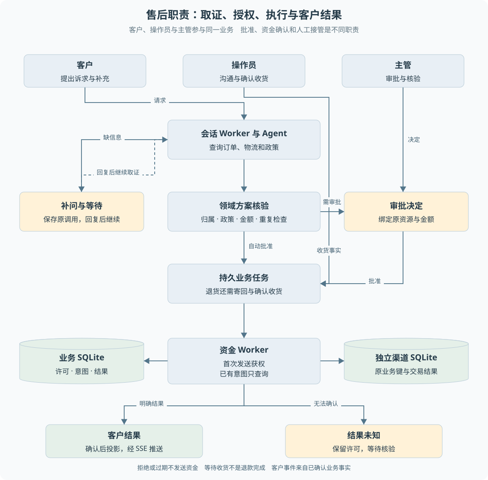

# 第 01 章 售后业务与项目边界

客户说“东西还没发，我不想要了”，系统需要做的不只是生成一句回复。它必须找到正确订单，确认付款与发货情况，根据政策判断能否退款，在需要时取得主管批准，并把处理结果准确地交给客户。

其中任何一步出错，影响都不相同：找错订单可能越权，解释错政策可能误导客户，重复执行退款则会造成资金差错。**这个项目的主要问题是如何把自然语言诉求变成受控业务动作，而不是怎样让聊天回复更像客服。**

> **阅读前提**：知道浏览器向服务器发送请求、服务器保存业务数据即可。无需预先掌握 Agent、数据库事务或任务队列。

## 设计思路

### 从一个最小售后流程开始

最小方案可以是一张退款表单：客户选择订单和原因，服务器判断资格后执行。这适用于信息完整、规则确定的业务。如果用户准确填写了全部字段，额外引入模型未必更好。

自然语言入口增加了另一类工作。客户可能只说“上次买的那件坏了”，订单未明确，诉求可能是换货也可能是退款，必要事实分散在订单、物流与政策中。系统需要补问和查证，才能形成可以执行的申请。

教学上可以据此得到四层职责。这是解释当前设计的推导，不代表仓库曾逐版按此顺序开发。

1. **理解与取证。** Agent 根据消息决定还缺什么信息，查询订单与政策，必要时向客户补问。Agent 指能结合环境结果继续选择行动的程序，并不等于拥有无限权限的模型。
2. **资格与方案。** 领域代码重新读取事实，决定是否允许退款、金额是多少、是否需要审批。模型提供的申请意图不是执行授权。
3. **执行与恢复。** 已批准的方案交给持久任务；发送许可、幂等记录和渠道查询约束资金动作，进程退出后仍保留处理依据。
4. **沟通与核验。** 客户页面展示可公开的进度，操作员处理异常与收货，主管作审批决定。客户不需要看到模型配置和内部调试信息。

图 1-1 从上方三个角色进入中间主流程，两侧分别为补问与审批，底部展开明确结果和未知结果。数据库形状标明业务库与独立渠道库。人工核验表示处理责任，不代表项目已经实现真实渠道自动对账。

### 为什么要保留人的角色

人工并不是所有异常的万能出口。主管批准解决的是授权问题，无法证明退款已经到账；操作员接管解决的是沟通与处置责任，无法清除一笔结果未知的交易。

因此，系统将“谁可以作决定”和“决定后如何执行”分开。页面按钮只是入口，实际权限由 API 与业务规则判断。这样即使用户伪造请求，也不能因为看到了某个页面就获得相应能力。

## 两条贯穿教材的业务主线

### 仅退款

以尚未发货的订单为例，客户表达取消意愿后，系统需要确认订单归属、状态和退款原因。领域规则允许时形成退款方案；达到人工审批条件时先等待主管，否则走自动批准路径。

**自动批准不等于直接调用支付。** 它仍然需要持久业务受理、执行权保护和渠道确认。自动与人工批准在授权来源上不同，不应因此拥有不同的资金安全标准。

正常结果是渠道确认成功，退款与售后记录更新，客户看到完成。异常结果可能是无权访问订单、政策拒绝、审批过期、渠道明确拒付或结果未知。它们不能全部映射成一个“失败，请重试”。

### 退货后退款

这条链路多了寄回和收货两个事实。批准退货只说明允许客户进入后续流程，**不是批准后立即退款，也不是已收到货物**。

顺序是申请与批准、等待寄回、登记运单、操作员或主管确认收货、受理退款任务、核验渠道结果。寄回信息必须绑定原会话和原售后单。收货触发后续资金任务时，仍使用原退款业务身份，不能再建立一笔无关退款。

这个流程说明状态建模的重要性：等待客户寄回是一种可恢复的正常等待，不是程序执行失败。不能为了让所有任务都显示绿色，把“等待结束”当成“退款成功”。

| 业务事实 | 仅退款 | 退货后退款 |
| --- | --- | --- |
| 政策与归属核验 | 需要 | 需要 |
| 人工审批 | 由具体政策与金额决定 | 由具体政策与金额决定 |
| 客户寄回与确认收货 | 无此步骤 | 退款前置事实 |
| 持久资金执行与渠道核验 | 需要 | 需要 |
| 未知结果可直接重发 | 不可以 | 不可以 |

## 用户、操作员与主管

客户身份包含客户号，服务端据此限定订单和会话范围。操作员与主管属于工作台角色，但并非所有动作权限相同。

| 角色 | 主要动作 | 重要边界 |
| --- | --- | --- |
| 客户 | 发起自己的会话、补充信息、查看自己的进度、提交允许的寄回信息 | 不能访问其他客户资源，不能审批 |
| 操作员 | 查看工作台、人工接管与回复、确认收货、执行允许的运营操作 | 不能通过主管审批接口作决定，人工结案仍需业务核验 |
| 主管 | 作审批决定，也能访问部分操作员入口 | 批准不绕过金额绑定、执行权或资金结果核验 |

当前认证使用固定演示令牌，将令牌映射为角色和客户号。这使本机演示可复现，但不能作为真实登录、会话管理和凭据生命周期的实现经验。

信息边界也在服务端处理。客户事件通过白名单投影，只保留允许的类型与字段；内部工具轨迹、模型配置和错误详情不会因为新增事件就自动公开。前端隐藏字段不等于服务端没有泄露，教材会在 SSE 章节具体说明。

一个典型反例是人工处理中提交结构化寄回数据。普通客户留言可以继续送给坐席，但结构化寄回代表业务推进，当前接口会拒绝这类混用。否则前端收到“消息发送成功”，客户就可能误以为运单也已经登记。

## 仓库中的能力与当前入口

学习一个持续演进的项目，需要区分代码存在、模块通过测试和正式入口可用三个层次。

当前正式 API 只在显式 simulation 模式下打开持久客户会话；真实模型传输保持关闭。默认持久客户资金主线是仅退款和退货后退款。仓库中确实保留补偿、价保、换货相关服务及旧运行路径，但不能据此宣称这些动作已迁移到相同客户持久闭环。

P8 提供有限双分支调查与运行记忆模块，也不能解释成默认每个客户请求都会启动多个 Agent。判断接入范围应查看组合根和调用入口，而不是只看目录名或测试文件名。

模型相关证据同样需要分层：

- **离线脚本模型**适合固定轨迹，验证权限、恢复、状态和账本机制。
- **历史真实模型实验**只说明当时的模型、提示词、数据集与环境结果。
- **当前版本真实模型质量**需要相应实测，不能用离线全绿推导。

这不是削弱项目价值。可解释的工程保证与可测量的模型行为原本就是两个不同问题。面试中能够说清它们，比将所有测试包装为“Agent 准确率”更有依据。

## 如何判断一次售后真正完成

完成必须对应具体业务目标。订单查询得到答案，与退款成功，需要的证据不同。对退款主线，至少要能沿业务关联找到原售后、退款记录、资金执行结果和客户投影。

检查时需要分开三个问题：

1. **请求是否受理**：HTTP 返回了什么，是否形成持久命令。
2. **业务是否完成**：渠道是否确认，退款和售后记录是否达到相应终态。
3. **客户是否获知**：原动作是否回填，事件是否可以补发，页面是否展示正确进度。

前端卡住不代表后台退款失败；客户看见“提交成功”也不代表钱已经退回。异常恢复必须先定位断在哪一层，再决定查询、补投影或人工核验。

## 源码参考与证据

| 入口 | 本章对应内容 |
| --- | --- |
| [model-entry.ts](../../apps/api/src/model-entry.ts) | 正式模型入口关闭与显式 simulation 选择 |
| [auth.ts](../../apps/api/src/auth.ts)、[app.ts](../../apps/api/src/app.ts) | 身份映射、角色要求与业务路由 |
| [after-sale-service.ts](../../packages/domain/src/services/after-sale-service.ts) | 资格、方案与重复售后检查 |
| [p6-conversation-refund.ts](../../packages/persistence/src/p6-conversation-refund.ts) | 原会话与退款关联、建单及结果投影 |
| [customer-view.ts](../../apps/api/src/customer-view.ts) | 客户事件与运行字段白名单 |
| [退款闭环实验](../experiments/p6-conversation-refund.md) | 客户入口、审批、寄回、越权与未知结果的历史验证条件 |
| [人工消息接口修复](../handoffs/human-return-fix.md) | 普通留言与结构化寄回的边界 |

业务价值在本项目中体现为明确的责任划分、可复现的离线链路和可解释的故障处理。没有真实业务量、客服工时或线上成本数据，不能推导实际降本比例。后续章节将沿同一笔退款展开实现，不把通用电商行业判断写成本项目已测收益。

---

本章学习衔接：[渐进重建练习一与二](渐进重建练习.md) · [集中自测第 01 组](集中自测.md) · [返回导学](导学-有据售后.md)
