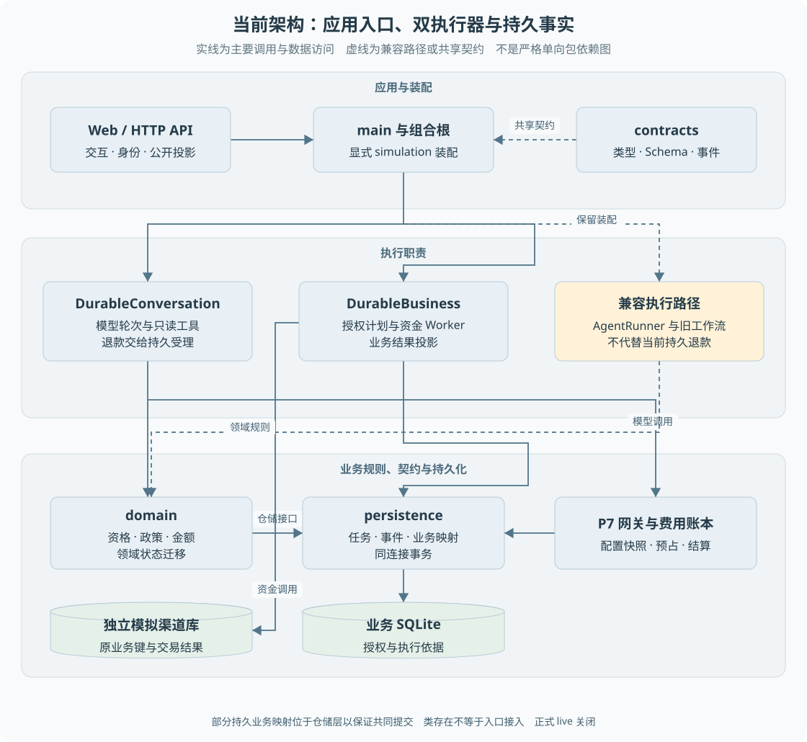

# 第 03 章 架构与源码阅读地图

第一次打开仓库，会同时看到 `agent`、`workflow`、`runtime`、`persistence`，以及名称含 P6、P7、P8 的模块。目录名并不能直接说明当前客户请求经过哪些代码。**阅读架构时，先确定运行入口，再追踪装配和调用，比从每个包逐行开始更有效。**

> **阅读前提**：熟悉 TypeScript 模块与函数调用，先读[第 02 章](02-一次退款请求的全景.md)。不要求先掌握所有框架。

## 架构设计思路

### 从单文件实现推导职责分层

一个教学用最小实现，可以在 HTTP 路由中解析输入、查询订单、调用模型并执行退款。它容易开始，但业务规则、数据库操作和对外协议纠缠后，会出现三个问题：规则难以独立测试，换存储会牵动业务判断，模型调用与资金副作用难以分别治理。

当前项目采用多包结构，把不同变化原因分开：

1. **协议层约定可以传递什么。** `contracts` 提供共享类型、Schema、事件与错误定义。前后端不应各自猜测同一个状态或参数的含义。
2. **领域层决定业务上允许什么。** `domain` 保存订单、退款、政策、状态迁移及仓储接口。资格与金额规则不应写在页面或 Prompt 中。
3. **基础实现保存和读取事实。** `persistence` 用 SQLite 实现仓储、持久任务、事件、账本与业务关联，也承担部分必须同事务完成的映射工作。
4. **运行时把能力组合起来。** `runtime` 选择具体模型、仓储、工作流及 Worker，把接口连接为能运行的系统。
5. **应用层提供访问方式。** API 负责 HTTP、认证与 SSE，Web 负责角色交互与展示。评测提供另一种驱动方式，用可控输入观察系统行为。

这种划分不是“每层只能调用下一层”的整齐阶梯。类型和接口会跨包被引用；一些持久退款映射位于仓储层，是因为它们需要同库同步事务。阅读时应根据实际 import 和调用判断，而不是强行套一个理想化分层图。

图 3-1 按应用装配、执行职责和业务持久化分层，同级节点横向对齐。实线表示主要调用与数据访问，虚线表示共享契约或兼容路径，不是完整 import 图。domain 到 persistence 的调用通过仓储接口完成，不表示领域层直接依赖 SQLite 实现。

### 组合根解决什么问题

组合根是集中创建并连接具体对象的位置。例如领域服务依赖“订单仓储”，并不必自己选择数据库文件；组合根将 SQLite 仓储注入服务，再把服务交给工具和执行器。

仓储（Repository）是读写业务记录的接口或实现，例如“按订单号找订单”；领域服务（Service）组织规则和业务动作，例如“校验后准备售后”；注入就是创建对象时把它需要的依赖作为参数传进去。它们都是普通 TypeScript 对象协作，不要求先掌握依赖注入框架。

可以用一条调用理解分层：HTTP 路由取得客户输入 → 服务调用仓储读订单 → 服务依据政策判断 → 仓储保存允许的结果。当前持久流程有些关联写入集中在 persistence，是为了共同提交；不能根据文件夹名字推断所有保存都一定经某个 Service。阅读源码时先问“这一段在决定规则，还是在安排数据共同保存”。

本项目的 `composeSystem` 还统一共享数据库连接、任务仓储和模型费用账本。事务要求同连接的地方，不能随意另建一个仓储连接替换。否则代码表面仍有事务包装，实际写入却可能不在同一个提交边界内。

装配也决定能力是否启用：只有提供相应选项，系统才构造持久会话和持久业务执行器。一个类存在，不代表入口已经装配它。这个判断在真实模型、P8 调查和旧资金路径上尤其重要。

## 实际技术栈与职责

| 技术 | 项目中的用途 | 不应推导出的结论 |
| --- | --- | --- |
| TypeScript 与 pnpm workspace | 多包类型协作、依赖管理、脚本运行 | 类型检查不能证明外部响应真实正确 |
| Hono | HTTP 路由、中间件与 SSE 入口 | 框架不会自动提供业务授权和幂等 |
| Next.js 15、React 19、Tailwind 4 | 页面、角色工作台、状态与样式 | 页面状态不是业务事实源 |
| Zod | 运行时输入与协议结构校验 | 字段合法不等于用户有权限操作 |
| better-sqlite3 与 SQLite | 同步数据库操作、事务、任务和账本持久化 | 不等同于多机共享数据库部署 |
| Vitest | 单元、集成与部分进程恢复测试 | 测试总数不等于模型质量分数 |
| 原生工具调用适配 | 消息块、工具调用与流式结果处理 | 存在 Anthropic 适配器不代表正式 live 入口开放 |

版本范围以各包 `package.json` 为依据，实际安装结果以锁文件为准。文档中的 Next.js 15 等表示版本系列，不应把依赖声明的起始版本当作当前解析到的精确版本。部署记录还需区分宿主 Node 与实际脚本进程使用的 Node。

## 从运行入口定位代码

### 第一站：进程入口

`apps/api/src/main.ts` 先解析业务模式，再打开业务库与初始化演示数据。显式配置内嵌渠道时，渠道服务使用另一数据库。随后创建系统、启动会话及业务扫描循环，最后提供 HTTP 服务。

关闭顺序也在这里：停止接入与长连接，等待后台执行器结束，再关闭渠道与数据库。强制退出后的恢复由持久事实承担，不靠退出回调一定执行。

因此，排查“本地启动了什么”应先看 `main.ts` 与 `model-entry.ts`。历史 `demo:desk`、`demo:durable` 和评测脚本可能采用不同装配，不能互相替代运行验收。

### 第二站：API 与浏览器边界

`app.ts` 决定一个请求进入哪个分支，并进行身份、归属和角色检查。`customer-view.ts` 将内部事件映射成客户可见字段，`customer-progress.ts` 根据原业务事实生成进度。

Web 的 `CustomerWorkspace` 组织客户交互，`lib/api.ts` 处理 API 请求，`event-stream.ts` 与相关 SSE 工具处理事件接入。页面读取服务端结果，不应独立重新计算是否已经退款。

API 与前端之间的契约错误经常表现为状态错位：例如把受理成功当成完成，把错误提示当成可自动重试指令，或在切换身份后继续显示旧请求结果。此类问题要两侧联读，而不是只找某个 React hook。

### 第三站：两个持久执行器

`DurableConversation` 负责模型轮次、补问、只读工具与业务动作交接；`DurableBusiness` 负责已授权业务受理、资金 Worker 和结果投影。两者复用 `P6Worker` 的任务认领机制，但支持的任务类型与执行端口不同。

会话执行器的直接支付端口会拒绝调用，退款必须交给业务受理。资金执行器不把已批准方案重新送给模型规划。这种装配约束把职责落实到代码，不只写在提示词中。

P6、P7、P8 是升级阶段编号：P6 主要对应持久执行，P7 对应模型预算与费用，P8 对应有限调查。它们不是三个不同产品，也不是三个默认协作的 Agent。

## 用一个问题串联源码

源码阅读可以从“为什么重启后不会重新退款”开始：

1. 在 API 找到受理与继续分支，确认任务如何关联原客户和运行。
2. 在会话执行器找到退款动作交接，确认它不会直接调用渠道。
3. 在退款仓储找到业务键和原工具关联，确认重放不会变成新业务。
4. 在资金 Worker 找到发送／查询分支，确认已有意图如何恢复。
5. 在测试中找对应故障点，确认断言检查了渠道提交次数，而不只是最终状态。

这条路径同时包含数据、控制流和证据。只阅读某一个类会遗漏它的装配前提，例如“仓储有守卫”不等于所有调用者都注入了该守卫。

## 源码参考

| 问题 | 首选入口 | 接着阅读 |
| --- | --- | --- |
| 进程启动与能力开关 | [main.ts](../../../apps/api/src/main.ts) | [model-entry.ts](../../../apps/api/src/model-entry.ts) |
| 对象如何连接 | [compose.ts](../../../packages/runtime/src/compose.ts) | [durable-business.ts](../../../packages/runtime/src/durable-business.ts) |
| 客户请求如何推进 | [app.ts](../../../apps/api/src/app.ts) | [durable-conversation.ts](../../../packages/runtime/src/durable-conversation.ts) |
| 规则与授权依据 | [after-sale-service.ts](../../../packages/domain/src/services/after-sale-service.ts) | [policy.ts](../../../packages/domain/src/policy.ts) |
| 数据与事务 | [db.ts](../../../packages/persistence/src/db.ts) | [p6-task-repository.ts](../../../packages/persistence/src/p6-task-repository.ts) |
| 浏览器状态 | [CustomerWorkspace.tsx](../../../apps/web/src/components/customer/CustomerWorkspace.tsx) | [customer-view.ts](../../../apps/web/src/components/customer/customer-view.ts) |

## 验证依据与架构取舍

早期[架构文档](../../architecture.md)和[ADR](../../adr/DECISIONS.md)解释了原生循环、分层与未采用部分框架的原因，但其中旧执行路径不能覆盖后续持久退款改造。当前装配应结合[退款闭环交接](../../handoffs/p6-conversation-refund.md)和源码确认。

多包结构使业务判断可以单独测试，但也增加了跨包定位和关联维护成本。项目中部分同步业务映射位于 persistence，体现了事务约束与纯分层之间的取舍。教材将解释这种现实结构，不把它美化成完全无耦合的架构。

未来如果迁移到其他数据库或独立 Worker 服务，最重要的不是搬动目录，而是保持命令受理、授权、执行权与结果确认的原子边界。架构图能帮助发现边界，真正保证行为的仍是接口、事务与对应测试。

---

本章学习衔接：[渐进重建练习一与二](../09-练习与自测/渐进重建练习.md) · [集中自测第 03 组](../09-练习与自测/集中自测.md) · [返回导学](../导学-有据售后.md)

业务对照：[B02-业务对象与状态关系](../03-业务逻辑详解/B02-业务对象与状态关系.md)。
