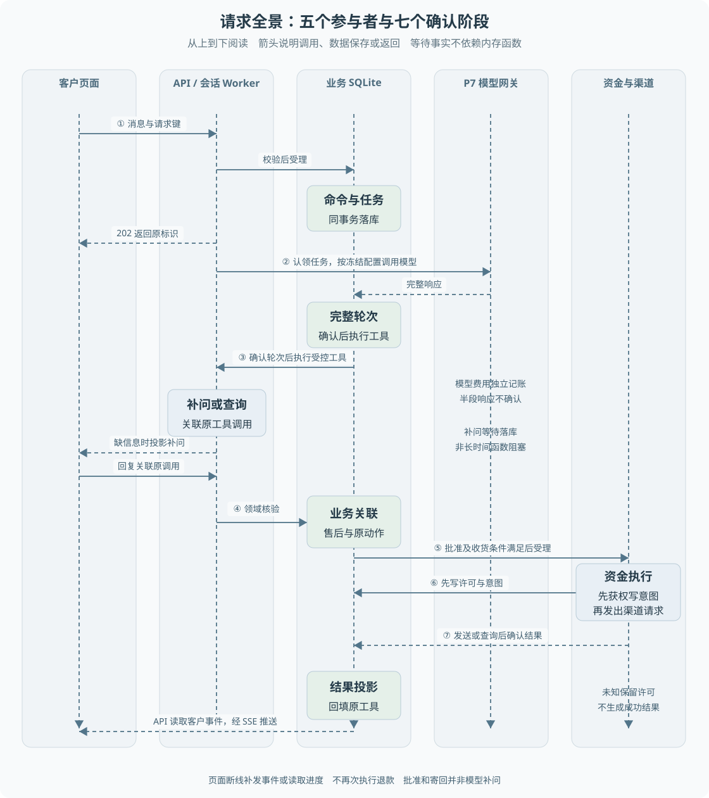

# 第 02 章 一次退款请求的全景

客户在页面输入“我要退款”，直到页面显示结果，中间并不是一次模型调用。请求受理、模型取证、业务授权、资金执行和结果展示在不同时间完成。**理解这条链路，需要同时追踪控制流与保存下来的事实。**

> **阅读前提**：熟悉 HTTP 请求与异步函数，先读[第 01 章](01-售后业务与项目边界.md)。本章中的事务、租约和检查点先按其职责理解，后续章节再展开实现。

## 实现思路

### 将长流程拆成可确认的阶段

最小实现可以让 HTTP 路由调用模型，再调用退款函数，最后返回结果。但售后可能等待补问、主管决定或客户寄回，持续时间远超一次普通请求。进程退出也会丢失内存中的调用位置。

当前持久链路把“接受一次输入”与“完成售后”分开。受理时先保存命令和任务，响应返回身份标识；后台 Worker 从数据库领取任务，再按已保存的状态推进。

1. **页面发送用户输入和请求键。** 服务端解析身份，检查输入，把客户消息、运行关联和配置快照持久化。相同请求的重放应得到原受理结果。
2. **会话 Worker 完成模型交互。** 它组织历史消息和工具目录，经模型网关调用离线传输。模型返回完整的一轮之后确认该轮，再执行允许的工具或暂停补问。
3. **退款动作转为业务任务。** 模型申请退款时，领域层重新核验订单、政策和金额。原工具调用与售后单建立明确关联；自动批准或主管批准形成受控持久业务任务。
4. **资金 Worker 执行已授权方案。** 它不会重新让模型计算退款金额。发送前校验执行权与业务事实，渠道响应后保存确认结果；已有发送意图的恢复优先查询。
5. **持久结果投影给客户。** 业务结果回填原工具调用并生成事件。SSE 读取事件并推送客户可见投影，页面据此更新；刷新和重连不会重新执行退款。

每个阶段都有对应的持久记录。系统因此可以区分“模型轮次还没确认”“退款已受理但未执行”和“业务已完成但客户事件尚未投影”，恢复不必把所有阶段再跑一遍。

图 2-1 使用五条泳道表示参与者，从上向下读取调用顺序。数据库中的矩形表示确认记录，横向实线表示调用，虚线表示返回或事件推送；纵向虚线只用于对齐参与者。资金执行与模拟渠道合为一条泳道，内部发送细节见第 14 章。SSE 由 API 读取事件后推送，数据库不主动向浏览器发送。

## 第一步：HTTP 只确认受理

当前持久入口是 `POST /api/runs`。客户身份来自认证结果，不能由请求体任意指定。`Idempotency-Key` 将这次输入与一次受理绑定，成功响应为 `202 Accepted`，包含 `runId`、`commandId`、`taskId` 与 `accepted`。

这些标识有不同用途：运行关联整个会话，命令记录这次受理内容，任务用于后台调度。页面需要保存运行身份以继续查看进度，但不应从编号猜测业务结果。

**202 表示任务已经受理，不表示模型已回答，更不表示退款已发生。** 旧兼容分支存在返回 201 的后台执行方式，不能把旧响应形态直接套到当前持久入口。

受理成功后即使页面关闭，持久任务仍可由后台处理。若网络在响应返回前断开，客户也不能随意换请求键重复提交，应先根据相同请求身份取得原结果。是否可以重放，还取决于内容是否相同。

## 第二步：会话 Worker 取证与补问

`DurableConversation` 负责普通持久会话，使用 `P6Worker` 的认领与租约机制。每个模型调用通过 P7 网关，使用运行保存的配置快照，而不是恢复时临时读取另一套配置。

工具调用并非模型直接访问数据库。模型产生工具名和参数，宿主程序检查工具是否允许、参数是否符合约定，再调用受控处理逻辑。工具结果随后以与原调用关联的消息反馈给模型。

会话过程中保存两类确认点：

- **完整模型轮次**：半段流式文本不等于完整决策，不能因为收到一部分参数就提交退款。
- **已完成工具结果**：恢复时复用已经确认的结果，不必重新查询或让模型重新选择已确定动作。

如果缺少订单号，模型可以调用 `ask_user`。系统保存等待的是哪个工具调用，暂停本次任务。客户下一条消息通过原运行进入受理，作为原补问的工具结果继续，而不是突然插入一条无关联聊天。

这一步解释了一个前端现象：输入框可以恢复可用，但后台不是“仍有一个函数一直等着用户输入”。等待事实已经落库，新的输入触发后续处理。

## 第三步：模型意图转为确定性业务

信息足够后，模型可能给出 `submit_refund_only` 或 `submit_return`。当前持久退款受理明确限制参数，**模型不能指定退款金额或伪造授权关联**。

`P6ConversationRefundRepository.submit` 在有效任务的事务边界中读取原订单、物流和已有售后，调用领域方案准备逻辑，再共同保存售后、退款、执行权、审批与原动作关联。出现错误时，不能留下半个售后单和一条无业务依据的资金任务。

原动作关联记录了运行、会话任务、步骤、工具调用、售后单和授权任务等身份。它解决的是“业务结果应该回填给哪个模型动作”。依靠扫描“当前只有一个悬空工具”来猜测关系，在并发和历史状态变化后会变得不可靠。

批准方式影响何时产生可执行方案：

1. **自动批准**：业务规则已允许，仍经过持久受理和执行权保护。
2. **主管审批**：决定、凭据与执行意图需要与原方案绑定，不能仅根据页面传来的金额放行。
3. **退货等待**：批准后先等待寄回和收货，不立即发出退款。

当前正式客户路径不会遇到未迁移动作就偷偷退回旧资金服务。补偿或换货请求需要按现有边界处理，不能将“兼容代码存在”当作迁移已完成。

## 第四步：资金执行与未知结果

`DurableBusiness` 装配的资金 Worker 执行已验证计划。它的模型步骤只是确认确定性计划来源，并不额外请求模型重新决策。

资金请求之前，业务库先保存发送许可和意图。渠道库独立记录交易，以业务键绑定资源、金额和币种。两库不能由同一个 SQLite 事务原子提交，因此必须处理渠道成功但本地尚未确认的窗口。

正常路径是发送、确认、回写。故障恢复则读取已有意图，按原业务键查询，不能因为 Worker 换了进程就重新退款。结果无法确认时任务进入待核验，执行许可保留。

对页面而言，需要区分**等待审批、等待寄回、执行中和结果待核验**。它们虽然都不是“已完成”，但允许的用户操作不同。把它们压成一个 loading 状态，会导致错误按钮与错误重试建议。

## 第五步：业务结果与页面状态

业务成功落库后，后续扫描还要投影结果。所谓投影，是从内部记录生成特定读者需要的表示：原工具调用得到结构化结果，客户事件得到可以公开的状态和文字，操作员则可以查看更详细的业务信息。

SSE（Server-Sent Events，服务器发送事件）提供服务器到浏览器的连续事件流。它负责传送已保存的变化，不承担退款业务执行。页面断线后重连，应补发事件或重新读取进度，而不是调用退款接口“再做一次”。

客户事件保留原事件序号，但隐藏内部类型和字段。因此序号可能不连续，前端不能把跳号直接判成丢消息。最终页面状态还需要考虑身份切换和请求迟到：旧客户请求晚返回时，不能覆盖新客户页面。

## 用故障位置定位问题

| 现象 | 先看什么 | 不应直接做什么 |
| --- | --- | --- |
| 提交后没有回复 | 请求是否受理、任务状态、模型调用记录 | 换键重复提交 |
| 一直等待审批 | 原审批状态与执行意图 | 让模型宣布批准 |
| 收货后没有退款 | 原收货绑定、授权任务、资金意图 | 新建另一退款单补救 |
| 渠道超时 | 原业务键的渠道查询与资金效果 | 清理 sending 后重发 |
| 后台成功但页面没变 | 结果投影、事件游标、客户进度请求 | 再执行资金动作 |

这张表按故障所属阶段定位。某个页面状态相同，不代表根因相同。排查要把 HTTP、任务、业务、渠道和事件放在同一关联链中，不能只看一条“接口成功”日志。

## 源码参考

| 顺序 | 入口 | 阅读目标 |
| --- | --- | --- |
| 1 | [CustomerWorkspace.tsx](../../apps/web/src/components/customer/CustomerWorkspace.tsx)、[api.ts](../../apps/web/src/lib/api.ts) | 页面请求与身份、会话的联系 |
| 2 | [app.ts](../../apps/api/src/app.ts) | 创建与继续接口的持久分支 |
| 3 | [conversation-journal.ts](../../packages/persistence/src/conversation-journal.ts) | 输入受理、事件与等待关系 |
| 4 | [durable-conversation.ts](../../packages/runtime/src/durable-conversation.ts) | 完整模型轮次、只读工具与退款交接 |
| 5 | [p6-conversation-refund.ts](../../packages/persistence/src/p6-conversation-refund.ts) | 业务关联与结果回填 |
| 6 | [durable-business.ts](../../packages/runtime/src/durable-business.ts)、[p6-worker.ts](../../packages/runtime/src/p6-worker.ts) | 已授权计划与资金核验 |
| 7 | [sse.ts](../../apps/api/src/sse.ts)、[customer-view.ts](../../apps/api/src/customer-view.ts) | 事件传送与信息边界 |

## 验证依据与取舍

[客户退款进程测试](../../apps/api/test/conversation-refund-process.test.ts)从正式客户 HTTP 发起流程，并在业务受理、批准受理、渠道响应、结果投影和退货等待等边界退出或停止进程。历史[实验记录](../experiments/p6-conversation-refund.md)检查了退款、渠道计数、原工具结果与客户事件，不只检查响应码。

这些证据支持命名故障条件下的本机恢复。当前正式离线主链路使用模拟模型与本机渠道，不提供真实模型效果和真实支付的保证。流程拆分增加了状态表、关联与恢复代码，但也让长等待和进程退出不再依赖单个请求函数的生命周期。

---

本章学习衔接：[渐进重建练习一与二](渐进重建练习.md) · [集中自测第 02 组](集中自测.md) · [返回导学](导学-有据售后.md)
