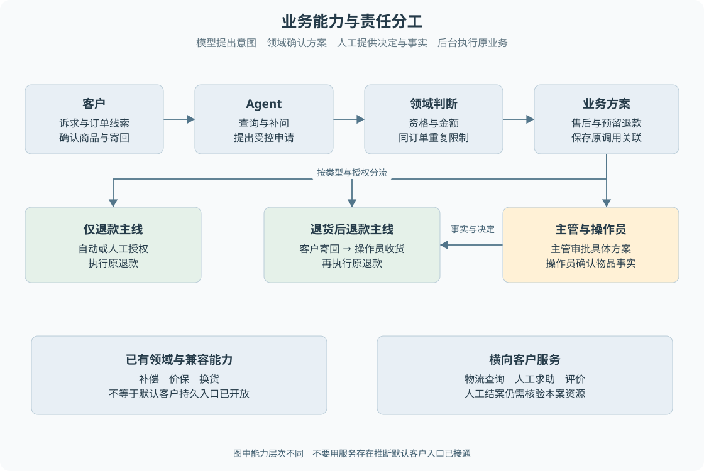

# B01 业务能力全景与角色分工

客户说“东西坏了，给我处理一下”，还没有形成一笔可执行售后。系统至少需要确定是哪张订单、哪件商品、什么问题、希望退货还是仅退款，再核对订单和政策。业务学习从这些问题开始，而不是从数据库表或 Agent 工具名开始。

> **阅读前提**：熟悉页面、请求与响应。建议先读[项目边界](../01-项目全貌/01-售后业务与项目边界.md)。本篇面向当前仓库，规则是项目的简化规则，不代表任意电商平台的政策。

## 实现思路

### 从客户诉求到可执行业务

最简单的做法是给页面一个退款按钮，后端收到订单号就付款。它缺少三个判断：客户是否拥有订单、当前情况是否符合退款条件、是否已经处理过同一诉求。加入聊天并不会让这些判断消失，反而增加了“客户究竟在说什么”的不确定性。

因此系统将处理分为四类工作：

1. **理解和取证**：将自然语言转成候选诉求，缺信息时补问。
2. **领域判断**：根据可信订单、物流、政策决定能否办理及金额。
3. **业务推进**：保存申请、审批、寄回和执行事实。
4. **结果沟通**：把当前事实交给客户或坐席。

> **责任边界**：模型主要参与第一类工作，后面三类都有确定性代码约束。完整层次见[业务架构总览](业务架构总览.md)。

“确定性”指给定同样的业务事实、规则版本和时钟，代码应算出同样结果；不是指所有客户都走相同步骤。“原方案”指第一次合法受理时确定的客户、订单、类型、商品范围、金额和授权关系，后续批准、收货与恢复都要继续指向它。后文反复说“原退款”，是在要求保持这个身份，而不是再生成一笔看起来相似的退款。

对前端开发者而言，可以把这理解为：表单中的可编辑字段表达用户意愿，提交后是否生效由服务端判断；界面里的进度条表达业务事实，而不是按钮被点击了几次。Agent 相当于一种更灵活的信息收集入口，但不能替代服务端校验。

图 B01-1 上半部分展示当前客户主线如何经过各角色，下半部分区分领域能力与正式入口。箭头表示责任交接，不表示模型直接控制资金。补偿、价保和换货没有画入默认客户退款链路。

### 三种实现状态必须分开

仓库里有某个服务，说明系统具备一部分业务实现；有测试调用它，说明存在可检验的局部行为；当前运行入口将它装配并暴露给客户，才说明客户能够沿该入口使用。教材按这三层判断能力，不根据文件名推断产品已经上线。

当前主入口使用持久客户会话和持久退款任务，订单与渠道仍是模拟业务。模型传输可以按本机配置切换，但切换模型不会自动接入真实订单、物流或支付。真实模型与真实业务是两个独立维度。

## 业务能力地图

| 能力 | 要解决的客户问题 | 核心事实和副作用 | 当前边界 |
| --- | --- | --- | --- |
| 仅退款 | 未发货取消、已确认丢件，或需要人工确认的质量问题仅退款 | 原订单、原因、资格、审批、原退款结果 | 已进入默认持久客户业务主线 |
| 退货后退款 | 商品需要先寄回再返还款项 | 原售后、寄回登记、收货、原退款 | 已进入默认持久客户业务主线 |
| 换货 | 保留购买关系，处理有问题的商品 | 售后和收货，现有实现不创建退款 | 有领域与旧流程实现；收货后完结留痕，不能宣称实现库存与重新发货 |
| 补偿 | 就特定原因给予额外安抚金额 | 补偿单、协商金额、原因、授权、渠道结果 | 有领域、工具与兼容流程；未成为默认客户持久退款动作 |
| 价保 | 签收后规定时间内降价，退还符合条件的差价 | 原成交价、当前价、商品数量、价保单 | 有规则、服务与兼容流程；不等于当前客户入口完整接入 |
| 物流查询 | 核对在途、签收、丢件等事实 | 订单归属与物流记录，只读 | 当前客户可查询；主动物流注入对持久会话受限 |
| 人工求助与接管 | 模型不可用、诉求复杂或需要坐席 | 人工案件、消息、原会话关联 | 有当前接口；可能新建关联人工会话，不总是修改原会话 |
| 服务评价 | 客户表达对服务的感受 | 会话评分与评论 | 已有独立接口；允许评分不代表退款完成 |

这里的“默认客户主线”指客户会话提交的受控业务动作。持久模块中的映射器、运营入口和历史测试可以覆盖更广对象，不能把它们合并成一条客户已经可走的流程。[B08](B08-补偿价保与换货.md)专门解释这些差异。

## 角色怎样交接

客户提供订单线索、诉求和允许提交的补充信息。身份由服务端认证上下文确定，不能让模型在工具参数中自行指定另一个客户。没有订单号时，可以展示本人订单候选；**查询候选不等于客户确认选择**。尤其是多商品订单，不能因为某件商品坏了就默认整单退货。

Agent 负责按当前工具集合查询事实、追问必要信息、解释政策并提出申请。它提出“提交退货”时，业务代码仍会重查订单和已有售后。即使模型读到客户写的“主管已经同意”，也不能把这段文字作为审批记录。

操作员负责人工接管、回复、运营寄回登记和确认收货等受限动作。主管除了这些工作，还能通过审批接口决定批准或拒绝。审批权与收货权分别对应资金授权和物品事实，不能用一次主管点击替代客户寄回。

后台执行器负责推进已经受理的任务。它依据持久记录判断该做什么，处理期间可能等待、失败或需要核验。它没有自行改变业务金额的权限，也不能因为任务重启就认定应再付一次。

| 操作者 | 输入 | 后端判断 | 记录变化 | 后续动作 | 客户所见 |
| --- | --- | --- | --- | --- | --- |
| 客户 | 订单线索和诉求 | 身份、信息完整性 | 会话和输入记录 | 查证或补问 | 已受理、待补充 |
| Agent | 结构化申请意图 | 订单归属、资格、重复申请 | 售后及可选退款、审批 | 自动授权或等待审批 | 办理中或等待审批 |
| 主管 | 批准或拒绝 | 原方案、待审批状态、有效期 | 审批决定与执行意图 | 后台受理后续任务 | 决定已记录，资金未必完成 |
| 客户与操作员 | 寄回单号与收货事实 | 原售后、类型、当前状态 | 寄回、收货及任务关联 | 原退款继续 | 等待收货或处理中 |
| 后台 | 原任务与渠道结果 | 授权及结果完整性 | 资金事实和结果事件 | 投影给原会话 | 成功、拒绝或待核验 |

## 先区分四种“结束”

页面请求返回，表示该次网络交互结束。客户会话停止自动运行，表示模型暂时不再继续。某个后台任务完成，表示该执行片段完成。退款成功或人工结案，才是各自业务对象的结果。它们发生在不同时间，也不一定全部出现。

例如退货授权任务可以完成，而售后还在等待客户寄回；拒绝申请后没有退款要执行，但客户可能仍需要人工解释。客户给了五星，也只是一条评分，不是支付证据。后续[B02](B02-业务对象与状态关系.md)会用同一笔退货把这些对象连起来。

人工求助还有一个容易被忽略的区别：如果原会话有正在运行的任务或已经受理退款，当前实现可能另开关联人工会话，让坐席沟通和原业务并行存在。不能把新人工会话的完成文案当作原退款已完成。关联案件的具体核验边界见[B07](B07-人工接管与结案.md)。

## 怎样学习本业务篇

先看 B02 的对象关系，再通过 B03 判断一笔申请是否成立，然后分别跟随 B04 和 B05 走完两条主线。遇到审批或人工接管时阅读 B06、B07，最后用 B08、B09 建立其他业务的边界，用 B10 对照熟悉的前端页面。

业务篇解释规则为什么影响下一步，原 22 章解释技术怎样保障这些规则。第一次读到持久任务时，只需知道它把待办保存到数据库；需要理解进程重启如何接管，再去读租约和检查点章节。这样不会在还不知道“要等谁”的时候，先陷入 Worker 的实现细节。

学习完成的判据不是能背出十个服务名，而是面对一笔具体诉求，能够明确：还缺什么事实、该由谁补充、哪个规则判断、生成哪些记录、什么条件触发下一步、为什么现在还不能告诉客户成功。

## 源码参考与验证依据

### 按业务问题对照源码

按表中顺序阅读，每到一站先回答对应业务问题，再进入下一处实现。路径相对本章，可直接点击；搜索词用于在大文件内定位，不要求逐行通读。

| 顺序 | 业务问题 | 项目源码 | 搜索符号或入口 | 阅读重点 |
| --- | --- | --- | --- | --- |
| 1 | 实际开放了哪些客户入口 | [app.ts](../../../apps/api/src/app.ts) | `/api/runs`、`/api/human-help` | 先找路由与身份检查 再区分当前持久入口和兼容分支 |
| 2 | 这些模块如何组合起来 | [compose.ts](../../../packages/runtime/src/compose.ts) | `composeSystem` | 确认会话服务与业务服务的实际装配 不凭服务文件存在判断能力开放 |
| 3 | Agent 能提出什么动作 | [durable-conversation.ts](../../../packages/runtime/src/durable-conversation.ts) | `execute`、`submit_refund_only`、`submit_return` | 区分查询补问与受控业务提交 |
| 4 | 哪类申请真正进入持久主线 | [p6-conversation-refund.ts](../../../packages/persistence/src/p6-conversation-refund.ts) | `submit` | 核对仅退款与退货白名单以及事务建单 |

### 验证依据与适用范围

[订单选择测试](../../../apps/api/test/order-selection.test.ts)包含不替客户自动选单、部分商品及跨客户拒绝；[客户引导测试](../../../apps/api/test/customer-guidance.test.ts)包含模型不可用时人工求助、另开关联人工和保护原退款。这些是现有测试覆盖，不表示本次重新运行过测试，更不代表真实生产订单效果。

---

学习衔接：[业务练习 B01](../09-练习与自测/业务流程练习.md#b01) · [业务目录](README.md) · [总导学](../导学-有据售后.md)
