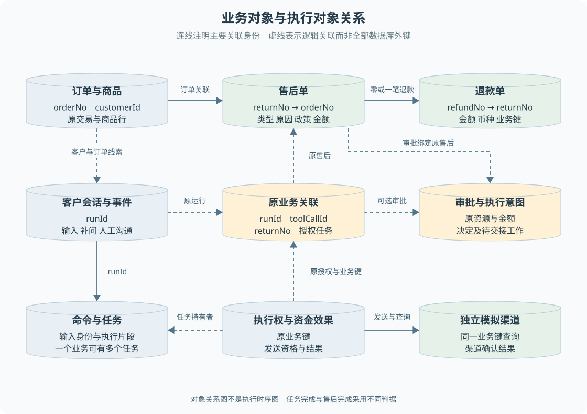

# B02 业务对象与状态关系

前端常把一页中的信息合并成一个状态对象：订单、退款金额、审批结果和聊天消息一起加载。但服务端不能把它们都保存为“当前处理状态”。如果主管批准后客户过两天才寄回，期间刷新页面、进程重启或转人工，每一类事实都要独立保留。

> **阅读前提**：先读[B01](B01-业务能力全景与角色分工.md)。本章随流程解释记录、关系、状态和事务，不要求先掌握 SQL。需要补充数据库基础时参考[第 05 章](../02-后端必要基础/05-数据建模与SQLite持久化.md)。

## 实现思路

### 先确定要记住哪些事实

假设客户买了两件商品，只退其中一件。订单保存原交易，售后单保存这次申请，退款单保存将返还多少钱，审批保存谁同意了这个方案。聊天记录保存客户说过什么，任务保存后台接下来做什么。它们虽然出现在同一个页面，却回答不同问题。

如果只给订单加一个 `refunded` 字段，就无法表达“批准退货但未寄回”“寄回但未收货”“已收货但渠道结果未知”。如果再不断给订单追加聊天、审批和任务字段，修改权限和生命周期会混在一起。更合适的办法是让每个对象只负责一类事实，通过稳定标识关联。

这就是本项目的基本设计：**业务对象描述正在办理什么，执行对象描述系统怎样推进，沟通对象描述客户如何参与。** 状态之间有关联约束，但不是同一个枚举的不同副本。

图 B02-1 中连线标明主要关联键，虚线是逻辑关联，不宣称全部对应数据库外键。订单可有多次历史申请，但业务规则限制当前能否再建单；每张售后最多关联一笔退款，换货和政策拒绝可以没有退款。

第一遍按以下顺序读图：

1. **原交易与申请**：沿订单 → 售后 → 退款读上排，分清各自保存的事实。
2. **沟通与业务的关联**：找客户会话怎样通过原业务关联连到售后。
3. **执行依据**：再看下排任务和执行权，不要求现在就推演租约与发送协议。

> **状态阅读原则**：以下状态都要带着对象一起读，不能只看到 `completed` 就判断整笔业务完成。

| 对象与代码值 | 中文含义 | 当前在等什么 |
| --- | --- | --- |
| 审批 pending | 主管尚未作有效决定 | 主管决定或安全过期处理 |
| 售后 awaiting_approval | 申请需要审批 | 原审批被处理并交接 |
| 售后 awaiting_buyer_shipment | 已获准，等客户寄回登记 | 客户提供合法寄回信息 |
| 售后 buyer_shipped | 已登记寄回 | 操作员确认收货 |
| 售后 goods_received | 已确认收货 | 原退款等后续处理 |
| 退款 created | 已预留退款记录 | 条件满足后执行 |
| 退款 executing | 退款执行尚未明确结束 | 渠道结果与本地确认 |
| 退款 succeeded | 业务退款记录已成功 | 仍需其他证据一致才能公开成功 |
| 任务 queued／running | 后台待办排队／正在执行 | 有效执行者推进该片段 |
| 任务 completed | 这个执行片段完成 | 业务可能还等客户、主管或仓库 |

例如任务 completed 与售后 awaiting_buyer_shipment 同时存在，读成“建立等待这项工作完成，客户还没登记寄回”，就不会误读为状态冲突。状态表用于查词，不要求背完整枚举。

## 订单与商品是判断依据

订单提供客户归属、支付金额、币种、支付渠道、发货和签收时间。订单商品提供商品标识、SKU、类目、单价与数量。客户输入的“我买了 300 元”可以帮助理解诉求，真正算退款金额时仍读取订单记录。

商品标识与 SKU 也有区别。前者标识这张订单中的商品行；SKU 表示可销售的具体商品规格，例如同款耳机的黑色版本，后者用于查找当前售价等信息。同一个 SKU 可以出现在不同订单中，不能只拿 SKU 就认定客户拥有该订单商品。价保服务先检查指定商品属于订单，再按涉及的 SKU 查询价格。

订单的物流记录描述正向配送，例如在途、签收或丢件。客户登记退货运单描述的是逆向寄回。在当前实现中，寄回单号写入售后相关审计，再通过客户进度查询读出；不要假设它一定生成了另一张完整物流实体。**一个页面有两段物流展示，不意味着后端用了同一张表和同一套流程。**

## 售后单表达一次申请

售后单记录订单、客户、类型、原因、商品范围、金额、政策版本和判定结果。它将“我要退货”固化为可核验的业务方案。即使最终政策拒绝，也会留下 `rejected` 售后记录，方便解释和审计。

建单时临时从 `submitted` 起步，但准备逻辑会立即根据政策进入 `auto_approved`、`awaiting_approval` 或 `rejected`。自动获准的退货或换货会继续进入 `awaiting_buyer_shipment`。因此数据库最终读到的初始状态不一定是 `submitted`，前端也不必为每个函数内部瞬时状态设计一屏。

售后单的完成表示这次业务流程达到实现定义的终点。对于退款类业务，必须关联真实退款结果；对于当前换货简化实现，收货后即可留痕完成，不代表另一个包裹已经重新发出。这说明“completed”的业务意义必须与资源类型一起读。

## 退款单表达一笔资金业务

退款单关联原售后，保存退款编号、金额、币种、渠道、幂等键和状态。申请被允许或进入审批时就可能预留退款单，状态为 `created`；此时还没有发生付款。

预留的价值是让审批和后续执行始终指向同一笔资金业务。主管审批的是这张售后和这个金额，收货后继续的也是原退款。如果每次重试都新建退款单，渠道就难以判断两次调用是在恢复同一笔退款，还是两笔独立业务。

当前退款状态包含 `created`、`executing`、`succeeded`、`failed`、`cancelled`，但**并没有一个名为 `unknown` 的退款状态**。资金结果未知由执行权、资金效果和任务共同表达，退款单可能仍是 `executing`。看到页面“待核验”，不能直接去寻找 `refund.status = unknown`。

## 审批、授权与任务各自保存什么

审批保存资源类型、资源编号、金额、申请原因、有效期、决定和服务端一次性凭据。它回答“是否允许这个具体方案继续”。批准以后还需要把后续工作可靠交给后台，因此另有审批执行意图，记录决定之后是否已被消费者接手。

命令保存一次输入的身份及固定内容，任务保存它的执行状态。命令适合回答“这是不是同一次请求”，任务适合回答“现在谁在处理，是否还要继续”。同一业务可以经历申请、授权和收货等多个合法动作，因此不能把退款编号当作所有 HTTP 请求的唯一键。

执行权约束哪个执行路径和命令可以发送原资金动作。资金效果记录调用外部渠道的过程与结果。二者是后端执行事实，并不直接作为客户页面中的全部字段公开。前端看到的是服务端核验后生成的进度，内部 token 和任务租约无需暴露给客户。

会话关联表保存原运行、原任务、原工具调用与售后、审批、授权任务的对应关系。它让后台在几分钟甚至更久后拿到结果时，仍能回复正确的那一次申请，不必从聊天文字里猜测“这笔退款是谁发起的”。

| 对象 | 回答的问题 | 主要创建或更新者 | 不足以证明什么 |
| --- | --- | --- | --- |
| 订单与商品 | 原交易是什么 | 数据初始化或订单数据源 | 客户已经申请售后 |
| 售后单 | 正在处理哪种申请 | 领域准备与业务仓储 | 渠道已经付款 |
| 退款单 | 哪笔金额要返还 | 建单仓储与资金结算 | 单独一个成功字段不代表证据一致 |
| 审批 | 谁批准了哪个方案 | 审批服务和主管决定入口 | 已寄回、已收货或已支付 |
| 会话 | 目前如何与客户交互 | 客户执行器、人工服务 | 关联业务都已完成 |
| 命令与任务 | 哪个输入由谁推进 | 持久受理与 Worker | 任务完成等于整笔售后完成 |
| 执行权与资金效果 | 原资金动作能否发送、发生了什么 | 持久资金执行协议 | 任意人工操作都能重新授权 |

## 沿一笔退货观察状态组合

下面使用教学状态推演，不是本次运行记录。客户在允许窗口内申请质量问题退货，金额低于大额审批阈值。先把自动批准的情况走通，再在 B06 插入人工审批。

| 操作者 | 输入 | 后端判断 | 记录变化 | 后续动作 | 客户所见 |
| --- | --- | --- | --- | --- | --- |
| 客户与 Agent | 原订单、退货类型、质量原因 | 归属、窗口、已有售后 | 售后进入待寄回，退款预留，保存关联 | 授权等待任务 | 获准退货，尚未退款 |
| 后台 | 自动批准方案 | 原业务与执行权一致 | 授权任务完成，业务仍等待 | 等客户登记运单 | 可以登记寄回 |
| 客户 | 原售后和运单号 | 类型、归属、待寄回条件 | 售后变为已寄回，写入审计 | 等操作员收货 | 等待收货 |
| 操作员 | 确认原售后收货 | 已寄回、原授权、未发送许可 | 收货命令及任务被受理 | 执行原退款 | 处理中 |
| 后台 | 渠道明确成功 | 原金额和资金结果一致 | 退款成功、售后完成、效果和执行权确认 | 补原工具结果和事件 | 已确认退款成功 |

第二行尤其重要：任务已经完成，售后仍未完成。这不是数据异常，而是任务粒度比业务生命周期小。把长期等待切成多个可恢复片段，是避免一个函数一直挂在内存中等待客户几天的关键。

另一个合法组合是原会话处于人工处理，退款随后被核验成功。资金结果可以推进，但业务投影需要保护人工沟通状态，不能擅自用自动消息覆盖坐席正在处理的案件。业务结果与沟通责任需要分别判断。

## 状态表只是第一层限制

状态机表描述哪些方向可走，领域服务还可以增加更严格的条件。比如通用售后迁移表允许 `buyer_shipped` 转 `cancelled`，但普通取消服务明确拒绝买家已寄回后的线上取消。读到枚举中有一条边，不等于当前客户有一个能点击的按钮。

同样，退款状态表允许 `failed` 回到 `executing`，也不代表未知资金可以自动重发。实际发送还受执行权和渠道事实限制。这些限制叠加后，才形成“当前角色从当前入口现在能做什么”的最终答案。

对于前端，最可靠的动作条件是服务端公开的能力字段，例如 `canRegisterShipment`，而不是复制全部内部状态表。前端可以为了体验提前隐藏明显不可用的按钮，但提交时后端必须重新核验，因为页面读取和用户点击之间事实可能改变。

## 数据库基础怎样服务于业务

一行记录相当于一个持久对象；主键让对象在重启后仍可被定位；关联字段把申请、退款和任务连起来；唯一约束防止不该出现的重复身份。它们不是为了让数据库结构好看，而是为了让后续每个动作能找到原业务。

事务将必须共同成立的写入放在一起。例如售后和预留退款、原调用关联及自动授权任务如果只写了一半，页面就会看到已受理但后台找不到原任务。持久建单将这些写入放入同一受控事务，失败时全部回滚。

事务并不把模拟支付渠道也包进本地数据库。跨渠道成功与本地确认之间仍存在时间差，因此额外保存资金效果和发送许可。先理解“它们各自在保存什么事实”，再阅读[第 14 章](../05-资金执行与恢复/14-退款幂等与结果未知.md)中的并发和恢复细节。

## 把页面字段还原成一组记录

假设页面展示“订单 O 的退货 R，等待主管确认，预计退款 6000 元”。教学中的 O、R 是便于阅读的占位身份，不是运行生成的单号。把这一行文字拆开后，至少可以得到四个独立检查：O 是否属于当前客户，R 是否指向 O，R 的政策与金额是否支持该方案，审批是否绑定 R 和 600000 分。

“预计退款”可以在实际付款前显示，因为退款金额是方案的一部分；但“已退款”必须来自结果。保存金额和保存成功是两类写入。如果数据库已有一条 600000 分的 created 退款，而渠道还没有请求，这是正常预留，不是重复付款或脏数据。

现在主管批准。你应预期审批决定和执行意图发生变化，而不是订单所有字段都改变。若是退货，售后随后进入待寄回，原退款金额保持不变。客户寄回后，改变的是售后阶段与寄回证据；原审批不需要因为每次阶段推进重新生成。收货后则新增继续执行的命令，延续原退款身份。

通过这种逐行追踪，可以判断一个看似冗余的字段是否有用。例如审批也保存金额，售后也保存金额，退款仍保存金额。它们不是为了让三个页面方便显示，而是让后续交接能比较“当时批准的”和“现在将执行的”是否还是同一份方案。三个金额不一致时应停止核验，不能挑一个字段覆盖其他记录。

### 标识、版本和快照的区别

标识用于寻找原对象，例如 returnNo；版本用于判断自己手中的对象是否过时，例如 version；快照保存某次受理时使用的内容，例如原政策与执行配置。标识相同不代表内容没变，版本增加也不代表业务换了一张单。

领域服务更新记录时使用版本约束，保存成功后同步递增本地对象版本，避免同一流程的第二次更新仍携带旧版本。对前端开发者，可以将其理解为比组件状态更严格的并发检查：两个请求同时读取同一个版本，其中一个先写入后，另一个不能悄悄用旧副本覆盖。

快照解决另一个问题。系统配置或政策后续改变，不应让已经批准的原资金命令在重启时自动变成新金额或新工具集合。恢复需要沿原输入与绑定继续，而不是每次都读取最新配置重新解释历史。需要重新办理时，应明确产生新的合法业务过程，而不是静默改变旧记录。

## 从数据不一致定位责任边界

看到售后和退款状态不一致时，先确认它们是不是同一笔关联，再判断差异是否属于正常阶段。待寄回配 created 退款正常；售后 completed 配 executing 退款则不足以向客户宣称成功，需要核验资金效果及执行权。不要先把所有差异都归类为数据库问题。

看到页面与数据库不同步，先查公开快照和事件投影；看到任务存在却没有原售后，检查受理事务与关联；看到合法售后迟迟没人处理，检查授权任务和审批执行意图。每一种现象对应不同责任边界，按这个顺序定位比遍历所有表更有效。

精简重建也应保留这些区别。可以暂时减少字段、使用内存仓储练习规则，但必须明确内存版本不能证明重启恢复。等接入持久化时，再把“共同成立”的记录放入同一事务，不把教学便利误当成生产保证。

## 源码参考与验证依据

### 按业务问题对照源码

按表中顺序阅读，每到一站先回答对应业务问题，再进入下一处实现。路径相对本章，可直接点击；搜索词用于在大文件内定位，不要求逐行通读。

| 顺序 | 业务问题 | 项目源码 | 搜索符号或入口 | 阅读重点 |
| --- | --- | --- | --- | --- |
| 1 | 每类记录保存什么 | [entities.ts](../../../packages/domain/src/entities.ts) | `Order`、`ReturnRequest`、`Refund`、`ApprovalRequest` | 对照身份字段与关联字段 不把页面状态当作单一业务对象 |
| 2 | 同名状态属于哪个对象 | [enums.ts](../../../packages/contracts/src/enums.ts) | `RETURN_STATUSES`、`REFUND_STATUSES`、`RETURN_TRANSITIONS` | 区分状态定义和具体服务是否开放该迁移 |
| 3 | 申请怎样变成售后和可选退款 | [after-sale-service.ts](../../../packages/domain/src/services/after-sale-service.ts) | `prepareReturnRequest` | 观察初始状态和拒绝或换货没有退款的分支 |
| 4 | 会话怎样找到原业务 | [p6-conversation-refund.ts](../../../packages/persistence/src/p6-conversation-refund.ts) | `link`、`validate`、`project` | 沿原运行与原售后追踪授权和结果归属 |
| 5 | 多个状态怎样组成页面进度 | [customer-progress.ts](../../../apps/api/src/customer-progress.ts) | `customerRefundProgress` | 对比完整成功与待核验的证据组合 |

### 验证依据与适用范围

[客户退款测试](../../../apps/api/test/conversation-refund.test.ts)覆盖建单失败整体回滚和原结果投影；[客户进度测试](../../../apps/api/test/customer-progress.test.ts)覆盖成功事实完整性、未知结果优先和寄回能力。这些测试存在于仓库；本次写作依据静态核对，不把阅读源码说成运行验证。

---

学习衔接：[业务练习 B02](../09-练习与自测/业务流程练习.md#b02) · [下一章](B03-售后资格与金额如何判定.md) · [总导学](../导学-有据售后.md)
