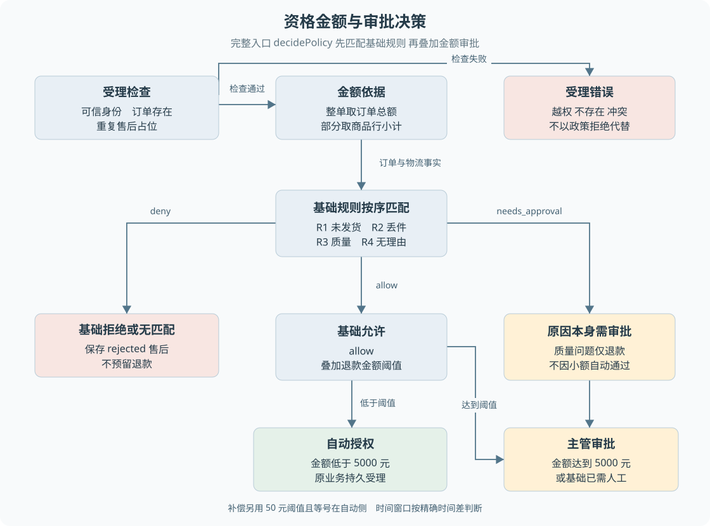

# B03 售后资格与金额如何判定

“七天内可以退”不足以决定一笔申请。还要知道从哪一时刻起算、退哪件商品、是什么类目、申请的是仅退款还是退货，以及是否已经存在其他售后。本章把这些条件连成一条真正执行的判断链。

> **阅读前提**：先读[B02](B02-业务对象与状态关系.md)。理解函数输入和返回值即可；政策函数是确定性计算，和模型如何检索政策原文是两件事。检索机制见[第 12 章](../04-Agent机制/12-政策检索引用与确定性判定.md)。

## 实现思路

### 将事实、规则与保存拆开

页面可以询问客户“要退哪件、为什么退”，但不能让客户传入最终退款金额、审批状态和政策版本。模型同样只提出业务意图。真正受理时，后端读取当前订单、物流和已有售后，检查归属及重复申请，再计算政策结果。

领域规则接收一个固定事实集合，输出允许、拒绝或需要审批，并给出金额、规则编号、解释和运费承担方。之后的业务准备逻辑将结果转换为售后及可选退款记录。这样规则可以独立测试，保存也可以由持久事务统一安排。

当前完整退款判定入口是 `decidePolicy`：先调用 `evaluatePolicy` 匹配具体业务规则，再对允许结果叠加大额阈值。**只看基础规则的 allow 会遗漏金额审批。** 这也是阅读后端时要追调用者的原因：某个函数的结果不一定是整个请求的最终决定。

图 B03-1 将输入校验、基础规则和金额分级分开。政策拒绝进入有记录的业务拒绝；越权、订单不存在和重复申请属于受理错误。两条路径都不能发起资金动作，但记录和客户解释不同。

## 先过归属与重复申请

客户只能申请自己的订单。持久受理并不信任先前查单结果，而是在事务中重新读取订单并把任务客户身份传入领域准备逻辑。即使 Agent 之前错误地提出其他客户的单号，也不能因此建单。

售后服务随后查看同订单历史。存在 `submitted`、`auto_approved`、`awaiting_approval`、`approved`、`awaiting_buyer_shipment`、`buyer_shipped` 或 `goods_received` 时，视为已有活跃售后，返回冲突。已经存在 `completed` 且类型不是换货的申请，也会阻止再次申请。

这是一种**订单级占位**，不是逐件累计退款账本。即使首次只退一件，完成后也不能根据本实现推断剩余商品可以再建另一笔退款。反过来，拒绝和过期记录不在上述占位集合，说明保留历史记录并不总意味着永久禁止重新申请。

不要把“失败可重试”泛化到所有服务。当前售后活跃集合没有 `failed`，价保判断活跃售后时却把它算进去；补偿、价保自己的占位集合也包含失败。判断的是不同业务风险，具体集合必须按服务分别阅读。

## 类型与原因共同决定基础规则

| 顺序 | 输入条件 | 可信事实要求 | 基础结果 | 运费承担 |
| --- | --- | --- | --- | --- |
| R1 | 仅退款＋未发货取消 | 订单状态为 paid 且无发货时间 | 满足则允许，否则拒绝 | 商家 |
| R2 | 仅退款＋丢件 | 有物流记录且状态为 lost | 满足则允许，否则拒绝 | 商家 |
| R3 | 质量问题、破损或错货 | 已签收，距签收不超过 15 天 | 仅退款需审批，退货或换货允许 | 商家 |
| R4 | 退货＋无理由 | 已签收，不超过 7 天，订单无排除类目 | 满足则允许，否则拒绝 | 买家 |
| R5 | 未匹配前面规则 | 没有可用自动政策 | 拒绝并建议人工 | 无 |

规则按代码顺序返回，命中某一分支后即形成该分支结果。未发货取消要求“状态 paid 且没有 shippedAt”，不是只看客户说没收到。物流丢件要求物流状态明确为 `lost`，在途很久也不能自动等同于丢件。

质量问题仅退款需要人工确认，即使只涉及很小金额也不能自动通过。无理由仅退款没有匹配自动规则，会走兜底拒绝；“七天无理由”在本实现中是退货退款，而不是任何退款形式都可用。

这些规则是项目实现，不能扩展成质检、举证上传、运费险或法定争议处理已经完成。领域判断目前主要使用订单与物流事实；没有代码支持的业务环节只作为未来扩展讨论。

## 时间窗口按精确时间差计算

资格函数比较 `当前时间 - 签收时间 <= 天数 × 24 × 60 × 60 × 1000`。因此恰好七天仍在窗口内，多一毫秒就超出。它不是“第七个自然日的晚上截止”，也不按页面显示的整数天数判断。

例如教学数据：签收时间为 9 月 1 日 10:00，七天窗口的边界是 9 月 8 日 10:00，10:00:00.001 已超窗。所有时间应按相同时间基准转换后比较。文案中的“签收 7 天”来自向下取整的天数计算，只适合解释，不应反过来当作规则输入。

此前源码注释将窗口误写成“边界当天 24 点”，现已改为与比较表达式一致的说明：恰好等于窗口仍允许，超过才拒绝。本次只修正注释，没有修改规则表达式。

## 金额来自订单与商品范围

金额使用整数分。整单申请取订单总额；指定商品时，对订单中命中的商品行计算 `单价分 × 数量` 后求和。商品标识先转为集合，重复标识不会重复累加；没有选择商品或空列表，计算函数按整单处理。

教学例子：A 商品 120 元、数量 2，B 商品 80 元、数量 1。整单记录若为 320 元，则整单金额为 32000 分；只选 A 时金额为 24000 分。本实现的商品选择以订单商品行为粒度，没有在 `itemIds` 中再传“同一行只退其中一件”的数量。

整单直接取订单总额，部分商品取行小计，二者未必能证明现实订单中折扣、优惠券和运费分摊的正确性。不能擅自加入“自动按优惠后比例退还”等规则。遇到这些业务问题，需要新的领域设计，而不是在文档里补一句常识。

另一个必须明确的边界是输入验证：售后金额函数只筛选命中的商品，没有像价保服务那样显式逐个拒绝不属于订单的 `itemId`。默认仅退款动作不开放商品选择，退货动作可以携带 `itemIds`。因此不能将“支持部分商品”写成“已经具备完整的逐件退款与非法商品集合校验”。这属于当前实现的限制，后续可独立修复，本次不改代码。

## 部分商品与类目限制并非同一范围

R4 排除类目是 `fresh_food`、`customized`、`virtual`。当前实现检查的是**整张订单是否包含排除类目**，不是只检查选择退回的商品。

如果一张订单同时有普通商品和生鲜，即使只选择普通商品进行无理由退货，当前规则仍拒绝。这未必是你期望的产品策略，但它是实际代码行为。文档应把行为、可能的设计取舍和未来改法分开：可以讨论改为选中商品判断，但不能提前把它说成现状。

这类边界说明业务规则不能仅靠正常案例理解。正常订单上“只选一件”看起来成立，混合类目订单才会暴露资格判断与金额计算的范围差异。

## 基础允许后再判断大额审批

基础规则为 `allow` 且退款金额 **大于等于 500000 分，即 5000 元**时，结果变为 `needs_approval`，规则编号变为 R6。基础拒绝保持拒绝；基础已经需要审批也保持原结果，不用大额规则覆盖质量问题仅退款的审批原因。

补偿采用另一条规则：金额 **小于等于 5000 分，即 50 元**自动通过，大于 50 元才需审批。不要把退款阈值的 `>=` 复制到补偿。价保差价达到 5000 元时同样需要审批，但先要通过价保自己的资格规则，详见 B08。

| 教学输入 | 基础结果 | 最终结果 | 关键理由 |
| --- | --- | --- | --- |
| 未发货仅退款 4999.99 元 | allow | allow | 未达到退款审批阈值 |
| 未发货仅退款 5000 元 | allow | needs_approval | 阈值等号在审批侧 |
| 质量问题仅退款 20 元，签收 3 天 | needs_approval | needs_approval | 审批由业务原因触发 |
| 无理由退货 6000 元，签收 8 天 | deny | deny | 大额不能让拒绝变成可审批 |
| 协商补偿 50 元 | allow | allow | 补偿等号在自动侧 |

审批不是对所有拒绝规则的万能覆盖。当前申请被拒绝后，应解释事实和原因，需要人工时走人工沟通；不能在前端显示一个“强制批准”按钮，绕开重新定义业务方案。

## 案例四：政策拒绝怎样落地

使用教学输入：普通类目订单已签收超过七天，客户申请无理由退货，身份和订单有效且没有已有售后。领域函数返回 R4 拒绝。业务准备仍生成售后记录，状态为 `rejected`，保存政策版本及解释，不创建预留退款。

| 操作者 | 输入 | 后端判断 | 记录变化 | 后续动作 | 客户所见 |
| --- | --- | --- | --- | --- | --- |
| 客户与 Agent | 退货、无理由、原订单 | 身份和重复检查通过 | 保留申请意图 | 计算政策 | 办理中 |
| 领域准备 | 可信签收时间和当前时钟 | 超过窗口 | rejected 售后，无退款 | 交回业务结果 | 拒绝原因 |
| 结果投影 | 原申请关联 | 没有可执行资金业务 | 原工具失败结果及客户事件 | 必要时人工解释 | 未执行退款 |

对比越权订单：归属检查直接拒绝受理，不应给另一个客户创建售后单。两个场景都没有付款，但一个是合法申请被政策拒绝，另一个是无权操作。将它们都写成“接口报错”会丢失业务含义。

## 手工执行一次完整判定

为了体会后端函数如何组合，先不用模型，也不用页面。构造一份本人订单，已签收三天，只有普通商品，两行商品金额合计 6000 元，没有历史售后；申请类型为 return，原因 quality，商品范围为空。按实际调用顺序在纸上执行以下步骤。

1. **先检查归属与占位**：当前检查通过，才进入政策计算。若存在活跃售后，后面的质量窗口和金额规则不再执行；商品符合政策不等于当前还能新建一单。
2. **确定金额**：商品范围为空，取原订单总额 600000 分。
3. **匹配基础规则**：R1、R2 的类型原因组合不匹配，进入 R3；订单签收未超过十五天，申请不是仅退款，基础结果为 `allow`。只运行 `evaluatePolicy` 还没完成整个判定。
4. **叠加金额阈值**：金额大于等于 500000 分，完整入口输出 `needs_approval`。
5. **保存原方案**：售后从瞬时 `submitted` 转为 `awaiting_approval`，预留 `created` 退款；持久受理创建审批并保存原关联。

> **此刻的客户结论**：等待主管确认，不能立即发钱。

把输入只改一项：商品范围选择其中金额 2000 元的普通商品行。窗口与原因不变，金额变为 200000 分，最终自动允许退货并进入待寄回。这个对照说明金额范围会影响审批，但不会把退货类型变成仅退款，也不会跳过寄回和收货。

再把原因改成 no_reason，订单加入一件生鲜，即使所选普通商品仍为 2000 元，R4 也会因为整单类目而拒绝。最后把类型改为 refund_only、原因 no_reason，则不会进入 R4，而落到无匹配规则。每次只改变一个输入，更容易理解真正触发分支的条件。

## 纯函数、领域服务与事务的分工

政策函数不负责查询数据库，也不负责保存审批。它拿到订单、物流、商品范围和时钟之后，计算结果。这使得规则测试可以固定时间和输入，验证等号边界，不必启动 HTTP 或真实模型。

领域服务负责把规则放入业务上下文：订单必须可访问、已有申请不能冲突、规则输出要转换为合法实体状态。持久仓储负责确保这批结果共同保存。若将归属判断只放在前端，直接调用服务就会绕过；若将建单写入放进纯规则函数，测试与事务组合都会变得困难。

这三个层次同样适用于你以后写其他后端功能。先写明确的输入输出，再决定哪些事实必须读取、哪些结果必须一起落库。函数多并不自动代表分层好，关键在于每层是否拥有明确的决定权，并且上层不能越过下层更改规则。

## 如何验证一个规则修改

假如未来要把无理由类目限制改为仅检查选中商品，不能只修改一句政策文案。需要同时核对空选择的整单语义、混合类目、非法商品标识、金额计算、审批阈值和既有申请快照。政策语义变化还应更新版本，并说明旧申请是否保持原判断。

本次不执行这种修改，但教材需要让你识别影响范围：前端选择器、模型动作参数、领域规则、持久绑定和测试数据都可能相关。业务逻辑学习的目标不只是知道现在返回什么，也要能说明为什么一个看似简单的需求会跨越这些边界。

还有一项值得在测试中明确：政策结果中的金额不等于可立即发送的金额。拒绝结果仍可能携带按订单计算的参考金额，供解释或记录使用；是否创建退款由业务准备逻辑按 outcome 决定。若只在页面检查 amount 大于零就显示支付成功或调用执行接口，会把被拒方案错误地变成资金动作。

因此阅读返回类型时，应同时关注数值、资格结果和后续状态。字段存在、数值合法、业务允许、获得授权、执行成功是不同判断，不能把一个强类型对象视为已经获得全部业务许可。

## 源码参考与验证依据

### 按业务问题对照源码

按表中顺序阅读，每到一站先回答对应业务问题，再进入下一处实现。路径相对本章，可直接点击；搜索词用于在大文件内定位，不要求逐行通读。

| 顺序 | 业务问题 | 项目源码 | 搜索符号或入口 | 阅读重点 |
| --- | --- | --- | --- | --- |
| 1 | 资格与金额的判断顺序 | [policy.ts](../../../packages/domain/src/policy.ts) | `decidePolicy`、`evaluatePolicy`、`applyLargeRefundThreshold` | 先基础规则 后大额审批 核对时间和金额边界 |
| 2 | 归属与重复申请 | [after-sale-service.ts](../../../packages/domain/src/services/after-sale-service.ts) | `prepareReturnRequest` | 先同订单占位 再将政策结果转为记录 |
| 3 | 客户提交的动作范围 | [p6-conversation-refund.ts](../../../packages/persistence/src/p6-conversation-refund.ts) | `submit` | 比较仅退款和退货的商品参数 |
| 4 | 商品归属检查的差异 | [price-protection-service.ts](../../../packages/domain/src/services/price-protection-service.ts) | `createPriceProtection` | 对比逐项归属检查与售后金额筛选 |
| 5 | 规则的现成验证用例 | [policy.test.ts](../../../packages/domain/test/policy.test.ts) | `decidePolicy` | 以固定订单与时钟核对规则边界 |

### 验证依据与适用范围

现有政策测试覆盖窗口、类目、金额及补偿阈值；本章额外边界推演来自对具体表达式的静态阅读，没有把未运行的输入称为实验结果。规则版本以当前代码的 `POLICY_VERSION` 为准，后续调整语义时需要同步教材与证据。

---

学习衔接：[业务练习 B03](../09-练习与自测/业务流程练习.md#b03) · [下一章](B04-仅退款的完整业务实现.md) · [总导学](../导学-有据售后.md)
