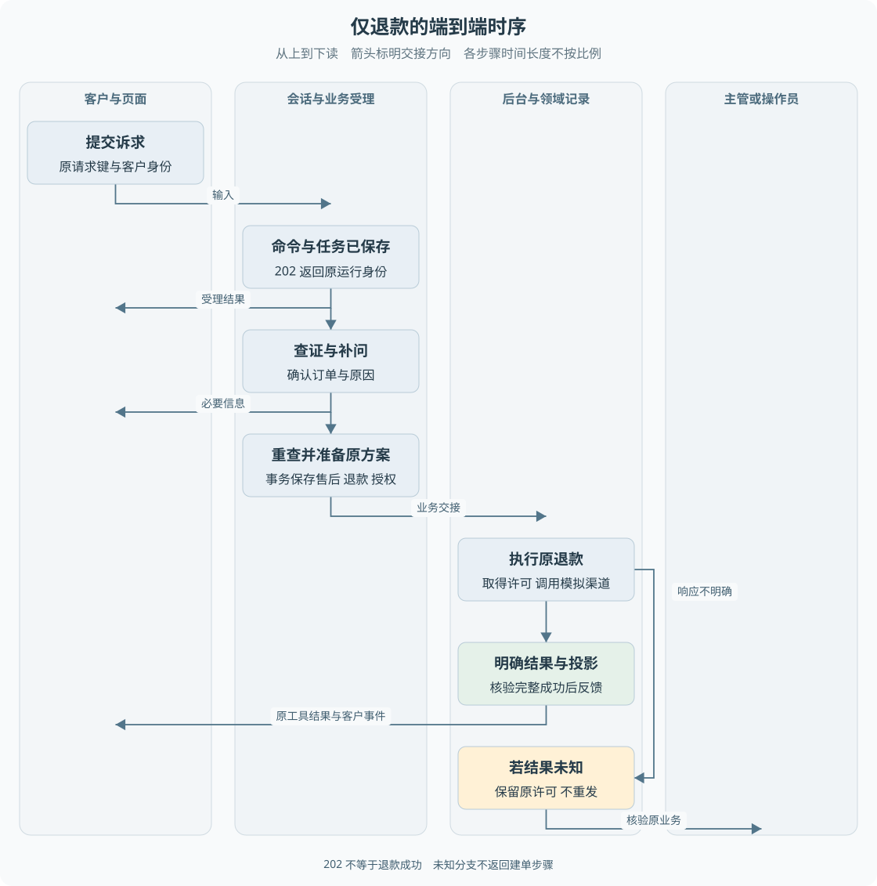

# B04 仅退款的完整业务实现

客户取消尚未发货的订单，看起来只需要一个退款动作。对系统而言，它必须先把模糊诉求变成可信方案，再可靠地交给资金执行，最后向正确的客户确认结果。本章沿这条路径解释各模块为什么存在。

> **阅读前提**：先读[B02](B02-业务对象与状态关系.md)、[B03](B03-售后资格与金额如何判定.md)。HTTP 返回码与请求幂等可随时查[第 04 章](../02-后端必要基础/04-HTTP接口与身份边界.md)。

## 实现思路

### 让受理、判断、执行和反馈分别可确认

如果 API 收到一句“退款”后一直等模型、数据库和支付完成，再返回一个成功响应，任何一步超时都会让客户端不知道发生了什么。用户再次点击时，系统还可能创建第二笔业务。解决方法不是单纯把超时时间调大，而是把各阶段保存成可以再次查询的事实。

可以将主线分成四个阶段，每段都有明确输入、结果和下一位负责人：

1. **受理输入**：返回运行与任务身份，确认系统已保存待办。
2. **补齐事实**：会话执行器查询、补问，再提出结构化动作。
3. **保存方案**：在数据库事务中重查并保存原业务，交给资金任务。
4. **确认与反馈**：确认渠道结果，再将结果投影给原会话。

> **关键区别**：前三个阶段的完成都不能单独证明退款成功。

这也解释了为什么当前有会话 Worker 和业务 Worker。前者回答“客户想办理什么，还缺哪些信息”，后者执行“已经确定的原方案”。批准后的付款不需要模型重新想一遍金额，更不应该因为重启重新生成一笔退款。

图 B04-1 的泳道按参与者划分，数据库提交处用明确文字标出。202 位于流程开头，渠道成功位于末尾，两者之间可能跨越多个请求和后台轮次。底部未知分支保留原业务，不返回建单阶段重新申请。

## 案例一：先补订单，再自动仅退款

先用一份固定教学数据走完整条正常路径：客户甲买了 299 元商品，订单已支付、未发货，没有已有售后；客户说“还没发货，我想取消并退款”。订单简称 O1，创建后售后简称 R1、退款简称 F1、会话简称 M1。这些是教学别名，不是可直接填进 API 的真实单号。

| 观察点 | 客户或系统动作 | 能确定的记录与金额 | 此刻还不能得出的结论 |
| --- | --- | --- | --- |
| 接受第一条消息 | 返回 202，打开 M1 | 输入命令和任务已保存 | 尚未证明有 R1 或 F1 |
| 缺订单时 | 客户确认 O1，继续同一会话 | 仍是客户甲的 M1，查到原订单 | 查到订单不等于授权付款 |
| 提交申请 | 仅退款、未发货取消 | 规则允许，R1 自动获准，F1 预留 29900 分 | F1 created 不是钱已到账 |
| 后台执行 | 使用原 F1 与其业务键 | 原金额一直是 29900 分 | 渠道没有明确结果前不能说成功 |
| 明确结算 | 渠道、业务和执行证据一致 | F1 succeeded，R1 completed | 客户还可能尚未收到最后事件 |
| 结果送达 | 原调用收到结果，页面查询更新 | M1 显示原退款已确认成功 | 不能据此新建另一笔退款 |

现在盖住表格，应该能回答：29900 分在哪一步确定，之后哪些步骤只推进状态而不重新计算金额？答案是领域受理确定原方案，后续执行核验并使用原金额。客户再问一次进度，不会让 F1 自动变成 F2。

仓库的客户退款测试使用“我要退款”起步，再补充 `SO-2026-0001`，最终断言模拟渠道提交一次、扣款一次。以下是对这条测试路径的教学拆解，不是本次新运行的演示。订单金额、时间等应以对应夹具为准，不从单号本身推断。

客户首次提交到 `POST /api/runs`。API 解析请求，从认证上下文确定客户身份，读取请求幂等键，再调用持久会话受理。返回的 202 中有 `runId`、`commandId`、`taskId` 和 `accepted`。这些字段说明系统记住了工作，不表示已有售后单，更不表示已发出退款。

页面可以据此打开会话并订阅事件。若网络中断导致没收到响应，同一请求键与同一内容重放应定位原受理结果。用户修正了内容，则不能把它当作同一请求无条件覆盖；请求身份保护的是一次输入，不是所有后续对话。

## 订单确认不是从文本中猜一个编号

会话 Worker 恢复输入和上下文，按配置快照选择可用工具。订单不明确时需要澄清；当前支持订单选择的路径可以查询本人候选订单，再由客户选择。原诉求和选择上下文需要保留，不能补了订单号就忘记客户说的是商品无法开机。

查询候选、查询订单详情和提交申请是三个动作。候选记录只帮助识别订单，不能被模型解释成客户授权提交。在多商品场景还要明确范围，退货动作可以携带商品标识；默认仅退款动作不开放任意商品范围和自报金额。

客户补充通过 `POST /api/runs/:runId/messages` 进入原会话。API 核验会话归属，后端核验当前等待状态和原调用关联。不是任何状态都能继续发一条消息让模型从头处理，尤其是已受理退款和人工接管后，需要走对应分流。

## 结构化意图如何成为售后方案

模型最终提出 `submit_refund_only`，输入包含订单号、原因和解释等允许字段。`P6ConversationRefundRepository.submit` 只接受已迁移的退款动作，并拒绝模型传入金额或业务授权字段。通过 JSON Schema 只说明格式合法，还要继续验证订单归属和业务资格。

受理在有效任务围栏内重新读取订单、物流、已有售后，调用 `prepareReturnRequest`。未发货取消要求订单仍为已支付且无发货时间；如果在模型查询之后已经发货，应以重新读取的事实判断，不能沿用模型缓存的“尚未发货”。

准备函数只构造记录，不调用支付。政策允许时生成售后和预留退款；需要审批时同时准备审批；拒绝时保留被拒申请但不创建退款。持久仓储负责把这些记录与原任务、工具调用和检查点一起保存。

自动允许的仅退款会在同一事务中接管原退款执行权，创建授权命令和资金任务，并保存授权任务关联。任何关键写入失败都回滚，避免出现售后已创建但无人负责执行，或者任务存在却找不到原业务的半成品。

## 自动批准后为什么还没成功

自动批准只是领域规则认为可以继续。资金 Worker 仍需取得原任务，验证原客户、售后、退款、金额、币种和授权关联，然后才允许发送原资金动作。

资金业务键来自原售后，例如 `refund:<原售后单号>`。HTTP 请求键可能有多个，工具调用也可能跨多个轮次，但一笔既定退款只能有一个稳定业务身份。恢复时必须查询它，而不是因为客户又问了一句就生成新的退款编号。

本地写入与外部渠道不是一个事务。执行器先保存必要的发送事实，再调用独立模拟渠道；收到明确结果后结算本地记录。对于业务学习，关键是理解“允许执行”“已经发出”“渠道明确确认”是三个不同阶段。发送许可和围栏细节见[第 14 章](../05-资金执行与恢复/14-退款幂等与结果未知.md)。

## 结果怎样回到原客户

后台确认成功后，不仅更新退款单，还需使售后、资金效果和执行权处于一致结果。随后扫描原会话关联，将结果补回最初的工具调用，保存客户可见事件。结果投影有去重标识，重启扫描不应重复生成终态结果。

因此助手文案“退款成功”不能成为数据源。真正的客户进度查询会联合核验售后完成、退款成功、渠道效果成功及原执行权确认。某一处写了成功、其他证据缺失时，应显示待核验，而不是挑最乐观的一项展示。

投影还有一项责任：保护人工处理状态。后台完成原业务时，可以保存结果，但不应擅自覆盖已经由坐席接管的会话。客户所见可能同时包含资金结果与人工沟通状态，前端需要按服务端进度和会话信息分别表达。

| 操作者 | 输入 | 后端判断 | 记录变化 | 后续动作 | 客户所见 |
| --- | --- | --- | --- | --- | --- |
| 客户 | 退款诉求与请求键 | 身份、格式、重放 | 会话命令与任务 | 后台处理输入 | 202 已受理 |
| 会话 Worker | 消息和工具结果 | 是否缺订单、是否可提交 | 补问或原工具调用 | 读取可信事实 | 待补充或办理中 |
| 业务仓储 | 仅退款意图 | 归属、重复、政策和金额 | 售后、退款、授权、关联共同提交 | 资金任务 | 处理中 |
| 资金 Worker | 原方案 | 原授权和发送条件 | 发送及渠道结果事实 | 本地结算 | 处理中或待核验 |
| 投影器 | 已确认业务结果 | 原调用及结果一致性 | 工具结果和客户事件 | 页面重新查询 | 明确成功或非成功 |

## 案例五：渠道结果未知时客户再次询问

假设渠道已经接受原退款，但响应在网络中丢失。业务进程只能确认“没有得到明确答复”，无法据此判断“没有付款”。如果把这个异常当成普通接口失败，换一个退款键重试就可能重复付款。

当前资金协议保留发送许可和未知事实，进入查询或人工核验路径。在这条持久退款主线，典型组合是任务 `needs_confirmation`、资金效果 `unknown`、退款仍 `executing`、执行权仍 `sending`；其他历史或守卫路径也可使用执行权 `unknown`。所以不能要求所有表一起变成 unknown 才算待核验。客户进度依据这些事实保守判断，不采用模型自行生成的标签。

客户此时再问“钱退了吗”，应查看原业务进度。重开一个退款申请既不能消除原渠道不确定性，也不应绕过同订单重复限制。人工求助可以另开关联沟通案件，但不会把原执行权清空。只要原资金结果仍未知，继续保留待核验是正确结果。

如果后续查询原交易得到明确成功，系统可以补齐本地结果再投影；如果仍不明确，就不能承诺已经退款或提供任意“重新发送”按钮。当前项目没有完整真实渠道对账平台，人工核验的含义和能力也必须以已有模块为限。

## 几个不同失败应怎样理解

订单不存在时，先核对客户选择，不进入资金流程。订单属于其他客户时，拒绝访问。政策不满足时，保留申请拒绝和解释。大额需要审批时，保留等待，不把它当作失败。渠道明确拒绝与渠道响应未知也不同：前者已获得一个否定结果，后者连结果都尚未确定。

重复消息还要分两层。相同请求重放应找回原命令；换请求键再次申请则由业务层检查同订单已有售后。仅有客户端禁用按钮不能防止其他浏览器、网络重试或后台进程重复推进，因此这些判断必须留在后端。

## 如何勾画精简实现

先去掉模型，使用固定表单收集订单和原因，实现可信查单、领域判断、原售后与退款关联。随后加入持久受理和后台执行，让页面通过查询看到处理中及结果。再加入模型，替代表单中的信息收集，但仍复用原领域判断和业务受理。

这个顺序让每一层复杂度对应实际问题：模型解决表达不明确，事务解决本地半写入，任务解决跨请求推进，资金键和核验解决外部结果不确定。它是教学重建顺序，不是对项目历史开发过程的叙述。

## 以源码阅读者的方式追踪一笔业务

阅读 API 时先找到 system.conversations 分支，而不是顺着文件第一个启动函数一路读下去。该分支调用 accept 并返回 202；下面保留的旧 runner 路径不能混入当前执行图。确认入口之后，再进入受理日志与任务仓储，观察哪些身份在第一次请求时已经确定。

接着读会话执行器时，重点找模型结果如何被分成查询、补问和业务提交。查询结果只是下一轮判断材料；补问保存等待；业务提交将原工具调用交给退款仓储。若把三种结果都理解为一个通用 tool success，就无法解释为什么有些调用立即完成、有些需要等审批或渠道。

读 submit 时可以写一张记录清单：原任务是否仍有效、原运行是否允许、动作是否在白名单、可信订单是否存在、领域方案是什么、有哪些记录共同写入。不要先研究每条 SQL 的语法，先确认某条写入若丢失会导致哪种业务断裂，再阅读它怎样被事务保护。

最后读业务扫描器和 project。扫描器推进已确定动作，project 将业务结果回填给原调用。你会看到结果生成没有要求模型重新总结资金是否成功，因为确认资金事实的权威来自业务记录。模型可以解释，不能在这一步重新投票。

### 给几个身份做一张随手表

| 身份 | 在何时确定 | 后续用来回答什么 |
| --- | --- | --- |
| 客户身份 | API 认证与原任务 | 谁能访问并推进这笔业务 |
| 请求键 | 客户一次输入 | 这次提交是否已经被受理 |
| 运行身份 | 首次会话受理 | 结果应返回哪一段客户交互 |
| 工具调用身份 | 模型完整动作确认 | 哪个原动作仍在等待业务结果 |
| 售后及退款身份 | 领域方案受理 | 当前处理的是哪一份申请和哪笔金额 |
| 原业务键 | 原退款创建 | 渠道查询和防重是否仍指向同一动作 |

这些身份之间不是互相替代的关系。一个客户可以有多次运行，一个运行可以有多条合法输入，但当前退款关联限制不能被解释为任意多业务编排。做阅读笔记时保留对应关系，可以避免调试时拿一个新会话的事件判断旧退款。

## 设计三种有区分力的观察

第一种观察是请求已经返回 202，但还没运行会话 Worker。此时应有输入命令和任务，不必已有售后。它证明异步受理与业务建单被分开。如果页面这时就显示售后单号，应追查数据从哪里来，而不是默认它总存在。

第二种观察是售后事务提交后，资金 Worker 尚未执行。此时应能找到原售后、退款和授权关系，渠道提交仍未发生。它证明“业务已受理”和“钱已发出”之间有可观察阶段，也解释了为什么刷新页面必须从数据库恢复进度。

第三种观察是资金明确结算后，客户结果尚未投影。此时恢复应补结果而不是再次支付。现有跨进程测试围绕命名故障窗口检查类似性质；在自己的教学实现中可以用可控暂停点观察，不必真实崩溃整个开发环境。

三个观察分别检验输入可靠性、业务交接和结果恢复。只检查最后出现一条成功文案，无法证明其中任何一项。对于前端开发者，这种按阶段检查的办法也有帮助：先判断数据从哪个阶段缺失，再决定是刷新接口、检查事件还是核查后端任务。

## 源码参考与验证依据

### 按业务问题对照源码

按表中顺序阅读，每到一站先回答对应业务问题，再进入下一处实现。路径相对本章，可直接点击；搜索词用于在大文件内定位，不要求逐行通读。

| 顺序 | 业务问题 | 项目源码 | 搜索符号或入口 | 阅读重点 |
| --- | --- | --- | --- | --- |
| 1 | HTTP 到底受理了什么 | [app.ts](../../../apps/api/src/app.ts) | `/api/runs`、`system.conversations` | 202 表示输入受理 尚未证明创建退款 |
| 2 | 重复请求怎样定位原工作 | [conversation-journal.ts](../../../packages/persistence/src/conversation-journal.ts) | `accept` | 追踪原命令和任务身份 |
| 3 | 模型意图怎样转交业务 | [durable-conversation.ts](../../../packages/runtime/src/durable-conversation.ts) | `execute`、`submit_refund_only` | 找到对话循环与受控提交的交接点 |
| 4 | 哪些记录必须共同保存 | [p6-conversation-refund.ts](../../../packages/persistence/src/p6-conversation-refund.ts) | `submit` | 对照售后 退款 授权和原调用关联 |
| 5 | 后台怎样继续原业务 | [durable-business.ts](../../../packages/runtime/src/durable-business.ts) | `runOnce` | 观察扫描 授权受理与结果投影 |
| 6 | 何时发送 何时查询 | [p6-worker.ts](../../../packages/runtime/src/p6-worker.ts) | `beginPayment`、`shouldSend` | 依据原资金意图区分首次发送与恢复 |
| 7 | 结果怎样回复原申请 | [p6-conversation-refund.ts](../../../packages/persistence/src/p6-conversation-refund.ts) | `project` | 核对回填的原工具调用身份 |
| 8 | 页面何时能显示成功 | [customer-progress.ts](../../../apps/api/src/customer-progress.ts) | `succeeded`、`uncertain` | 核对业务状态 资金效果与执行权 |

### 验证依据与适用范围

[退款闭环测试](../../../apps/api/test/conversation-refund.test.ts)包含补问、一次资金提交、重复申请、整体回滚、未知许可及取消后保留成功结果；[跨进程测试](../../../apps/api/test/conversation-refund-process.test.ts)提供另一类恢复依据。测试夹具使用模拟渠道，不等于真实支付接入；本次未执行资金演示。

---

学习衔接：[业务练习 B04](../09-练习与自测/业务流程练习.md#b04) · [下一章](B05-退货后退款的完整业务实现.md) · [总导学](../导学-有据售后.md)
