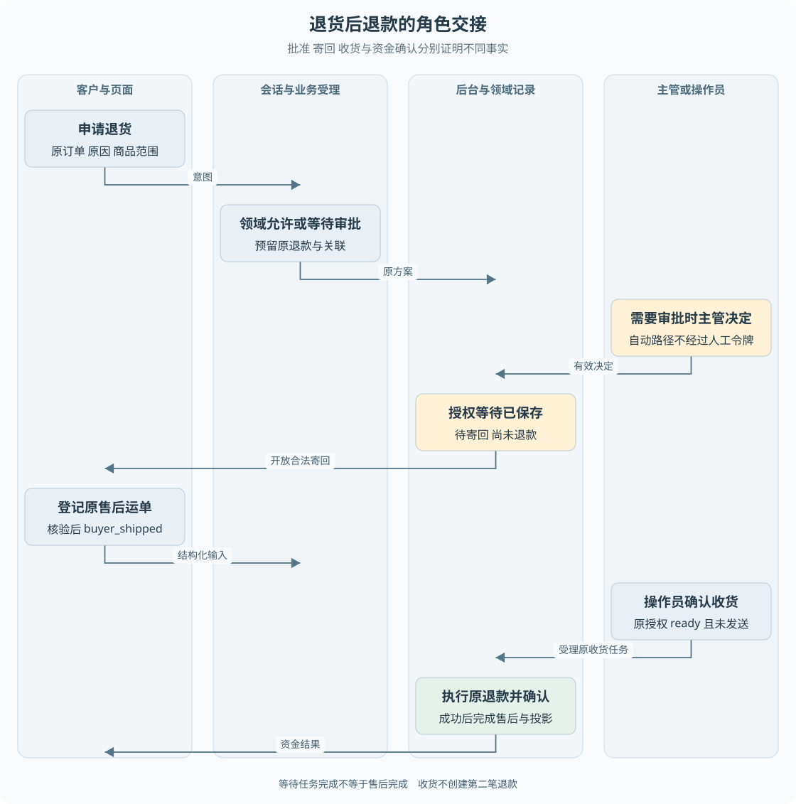

# B05 退货后退款的完整业务实现

退货后退款不是在仅退款流程中多加一个上传运单按钮。它把一个业务拆成跨角色、跨时间的几次交接：允许退货、客户寄回、操作员确认收货，最后才允许原退款继续。最重要的设计问题是每一步到底在证明什么。

> **阅读前提**：先读[B04](B04-仅退款的完整业务实现.md)。本章解释寄回与收货的业务条件；执行权转绑的事务细节参考[第 13 章](../05-资金执行与恢复/13-从售后申请到审批与执行.md)。

## 实现思路

### 将人的等待保存为业务状态

如果建单后直接调用支付，系统无法要求客户先寄回。如果一个函数一直等待客户快递到达，进程退出后就会丢掉等待位置。合理做法是先保存原申请、预留退款及授权关系，让每次外部输入推动一个明确的阶段。

三个交接点分别证明不同事实：

1. **批准退货**：客户可以进入寄回流程。
2. **登记运单**：系统接受了这次寄回信息。
3. **操作员确认收货**：业务允许进入收货后的处理。

> **实现边界**：当前没有通过快递服务自动验证包裹实际内容，也没有真实仓储质检闭环，不能把这三类事实混称为“已验货”。

退款身份在最初就确定，后续只推进原业务。收货阶段创建的是继续执行的命令，不是第二张售后或新的退款。这样客户、主管和仓库操作员虽然在不同时间参与，仍然围绕同一组原始记录工作。

图 B05-1 以角色和等待点展示交接。黄色等待区是正常业务阶段，绿色结果区必须经过收货后的原退款执行。退货批准与收货之间没有资金发送箭头。

## 案例二：质量问题退货到退款

使用独立教学构造：客户选择本人已签收三天、金额 320 元的普通商品，说明无法开机，希望退货退款。没有已有占位售后。B03 的质量规则允许退货，商家承担寄回运费，领域准备创建待寄回售后和 32000 分原退款。它是另一张订单，不是把 B04 已退款订单改成已签收后再次申请。

把售后和退款并排观察，会看到以下过程。表中售后 R2、退款 F2 都是教学别名，金额始终为 32000 分。

| 时点 | 售后 R2 | 退款 F2 | 下一位需要行动的人或程序 |
| --- | --- | --- | --- |
| 自动允许退货 | awaiting_buyer_shipment，等待寄回 | created，已预留未执行 | 客户登记原售后运单 |
| 客户完成登记 | buyer_shipped，已寄回 | created，仍未执行 | 操作员确认收货 |
| 合法收货受理 | goods_received，已收货 | 资金执行前仍可能为 created | 资金 Worker 推进原任务 |
| 开始资金动作 | goods_received，尚待后续结束 | executing，执行中 | 渠道响应或原交易查询 |
| 成功证据完整 | completed，完成 | succeeded，成功 | 结果投影给原客户 |

如果操作员尚未收货，客户等一天与等一分钟都不会自动满足收货条件；如果渠道结果未知，即使货已收到，也不能把最后一行当作必然结局。等待的结束由可信输入或结果触发，不由页面倒计时触发。

如果金额达到大额阈值，流程先进入审批，获准后再进入寄回；后续交接原则不变。仓库的客户进度测试覆盖了“主管审批—客户登记—操作员收货—渠道确认”的路径，本章不把教学金额当作测试夹具金额。

模型提出 `submit_return`，可以携带原订单、原因和商品标识。后端重查事实，生成原方案，保存金额、币种和政策版本。即使客户后面再说“多退一点”，也不能通过寄回或收货接口改掉原方案金额。

## 等待任务完成与退货完成不同

自动允许的退货会创建 `after_sale_wait` 任务，它的工作是保存并确认等待所需的授权和关联，不是发送资金。人工批准后也需要完成相应的持久授权受理。等待任务可以完成，而售后仍停在 `awaiting_buyer_shipment`。

这类任务的存在解决“批准结果只在内存里”的问题：进程重启后，系统仍知道原售后已获准、该等客户做什么、以后该由哪笔原退款继续。它不要求后台一直占用一个连接或线程等待包裹到达。

等待期间原退款执行权也已被接管，避免兼容旧路径另行发送。这里的持有不等于已经付款，只表示原业务的后续执行归属已经确定。客户页面应提示“请寄回”或“等待收货”，而不是因为任务状态是 completed 就显示退款成功。

## 客户如何登记寄回

默认客户入口通过 `POST /api/runs/:runId/messages` 携带结构化 `returnShipment`。普通一句“我寄回了”是沟通内容，不能自动当作合法运单登记结果。服务端需要原会话、原客户、原售后和有效运单字符串，验证它们仍属于当前等待。

当前持久寄回逻辑检查关联售后、客户身份、类型为 `return`、运单非空且长度不超过 100，以及售后处于 `awaiting_buyer_shipment`。成功后将售后更新为 `buyer_shipped`，写入寄回审计，并明确告诉客户“等待仓库确认收货，尚未退款”。

运单在当前链路通过审计留存，客户进度查询按原运行、售后和客户读取对应登记记录。输入校验不等于承运商验证，合法字符串不证明包裹已真实发出。教材只描述现有证据，不补写快递公司接口或物流签收回调。

相同请求键重放不会重复创建命令；业务已经处于 `buyer_shipped` 时，寄回逻辑也不会再次推进。再次发送不同单号不能据此视为已实现运单修改功能。若需要更正，应该有明确修改协议和审计，目前不能假设再次提交会覆盖原信息。

## 客户何时能看到寄回表单

客户进度并非只检查售后状态。`canRegisterShipment` 还要求进度是待寄回、原结果尚未终态投影、会话处于允许等待输入或审批的状态。只有这些条件组合成立，页面才应显示可提交能力。

当会话已经由人工接管，消息接口仍可以接受普通客户留言，但会拒绝结构化寄回。否则页面可能把“留言已发送”误认为“运单已登记”。这不是交互小细节，而是两个不同业务动作共用消息入口时必须保持的语义边界。

运营寄回接口允许操作员或主管登记售后运单，走现有领域服务。它与客户路径的参数、审计身份和公开进度读取方式不完全相同。坐席代登记后不能凭想象保证客户页面一定显示和本人登记完全相同的运单明细，应按实际快照字段核对。

## 收货为什么必须由操作员确认

客户能证明自己提供了运单，不能代表卖家确认收到商品。因此 `POST /api/operations/receive-goods` 限操作员或主管。API 检查角色和售后标识，持久业务服务再查原关联，分流到当前客户退款路径或已有持久审批路径。

收货前置是 `buyer_shipped`。仅有批准还不够，不能跳过客户寄回；仅退款也没有这一段业务。后端还会核对原运行、客户、退款、金额及授权关系，防止把另一张售后号传给已经批准的资金任务。

对于自动批准的退货，收货命令必须引用原自动授权任务。对于人工批准的退货，收货必须引用对应审批授权。两者最终都要求原执行权仍处于未发送的 ready，且没有发送 token，才允许把持有者转交给收货命令。

**收货是新的物品事实，不是新的资金授权。** 如果退款已经发送或结果未知，再次收货不能“救活”它并重新退款。否则一个操作员重复点击就可能绕过资金协议。

## 收货受理后如何完成原退款

收货接口在持久模式下返回 202 和任务身份，意味着后台已接受后续工作。原售后进入收货相关状态，退款仍使用之前创建的编号、金额、币种和业务键。资金 Worker 按与仅退款相同的发送及确认协议执行。

渠道成功后才完成退款及售后，再将结果送回原会话。重复收货沿稳定收货请求身份定位原任务，不应新建第二笔资金业务。渠道响应不明确时，仍然进入原退款的核验路径；有收货证据并不能证明钱有没有退。

| 操作者 | 输入 | 后端判断 | 记录变化 | 后续动作 | 客户所见 |
| --- | --- | --- | --- | --- | --- |
| 客户与 Agent | 退货诉求、订单、商品范围 | 资格和金额 | 售后、退款及原关联 | 自动授权或审批 | 办理中或待审批 |
| 后台或主管 | 原方案授权 | 政策允许或有效审批 | 持久等待授权 | 等寄回 | 可以登记运单 |
| 客户 | 原售后与运单 | 归属、类型、状态 | buyer_shipped 和审计 | 等收货 | 等待仓库收货 |
| 操作员 | 确认原售后收货 | 已寄回和原未发送授权 | 收货命令、任务及持有者转绑 | 执行原退款 | 处理中 |
| 后台 | 原渠道结果 | 资金事实一致 | 退款成功和售后完成 | 原结果投影 | 已确认成功 |

## 在每个等待点判断异常

审批未完成时提交运单，问题是尚未取得寄回授权，应等待决定。已经寄回但尝试取消，普通取消服务会拒绝并建议人工；通用状态表存在某条迁移边，不代表当前线上服务开放该操作。

寄回登记响应丢失时，应复用原请求身份并读取进度，而不是自动生成另一个运单。操作员收货响应丢失时，应查询原任务或业务结果，不能把“没有看到响应”理解成收货没有发生。

原授权与金额不匹配时，系统停止推进并保留待核验信息。不能重新调用模型，让它生成一个“差不多”的方案覆盖原记录。假如渠道成功但页面还显示等待，首先检查投影和公开快照，不应先补一次退款。

人工接管后的结构化寄回冲突需要特别区分：错误并不表示客户运单无效，而是当前入口不允许该动作。坐席需要查看原业务，并使用确实开放的运营路径处理；如果没有适合的受控路径，就保留阻塞，不能用聊天确认替代后端写入。

## 重建时如何切分接口和服务

精简实现至少保留三个独立动作：申请、登记寄回、确认收货。申请生成固定方案；寄回仅更新寄回事实；收货检查原授权后受理退款。不要设计一个能随意传 `nextStatus` 的万能更新接口，因为它会把规则判断交给客户端。

数据上至少需要原订单、售后、退款、授权和待办记录。先做单进程也应把长期等待落到存储；后续加入 Worker 和恢复时，不必重新定义业务语义。前端的表单、按钮和进度只是这些动作的入口及结果展示。

## 沿自动批准收货事务读实现

收货函数先根据 returnNo 找到原客户退款关联，再通过 validate 取得原任务、售后、退款和冻结方案。如果原申请包含人工审批，转入对应审批收货映射；没有审批时，必须找到此前保存的自动授权任务。这一步是在识别授权来源，不是在重新判断一遍客户的自然语言。

自动授权还要证明自己是 after_sale_wait、原售后类型确实为 return、政策原结果为 allow，并且运行和售后标识一致。任务状态可以是 queued、running 或 completed，只要符合代码定义的可衔接条件。因此“必须先等等待任务显示完成才能收货”也不是准确描述，真正约束由原授权和业务事实共同决定。

随后函数使用原售后生成稳定收货请求键，先查是否已有同一收货命令。找到时，不是立即相信任何同键记录，而是继续比较原运行、原授权任务和售后，全部匹配才返回。这样正常重放可以恢复结果，错绑的记录不会因为命中幂等键而蒙混过去。

没有既有命令时，再检查售后 buyer_shipped、退款 created、执行权属于 p6、状态 ready、没有 token，且 holder 仍指向原授权命令。通过后，更新 goods_received，创建携带原资金计划的收货命令，再将 holder 条件更新为新命令。任何一步失败都回滚，不留下“收货已写入但退款没有接手者”的半完成状态。

这一过程体现了后端服务与前端状态更新的不同：页面可以一次 setState 显示“已收货”，数据库却必须同步维护多项必须共同成立的事实。它们不是无关字段一起刷新，而是一个业务交接契约。

## 以一个反例检验交接设计

假设原等待任务已经持有退款执行权，操作员准备收货时，另一条执行路径意外尝试取得发送许可。仅仅先读取 ready 再更新 holder 不足以防止竞争，因为读取后状态可能变化。条件更新还要求 owner、holder、state 和 token 都仍符合原值，受影响行数必须为一。

如果更新失败，应该返回冲突并回滚当前收货写入，保留另一条路径已经发生的事实。不能无条件覆盖 holder，也不能把原 token 清空来“修复”。收货证明物品到了，不证明另一条资金请求没有发生。

再假设操作员双击，两个请求几乎同时到达。稳定请求键和事务使它们最终定位同一收货动作；应用不能为了让两个按钮回调都成功而创建两个退款任务。前端可以禁用重复点击，但后端仍要处理跨页面或自动重试的重复输入。

## 等待期应该保存什么给客户

客户最需要知道的是下一位行动者和当前尚未完成的事情。待寄回时提示需要登记原售后运单；已寄回时提示等待仓库；收货受理后提示正在处理原退款。把三种状态统一显示为“处理中”，会让客户不知道自己是否还需要操作。

同时不应公开内部授权凭据。客户不需要看 holder、token 或审批一次性令牌，业务进度只公开足够解释和完成允许动作的字段。这样页面既有可操作性，又不把后台执行协议暴露成可以被用户改写的输入。

运单登记的审计身份也有实际影响：客户进度当前读取本人在原运行登记的记录，运营代登记可能只让状态变化而未提供同样的客户运单明细。学习时应比较公开 DTO 和审计条件，不能因为后台保存过字符串就断言所有前端入口都能看见。

最后核对完成判据时，至少同时观察原售后、原退款和模拟渠道结果，再检查原调用是否收到一次终态投影。仅看到收货接口返回任务号，或前端隐藏寄回表单，都不足以确认资金闭环。这个观察顺序也适用于手工演示：每完成一个人的动作，先确认它对应的业务事实，再进入下一步。

## 源码参考与验证依据

### 按业务问题对照源码

按表中顺序阅读，每到一站先回答对应业务问题，再进入下一处实现。路径相对本章，可直接点击；搜索词用于在大文件内定位，不要求逐行通读。

| 顺序 | 业务问题 | 项目源码 | 搜索符号或入口 | 阅读重点 |
| --- | --- | --- | --- | --- |
| 1 | 客户登记和运营收货的入口 | [app.ts](../../../apps/api/src/app.ts) | `returnShipment`、`/api/operations/receive-goods` | 比较客户身份与操作员角色要求 |
| 2 | 登记寄回保存什么 | [p6-conversation-refund.ts](../../../packages/persistence/src/p6-conversation-refund.ts) | `shipment` | 核对原售后 类型 状态和审计 |
| 3 | 自动批准怎样衔接收货 | [p6-conversation-refund.ts](../../../packages/persistence/src/p6-conversation-refund.ts) | `receive`、`validate` | 核对原自动授权 收货命令与执行权转绑 |
| 4 | 人工批准怎样衔接收货 | [p6-owned-after-sale.ts](../../../packages/persistence/src/p6-owned-after-sale.ts) | `receive` | 核对原审批授权与未发送许可 |
| 5 | 运营代登记与客户登记的差异 | [after-sale-service.ts](../../../packages/domain/src/services/after-sale-service.ts) | `recordReturnShipment` | 比较参数与审计身份 不假设页面明细相同 |
| 6 | 何时开放寄回表单 | [customer-progress.ts](../../../apps/api/src/customer-progress.ts) | `canRegisterShipment`、`shipmentRegistered` | 结合进度 会话状态和是否已投影 |

### 验证依据与适用范围

[客户进度测试](../../../apps/api/test/customer-progress.test.ts)核对审批、寄回重复受理、收货前渠道零提交及最终一次退款；[售后映射测试](../../../packages/persistence/test/p6-after-sale-mapping.test.ts)核对持久映射条件。测试证明的是其覆盖路径，不代表真实仓储验货和快递服务接入。

---

学习衔接：[业务练习 B05](../09-练习与自测/业务流程练习.md#b05) · [下一章](B06-自动处理与人工审批.md) · [总导学](../导学-有据售后.md)
