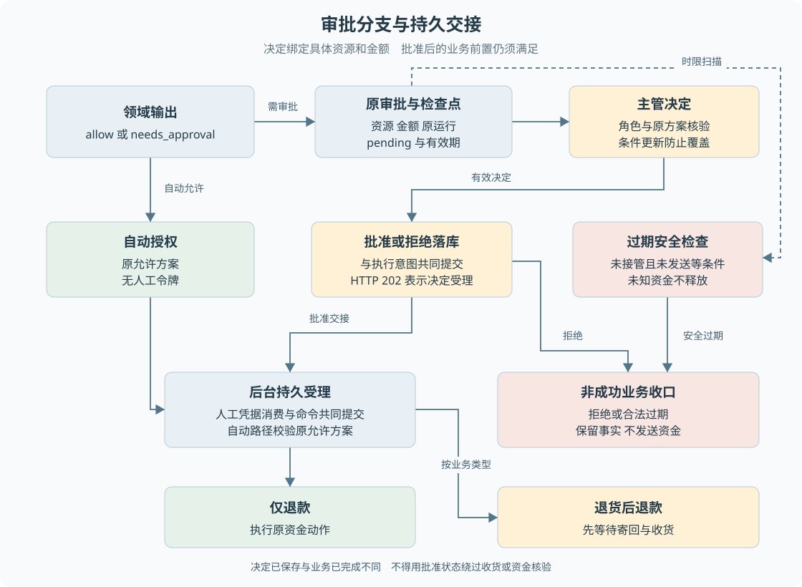

# B06 自动处理与人工审批

审批中心有一个“批准”按钮，但按钮背后至少有三个问题：批准的是哪份方案，决定是否已经被其他人处理，批准以后谁负责继续。这三个问题分别决定审批的业务含义、竞争规则与可靠交接。

> **阅读前提**：先读[B03](B03-售后资格与金额如何判定.md)、[B05](B05-退货后退款的完整业务实现.md)。条件更新与事务的原理见[第 06 章](../02-后端必要基础/06-事务唯一约束与条件更新.md)，本章关注它们保护的业务事实。

## 实现思路

### 把批准看作一份具体授权

最简单的实现是在售后上保存 `approved = true`，然后允许执行退款。但这个布尔值不能回答批准了多少金额、对应哪个资源、是否过期，以及是否已经被使用。若批准后方案发生变化，旧批准就可能被错误地用于新方案。

本项目将审批单独建模，绑定原运行、资源类型、资源编号与金额，并保存原因、时限、决定者及服务端凭据。批准只允许原方案继续，不能成为任意退款的通行证。

决定和执行又分成两个阶段。主管负责选择批准或拒绝，后台负责根据已保存的决定推进业务。为了避免“主管已经点完，但进程退出后无人继续”，数据库同时保存后续执行意图，消费者可以在重启后重新找到这项工作。

图 B06-1 左侧是领域判断，右侧是主管决定，底部是后台持久受理。自动批准与人工批准汇合到受控执行，但自动路径没有人工审批单和人工令牌。退货获准后先等待寄回，仅退款才进入直接资金执行路径。

## 自动与人工的分界由规则决定

退款的基础资格为允许且金额达到 5000 元时，需要主管审批；质量问题仅退款即使低于该金额，也需要人工确认商品情况。政策拒绝不因金额较高而变成“可强制批准”，自动处理范围必须先由业务规则给出。

补偿和价保的分级方式不同。补偿金额不超过 50 元可以自动处理，价保先判断窗口、售后占用与实际差价，再叠加大额阈值。这些能力有自己的入口边界，B08 会说明，不能因为审批表支持资源类型就认定默认客户已可申请全部业务。

对前端而言，`requiresApproval` 是后端结果，不是根据金额在页面自行推断。页面可以显示原因和金额，但最终决定接口会再次核验原方案。即使页面没有被恶意修改，也可能因为读取后事实改变而过时。

## 审批申请怎样产生

持久建单在同一事务中保存售后、预留退款、审批、原工具关联和检查点。审批初始为 `pending`，当前演示有效期为 30 分钟。服务端生成一次性令牌，令牌不交给模型，也不是客户按钮参数。

检查点记录当前待继续方案，包括审批身份、售后编号、金额和原工具调用。它在这里承担“决定要对应哪一个业务方案”的证据，不只是技术上的断点。API 后续比较审批和最新检查点，防止使用旧页面上保留的审批去推进已经变化的运行。

会话进入 `awaiting_approval`，客户收到明确的等待说明。此时退款记录可以已经存在，但资金尚未执行。模型不需要反复询问“主管批准了吗”，后台扫描器负责等待决定和受理后续动作。

## 主管提交决定时检查什么

审批接口先检查角色必须为主管，然后核验审批属于当前运行、运行仍在待审批阶段，以及当前没有尚未暂停完成的处理占用。接着读取最新检查点，比较审批编号、资源类型、资源编号及金额。

这些条件既保护安全，也保护业务一致性。例如两个页面打开同一运行，其中一个页面已经触发了状态变化，另一个页面仍显示旧审批。第二个页面点击批准时，服务端必须拒绝过时方案，而不能因为登录者是主管就跳过核验。

随后审批服务执行带条件的更新：记录仍为 pending、尚未过期、运行和检查点条件仍匹配时，才写入决定。数据库报告实际更新行数，让服务端知道当前请求是否真正赢得了决定权。

### 两位主管同时操作

假设主管甲批准，主管乙几乎同时拒绝。两人读取时都可能看到 pending，但不能都成功。成功的条件更新保存一个决定，另一方重新读取后得到已决定、已过期或前置冲突。

前端应该提示刷新真实结果，而不是让后一次点击覆盖先前决定，也不能因第二个请求失败就撤销第一个已经提交的授权。仅在页面禁用按钮无法覆盖跨浏览器并发，这就是后端条件更新必要的业务理由。

## 决定与执行意图为什么共同提交

决定保存后，审批执行意图进入待处理状态。持久模式下 API 返回 202，包含已记录的决定和执行状态 pending。这个响应表示“主管决定已被接受”，不表示退款已完成，甚至不表示后台已经完成授权任务受理。

扫描器读取 pending 意图，核对原业务并创建对应任务。如果受理失败，保留原决定和可见失败原因；不能把审批重新改成 pending，让主管重复点击掩盖问题。已批准事实和当前能否执行是两个独立判断。

如果决定落库后进程退出，重启扫描仍能发现意图。如果任务已经受理，重复扫描应找到原任务。把决定与意图放在一个本地事务里，保护的是可靠交接；外部资金发送的去重由后续协议处理，两个层次不能互相替代。

## 一次性凭据怎样转成可恢复授权

人工批准路径验证并消费服务端一次性凭据，同时创建持久命令和任务。它不是每次 Worker 重启都重新消费一遍。成功受理后，后续工作依据原命令与授权关系恢复，原凭据已经完成它的一次性交接职责。

如果先清空令牌，再单独创建任务，任务写入失败会丢失继续执行的依据；反过来先创建任务但未可靠消费，其他执行路径可能仍看到可用凭据。将两者共同提交，避免授权既丢失又可能被复用的矛盾。

自动批准没有人工令牌，它以领域允许结果、原方案和执行权接管作为授权来源。图中两路汇合只表示最终都接受资金安全约束，不表示自动路径伪造一张主管审批单。

## 案例三：同一份大额方案的三种结局

教学输入：已签收且在质量窗口内的退货，金额达到大额阈值，没有已有售后。创建待审批售后和预留退款，进入以下三个互斥推演。

| 操作者 | 输入 | 后端判断 | 记录变化 | 后续动作 | 客户所见 |
| --- | --- | --- | --- | --- | --- |
| 主管 | 在有效期内批准 | 原方案仍一致 | approved 决定与执行意图 | 后台接受等待授权 | 批准后等待寄回，未退款 |
| 主管 | 在有效期内拒绝 | 原方案仍一致 | rejected 决定与执行意图 | 终止申请并处理预留退款 | 申请被拒，未执行退款 |
| 后台 | 时限到达 | 未被接管且未取得发送许可等安全条件 | 符合条件时过期收口 | 停止原未执行方案 | 已过期，需要重新核验 |

批准退货后，客户仍需寄回，操作员仍需收货。若该申请改为仅退款，批准受理后才进入直接资金执行。共同点是两者都需要原授权；不同点是业务前置条件不同，不能把批准后分支合并成无条件支付。

拒绝以后预留退款应按未执行事实取消，不是执行一笔负数退款。客户可能继续咨询，因此售后拒绝和会话转人工可以同时存在。拒绝决定对这张审批是终态，不能通过重复调用把它修改为批准。

## 过期不等于可以清空未知资金

审批时限限制的是原授权受理条件，不是资金请求的自动回收定时器。当前过期处理还检查原业务是否已被接管、执行权是否 ready、是否已有持有者或发送 token。已经发送或结果未知的资金不能因为时钟到期就释放许可。

一个常见误解是“审批三十分钟过期，所以过了三十分钟就安全地从头开始”。如果这段时间内渠道已经收到钱款请求，旧动作的事实仍然存在。从头再来只会扩大不确定性。必须先查清原业务结果，再讨论是否需要另一份业务方案。

客户进度可以根据时钟提前显示审批已过期，但这不证明后台已经完成所有关联记录的终止写入。显示层与业务写入层承担不同职责，核验资金时仍以完整记录为准。

还有一种状态组合：主管曾批准，但授权尚未消费、业务仍待审批受理，之后满足安全过期条件。当前映射保留审批的 approved 决定，只清除未消费凭据并终止业务；不会把历史批准伪造为主管从未批准。审批决定与业务最终过期并存时，应沿时间顺序解释，不能仅因字符串不同就改写记录。

## 审批界面应如何表达

审批列表应展示原资源、金额、理由和当前状态；按钮提交只表示决定，不应在成功回调直接显示“已退款”。决定成功后，应刷新审批和执行进度，退货业务还需显示等待寄回或收货。

状态冲突应保留具体语义：已决定不允许重复，过期需要重新核验，方案不一致需要刷新并检查原业务。网络失败可以重查结果，不应自动改用另一个审批编号重新决定。客户端的乐观更新可以改善响应感，但不能替代服务端事实。

## 从接口到仓储追踪一次决定

在 API 文件中定位决定路由后，先列出接口已经检查的事实，再进入 ApprovalService.decide。服务先读取原审批，按时钟和状态分类，只有仍待决定的记录才调用仓储 decidePending。它不会把上层传入的一份完整审批对象原样保存，因此客户端不能随请求修改金额、令牌和决定者。

进入数据库仓储后，关注两个问题：决定写入的条件包含什么，决定成功后是否同时产生执行意图。最新 checkpointId 从接口一路带到写入侧，是为了防止读取原方案之后又被其他工作更新。只比较 approvalId 无法覆盖这种读取与提交之间的变化。

若更新未成功，服务重新读记录并分类。已决定表示另一请求已经完成决定；过期表示时限条件失效；仍 pending 却没能更新，则可能是运行或方案条件冲突。三个结果对页面的提示不同，不能都映射成“服务器繁忙，再点一次”。

再进入 DurableBusiness.runOnce，查看 pending 执行意图怎样被扫描。对于原客户退款，先 validate 原关联；根据资源类型进入售后映射或其他已有业务映射。此处是对既定授权做持久受理，而不是把“主管同意”作为文本再次交给模型规划。

## 用三份快照核对前后含义

可以按时间顺序写三份教学快照：

1. **决定前**：售后 `awaiting_approval`、退款 `created`、审批 `pending`，原检查点指向这份方案。
2. **决定已保存，尚未被扫描**：审批 `approved`、执行意图 `pending`，退款仍未成功。
3. **授权受理后**：原持久授权任务已经存在，审批凭据已完成交接，业务按类型继续。

> **不要跳过第二份快照**：主管已批准和后台已接手是两个可以分别观察的事实。

如果第三份快照是退货，就不要求退款立刻从 created 变成 succeeded；等待寄回是正确路径。如果是仅退款，也只能说允许资金执行器推进，必须等渠道确认才产生成功结果。这个练习能帮助你避免从一个字段推断所有对象同时完成。

把第二份快照中的批准改为拒绝，后台应沿拒绝分支终止原未执行申请并处理预留退款，不应创建可支付方案。注意“执行意图”不一定意味着执行付款，它也可以负责落实拒绝决定。名称里有 execution，仍需看实际 plan 才知道副作用是什么。

## 为什么不能把审批令牌放到浏览器

浏览器需要提交的是决定，不是原资金授权凭据。若把服务端令牌作为隐藏表单字段返回，用户或脚本就可能把它带到不相干的动作。即使后端仍会校验资源，这种暴露也增加了误用和泄漏范围。

当前令牌由服务端生成、存储、绑定和消费。模型也不需要在上下文里保存令牌，因为它的职责已经在提出方案后暂时结束。后续恢复通过原持久命令定位授权，避免把一段模型记忆当成资金执行许可。

这也说明“令牌一次性”不是全部设计。一次性只防止同一凭据重复消费，还需防止它被用于错误资源、错误金额、过时方案以及已经未知的资金。完整授权由这些条件共同构成。

## 授权失败后怎样保留可解释性

主管批准以后，如果发现绑定缺失，系统应保留“谁批准了什么”与“为什么没有合法受理”两类事实。直接删除审批会丢失责任来源；自动改为拒绝会伪造主管决定；重新创建一张金额不同的审批又会改变原业务身份。

当前受理失败会留下可见错误供核验。教材不承诺存在一个能自动修复所有坏审批的按钮。实际处理应先确认原业务、原资金是否已发生，缺少受控恢复路径时继续保留异常。可靠系统允许显式停在待核验状态，而不是把所有分支都压成绿色完成。

## 源码参考与验证依据

### 按业务问题对照源码

按表中顺序阅读，每到一站先回答对应业务问题，再进入下一处实现。路径相对本章，可直接点击；搜索词用于在大文件内定位，不要求逐行通读。

| 顺序 | 业务问题 | 项目源码 | 搜索符号或入口 | 阅读重点 |
| --- | --- | --- | --- | --- |
| 1 | 主管决定前核验什么 | [app.ts](../../../apps/api/src/app.ts) | `/api/runs/:runId/approvals/:approvalId/decide` | 检查角色 原运行 原资源 金额和检查点 |
| 2 | 审批怎样生成与决定 | [approval-service.ts](../../../packages/domain/src/services/approval-service.ts) | `prepare`、`decide`、`consumeToken` | 区分决定 时限与一次性凭据 |
| 3 | 并发决定怎样只留一个结果 | [business-repositories.ts](../../../packages/persistence/src/business-repositories.ts) | `decidePending` | 核对条件更新和执行意图的共同提交 |
| 4 | 决定后由谁继续 | [durable-business.ts](../../../packages/runtime/src/durable-business.ts) | `runOnce` | 观察待处理意图与受理失败的保留 |
| 5 | 授权受理和过期如何处理 | [p6-owned-after-sale.ts](../../../packages/persistence/src/p6-owned-after-sale.ts) | `acceptApproval`、`expireApproval` | 区分历史决定 授权消费与发送许可 |

### 验证依据与适用范围

[审批竞争测试](../../../packages/persistence/test/approval-concurrency.test.ts)与[审批原子性记录](../../experiments/approval-atomicity.md)用于核对决定竞争、令牌和回滚；不能把同进程的独立连接实验说成跨操作系统进程竞争。本次为文档静态复核，未新增主管操作或资金调用。

---

学习衔接：[业务练习 B06](../09-练习与自测/业务流程练习.md#b06) · [下一章](B07-人工接管与结案.md) · [总导学](../导学-有据售后.md)
