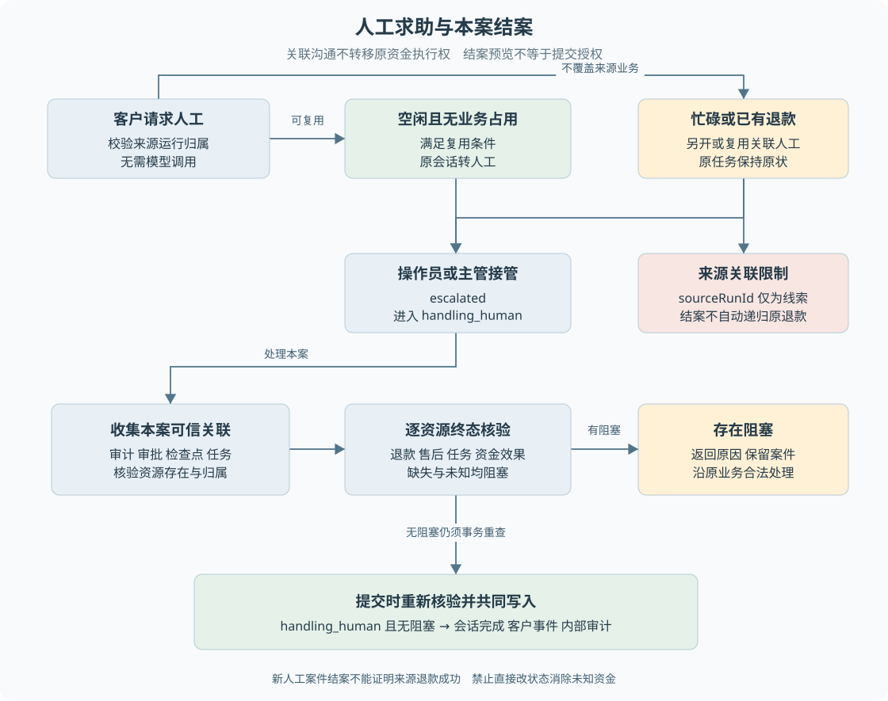

# B07 人工接管与结案

客户要求人工，可能只是希望有人解释进度，也可能存在无法自动处理的业务。人工加入后，沟通责任改变了，但已经存在的售后、审批和资金事实不会消失。理解这一点，才能正确设计接管和结案。

> **阅读前提**：先读[B02](B02-业务对象与状态关系.md)、[B04](B04-仅退款的完整业务实现.md)。资金核验机制见[第 16 章](../05-资金执行与恢复/16-跨进程恢复与人工核验.md)。

## 实现思路

### 沟通责任与业务结果分开

最小客服系统可以将会话状态改成“人工处理中”，坐席回复后点击“已解决”。但如果会话关联一笔未完成退款，仅修改会话就会制造表面结案，客户的钱仍未确认。可靠结案必须先知道本案件关联哪些资源，再检查它们是否都已达到允许结束的状态。

本项目将人工服务和结案核验分开。人工服务检查谁可以接管、回复和申请结案；结案仓储读取案件关联及业务事实，在同一事务中重新核验后，才保存会话完成、客户事件和内部审计。

这里的结案不是“所有请求都成功”。一张申请被合法拒绝、对应退款取消，也可能允许案件结束。关键是**每个相关结果都明确且满足收口条件**，不能留下未知资金、未完成任务或无法核实的关联。

图 B07-1 上半部分区分原会话转接与另开关联人工，下半部分展示单个案件的结案核验。来源关联是沟通线索，不应画成原资金授权转移或跨案件结案证明。

## 请求人工可能产生哪个会话

当前有独立 `POST /api/human-help` 入口，客户可以在模型不可用时求助，不需要先成功调用模型。若提供来源运行，后端先验证它属于当前客户，再判断原会话是否适合直接转接。

空闲、等待输入、没有繁忙任务和退款关联等条件满足时，可以复用原会话。已有 `escalated` 或 `handling_human` 状态时可以复用人工会话。原会话正在运行、已经失败或已经关联退款时，当前实现会查找或新建关联人工会话，保留原任务及资金执行权。

这种分流避免为了接通坐席而覆盖原业务状态。人工事件中的 `sourceRunId` 帮助定位来源，但新人工运行有自己的身份。重复请求还会尽量复用符合条件的关联人工会话，避免客户连点产生一排重复工单。

前端必须使用接口返回的 `runId`，不能假设它永远等于当前页面原运行。切换到人工页面时，原退款仍可能继续推进，两个会话的结果不能混用。

## 接管与消息的业务规则

操作员或主管可以接管 `escalated` 会话，使其进入 `handling_human`；普通客户不能调用坐席接管。对其他状态强行接管会冲突，服务不会把任意运行直接改为人工处理中。

坐席回复要求当前会话处于人工处理中，消息直接进入事件流，不再驱动模型回合。客户在同一状态下也可以留言，API 会验证会话归属。模型无需重新解释坐席每一句话，否则会同时出现两个沟通负责人。

普通留言成功不等于业务操作成功。人工处理中通过客户消息接口提交结构化寄回会被拒绝，避免“留言已发送”被页面解释为“运单已登记”。坐席如需代登记，应核对原售后并使用允许的运营入口，不能只在聊天里写“已登记”。

## 结案前怎样找到相关资源

结案仓储不会从客户文字里搜索一个退款号就认为它属于案件。它从服务端审计、审批、全部检查点和持久任务命令中读取可信关联，再核验资源是否存在且属于原客户。

售后和退款还需要双向展开。只看到售后 completed，不能遗漏关联退款仍 failed；只看到退款编号，也要找回它的原售后。任务携带资金计划时，还要核对渠道资金效果。任务声称 completed 却找不到应有的资金效果，会生成缺失证据阻塞。

损坏的检查点或无法识别的资源关联不能当作“没有业务”。它们变成 `missing` 或 `unverified` 等阻塞事实，避免解析失败反而让案件更容易被关闭。这是一种保守策略：无法证明完成时保留待处理。

同一客户另一个案件的业务不会仅因客户相同就全部拉入当前核验。核验范围是当前运行的可追溯关联，既要避免漏掉本案资金，也要避免其他无关业务永远阻塞本案。

## 各资源的结束条件不同

| 资源 | 当前允许收口的状态 | 仍需注意 |
| --- | --- | --- |
| 退款 | succeeded、cancelled | failed 不等于已经明确收口 |
| 售后 | completed、rejected、expired、cancelled | goods_received 仍可能等待退款 |
| 补偿与价保 | succeeded、rejected、expired、cancelled | failed 仍阻塞 |
| 审批 | approved、rejected、expired | 审批结束不代表关联业务结束 |
| 审批执行意图 | completed、failed | 失败意图可结束，但业务单必须独立满足条件 |
| 持久任务 | completed、cancelled、call_failed、business_failed | needs_confirmation 仍阻塞 |
| 渠道资金效果 | succeeded、rejected | 准备、发送中或未知不能收口 |
| 证据异常 | 无允许终态 | 必须查清关联，不能忽略 |

白名单按资源类型分别应用。假设审批 approved、任务 completed、退款 executing，依然不能结案。假设任务 call_failed 但原退款已经通过其他受控核验确认成功，也不能仅看任务失败断言“肯定未退款”。每个对象都回答自己的问题。

即使所有资源通过，当前运行也必须处于 `handling_human` 才能由人工结案。客户不能读取团队内部核验详情或直接调用结案接口，避免泄漏内部资金和关联诊断。

## 案例六：第一次结案被阻止

下面是教学推演：一个已由坐席接管的原案件关联退货和预留退款，客户已寄回，但仓库尚未确认收货。坐席完成沟通后点击结案，核验发现售后 `buyer_shipped`、退款 `created`，因此返回阻塞信息。

| 操作者 | 输入 | 后端判断 | 记录变化 | 后续动作 | 客户所见 |
| --- | --- | --- | --- | --- | --- |
| 坐席 | 接管原升级案件 | 角色和 escalated 状态 | handling_human 与接管事件 | 人工沟通 | 专员处理中 |
| 坐席 | 预览结案 | 本案资源是否满足终态 | 只读，不结束案件 | 显示阻塞 | 仍处理中 |
| 坐席 | 提交结案摘要 | 写入时再次核验 | 条件不满足则不写完成 | 处理原业务阻塞 | 不能宣称已解决 |
| 操作员与后台 | 合法收货及原退款结果 | 原授权和资金证据 | 原业务到明确结果 | 再次核验 | 收到业务进展 |
| 坐席 | 再次提交摘要 | handling_human 且无阻塞 | 完成、客户事件、审计共同提交 | 关闭本案 | 已结案 |

这里假定当前案件确实关联该原退款，并且存在允许的收货和执行路径。如果资金未知，坐席不能为了通过核验而直接改数据库、取消退款或再发一笔补偿。应该保留阻塞，沿原任务的受控核验流程处理。

## 为什么预览通过后仍要重新检查

前端先加载核验结果，再让坐席填写摘要，两次请求之间可能新增补偿、任务或其他关联。预览只能说明读取时没有阻塞，不能作为永久结案授权。

`resolve` 在事务内重新执行核验，然后才更新会话、写客户 `run.resolved` 事件和审计。任何后续写入失败都会回滚同一事务，避免会话已结束但没有对应证据。现有测试包括预览通过后新增未执行补偿，以及审计失败导致整体回滚。

重复结案也不应重复发送完成事件。第一次完成后案件已不再是人工处理中，后续调用应看到最新事实。前端可以显示原结案结果或冲突提示，但不能再创建一条新的“成功处理”记录。

## 关联人工案件的实际边界

必须特别区分两种情形。原案件自身升级并被接管时，核验读取原运行关联的售后和资金。另开关联人工会话时，新运行通过 `human.requested.sourceRunId` 记录来源，但当前结案仓储没有沿这个字段递归读取来源运行的资源。

因此，**新人工沟通案件能结案，不足以证明来源退款已完成**。当前代码保护了原任务不被转接覆盖，但不能据此宣称已经实现跨关联案件的资金闭环核验。文档中的完整结案案例限定在当前案件具有可信业务关联的情形。

产品若要把关联人工案件作为原退款的统一收口入口，需要增加明确的跨案件核验与展示设计，不能靠文案推断继承关系。本次只记录现状，不修改实现。对当前学习而言，重要的是能指出哪个 run 被结案、哪个 run 仍承担资金事实。

## 结束咨询与人工结案也不同

普通咨询提供显式结束动作，但只允许符合条件的等待输入会话，不能有繁忙任务或退款关联，并要求对应配置版本。它用于结束不含业务副作用的咨询，不是客户自行终止正在办理的退款。

人工结案需要坐席身份、摘要及资源核验；结束咨询则走受控客户控制动作。页面上都可能出现“结束”，后端语义完全不同。设计接口时应采用明确动作，不能给客户端一个能任意设置 completed 的公共方法。

## 按一次失败结案阅读仓储

首先定位 inspect 中读取 run 的语句，确认本次核验的运行和客户。随后观察两组容器：linked 收集待核验的业务标识，resources 收集已经归类的资源状态。前者解决“要查哪些对象”，后者解决“这些对象现在是否结束”，两者分开可以在发现退款父子关系后继续扩展核验集合。

审计关联排除 access_denied 一类记录，避免客户曾经越权尝试访问的对象被当作他的合法案件业务。审批关联还会核验资源类型是否属于支持的业务集合，遇到无法确认的类型则保留证据异常。这里体现了后端读取也要理解记录语义，不能把所有看起来像编号的字段都加入关系图。

检查点读取使用全部历史记录，而不是只读最新一条。原因是一个案件此前可能创建过补偿或其他资源，后续检查点换成另一阶段，不能因此忘记之前的未完成业务。不过“全部历史”仍限定当前 run，不等于扫描该客户所有订单。

任务命令提供独立关联来源。即使业务审计丢失，只要持久命令还声明了资金资源，就仍需核验它。反过来，如果命令结构损坏，不能把解析失败当成无资金任务，应产生 unverified 阻塞。这个设计保护的是信息缺失时的保守判断。

最后，所有资源经 closureBlockers 过滤，只有各自属于允许终态才不阻塞。inspect 返回 canResolve 时还结合 handling_human。理解这一过程后，你就能解释为什么某个页面显示“没有待审批”仍然不能结案：审批只是资源集合中的一类。

## 结案摘要为什么也在事务结果中

坐席提交摘要时，服务先检查非空并进行脱敏，再交给仓储 resolve。摘要是对本案处理的解释，不是一个绕过阻塞的授权口令。写“已退款”不能把 executing 退款变为 succeeded，写“客户同意”也不能删除未知资金。

仓储重新核验后，把会话 completed、客户可见的解决事件和内部审计放在同一事务中。如果审计插入失败，事务回滚，客户不应看到一个无法追溯的成功收口。前端收到失败后需要重查，而不是永久保留乐观完成状态。

这与发坐席消息的语义不同。消息表示沟通内容已保存，结案表示后端已核验允许结束。把两种操作设计成两个清晰入口，可以避免坐席发出最后一句话就无意中结束案件。

## 三个可独立推导的异常

- **关联资源不存在**：检查点声明有退款编号，但查询不到记录，保留 `missing`。需要查明关联或存储事实，不能删除检查点来通过核验。
- **资源属于另一个客户**：保留 `unverified`。金额相同不代表身份相同；团队可收到核验提示，客户不应看到他人的详细订单。
- **任务失败，但退款已经成功**：分别检查业务单与资金效果。只有所有相关资源符合允许终态且证据完整，才有机会通过结案；不能因为任务失败就忽略资金事实。

## 为自己的实现定义结案契约

重建时先列资源范围，再列每种资源的允许终态，最后定义提交事务。只写一个 isDone 布尔字段会把这些判断藏起来，后续新增补偿或价保时容易忘记加入核验。

预览结果适合帮助坐席决定下一步，但提交函数必须自行取得当前事实。新增业务类型时同时增加关联提取、归属检查、终态白名单和阻塞解释，并补上“预览之后状态变化”的用例。这个扩展顺序比在页面继续追加几个 if 更能保持完整性。

跨案件核验则需要单独决定关系含义、授权范围和循环关联处理。当前仓库未提供这套完整设计，因此本章只要求你认识现有边界，不要求通过复制本案查询自动解决所有关联工单。

## 源码参考与验证依据

### 按业务问题对照源码

按表中顺序阅读，每到一站先回答对应业务问题，再进入下一处实现。路径相对本章，可直接点击；搜索词用于在大文件内定位，不要求逐行通读。

| 顺序 | 业务问题 | 项目源码 | 搜索符号或入口 | 阅读重点 |
| --- | --- | --- | --- | --- |
| 1 | 人工求助返回哪个会话 | [app.ts](../../../apps/api/src/app.ts) | `/api/human-help`、`sourceRunId` | 观察原会话复用与关联人工分流 |
| 2 | 谁能接管 回复和结案 | [handover-service.ts](../../../packages/domain/src/services/handover-service.ts) | `takeOver`、`appendOperatorMessage`、`resolve` | 区分沟通动作与资源核验 |
| 3 | 各资源怎样才算结束 | [case-closure.ts](../../../packages/domain/src/case-closure.ts) | `closureBlockers` | 按资源类型应用终态白名单 |
| 4 | 怎样查资源并提交结案 | [case-closure-repository.ts](../../../packages/persistence/src/case-closure-repository.ts) | `inspect`、`review`、`resolve` | 核对可信关联 提交时重查与事务回滚 |
| 5 | 结束咨询为什么不能结束退款 | [conversation-journal.ts](../../../packages/persistence/src/conversation-journal.ts) | `control` | 核对状态 任务与退款关联限制 |

### 验证依据与适用范围

[结案测试](../../../apps/api/test/case-closure.test.ts)覆盖多资源阻塞、其他案件隔离、关联缺失和原子回滚；[人工求助测试](../../../apps/api/test/customer-guidance.test.ts)覆盖另开关联人工及原业务不变。两组证据不能拼成尚未实现的跨案件核验能力。本次仅静态核对这些路径。

---

学习衔接：[业务练习 B07](../09-练习与自测/业务流程练习.md#b07) · [下一章](B08-补偿价保与换货.md) · [总导学](../导学-有据售后.md)
