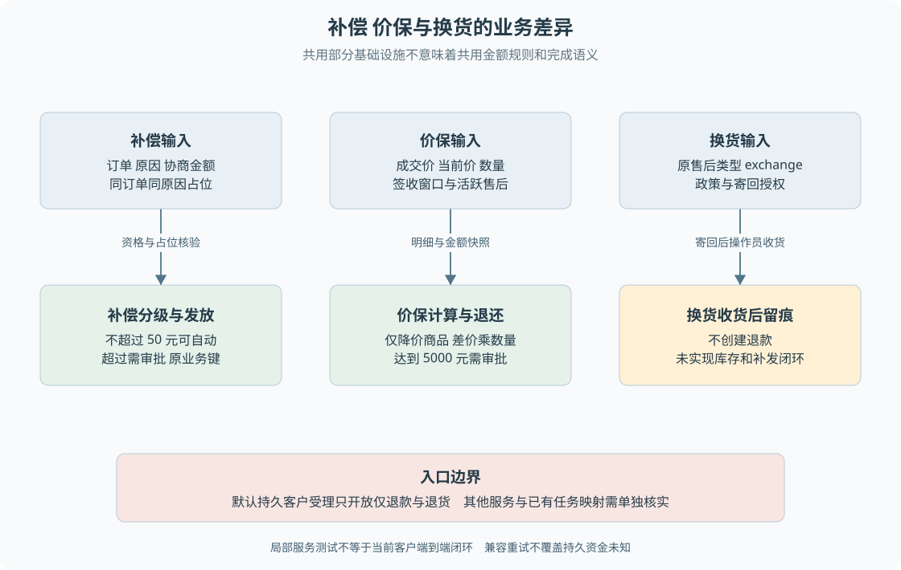

# B08 补偿价保与换货

退款返还原交易款项，补偿提供特定原因下的额外金额，价保返还符合规则的降价差额，换货处理商品替换诉求。它们可能共用审批或渠道接口，但业务身份、金额依据和完成条件不同。

> **阅读前提**：先读[B03](B03-售后资格与金额如何判定.md)、[B06](B06-自动处理与人工审批.md)。本章介绍仓库已有领域与兼容能力，并逐项区分默认客户入口；不把局部实现写成完整产品流程。

## 实现思路

### 复用执行设施，保留业务差异

如果看到这些动作最终都涉及客户利益，就把它们统一成一个带任意金额的 `refund` 接口，会失去关键语义。补偿要约束同订单同原因重复发放，价保要读取当前价格，换货不应该创建退款。一个资金网关不能替上层决定这些规则。

因此补偿和价保分别有自己的实体、服务与状态，复用部分审批、幂等和渠道设施。换货使用售后类型分支，但不预留退款。复用发生在已经确定业务身份与金额之后，而不是把所有诉求塞入同一个自由参数对象。

图 B08-1 使用三个并列流程，强调金额来源和结束语义。底部单独标出入口边界：默认客户退款受理只接受仅退款与退货，已有模块支持不能直接扩大客户工具权限。

## 补偿：金额来自协商，规则负责分级

补偿输入包括原订单、补偿原因和金额。领域服务先拒绝非正金额，再查订单和客户归属，读取已有补偿，检查相同原因是否仍占位。随后按金额判定自动处理还是需要审批。

占位状态包括 created、auto_approved、awaiting_approval、approved、executing、succeeded 和 failed。也就是说，“上次发放失败了”不等于可以创建另一张同原因补偿绕过原结果。拒绝、过期、取消不在该集合，但能否重新申请仍需重新经过全部规则。

阈值是 5000 分，即 50 元。**恰好 50 元在自动侧，超过才需审批。** 补偿单保存订单币种和支付渠道快照，执行时依据原补偿方案，不让模型在发放阶段重新给出金额。

| 操作者 | 输入 | 后端判断 | 记录变化 | 后续动作 | 客户所见 |
| --- | --- | --- | --- | --- | --- |
| 兼容流程调用者 | 订单、原因、协商金额 | 正金额、归属、同原因占位 | 补偿单及执行权登记 | 自动或审批 | 已申请或待审批 |
| 主管 | 原补偿决定 | 资源与金额绑定 | 审批和补偿状态 | 允许的执行路径 | 决定结果 |
| 执行服务 | 原补偿编号 | 状态、凭据、执行权 | 发放结果与幂等记录 | 返回原结果 | 以渠道确认决定成功 |

该表描述已有服务层协作，不表示默认聊天入口能直接调用完整补偿流程。当前持久客户受理不会因为模型提出补偿就回退到旧发放路径。

教学例子：同一订单因延迟配送补偿 30 元并成功，再次以同原因提交 30 元会冲突；换成另一原因并不自动证明合理，代码按原因分开占位，但真实产品仍可能需要更强的总额限制和审核规则。教材不能把尚未实现的累计风控补写成现状。

## 价保：金额来自实际降价商品

价保输入以订单和可选商品列表为主，没有客户自报差价。服务先验证订单归属；指定商品时逐项确认它属于订单，再检查是否已有占位价保。占位状态同样包含成功和失败，不是每降一次价就能无条件再申请。

随后收集当前订单相关 SKU 的售价，按以下顺序判断：未签收拒绝；签收超过七天拒绝；存在进行中售后拒绝；没有降价商品拒绝；其余按命中商品退还差价。这里进行中售后集合还包含 failed，因此售后失败也可能阻止价保，不能照抄退款建单的活跃集合。

当前价缺失的商品按没有可用降价处理，不虚构价格。对每个命中的降价商品，金额为 `(成交单价 - 当前单价) × 数量`。未降价或涨价商品不参与计算。汇总差价达到 5000 元后，再转人工审批。

教学数据：A 成交价 100 元、当前价 80 元、数量 2；B 成交价 60 元、当前价 70 元、数量 1。整单价保只计算 A，合计 40 元；只选择 B，则没有降价商品，拒赔；缺少 A 当前价格时，也不能直接认定降价 20 元。

价保记录保存命中商品的原价、当前价、数量与差价明细，方便解释金额依据。后续执行使用原价保单的金额和渠道快照，不在付款时重新读取市场价格，否则主管批准的差价可能与实际发出的金额不同。

拒赔也保存 rejected 价保记录，但不占用后续申请资格。若之后价格变化且仍在窗口内，可以重新经过判定。这与“同一订单仅一次”的口语描述需要一起读：准确含义是已有占位申请会阻止重复，拒绝和过期等结果不属于占位集合。

## 换货：现有完成语义比真实供应链窄

换货复用售后类型 `exchange`，质量、破损或错货等原因会进入相应政策判断。允许后等待寄回，需要审批时先等待主管决定。它不创建退款单，因为目标不是返还款项。

已有领域服务要求先 buyer_shipped，再确认收货。对于 exchange 分支，收货后将售后推进 completed 并写入换货完成审计，返回空退款编号。**代码没有在这里扣减库存、生成补发订单或等待新包裹签收。**

所以可以用这个分支学习“同一个售后对象因类型不同走不同结束路径”，但不能用它证明完整换货履约。真实换货还可能涉及库存锁定、颜色尺码确认、补差价和新物流，这些都需要另外建模，不能从一个 exchange 枚举推导出来。

换货方案仍经过原政策函数和金额阈值逻辑，因此也不能简单说“没有退款，所以永远不需审批”。判断实际审批时应看当前领域输出。业务字段名带 refund 不代表当前类型必然创建资金记录，这是复用模型留下的语义边界。

## 三种不同的防重范围

| 业务 | 新申请防重依据 | 已确定动作的执行身份 | 不能推导出的能力 |
| --- | --- | --- | --- |
| 退款售后 | 同订单活跃售后及已完成非换货申请 | 原售后生成的退款业务键 | 多次部分退货累计余额 |
| 补偿 | 同订单、同原因、占位状态 | 原补偿编号对应业务键 | 任意原因都合理或全订单总额风控 |
| 价保 | 同订单已有占位价保 | 原价保编号对应业务键 | 每次降价都重复赔付 |
| 换货 | 售后服务的申请限制和状态前置 | 原售后与收货动作 | 完整仓储重新发货幂等 |

新申请防重保护“同一业务诉求不能无限建单”，执行幂等保护“同一笔已确定动作不能反复产生副作用”。只完成后一层，客户仍可能通过新单号生成新的业务键，因此两者必须分别讲清。

## 哪些路径存在，哪些尚未完整接入

领域服务和旧工作流可以创建补偿、价保、换货；持久业务执行器也包含对已有补偿、价保审批的接管能力。但当前客户会话退款受理明确仅允许 `submit_refund_only` 与 `submit_return`。业务 Worker 能处理某种任务，不表示客户已有合法入口生成该任务。

判断一项能力是否接入客户闭环时，按顺序核对：

1. **工具是否可见**：当前客户使用的工具集合中是否有该动作。
2. **调用是否允许**：执行入口是否接受该动作和参数。
3. **业务是否持久受理**：是否保存原方案、授权与后续工作。
4. **结果是否回到客户**：能否关联原调用并展示可靠结果。

> **证据边界**：少一段都不能声称端到端闭环。历史同步测试可以说明局部行为，不能自动证明未知结果下的持久安全。

未来接入这些能力时，需要补齐原调用关联、授权、执行权、资金结果与客户投影，并核验结案阻塞。不能直接扩大工具白名单，把旧服务挂到新客户入口就宣布迁移完成。这里是设计迁移条件，不是本次新增功能。

学习这些能力时，可以先为每种动作写一句精确的完成判据，再决定是否复用流程。补偿是原补偿金额已确认发放，价保是原差价方案已确认退还，当前换货只是原售后收货后留痕完成。判据不同，就不应共用一句模糊的“售后成功”覆盖页面、测试和面试描述。

## 源码参考与验证依据

### 按业务问题对照源码

按表中顺序阅读，每到一站先回答对应业务问题，再进入下一处实现。路径相对本章，可直接点击；搜索词用于在大文件内定位，不要求逐行通读。

| 顺序 | 业务问题 | 项目源码 | 搜索符号或入口 | 阅读重点 |
| --- | --- | --- | --- | --- |
| 1 | 补偿按什么范围防重 | [compensation-service.ts](../../../packages/domain/src/services/compensation-service.ts) | `createCompensation`、`executeCompensation` | 对照订单 原因 占位状态与原金额 |
| 2 | 价保差价如何确定 | [price-protection-service.ts](../../../packages/domain/src/services/price-protection-service.ts) | `createPriceProtection`、`executePriceProtection` | 核对商品归属 当前价与原差价明细 |
| 3 | 两种业务的政策差异 | [policy.ts](../../../packages/domain/src/policy.ts) | `evaluateCompensationPolicy`、`decidePriceProtectionPolicy` | 比较资格和阈值 不套用退款规则 |
| 4 | 换货完成的实际含义 | [after-sale-service.ts](../../../packages/domain/src/services/after-sale-service.ts) | `receiveReturnGoods`、`exchange` | 收货后留痕完成 不代表重新发货 |
| 5 | 已有审批如何被接管 | [durable-business.ts](../../../packages/runtime/src/durable-business.ts) | `runOnce` | 模块支持范围不等于客户可申请范围 |
| 6 | 默认客户入口开放哪些动作 | [p6-conversation-refund.ts](../../../packages/persistence/src/p6-conversation-refund.ts) | `submit` | 核对仅退款与退货白名单 |

### 验证依据与适用范围

对应测试为[补偿测试](../../../packages/domain/test/compensation-service.test.ts)、[价保测试](../../../packages/domain/test/price-protection-service.test.ts)和[售后测试](../../../packages/domain/test/after-sale-service.test.ts)。其中部分测试使用未注入持久执行权的内存兼容服务，“失败后重试成功”的结论不能移用于资金未知的当前持久入口。本次只读取测试与实现。

---

学习衔接：[业务练习 B08](../09-练习与自测/业务流程练习.md#b08) · [下一章](B09-物流事实与服务评价.md) · [总导学](../导学-有据售后.md)
