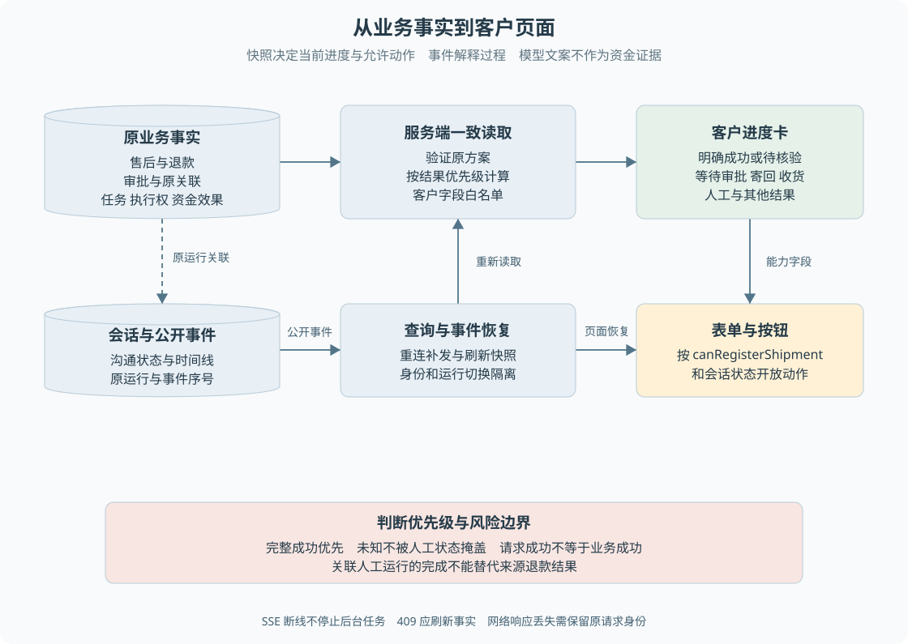

# B10 从业务事实到客户页面

对于前端开发者，最熟悉的是按钮、加载状态、消息和进度卡。本章从这些可见内容反向定位后端事实：页面应该依据什么显示，哪个请求真正改变了业务，出错后该重试还是重新查询。

> **阅读前提**：先读 B04—B07。SSE、事件序号、迟到响应和 reducer 的实现细节见[第 17 章](../06-交互与运行治理/17-SSE事件投影与前端状态.md)，本章不重复实现网络客户端。

## 实现思路

### 用业务快照决定操作，用事件解释过程

如果页面只根据最新一条聊天文字判断进度，模型说“处理好了”就可能触发成功样式；如果只根据会话 completed 判断，也会混淆普通咨询结束、人工结案和退款成功。正确做法是分别读取会话、客户可见事件和业务进度快照。

页面需要组合三类信息：

- **会话**：现在由谁沟通，是否等待输入。
- **事件**：期间发生过什么。
- **业务快照**：原售后及资金现在处于什么阶段，客户能做什么。

> **展示依据**：三类信息共同组成页面，但不能随意互相覆盖。聊天文案不能替代退款成功证据。

客户进度由服务端在数据库事务中读取原会话与业务关联，并验证原方案。这样查询看到的是一个一致读取位置，而不是前端先取售后、再取退款、再自行拼凑多个时间点的事实。

图 B10-1 左侧是内部多类事实，中间是服务端核验和客户白名单，右侧是页面。事件驱动页面获取更新，业务快照提供当前结果；内部授权 token、原始工具参数和诊断不直接穿过白名单。

## 进度字段为何不是退款状态的翻译

`customerRefundProgress` 验证原关联后，读取售后、退款、审批、资金效果、执行权及非会话任务，按优先级计算公开进度。没有原退款关联时返回空，表示当前没有可展示的退款流程，不代表查询失败或默认成功。

成功需要同时满足售后 completed、退款 succeeded、资金效果 succeeded、执行权归 p6 且 succeeded，并保留发送确认标识。仅其中一个对象成功不能保证整个证据链一致。

未知条件包括任务需要确认、资金效果尚未明确、执行权 sending 或 unknown，以及成功事实只出现一部分的矛盾组合。这个公开 `unknown` 也覆盖保守的待核验阶段，不一定都说明已经发生不可逆支付事故。它表达的是页面暂时不能给出确定成功结论。

优先级大体是：完整成功、待核验、过期、拒绝、取消、人工、明确失败、等待审批、待寄回、待收货，最后是处理中。**未知先于人工状态**，避免坐席接管把资金风险从页面上盖掉；完整成功也可以在人工沟通仍存在时被准确展示。

## 客户进度与下一步操作索引

| 公开进度 | 业务含义 | 客户下一步 | 不应提供的操作 |
| --- | --- | --- | --- |
| 无退款进度 | 尚无可展示的原退款关联 | 按会话要求补充信息 | 默认显示退款成功 |
| processing | 原流程正在推进或尚未形成更明确阶段 | 等待并查询进展 | 为催促重新创建退款 |
| awaiting_approval | 原方案尚待有效决定 | 等主管或申请沟通帮助 | 客户自己批准 |
| awaiting_shipment | 退货获准，等待登记 | 仅能力允许时填写运单 | 未确认权限直接展示可提交 |
| awaiting_receipt | 已登记寄回，等待收货 | 等待仓库处理 | 客户代替仓库确认收货 |
| unknown | 资金证据需要核验 | 查看原业务、联系团队 | 一键重发退款 |
| rejected／expired／cancelled | 原申请已拒绝、过期或取消 | 阅读原因，必要时人工沟通 | 自动从头创建新资金动作 |
| human | 当前进入人工沟通阶段 | 按会话状态留言 | 把人工接管当资金成功 |
| failed | 原流程出现明确停止或失败事实 | 团队核验原业务 | 仅凭失败文案推断从未付款 |
| succeeded | 原退款成功证据完整 | 查看结果 | 继续登记寄回或再次退款 |

这张表描述页面语义，最终按钮仍依据接口能力与会话状态。比如待寄回还要求 `canRegisterShipment` 为真；同名 progress 并不自动授权任意客户端写入。

## 会话输入与业务表单分别判断

前端 `canSendCustomerMessage` 允许人工处理中留言；等待补充时还要考虑模型是否可用。审批中不应继续发送普通消息驱动同一模型回合，但可能仍有独立人工求助入口。

寄回表单则读取服务端 `canRegisterShipment`。它要求原售后等待寄回、关联尚未终态投影、会话仍在允许状态。表单成功后重新获取进度，确认已登记且进入等待收货；普通留言回调成功不能复用成寄回成功提示。

订单候选卡片也有独立语义。用户选择订单和商品后，系统继续原诉求，而不是点击任意卡片立即退款。候选只显示本人最小字段，后端提交申请时再次检查归属。页面切换身份后必须清理旧候选和旧响应，防止客户看到不属于自己的信息。

## 接口与事实来源索引

| 接口 | 用途 | 成功响应真正意味着什么 |
| --- | --- | --- |
| POST `/api/runs` | 创建客户会话输入 | 持久模式 202，命令和任务已受理 |
| POST `/api/runs/:runId/messages` | 补充、结构化寄回或受控动作 | 依分支受理或保存留言，不能统一解释为退款完成 |
| GET `/api/runs/:runId/customer-progress` | 查询原退款公开快照 | 得到当前可核验进度，查询本身不推进资金 |
| GET `/api/runs/:runId/events` | SSE 客户事件 | 收到过程更新，不等同于完整业务快照 |
| POST `/api/human-help` | 请求人工 | 返回目标人工运行，可能不是来源 run |
| POST `/api/runs/:runId/approvals/:approvalId/decide` | 主管决定 | 持久模式记录决定，执行仍待推进 |
| POST `/api/operations/receive-goods` | 操作员确认收货 | 持久模式受理后续任务，不等于渠道已成功 |
| GET `/api/desk/cases/:runId` | 团队案件详情与结案预览 | 当前读取时的阻塞信息，不是永久结案授权 |
| POST `/api/runs/:runId/resolve` | 人工结案 | 本案件在提交时通过核验并保存结果 |
| POST `/api/runs/:runId/rating` | 客户评价 | 评分已保存，不改变资金事实 |

接口具体请求结构以契约和 API 为准，本表不另造一套协议。客户查询与团队查询使用不同可见范围，隐藏前端导航不能代替服务端鉴权。

## 错误响应怎样转成正确交互

- **400 输入问题**：通常要求修正输入。
- **403 权限问题**：检查身份和资源归属，不能自动重试到成功。
- **409 状态冲突**：刷新当前状态、关联与请求身份，再判断是否允许操作。
- **503 服务不可用**：模型不可用等场景可提供明确错误和人工求助，不能据此推导原退款没有执行。

网络失败无法告诉页面服务端是否已经接受请求。对同一次可幂等输入，应保留原请求键；不要每次点击重试都随机生成新键。刷新业务快照可以帮助确认原动作是否发生，但不能让前端自己修改订单或退款状态。

切换会话后旧请求才返回，是前端常见的异步竞争。应将结果与当前身份、运行和请求代次核对，过时响应不进入新页面。这个机制保护展示一致性，与后端资金幂等是两种防线，不能用其中一个替代另一个。

## 断线和页面恢复

SSE 断开只表示浏览器暂时收不到事件，不表示后台停止工作。页面恢复时需要补事件并重新查询业务快照，不能因为一段时间没有消息就将退款标为失败。

事件用于解释时间线，快照用于确认当前位置。若资金已经成功但终态事件尚未投影，后台可继续补投影；若消息声称成功但业务快照仍未知，页面应保留待核验。状态来源的优先级比文案是否“像成功”更重要。

在人工求助分流中，要同时关注来源与目标。接口返回新人工 run 时，客户端可以进入沟通页，但来源退款的进度应仍按来源查询。新人工案件结案也不能用于把原退款卡片改为成功，详见 B07 的跨案件边界。

## 用一个页面问题反查后端

假设退货页没有出现寄回表单。先看 customer-progress 是否存在，再看 progress 是否为 awaiting_shipment，然后看 canRegisterShipment 与会话状态。如果仍待审批，就查审批和后台授权；如果已人工接管，则检查入口限制；如果关联校验失败，则应核验原业务，而不是前端强行显示表单。

再假设页面显示“处理中”很久。先判断它在等谁：客户补充、主管决定、仓库收货、后台执行还是渠道确认。没有这个业务分类，延长轮询或重复发消息都可能无效。B04—B07 的流程表正是为了让你沿事实定位问题，而不是先猜某个组件有 bug。

## 源码参考与验证依据

### 按业务问题对照源码

按表中顺序阅读，每到一站先回答对应业务问题，再进入下一处实现。路径相对本章，可直接点击；搜索词用于在大文件内定位，不要求逐行通读。

| 顺序 | 业务问题 | 项目源码 | 搜索符号或入口 | 阅读重点 |
| --- | --- | --- | --- | --- |
| 1 | 公开进度怎样计算 | [customer-progress.ts](../../../apps/api/src/customer-progress.ts) | `customerRefundProgress`、`canRegisterShipment` | 核对成功 待核验和操作能力 |
| 2 | 内部事件哪些能公开 | [customer-view.ts](../../../apps/api/src/customer-view.ts) | `customerEvent`、`customerRun` | 核对客户白名单和内部凭据隔离 |
| 3 | 消息按钮怎样受状态限制 | [customer-view.ts](../../../apps/web/src/components/customer/customer-view.ts) | `canSendCustomerMessage`、`customerStatus` | 区分人工留言 等待输入与模型可用性 |
| 4 | 页面怎样组合消息与进度 | [CustomerWorkspace.tsx](../../../apps/web/src/components/customer/CustomerWorkspace.tsx) | `CustomerWorkspace` | 沿查询 事件和当前会话追踪更新 |
| 5 | 寄回表单何时提交 | [ReturnShipmentPanel.tsx](../../../apps/web/src/components/customer/ReturnShipmentPanel.tsx) | `ReturnShipmentPanel` | 结合服务端能力与提交后刷新 |

### 验证依据与适用范围

[进度测试](../../../apps/api/test/customer-progress.test.ts)、[客户事件测试](../../../apps/api/test/customer-events.test.ts)、[前端寄回测试](../../../apps/web/test/return-shipment.test.ts)分别核对业务事实、公开边界和交互条件。当前章节是行为说明，不宣称本次进行了完整应用 UI 回归；SVG 的独立预览记录见维护目录。

---

学习衔接：[业务练习 B10](../09-练习与自测/业务流程练习.md#b10) · [业务目录](README.md) · [总导学](../导学-有据售后.md)
