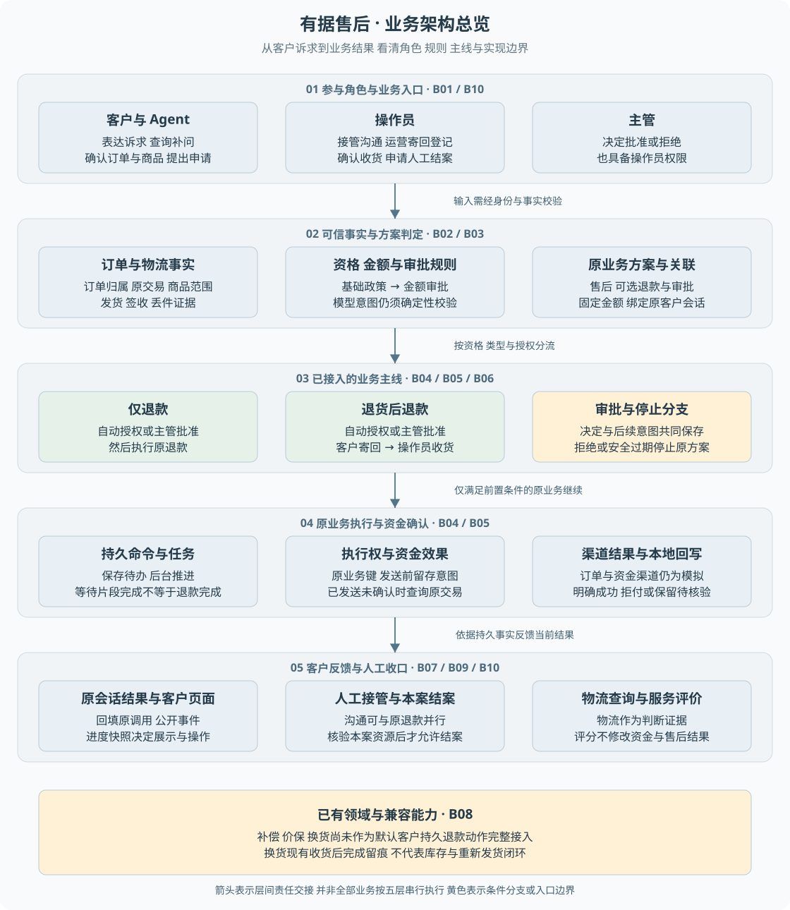

# 业务逻辑详解

掌握当前业务规则、角色交接、记录变化与实现边界。

> **阅读前提**：先读项目全貌，按需回查后端基础。默认读者熟悉前端、后端基础较弱、略懂 Agent；不要求先掌握整个技术栈。

## 先看业务架构

图 B00-1 展示角色、规则、退款主线、执行与客户反馈的关系。**箭头表示责任层次，不是每笔业务都要经过的固定时序**；黄色标明条件分支或入口边界。

- [业务架构总览与读图说明](业务架构总览.md)：两条主线、对象职责、能力边界及源码映射。
- [单独打开业务架构图](业务架构图.svg)：图文件就在本业务逻辑目录内。

## 建议阅读顺序

1. **建立业务地图**：B01 → B02，先理解谁负责什么、各类对象保存什么。
2. **走通两条主线**：B03 → B04 → B05，先判资格与金额，再看仅退款和退货退款。
3. **理解角色交接**：B06 → B07，关注审批、人工接管和结案条件。
4. **回到前端页面**：B10，对照快照、事件与按钮能力理解页面状态。
5. **补齐能力边界**：B08 → B09，比较补偿、价保、换货、物流与评价。

B04—B07 是核心长流程，B03 的规则矩阵可随时回查。后端基础的插入位置见[总导学](../导学-有据售后.md)。

## 章节目录

| 章节 | 本章要回答的问题 |
| --- | --- |
| [B01 业务能力全景与角色分工](B01-业务能力全景与角色分工.md) | 谁参与售后，默认客户入口开放哪些能力 |
| [B02 业务对象与状态关系](B02-业务对象与状态关系.md) | 订单、售后、退款、审批、任务为何不能合成一个状态 |
| [B03 售后资格与金额如何判定](B03-售后资格与金额如何判定.md) | 归属、占位、政策、金额和审批按什么顺序判断 |
| [B04 仅退款的完整业务实现](B04-仅退款的完整业务实现.md) | 一句退款诉求如何变成已确认的原退款结果 |
| [B05 退货后退款的完整业务实现](B05-退货后退款的完整业务实现.md) | 谁登记寄回、谁确认收货、为什么继续原退款 |
| [B06 自动处理与人工审批](B06-自动处理与人工审批.md) | 主管批准了什么，决定后谁继续推进 |
| [B07 人工接管与结案](B07-人工接管与结案.md) | 沟通转人工后，哪些业务事实仍会阻止结案 |
| [B08 补偿价保与换货](B08-补偿价保与换货.md) | 其他售后能力为何不能直接套用退款闭环 |
| [B09 物流事实与服务评价](B09-物流事实与服务评价.md) | 配送、寄回、评分各自证明什么 |
| [B10 从业务事实到客户页面](B10-从业务事实到客户页面.md) | 页面状态和可操作按钮应该依据哪些后端事实 |

## 怎样对照源码学习

每章末尾提供 **业务问题 → 项目源码 → 搜索符号或入口 → 阅读重点** 对照表：

- **先理解问题**，再按顺序点击文件，避免从大文件第一行漫读。
- **保留对象身份**，分清原会话、原售后、原退款与本次任务。
- **区分证据类型**，源码行为、现有测试覆盖与本次实际运行结果分别阅读。

读完主线后，可以用[业务流程练习](../09-练习与自测/业务流程练习.md)检查自己是否能解释下一步由谁推进、何时仍不能向客户宣称成功。

---

[返回总导学](../导学-有据售后.md)
