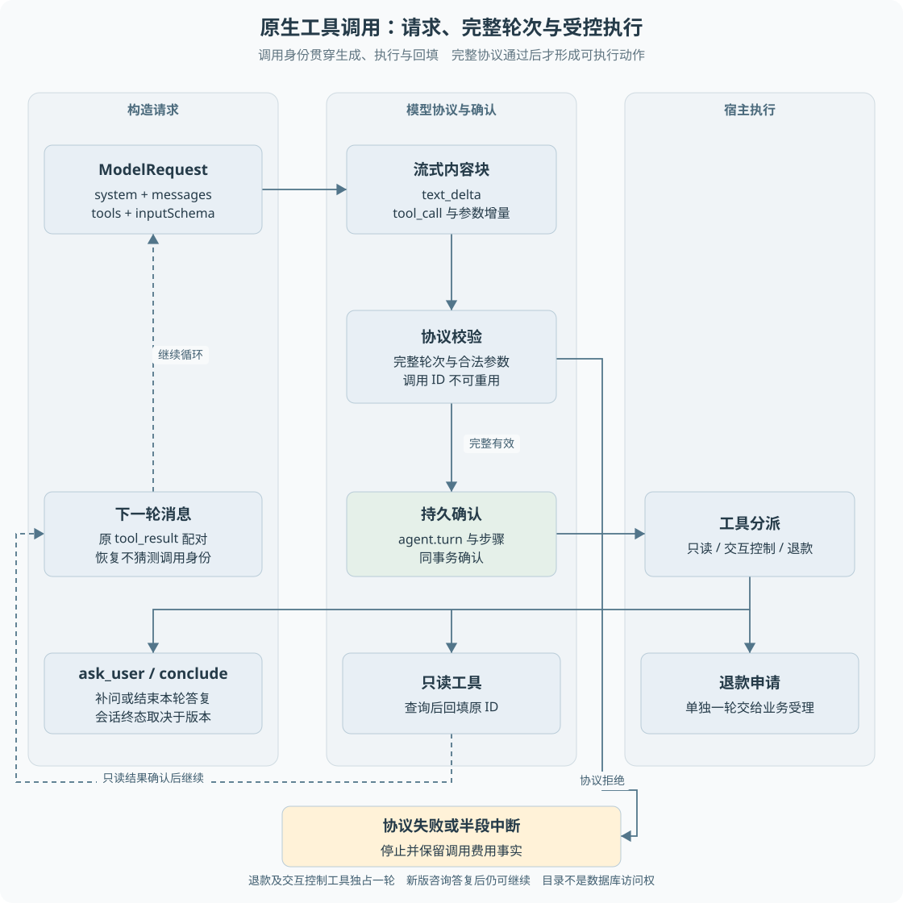

# 第 09 章 原生工具调用与 Agent 循环

模型回复“我正在查询订单”并不意味着真的查询了数据库。宿主需要一个明确协议，知道模型请求哪个工具、参数是什么，以及执行结果应回给哪次调用。**原生工具调用把行动请求与普通文本分开，但执行权仍在宿主程序。**

> **阅读前提**：先读[第 08 章](08-Agent与确定性工作流的分工.md)，理解异步函数和 JSON。本章解释消息角色和调用配对，无需先使用某个 Agent 框架。

## 实现思路

### 从解析文本升级到结构化协议

最小做法是要求模型输出一段 JSON，再由程序解析工具名和参数。这个方案可以工作，但文本说明、格式错误、截断与多工具结果配对会逐渐增加解析负担。

项目定义提供商无关的 `ChatModel`，把模型输出统一为文本增量、工具调用起始、工具参数增量和轮次完成。适配器负责翻译提供商协议，运行时负责校验和执行。

完整循环由六个步骤组成：

1. **构造请求**：系统提示、历史消息、工具目录共同组成 `ModelRequest`。工具包含名称、描述和输入 JSON Schema。
2. **收集一轮输出**：按 toolCallId 累积参数片段，区分文本与工具块。未完成的参数不能直接执行。
3. **校验完整协议**：必须得到完整轮次，工具名和参数结构有效，不能复用已经出现的调用标识。
4. **持久确认模型轮次**：当前持久路径把完整 `agent.turn` 与步骤确认一起保存，再进入工具处理。
5. **执行并回填结果**：只读工具结果关联原 toolCallId；退款动作交给业务受理，终止协议工具决定暂停、完成或升级。
6. **继续或停止**：有新的工具观察则进入下一轮，补问时暂停，普通答复按原工具版本决定继续咨询还是结束；退款终态由业务结果确认，协议错误或预算限制时停止。

关键设计是**调用身份贯穿模型输出、宿主执行和结果回填**。即使有两个同名查询，结果也不能只靠工具名匹配；必须知道它回答的是哪一次调用。



图 9-1 把请求、模型协议和宿主执行分成三个区域。循环返回的是原调用结果，不是重新拼接一段无来源的助手说明。资金动作在右侧交给业务链路，不由协议适配器直接执行。

图中的回环从只读工具结果确认之后返回下一轮，不从模型意图直接返回。补问和结束工具暂停或收尾，退款则交给业务受理并由原业务结果投影回填，不能画成所有工具执行后立即再调用模型。

## 工具目录与 Schema

`ToolDefinition` 包含 `name`、`description` 和 `inputSchema`。名称用于定位能力，描述帮助模型选择，Schema 描述合法输入。项目从共享 Zod 契约生成 JSON Schema，减少运行时校验与模型目录各写一套造成的漂移。

Schema 能约束字段类型和可选值，但无法知道某订单当前属于谁。工具执行仍要进行权限与领域校验。模型收到工具定义不等于获得数据库连接，也不等于可以调用任意服务函数。

协议工具与业务工具也不完全相同：

- `get_order`、`get_shipment`、`search_policy` 取得外部事实。
- `list_my_orders` 在支持选单的版本中查询本人订单候选，候选仍需客户确认。
- `ask_user` 把缺失信息交给客户补充，形成持久等待。
- `conclude` 标识答复结束；新版普通咨询只结束本轮，旧版可能结束会话，不能由工具名字直接推断业务终态。
- `escalate` 表示升级人工，不能只在文本里承诺转接。
- 两个退款申请工具将意图交给确定性业务受理。

## 消息为什么要成对

先区分消息中的角色。system 是宿主给模型的任务说明；user 通常承载客户输入，也可按提供商协议承载工具结果；assistant 承载模型输出，既可以是文字，也可以包含工具调用。工具执行者是宿主代码，不是消息角色名称本身。这里的“一轮”指一次模型请求到完整响应，不等于客户说一句、助手回复一句的完整业务周期。

原生上下文中，assistant 消息可以携带 `tool_use`，后续 user 消息携带相应 `tool_result`。这里的 user 是协议消息角色，不意味着工具结果是客户手写的内容。

最小配对示意如下，省略其他文本块和业务字段：

```text
assistant: tool_use(id=call_1, name=get_order, input={orderNo: ...})
user:      tool_result(id=call_1, content=订单查询结果)
assistant: 根据结果选择下一步
```

如果把结果配给另一调用，模型就可能将 A 订单事实用于 B 订单。若遗漏结果，提供商协议校验可能拒绝请求，或者上下文无法解释上一次动作是否完成。

项目从事件重建消息，工具结果保存原 ID。持久路径还检查跨轮 ID 重用，并要求退款动作与终止工具独占一轮，避免同一轮既补问又执行资金申请所产生的未完成配对。

## 流式输出与确认边界

流式参数可能分成多片到达，例如一个 JSON 对象尚未闭合时连接已经断开。此时页面看到了一部分文字，也不代表宿主已经拥有可执行参数。

当前持久会话使用 `collect` 收集已经通过 P7 协议校验的完整轮次，未完成片段不会作为业务轮次落库。确认之后才保存 `agent.turn` 和相应客户消息，再处理工具。

旧 `AgentRunner` 则有文本与参数增量事件逐片段落库的实现。**不能把旧路径的“逐 token 持久流式”描述直接用于当前持久客户入口。** SSE 是否持续连接，与模型是否逐 token 对客户展示也是两件事。

这两种确认策略的取舍在于展示及时性、重放复杂度和恢复边界。持久完整轮次更容易避免半个工具参数触发业务，但客户不一定获得逐 token 的当前持久对话体验。改进时需要设计增量身份和中断语义，不能只打开一个前端动画。

## 为什么需要明确的停止协议

模型输出一段纯文本，可能是完整回答，也可能是在问客户问题。若仅凭文本判断，系统容易把尚未完成的交互关闭，或者让已经完成的回答一直等待。

项目用 `ask_user` 明确指出需要客户回答的问题，用 `conclude` 标识已给出答复，但状态还要结合运行冻结的工具版本判断：

| 输出或动作 | 当前如何解释 | 会话状态 |
| --- | --- | --- |
| ask_user | 正在等某项必要信息，保存原调用 ID | awaiting_input，补问 |
| customer-guidance-v1 中的 conclude | 本轮普通咨询已答复，仍可继续问 | awaiting_input，consultation=ready |
| 较早工具版本中的 conclude | 按旧契约结束会话 | completed |
| 没有工具调用的纯文本轮次 | 不凭文字猜业务完成 | awaiting_input |
| 客户显式结束咨询 | 后端核验空闲、无退款关联等条件 | 条件满足才 completed |

所以“结束本次模型调用”“结束一轮答复”“结束客户会话”“退款成功”是四个不同结论。新版 conclude 还会补齐自身工具结果，保证客户下一次追问时消息协议完整；旧会话保留原快照，不会随代码升级自动获得新行为。具体分支见 `DurableConversation.execute` 中的 guidance 判断及 `ConversationJournal.control`。

循环还有上限，每次持久会话任务默认最多 12 个模型轮次，不是整个多轮客户会话终身只允许 12 次。步骤上限限制持续循环，但它不能独立控制所有费用；每次模型调用还需要经过预算网关。重试、轮次与任务尝试是三个不同计数，不能混为“最多调用 12 次所以费用一定可控”。

## 失败如何回到循环

只读工具执行失败可以形成 `isError=true` 的工具结果，让模型知道查询没有得到事实。它不能使用失败占位内容编造订单状态。是否进一步重试或升级，应结合现有规则和提示词，而非假定任何失败都自动重跑。

P7 协议或模型调用失败在持久会话中会停止为明确错误，避免 Worker 再包一层模型重试，导致供应商尝试与任务重试相乘。退款业务受理失败则在事务回滚后回填明确失败，不退回旧资金执行器。

正常案例是查询订单后继续检索政策，再提交退款。异常案例是模型同轮输出一个退款动作和 `ask_user`：当前宿主拒绝这种组合，而不是任选一个执行。它要求协议先明确当前轮次的责任。

## 从两轮消息推导最小执行器

考虑一个教学会话：客户要退一笔订单，模型先选择查单，读取结果后再申请退款。第一轮输入由系统说明、客户消息和工具目录组成；第一轮输出是一块带调用 ID 的查单意图。宿主不能把这个意图直接显示成“订单已查到”，而是检查名字与参数，调用读取端口，得到结果后关联原 ID。

第二轮的消息历史至少要包含模型曾提出的工具调用以及对应结果。只塞入“订单未发货”这段普通文本，会丢失它来自哪个工具、回应哪个动作以及是否已执行的协议信息。多个工具或跨进程恢复时，这种丢失更明显：新进程无法可靠配对，提供商也可能拒绝不合法消息序列。

最小执行器可以据此分成四个接口：模型适配负责收集完整轮次，工具派发负责受控执行，日志负责确认与重建，循环负责决定继续或暂停。代码组织未必恰好是四个类，但必须能指出这四种职责在哪里。若一个函数同时解析流、写业务表、计算价格并生成客户文案，故障时就难以知道哪一项已经完成。

在当前持久实现中，读取轮次检查点是每轮开始的重要动作。若完整轮次已经确认，新进程复用原调用 ID 和参数；只有尚未确认的轮次才再次调用模型。工具结果也独立确认，所以同一轮多个动作中的确认进度可以被识别。**恢复保留的是已确认的协议事实，不保证每次外部模型计算只发生一次。**

### 半段流、完整轮次与费用证据

流式传输只是响应的交付方式。一个工具的名称可能先到，参数分多次到达，最终还需要完成标记和用量。执行器应等到协议允许确认时才建立完整工具调用，不能见到部分合法 JSON 就提前执行。不同提供商的增量格式由适配层处理，主循环不应到处散落供应商专用字段判断。

假设模型已经在远端生成全部结果，本地在最后一帧前断线。对话层没有足够证据把它确认成完整轮次，费用层也可能无法得到可靠 usage。于是任务与费用出现不同事实：业务动作未执行，但模型费用未知。若只用“工具没有执行”就把模型成本清零，账本会低估真实风险。

相反，完整轮次已经确认，业务工具尚未受理时退出，恢复应复用那次意图进入受理，而不是再让模型选一次。业务受理成功后才退出，又要优先读取原业务关联，避免生成第二张售后。循环、日志和领域受理因此有连续但不同的确认边界，不能用一个 try/catch 包起来后统一从头重试。

对应[练习三](../09-练习与自测/渐进重建练习.md)，先用固定两轮轨迹检查配对，再分别在半段流、完整轮次后和工具确认后中断。预期结果应写明重做哪一步、复用哪条记录以及哪些动作绝不能重复。测试“最终有一条正确答案”不足以排除错误执行路径。

## 源码参考与验证依据

| 入口 | 内容 |
| --- | --- |
| [model.ts](../../../packages/agent/src/model.ts) | 请求、消息块、流事件与模型端口 |
| [tool-defs.ts](../../../packages/agent/src/tool-defs.ts) | 工具目录与 JSON Schema |
| [anthropic-model.ts](../../../packages/agent/src/anthropic-model.ts)、[p7-live-transport.ts](../../../packages/runtime/src/p7-live-transport.ts) | 原生协议与当前真实传输，实际启用仍看配置与入口 |
| [durable-conversation.ts](../../../packages/runtime/src/durable-conversation.ts) | collect、完整轮次确认、独占工具与 ID 检查 |
| [context.ts](../../../packages/agent/src/context.ts) | tool_use 与 tool_result 重建 |
| [会话测试](../../../apps/api/test/durable-conversation.test.ts)、[退款测试](../../../apps/api/test/conversation-refund.test.ts) | 工具配对、退款交接及错误边界 |

原生工具调用改善的是协议结构，不保证模型一定选对工具。接口兼容、参数合法、业务正确和客户任务完成，需要由不同层的测试与评测分别证明。

---

本章学习衔接：[渐进重建练习三](../09-练习与自测/渐进重建练习.md) · [集中自测第 09 组](../09-练习与自测/集中自测.md) · [返回导学](../导学-有据售后.md)

业务对照：[B04-仅退款的完整业务实现](../03-业务逻辑详解/B04-仅退款的完整业务实现.md)。
