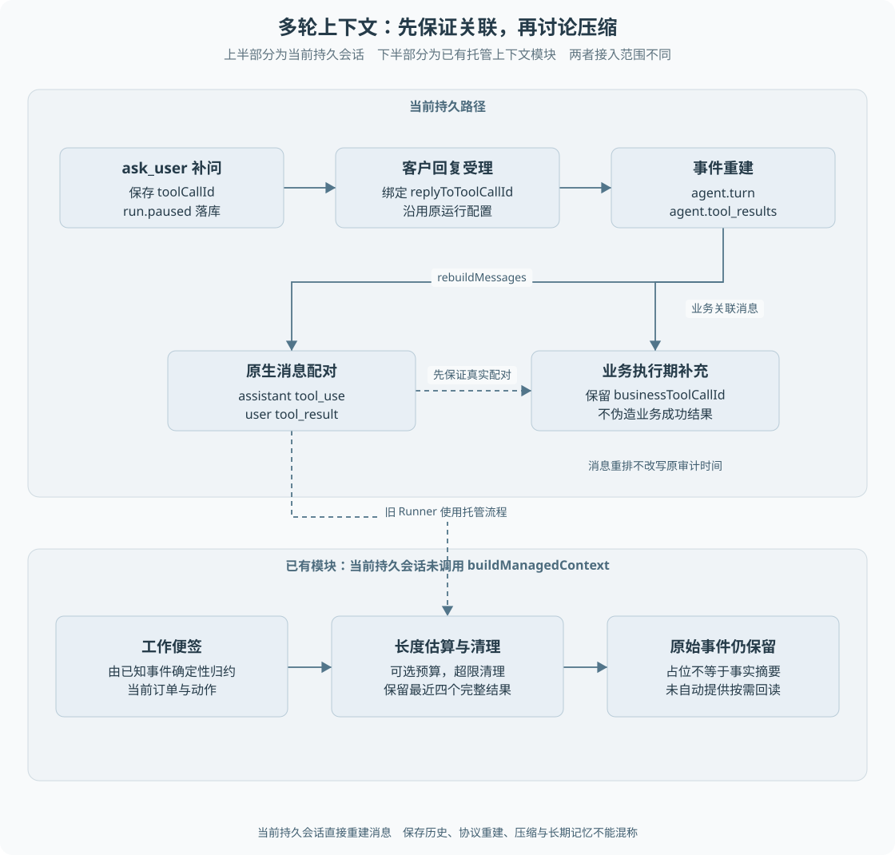

# 第 10 章 多轮澄清与上下文管理

系统问“要退哪一笔订单”，客户稍后只回复一个订单号。模型要理解这条短消息，必须知道它回答的是哪个问题，以及前面哪些工具已经执行。把所有文字拼成一个字符串，并不能可靠保存这种关系。

> **阅读前提**：先读[第 09 章](09-原生工具调用与Agent循环.md)，理解原生消息块、toolCallId 与工具结果配对。

## 实现思路

### 从聊天历史到可恢复上下文

最小上下文可以保存最近几条用户和助手消息。业务流程需要更多信息：哪些工具调用已有结果、哪个问题还在等待、原退款是否仍在处理、哪些消息到达时资金动作尚未结束。

项目以持久事件作为重建模型消息的依据，而不是依赖进程中的聊天数组。

1. **补问保存原调用。** `ask_user` 的 toolCallId 随暂停事件落库。用户回复时，受理层把回复绑定这个 ID。
2. **工具结果按身份重建。** `agent.turn` 恢复 assistant 工具块，`agent.tool_results` 恢复对应 user 结果块，连续工具结果可以合并到一个协议消息中。
3. **业务执行期消息保留真实语义。** 退款尚未返回结果时，客户补充不能假装退款工具已经完成。重建时按原业务关联安排消息顺序，不改变审计事件的实际时间。
4. **已确认步骤与上下文分开。** 检查点决定要不要重新执行某一步，消息历史决定下一次模型看到什么。两者有关联，但不能互相替代。
5. **长历史处理按实际入口区分。** 仓库有工作便签与确定性工具结果清理，但当前持久会话直接调用 `rebuildMessages`，未装配完整托管压缩流程。

最后一点十分重要：**保存历史、重建协议、压缩内容、长期记忆是四种不同能力**。不能因为目录里出现 memory，就把它们全部描述成已接入当前请求。

图 10-1 上半部分是当前持久会话的补问与重建，下半部分单独标出已有但未接入该路径的托管压缩。虚线表示能力关系，不表示当前默认调用。

## 补问为什么要绑定原工具

客户可能连续补充多条信息，服务也可能在等待期间重启。若只查找“最后一句助手问题”，会受到其他消息、系统通知或历史异常的影响。

`ConversationJournal.accept` 在继续原运行时读取暂停事件，取得 `replyToToolCallId`，将其写入客户消息。`rebuildMessages` 再把这条消息转成 `ask_user` 的 `tool_result`。

这个设计保留了协议含义：客户回复是在满足一个尚未完成的信息请求。模型能够继续原任务，而不是把订单号理解为新的无关话题。

但 awaiting_input 不总是存在一个未回答的 ask_user。新版普通咨询的 conclude 也进入等待输入，含义是“本轮已经答完，可以继续问”；这种下一条追问是新的客户消息，不能硬绑定到不存在的补问调用。应先看暂停原因及是否保存 toolCallId，再决定如何重建，不能只凭运行状态推断消息配对。

当前会话还检查是否已经存在未完成命令，以及运行是否处于允许补充的状态。客户新输入不能并发驱动两份相互冲突的模型规划。

## 业务补充与模型补问不同

进入退款业务后，原申请工具可能仍未得到最终结果。此时客户登记寄回运单，是在推进原售后，而不是回答任意模型问题。

受理层保存业务关联，合法寄回通过专属逻辑处理；普通补充只记录消息，不重新启动模型去生成第二笔退款。在重建上下文时，相关消息通过 `businessToolCallId` 关联原业务动作。

如果业务结果后来到达，消息重建需要先形成正确工具配对，再交付执行期间收到的补充。**模型消息顺序可以为满足协议整理，原事件记录和真实发生时间不能随之改写。** 这区分了用于模型输入的投影与审计事实。

旧路径的物流通知还有合成协议消息逻辑。当前持久入口并未因此自动开放旧物流注入流程，不能拿重建函数支持某事件作为正式入口全部接入的证明。

## 上下文中应保存什么

模型请求一般由系统提示、历史消息和工具目录组成。系统提示描述角色和行为约束，历史提供本次任务事实，工具目录描述当前允许的能力。

业务系统不应把所有内部记录原样放进去。审批令牌、执行权 token、内部错误堆栈没有必要交给模型；它们由宿主程序处理。工具结果还会脱敏后写入事件与模型结果。

另一方面，过度删除事实也会使模型失去依据。订单身份、客户选择、原工具结果状态和未决问题，决定了下一步能否正确进行。压缩设计需要优先定义这些事实如何保留，而不是只追求消息更短。

## 已有托管上下文的具体机制

旧 `AgentRunner` 通过 `buildManagedContext` 构建上下文。它包含两项不同操作。

**工作便签**由事件确定性归约，提取当前订单、物流状态和已发起动作。它不是模型自由生成的摘要，也不是跨客户长期档案。便签字段受已有事件结构限制，不能宣称覆盖了所有退款与未知资金事实。

**工具结果清理**在配置 token 预算且估算超限时进行。实现保留最近四个完整工具结果，把更早的结果替换为工具名占位摘要，原 toolCallId 和结果块结构仍保留。原始持久事件没有被删除。

这个方案无需新增模型调用，容易复现，但会丢失较早结果的具体内容。占位文字只说明曾有该工具结果，不保证模型还能准确回答早期金额和细节。原文仍在库中，也不等于模型已拥有自动按需回读原文的工具。

## token 估算与压缩边界

token 是模型处理文本的计量单位，不等于汉字数或单词数。本项目的上下文估算使用字符数折算，约每 2.5 个字符一 token。这是启发式估计，不是特定模型 tokenizer 的精确结果。

因此需要区分：

- **估算消息长度**：用于决定是否尝试清理工具结果。
- **提供商 usage**：模型调用返回的实际计量，用于费用结算或证据。
- **预算预占**：在调用前为最坏允许情况保留额度，不能直接等于字符估计。

清理完成后估算值仍可能超过目标，因为实现并没有保证通过递归摘要将全部历史硬压到某个上限。默认组合根也没有把一个明确 tokenBudget 传给旧 Runner；这进一步说明不能把函数存在当成默认自动压缩已启用。

当前持久会话调用的是 `rebuildMessages`，没有调用 `buildManagedContext`。这一缺口会影响长会话输入规模，属于当前适用边界；本轮文档不会为了凑齐能力擅自接入压缩。

## 正常与异常案例

正常案例是先问订单号，再问退货范围，两次回复分别绑定对应 ask_user 调用，重启后继续得到相同协议结构。

异常案例是保存了工具调用，却丢失结果关联，只剩一条“查询成功”文字。模型无法确认它属于哪个订单查询，不能安全地继续执行。另一个反例是摘要写成“退款已经处理”，却省略原事实其实为 unknown；这会把不确定性误写成成功。

设计压缩时应测试事实保留，而不仅检查字符串长度下降。至少要检查订单身份、金额单位、客户选择、失败状态和未决业务是否改变；没有这些实验，就只能声称做了确定性文本清理。

## 从补问到恢复的消息推演

客户说“上次买的有问题”，模型要求补充订单号。此时必须保存的不只是问题文本，还有提出补问的工具调用身份。客户回复订单号后，服务端先确认回复属于原运行、原客户及当前允许的等待，再将回复放回原调用对应的结果位置。随后模型才基于完整配对继续理解。若仅追加一条新 user 消息，协议可能仍认为原工具调用没有结束。

还要区分两个相似但不同的场景。模型缺少信息，下一条回复确实用于继续模型判断；已经受理退货后，客户登记运单主要用于推进原业务，并不需要重新问模型是否创建售后。当前日志根据原退款关联采用不同分支，因此“客户发了一条消息”不能自动推出“应该再调用一次模型”。

用三个读者检查保存内容，可以看出事件、检查点和业务记录为何不能混为一个上下文对象。模型要知道对话中的调用与观察；Worker 要知道哪些步骤已确认；业务执行器要知道原方案和授权状态。事件可以帮助重建消息，但不会单独代替资金执行权。检查点可以帮助跳过已确认轮次，但不代表当前政策或客户权限可以省略核验。

### 假如把压缩接入默认路径

下面是接入设计，不是当前入口已经启用的功能。应先规定不可丢失集合，再谈阈值：运行和订单身份、有效工具配对、未决补问、原业务引用和证据版本必须保留。较长只读结果可以用概要与原文指针表达，但执行金额和批准事实仍以权威业务表为准，不能让摘要变成新的事实源。

压缩的正常案例可以是多次物流查询只保留最新有用观察，同时留下原记录引用。异常案例是第一次出现争议签收信息，后续摘要却只留下“物流正常”。此时即使 token 显著减少，信息保留仍失败。验收应按事实项逐一对照，并检查工具调用与结果是否仍可组成合法消息序列，而不是只看压缩比。

阈值也不宜仅由字符数猜测。应保留系统说明、工具目录及预期输出空间，并记录估算与供应商实际用量的偏差。发生压缩失败或原文无法回读时，需要明确停止、补充或回退策略；不能悄悄删掉一半历史继续执行高风险业务。现有 P7 使用保守上界预算，与未来上下文裁剪策略要分别验证。

[练习三](../09-练习与自测/渐进重建练习.md)先实现无压缩的正确重建，再在独立分支添加裁剪实验。这样能确定错误来自基本消息协议还是后来引入的信息丢失，也避免尚未解决配对就叠加摘要模型。

## 源码参考与验证依据

| 入口 | 内容 |
| --- | --- |
| [conversation-journal.ts](../../../packages/persistence/src/conversation-journal.ts) | 原补问与业务补充关联 |
| [context.ts](../../../packages/agent/src/context.ts) | rebuildMessages、工作便签与旧工具结果清理 |
| [agent.ts](../../../packages/agent/src/agent.ts) | 旧托管上下文调用位置 |
| [durable-conversation.ts](../../../packages/runtime/src/durable-conversation.ts) | 当前仅重建消息的实际入口 |
| [上下文测试](../../../packages/agent/test/context.test.ts) | 消息配对、便签与清理的模块证据 |
| [会话进程测试](../../../apps/api/test/conversation-process.test.ts) | 补问与已确认轮次的恢复 |

上下文管理应先保证来源、关联和不确定性正确，再考虑长度与效率。P8 的运行记忆有独立结构与权限要求，将在第 19 章解释，不能用旧工作便签替代其证据。

---

本章学习衔接：[渐进重建练习三](../09-练习与自测/渐进重建练习.md) · [集中自测第 10 组](../09-练习与自测/集中自测.md) · [返回导学](../导学-有据售后.md)

业务对照：[B04-仅退款的完整业务实现](../03-业务逻辑详解/B04-仅退款的完整业务实现.md) · [B05-退货后退款的完整业务实现](../03-业务逻辑详解/B05-退货后退款的完整业务实现.md)。
