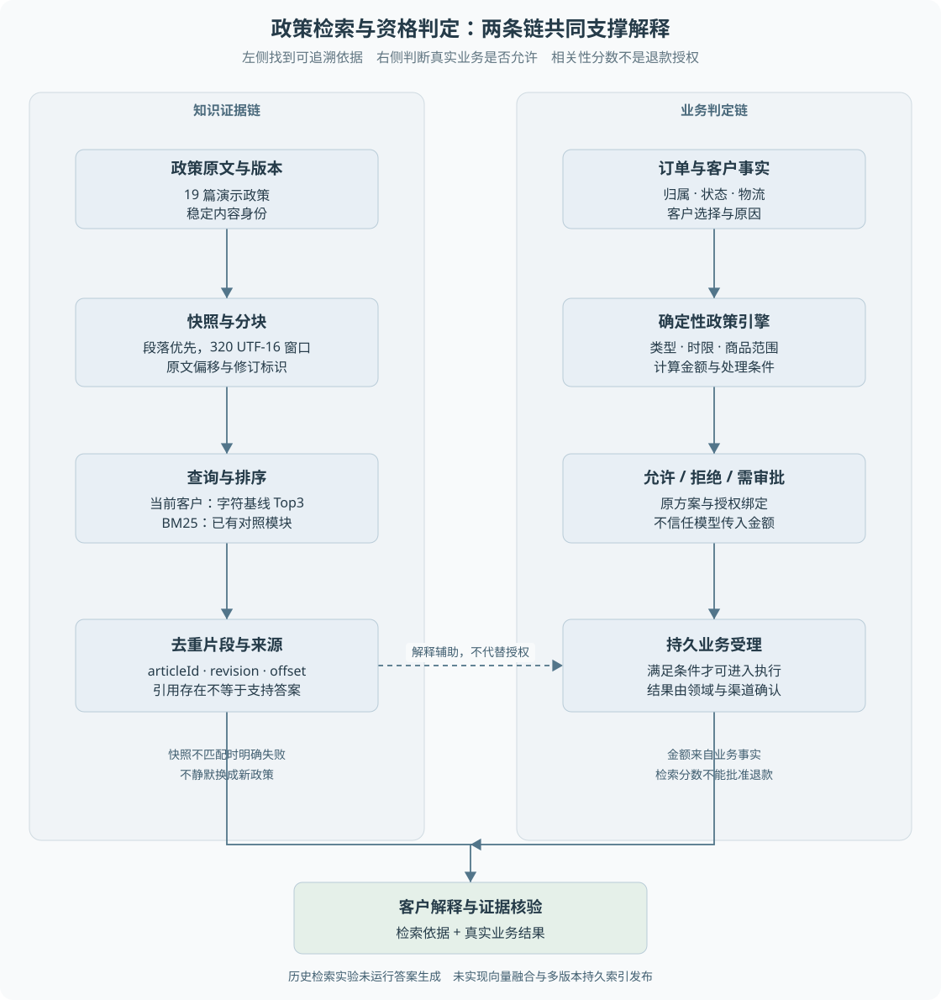

# 第 12 章 政策检索、引用与确定性判定

客户问“键盘用了十天发现质量问题，还能退吗”，系统既需要找到相关条款，也需要根据订单、签收时间和原因判断资格。**检索到一段看起来相关的文字，并不等于业务上已经允许退款。**

> **阅读前提**：先读[第 08 章](08-Agent与确定性工作流的分工.md)和[第 11 章](11-工具门控与安全边界.md)。需要理解排序、集合和简单计数，不要求具备向量数据库经验。

## 实现思路

### 将知识依据与业务决定分开

最小方案可以把所有政策放进 Prompt，让模型回答。对很小的语料，这是一种可以比较的基线，但更新、版本、来源定位和无关内容都会逐渐变难。项目因此提供受控政策检索，让回答带有可定位依据。

当前设计由五个环节组成：

1. **建立可追溯语料快照。** 读取政策原文，以稳定排序、内容版本和分块配置形成快照身份。
2. **把原文切成可定位片段。** 保留父文档、标题、偏移和版本，不只留下匿名文本。
3. **按查询检索与排序。** 当前持久客户路径使用字符关键词基线；BM25 是已有可比较模块，不默认切换为生产策略。
4. **返回引用依据供模型解释。** 工具结果保留片段来源，查询审计关联文档 ID。能找到引用和引用是否支持答案，分别判断。
5. **由领域规则作终判。** 退款申请重新读取订单与政策条件，决定允许、拒绝或需要审批。生成答案不拥有最终资格决定权。

如果查询时当前语料快照与运行冻结的知识版本不同，持久会话明确报错，不把新政策静默当作旧运行依据。这个选择保护可追溯性，但并不等于已经实现多版本索引在线共存。

图 12-1 左侧从政策原文形成可检索证据，右侧从订单和业务条件形成确定性决定。两条链都与客户解释有关，但只有领域判定进入授权与业务受理。

## 原文、片段与快照

`buildKnowledgeSnapshot` 给文章计算内容修订标识，并按段落优先切分。过长段落使用最多 320 个 UTF-16 单位的窗口，避免切断代理对；窗口没有 overlap，即相邻窗口不重复文本。

UTF-16 单位是 JavaScript 字符串位置使用的计量，不应简单叫“320 个汉字”或“320 token”。片段保存原文起止偏移，以便从快照回查内容。

这一实现适合当前短政策语料。历史实验中 19 篇文章实际生成 19 个片段，不能据此证明长 PDF、跨页表格和复杂文档解析已经成熟。长规则若被切开，需要回读完整依据，不能只用截断片段决定资格。

快照身份还与配置有关。相同原文采用不同分块规则，检索对象可能不同，不能仍把它们称为完全相同的实验条件。数据库返回行顺序也不应任意改变快照身份，因此构建过程使用稳定排序。

## 两种确定性检索策略

字符关键词基线把查询中的字符去重，计算标题与正文命中了多少字符。它容易解释、成本低，但单个字命中不一定表达语义相关。例如包含“退”的多个条款可能都得到分数，噪声不能仅靠排序消除。

BM25 基线采用中文双字词项，拉丁字母、数字和编号按相应规则处理。它综合考虑：

- **词频**：词项在片段中出现多少次，但贡献不会无限线性增加。
- **区分度**：大量片段都出现的词项，区分能力通常较弱。
- **长度归一化**：避免长片段只因文本更多就占据优势。

项目参数为 `k1=1.2`、`b=0.75`，没有题集专用同义词或额外标题倍数。先按片段打分，再对同一文档去重，保留分数最高的片段；分数相同时使用稳定排序。

这里没有实际向量 embedding、混合检索融合或模型重排。相关面试知识会作为扩展讨论，不能为了补全“标准 RAG 流程”把不存在的环节加到项目图中。

## 当前客户检索到底走哪条路径

持久会话的 `search_policy` 读取工作台政策构建快照，检查与冻结 `knowledgeSnapshotId` 一致后，调用 `retrieveKnowledge` 的 `character-keyword-baseline`。较早版本最多取三条文档去重结果，`customer-guidance-v1` 最多取五条；条数由运行冻结版本决定。新版增加候选容量，并没有切换为 BM25 或向量检索。

旧 `PolicySearchService` 有可注入 scorer 接口，默认组合根使用确定性 `KeywordPolicyScorer`。仓库还保留模型 scorer 实现，但当前正式入口并没有因此启用付费重排。

因此需要区分三个事实：BM25 模块与实验存在，知识页可以比较方案，当前持久客户查询仍使用字符基线。实验中某个指标改善，也不能直接宣布默认 Agent 已获得同等提升。

## 引用能证明什么

引用定位首先检查文章、版本、片段内容和偏移是否一致。这证明返回的依据能在原文中找到，不是模型凭空编出的文档。

但引用存在与答案忠实是不同层次。一段真实生鲜条款被引用到键盘问题，来源真实却适用错误；召回正确条款，模型也可能漏掉时间或运费条件。

因此解释质量至少需要区分：

1. **相关依据是否召回**：检索排序问题。
2. **所需依据是否齐全**：多条件问题可能需要多篇条款。
3. **回答是否忠实使用依据**：生成与引用支持问题。
4. **业务条件是否真的满足**：领域资格问题。

项目现有引用定位证据不能替代真实模型答案支持率。审批也不能代替对引用适用性的检查。

## 领域终判与检索分工

`evaluatePolicy` 根据业务类型、原因、订单、物流、商品范围和时钟计算资格与金额。金额来源是业务记录，政策规则返回明确结果；大额审批等条件由相关领域逻辑处理。

模型可以解释“未发货支持取消”，但执行仍需确认订单确实未发货。客户口述与系统记录不一致时，不能仅靠模型选择相信哪一方来发送资金。

检索不应负责最后的金额计算，规则引擎也不需要承担自然语言条款解释的全部工作。两者各自可测，故障时才可以判断是召回噪声、生成误读，还是确定性业务规则的问题。

## 历史检索实验如何解读

2026-09-25 的 P4 实验使用 24 道人工构造题与 19 篇演示政策。两个争议标签只作诊断，不进入主指标；tuning 和 holdout 各有 10 道有相关证据的题参与 Recall 与 MRR，另各有一道无答案题。

tuning 是用来选择方案或参数的样本，holdout 是原先保留用于检查泛化的另一组样本。Recall 看相关依据找回了多少；MRR 看第一条相关结果排得多靠前；完整证据看一题需要的依据是否全部找齐。表中的数值是分别对题集聚合后的结果，不是模型回答正确率。

用一题手算：正确依据需要 A、B 两篇，前三名返回 X、B、A，则 Recall@3 为 2/2，单题倒数排名为 1/2，完整证据为真；若只返回 X、B、Y，则 Recall@3 为 1/2，倒数排名仍是 1/2，但完整证据为假。MRR 是多题倒数排名的平均值。这个对照说明“首条相关很靠前”不能证明回答需要的条件已经全部找到。

| holdout 指标 | 字符基线 | BM25 |
| --- | ---: | ---: |
| Recall@3 | 0.76 | 0.86 |
| MRR@3 | 0.90 | 0.9333 |
| 完整证据@3 | 0.60 | 0.70 |
| Recall@5 | 1.00 | 0.95 |

BM25 在 Top3 的部分指标更好，但 Top5 召回下降，tuning 的 MRR 也略低。因此实验没有支持“全面提升”，原决定是不更换默认 scorer。

Top-k 是每次最多返回的候选数。一个问题需要五篇依据时，Top3 天然无法全部容纳，这属于容量限制，不应全归因于排序差。无答案题返回空也不等于模型拒答正确，因为该实验没有运行答案生成。

这份报告是检索模块实验，不是线上质量或延迟收益。保留集已经用于观察结果，后续调参若继续依赖它，需要新的未见样本来支撑最终评估。

## 顺着一个问题检查中间产物

用“签收十天后出现质量问题”作为教学查询，先不要急于看最终答案，而是逐层记录中间产物。原文层应能指出相关政策文章及内容版本；分块层应找到携带适用时间、原因和例外条件的片段；检索层要说明哪些候选进入本版本的 Top-k，是否同文档去重；生成层才检查回答如何使用这些依据。最后再用真实订单的签收时间和原因进入领域判断。

这里有两个容易混淆的“版本”。政策业务版本表达规则发布身份，内容哈希还可以识别相同版本字段下正文是否变化。只比较版本字符串而忽略实际内容，会让被修改的原文继续冒用旧证据身份。快照把内容与分块配置共同纳入，有助于定位实验到底读取了什么，但并不自动提供历史内容长期保留服务。

引用至少需要文档身份、片段和原文位置。假设返回片段丢失了末尾的限制条件，文章 ID 仍正确，引用定位也可能通过，但用户回答不成立。这个反例说明“出处存在”与“证据完整”必须有不同断言。多条件题还要检查相关集合是否全部进入上下文，不能用首条相关结果靠前代替完整覆盖。

对无答案问题，返回空候选与解释拒答是两次判断。当前检索模块可以观察空召回，但真实模型可能随后用常识编出答案；反过来，召回了弱相关材料，模型也可能谨慎拒答。因此离线检索实验应报告自己的对象，不把未运行的生成行为一起算成成功。

### 从失败类型推导改进顺序

如果正确条款根本没有进入候选，先查分块、关键词表达及排序；如果正确条款进了候选但被裁剪掉，先查上下文组装；如果完整依据进入模型却被误读，再研究生成约束；如果回答合理但执行金额错了，应检查领域计算，而不是继续加检索器。

每一步改进都需要保留一组不变条件。例如比较 BM25 与字符基线时使用同一原文快照和题集，才能把差异定位在检索策略；改变分块后重新建立快照身份，不能沿用旧报告名称。现有 P4 报告同时保留了上升和下降指标，这比只选一个漂亮数字更能指导是否替换默认策略。

向量、融合和重排的具体推导见[检索生成扩展](../08-扩展专题/扩展-检索生成与模型迁移.md)。动手时可以先用[练习三](../09-练习与自测/渐进重建练习.md)实现引用回填，再增加一组人为构造的多条件问题；不要把教学新题的手算结果混入原 P4 实验分母。

## 源码参考与证据

| 入口 | 内容 |
| --- | --- |
| [knowledge.ts](../../../packages/domain/src/knowledge.ts) | 快照、片段、词项和两种排序 |
| [durable-conversation.ts](../../../packages/runtime/src/durable-conversation.ts) | 当前客户检索与知识版本核验 |
| [policy-search-service.ts](../../../packages/domain/src/services/policy-search-service.ts) | 旧 scorer 端口与关键词实现 |
| [policy.ts](../../../packages/domain/src/policy.ts) | 确定性资格与金额 |
| [检索测试](../../../packages/domain/test/knowledge.test.ts) | 分块、快照与引用定位机制 |
| [P4 实验记录](../../experiments/rag-baseline-v1.md)、[冻结协议](../../../eval/rag/protocol-v1.json) | 数据分母、排除规则与指标解释 |

当前局限包括小语料与小题集、未实现持久多版本索引发布、无真实向量融合和未验证生成支持率。选择下一步改进时，应先定位当前失败属于哪一层，再决定增加检索器、调整片段或改进生成，而不是把所有问题都归结成“模型不够大”。

---

本章学习衔接：[渐进重建练习三](../09-练习与自测/渐进重建练习.md) · [集中自测第 12 组](../09-练习与自测/集中自测.md) · [返回导学](../导学-有据售后.md)

业务对照：[B03-售后资格与金额如何判定](../03-业务逻辑详解/B03-售后资格与金额如何判定.md)。
