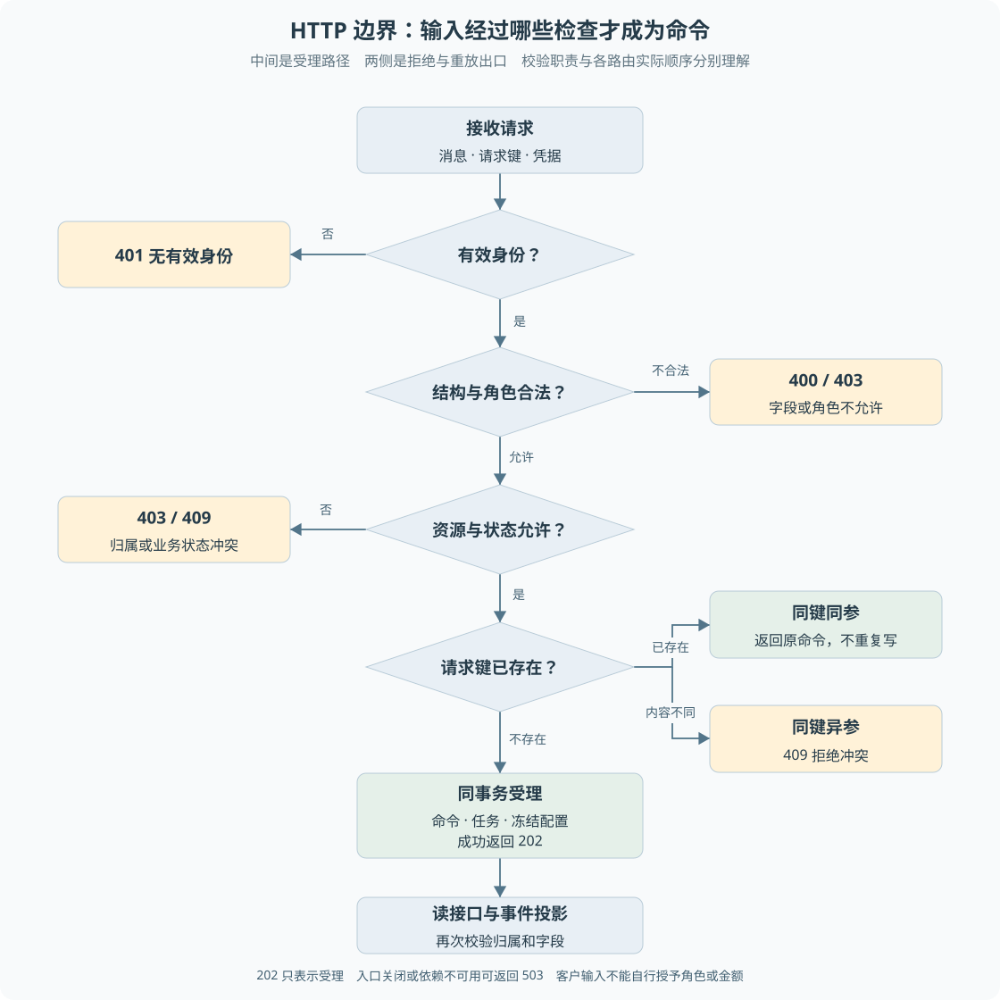

# 第 04 章 HTTP 接口与身份边界

客户已经知道另一笔订单号，能否直接把它填进退款请求？操作员能看到审批单，是否就可以调用批准接口？这些问题不能靠页面是否显示按钮来解决。**接口必须从可信身份出发，重新判断对资源和动作的权限。**

> **阅读前提**：理解 HTTP 方法、请求头、JSON 和状态码，先读[第 02 章](02-一次退款请求的全景.md)。本章补充身份、输入校验与幂等受理的区别。

## 实现思路

### 最小接口为什么还不够

最小退款接口可以接受订单号并调用领域服务。如果它同时相信请求体中的客户号、金额和角色，攻击者就能绕过页面，构造自己想要的请求。因此接口首先需要区分两类输入：用户表达的诉求，与服务器确认的身份和业务事实。

项目采用以下边界：

1. **认证中间件得到操作身份。** `Authorization` 中的演示令牌映射为客户、操作员或主管。客户身份附带客户号；路由不根据自然语言中的“我是主管”改变角色。
2. **Schema 校验请求结构。** Zod 检查字段是否满足协议。订单号是字符串、消息非空等属于结构条件，不能替代订单归属检查。
3. **路由检查角色与资源范围。** 客户读取会话时匹配会话客户号，审批决定只允许主管。角色允许访问某类接口后，还需检查原业务关系。
4. **领域与持久受理再次核验关键事实。** 退款金额来自原订单与政策，审批绑定原售后，消息绑定原运行。不能把一次前端校验视为整个过程的授权。
5. **返回与实际阶段一致的结果。** 持久受理成功返回 202 和原标识；拒绝、冲突、尚不可用分别返回对应错误，不用成功响应掩盖业务未发生。

图 4-1 按接口职责展开。中间是受理主线，两侧列出拒绝与重放出口，底部形成持久命令，再经受限读接口公开结果。具体路由可以先检查能力是否启用，图不要求所有端点具有完全相同的校验顺序。

## 认证与授权

**认证回答是谁，授权回答能做什么。** `resolveActor` 根据令牌返回操作身份，`requireActor` 拒绝没有有效身份的请求。之后 `requireRole` 检查角色是否在允许集合中。

当前客户令牌映射到 C1001、C1002、C1003；操作员与主管令牌可由演示环境配置。它们是本机演示凭据，不包含完整登录、注销、过期刷新或设备管理。部署到真实环境需要新的认证方案，但不能因此删掉现有资源归属与业务授权检查。

创建会话时，客户号从已解析身份中取得。操作员创建会话需要提供目标客户号，这属于另一种受控角色行为。**同一个 JSON 字段对不同角色的信任方式不同**，不能简单地将请求体直接复制成领域命令。

查询客户进度时，还要确认请求角色确实是客户且属于该运行。操作员已有其他工作台入口，不意味着每个客户专用接口都自动向操作员放行。

SSE 的原生 EventSource 场景采用查询参数传递演示令牌，认证实现优先使用请求头，缺少时才取查询参数。这属于现有演示兼容方式，不适合直接包装成生产认证最佳实践。技术扩展时应比较同源 Cookie 或短期票据，并重新评估日志与链接泄露风险。

## 输入正确与业务正确

Zod 校验能拒绝不符合结构的消息，但它无法单独判断订单是否属于当前客户、订单是否允许退款，或金额是否被篡改。这些需要读取业务事实。

以模型发起退款为例，接口与工具层接收的是订单、原因等诉求字段，持久退款受理不允许模型传入金额和授权关联。金额由领域准备逻辑计算，执行前还会重查。这样防止在查询与执行之间事实改变后，旧结果继续被当成有效授权。

可以把校验分成三类：

- **结构校验**：消息长度、字段类型、枚举是否合法。
- **访问校验**：这个角色能否执行动作，这个客户是否拥有资源。
- **业务校验**：当前状态、政策、审批与金额是否允许这次变化。

三个层次都需要。一个合法字符串可以指向其他客户订单；一个有权限的主管也不能批准与原售后金额不匹配的方案。

## 请求键与重复受理

浏览器发送成功后，网络可能在响应返回前断开。用户看到错误，但服务端可能已经提交任务。如果每次点击重试都生成新请求键，服务端就难以把它识别为原请求的重放。

`ConversationJournal.accept` 保存原始请求内容，并按客户和请求键查找既有命令：

1. 已存在且消息、运行关联等内容一致，返回原任务。
2. 已存在但内容不同，返回冲突，不追加第二条消息。
3. 不存在，检查当前会话允许的动作，再事务性写入命令和事件。

请求键是一次操作的身份，不是整个会话永久不变的身份。用户真正发送下一条不同消息，需要新的请求键；网络重试原消息才复用原键。前端应区分这两种意图。

同一个运行可能有多个命令和任务。客户补问回复、寄回补充与最初创建是不同受理动作，但必须关联同一运行及其原业务流程。不能为了请求去重而把后续消息全部吞掉。

## 状态冲突不是服务故障

会话不在等待输入时提交补问，或人工接管后提交结构化寄回，属于当前状态不允许的操作。客户端收到 409 后应刷新事实或提示正确入口，不应无限自动重试。

人工处理中，客户普通留言可以写入消息事件供坐席查看，但不会驱动模型。包含 `returnShipment` 的同一端点请求则被拒绝，因为“留言成功”不能冒充“寄回登记成功”。

| 响应 | 当前项目中的典型含义 | 前端处理方向 |
| --- | --- | --- |
| 202 | 持久命令已受理 | 保存标识，读取进度或订阅事件 |
| 400 | 字段或参数不合法 | 指出输入问题，不直接反复发送 |
| 401 | 无有效身份 | 提示身份问题 |
| 403 | 角色或资源不允许 | 不展示受保护数据，不引导绕过 |
| 409 | 请求键、关联或业务状态冲突 | 刷新当前事实，核对操作是否仍成立 |
| 503 | 入口关闭或依赖暂不可用 | 区分明确禁用与暂时故障，不承诺稍后必定可用 |

错误码也不是业务成功的反面。例如资金执行阶段的未知结果可能在后台形成待核验任务，不能仅看最初 HTTP 202 就忽略后续状态。

## 读接口与写接口的信息边界

写接口需要防止越权修改，读接口同样需要限制资源和字段。客户查询运行列表时按客户过滤；详情、消息和事件端点校验运行归属。客户 DTO 是面向客户的数据传输对象，只包含允许公开的字段。

客户事件采用白名单：新增内部事件默认不可见，而不是“先全量返回，再让前端藏起来”。用户能够打开开发者工具，因此前端不显示不等于数据安全。

正常案例是 C1001 查看自己的退款进度。异常案例是使用同一令牌访问 C1002 的运行；即使知道 runId，也不能通过归属校验。另一个异常是主管读取客户专用进度，角色不符合该端点时同样可能拒绝，权限模型不是简单的角色大小排序。

## 沿一次响应丢失检查接口契约

考虑客户第一次提交退款消息：浏览器保存请求键 K，服务端写入命令 C 和任务 T，响应却在途中丢失。客户此时只知道没有收到回答，不知道服务端是否接受。正确重试仍携带 K 和原输入，服务端返回原运行、命令与任务身份，不创建另一条客户消息。这个例子说明，幂等响应要提供可以继续查询的身份，而不只是提示“没有重复处理”。

如果客户修改消息后再次点击，客户端需要把它当成新动作，不能为避免重复始终沿用 K。反过来，失败后原样重试又不能总生成新键。前端需要保存待重试操作的内容、目标运行和键，在真正改变意图后更新；服务端保存原输入，使错误复用键能够被发现。**客户端表达操作身份，服务端验证身份与输入仍然一致。**

继续接口还要确认消息属于哪个等待。假设运行原本在等客户提供订单号，却收到结构化寄回字段，不能只因 JSON 合法就推进另一笔业务。系统需要核对当前运行状态及原售后关联。人工接管时普通留言与寄回登记采用不同处理，正是这种契约的实例。

排查时可以按“收到、受理、推进”分别观察：请求日志证明到达，命令记录证明接受，任务及业务记录证明推进。三者之间可能存在时间差，也可能在任一步失败。只记录一个接口耗时，无法回答任务为什么没有继续；只看后台报错，又可能忽略原受理其实已成功。错误响应应保留可安全公开的定位身份，内部参数和敏感诊断则留在受控日志。

接口演进还要考虑旧客户端。增加必填字段、改变错误码或把同步成功改成异步受理，都会改变页面行为，不能只修改服务端类型。当前教材不提供通用兼容版本框架，但可用创建、重放、补问、人工留言和寄回五类契约检查影响。测试除了状态码，还应核对返回身份和实际记录数。

K、C、T 只是教学符号，不是实际业务值。对应动手任务见[渐进重建练习二](渐进重建练习.md)，应在独立数据上模拟响应丢失，不通过重复操作既有业务库观察结果。

## 源码参考与验证依据

| 入口 | 核心问题 |
| --- | --- |
| [auth.ts](../../apps/api/src/auth.ts) | 身份解析、头部优先与角色判断 |
| [app.ts](../../apps/api/src/app.ts) | 创建、消息、进度、审批及人工入口的实际条件 |
| [conversation-journal.ts](../../packages/persistence/src/conversation-journal.ts) | 请求键重放、原配置与原补问绑定 |
| [customer-view.ts](../../apps/api/src/customer-view.ts) | 面向客户的字段投影 |
| [api.ts](../../apps/web/src/lib/api.ts) | 前端请求与错误契约 |
| [客户事件测试](../../apps/api/test/customer-events.test.ts)、[客户进度测试](../../apps/api/test/customer-progress.test.ts) | 归属与展示边界 |
| [退款接口测试](../../apps/api/test/conversation-refund.test.ts)、[人工消息修复记录](../handoffs/human-return-fix.md) | 请求重放、业务越权及留言与寄回的区别 |

接口层保留明确拒绝，会增加前端需要处理的状态，却能防止用一个泛化成功响应掩盖业务事实。认证将来可以替换，以上角色、资源、业务条件仍然需要保留并重新验证。

---

本章学习衔接：[渐进重建练习一与二](渐进重建练习.md) · [集中自测第 04 组](集中自测.md) · [返回导学](导学-有据售后.md)
