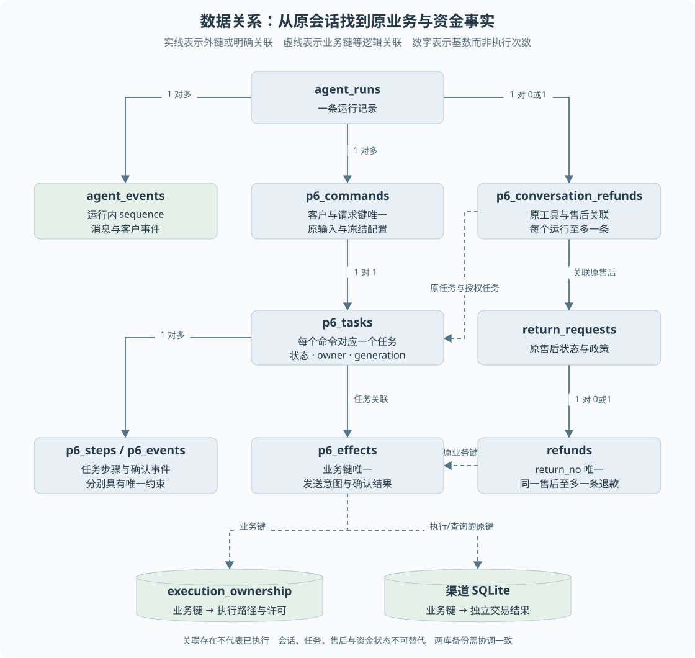

# 第 05 章 数据建模与 SQLite 持久化

进程重启后，系统凭什么知道客户正在等审批、退款是否已经发出、模型哪一轮已经完成？仅保存聊天文本无法回答这些问题。**持久化要保存能决定下一步行为的事实，而不只是方便展示的内容。**

> **阅读前提**：理解对象、JSON 和简单增删改查，先读[第 02 章](02-一次退款请求的全景.md)与[第 04 章](04-HTTP接口与身份边界.md)。本章解释表的职责和关系，事务机制在下一章展开。

## 实现思路

### 从一张聊天表到多类业务事实

最小聊天应用可以只保存角色和文字。售后系统还需要区分“客户说要退款”“系统接受申请”“主管批准”“渠道确认成功”。这些不是同一事实的不同措辞，而是不同阶段的授权与结果。

当前设计按事实用途拆开保存：

1. **会话记录解释交互位置。** `agent_runs` 保存运行状态，`agent_events` 保存有序消息与内部事件。它们支撑页面重建和模型上下文，不单独证明资金成功。
2. **业务记录解释实际对象。** 订单、售后单、退款与审批分别保存领域状态。退款金额和资源关系从这些记录取得，而不是从助手文字中解析。
3. **命令与任务解释谁在处理。** 命令保存受理内容及冻结配置，任务保存排队、租约、尝试与截止时间，检查点保存已确认步骤。
4. **资金与费用记录解释外部不确定性。** 资金意图、执行权和幂等结果分别承担发送约束与确认依据；模型费用账本则保留预占、已结算及未知费用。
5. **关联表连接跨阶段对象。** 原会话工具调用与售后单、审批及授权任务建立明确关系，后续结果据此回填。

拆分不是为了增加表数量，而是避免同一个字段同时承担不相容的含义。例如会话已由人工接管，不代表退款未知事实可以删除；任务已完成，也不代表退货后退款已经发生。

图 5-1 以关系结构展示运行、命令、任务和业务记录。箭头表达关联而非执行时序，边上的数字表示关系基数。退款表的 return_no 唯一，同一售后至多对应一条退款记录；虚线业务键关联不表示每处都声明了外键。

### 为什么业务库之外还需要渠道库

如果模拟渠道直接读取业务库中的“成功”，恢复实验就可能自证循环：业务写成功，渠道查询也返回成功，无法模拟两边事实不同步的故障。

本机渠道使用独立数据库，保存按业务键关联的请求参数、状态、交易标识和计数。业务进程可以退出，而渠道事实仍保留。当前 main 也支持将渠道服务内嵌于同一进程，但数据库依然独立；进程隔离程度要按具体实验区分。

双库让“渠道成功、本地未落账”可以被真实构造，也带来备份一致性问题。两份文件必须在停止写入等明确条件下协调备份，不能任意复制两个不同时间的快照拼成一致系统。

## 命令、任务和检查点

命令保存一次经过验证的输入。`p6_commands` 对客户号与请求键设置唯一约束，并保留请求指纹和 `input_json`。后者包含计划与配置快照，用于恢复时延续原授权和模型配置。

任务是这个命令的执行载体。`p6_tasks` 保存：

- **调度字段**：状态、可执行时间、任务类型。
- **执行资格**：所有者、代次、租约截止时间。
- **停止与尝试**：累计尝试次数、取消请求、运行截止时间。
- **业务关联**：运行、客户、命令和可选审批。

检查点表 `p6_steps` 以任务和步骤名为主键，保存该步骤已确认的值。它不是随意拷贝整个内存，而是明确告诉恢复执行器：这一轮模型输出或这个工具结果已经确认，可以复用。

任务事件 `p6_events` 与客户会话事件不同。前者面向任务机制，以任务和事件键防止重复确认；后者有运行内序号，供上下文和页面重建。不能拿任务全局 cursor 直接充当客户 SSE 的运行内序号。

## 业务事实与执行事实

退款记录保存领域结果，资金效果保存对外动作结果，执行权记录约束发送资格。它们看起来都涉及状态，但各自回答不同问题：

| 记录 | 核心问题 | 典型误用 |
| --- | --- | --- |
| `refunds` | 这笔退款在业务上处于什么阶段 | 看到 executing 就断言渠道正在处理 |
| `p6_effects` | 这笔资金动作的发送与确认事实是什么 | 未找到成功就删除意图重发 |
| `execution_ownership` | 哪条执行路径持有发送许可 | 任务租约到期就重置资金许可 |
| `idempotency_records` | 已确认成功能否返回原结果 | 认为成功后才记一行就覆盖全部崩溃窗口 |
| `p6_conversation_refunds` | 结果应该回填给哪个原动作 | 依靠当前悬空工具数量猜关联 |

数据冗余本身不一定错误。关键是哪些字段必须共同变化、哪些字段只作投影，以及发生不一致时如何拒绝错误结论。客户退款进度会联合检查多个记录；若一边成功、另一边未确认，可能显示未知，避免仅凭一张表乐观宣布完成。

## 约束如何参与设计

主键表示记录身份，唯一约束表达不允许重复的业务关系，外键要求被引用对象存在，CHECK 限制字段取值。它们是数据层的最后一道约束，但不能代替完整业务规则。

例如 `(customer_id, request_key)` 唯一可以阻止重复插入同一次请求，却不能解释“同键不同消息”。程序还要比较指纹，给出明确冲突。`p6_effects.business_key` 唯一可以保护一笔效果记录，却不能确认订单归属和政策资格。

当前迁移为任务、事件、效果及执行权配置了这些约束。应以真实建表语句为准，不能从 TypeScript 中 `string` 的联合类型推断数据库一定也限制了同样的值。

金额使用整数分而不是页面展示的小数元，减少业务计算中对浮点表示的依赖。币种与资源身份跟随资金计划保存，渠道同键重放还要比较参数，避免同一键被拿来发送另一金额。

## SQLite 在这里承担什么

`openDatabase` 打开文件库、启用 WAL 与外键并执行增量迁移。WAL 是预写日志模式，更新先进入日志文件，再通过检查点合并到数据库。对本项目最重要的影响是：**运行中的数据库状态不能简单等同于一个主文件的内容**，备份需要使用正确的数据库机制或停写策略。

`createMemoryDatabase` 则直接创建独立内存库，用于测试和评测。它与传一个路径给文件库入口不是同一个动作。每个用例独立环境有利于控制夹具，但不能证明跨进程文件恢复。

SQLite 可以由多个连接或进程访问同一文件，本项目也测试了独立进程竞争。写事务仍存在串行化与锁等待，不能据此声称已经具备多节点水平扩展能力。`busy_timeout` 是锁等待设置，不会自动修正业务竞态或保证网络调用幂等。

## 迁移不是重新初始化业务

启动时建表和增量补列，目的在于让已有数据适应当前结构。演示播种和清空业务是不同操作，正常重启不能通过重置数据库获得“干净状态”。

执行权迁移对历史非成功记录采取保守冻结：缺少发送证据时，不推测这笔钱没有支付，也不自动补一张可用许可。已有成功或幂等记录则保留相应事实。

这意味着升级可能产生需要人工核验的历史业务，但避免把信息缺失误当成可以发送。迁移脚本的安全目标并不是让所有旧记录立即恢复自动执行。

## 用一笔退货检查记录之间的关系

假设一位客户申请退货。最初消息对应一个运行，运行下可以接受多条命令；每条命令承担一次明确输入，而不是每句话都创建一个新售后。退款动作确认后，需要保存“原运行中的哪个工具调用创建了哪张售后、哪笔退款”。后续主管批准、客户寄回和操作员收货都沿这条关联继续，因此单独保存退款表远远不够。

从读取目标倒推字段会更容易理解设计。客户进度需要知道归属和当前等待，恢复需要知道原执行计划和发送依据，审批需要知道批准对象及金额，事件投影需要知道原工具调用。不同读者关心不同事实，不必把每个字段都复制到一張超级表；但跨表引用必须稳定，不能依靠“最近一条退款大概属于这次会话”来猜测。

一个最小关系核查可以依次提出四个问题：

1. 运行是否属于当前客户，后续命令是否仍关联它。
2. 售后和退款是否对应原订单与已批准金额。
3. 执行权及资金效果是否使用相同业务键，而非仅有相似描述。
4. 原动作结果是否已经投影，事件是否仍绑定原运行。

这些问题分别防止越权、方案错配、重复动作和展示错配。某张表的一行 succeeded 不能回答全部问题，所以客户成功投影需要联合核验。反之，几张表处于不同阶段未必就是损坏：渠道已确认、本地尚未确认正是设计允许出现并需要恢复的窗口。

业务库和渠道库分开，还让实验能够独立观察两种事实。如果只在同一张退款表上先写成功再模拟超时，就没有真实制造“外部已发生而本地不知道”的不确定性。独立渠道表保存原交易，业务表保存宿主知道的进度，二者对照才有诊断意义。

新增状态字段时应先定义其来源与更新者。例如“客户已获知”不能由渠道直接写入，“资金可能已发”也不能由页面断线推出。数据模型实际上是在规定哪些模块有资格声明哪种事实；表和索引只是这种规则的存储表达。相关重建任务见[练习一、二与五](渐进重建练习.md)。

## 源码参考与验证依据

| 入口 | 内容 |
| --- | --- |
| [schema.ts](../../packages/persistence/src/schema.ts) | 原业务表与会话事件结构 |
| [p6-migration.ts](../../packages/persistence/src/p6-migration.ts) | 命令、任务、检查点、效果与关联约束 |
| [execution-ownership-migration.ts](../../packages/persistence/src/execution-ownership-migration.ts) | 历史资金记录如何冻结 |
| [db.ts](../../packages/persistence/src/db.ts) | 文件库、内存库、迁移与清理边界 |
| [customer-progress.ts](../../apps/api/src/customer-progress.ts) | 多类事实联合形成客户进度 |
| [持久任务测试](../../packages/runtime/test/p6-durable.test.ts) | 重放、事务回滚、资金效果与检查点 |
| [P10 初始化测试](../../packages/persistence/test/p10-initialize.test.ts) | 首次、重复及部分数据情况下的初始化 |

当前 SQLite 方案降低本机复现成本，代价是数据库文件、单机写入与备份管理需要明确约束。迁移到其他数据库时，表结构只是起点；请求唯一性、执行权条件更新与共同提交的事务边界都要重新验证。

---

本章学习衔接：[渐进重建练习一与二](渐进重建练习.md) · [集中自测第 05 组](集中自测.md) · [返回导学](导学-有据售后.md)
