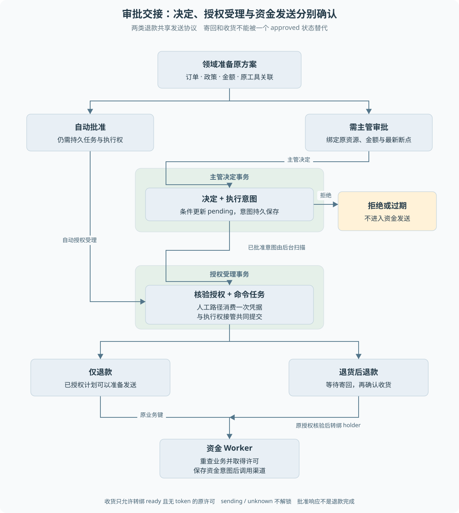

# 第 13 章 从售后申请到审批与执行

主管点击“批准”后，退款仍可能没有开始执行。系统需要把一个人的决定可靠地交给后台，同时确保执行的还是主管看到的那笔业务、那个金额。**审批决定、执行授权和资金完成是三个不同的事实。**

> **阅读前提**：先读[第 06 章](../02-后端必要基础/06-事务唯一约束与条件更新.md)、[第 07 章](../02-后端必要基础/07-状态机与异步任务.md)和[第 08 章](../04-Agent机制/08-Agent与确定性工作流的分工.md)，理解事务、任务与模型意图的边界。

## 实现思路

### 从一个批准按钮推导可靠交接

最小方案是先更新审批为 approved，再启动一个内存异步函数执行退款。如果进程在这两步之间退出，审批显示已通过，执行却没有开始；如果重复请求再次启动函数，还可能重复执行。

当前设计分为决定、受理与发送三个提交边界。

1. **决定与执行意图共同提交。** 主管决定通过条件更新写入，并在同一事务保存 `approval_execution_intents`。进程退出后仍能找到待处理意图。
2. **消费授权与受理命令共同提交。** 持久扫描验证原审批、最新断点、售后、金额与执行权，消费一次性凭据，形成持久命令和任务。中途失败一起回滚，避免授权已耗尽却没有可执行任务。
3. **发送前再次验证业务并获权。** Worker 不是看到 approved 就直接退款，还要核验计划与业务记录一致，在事务中取得发送许可并保存资金意图。

退货后退款在第二步还要建立等待。批准时先接管原退款的执行权，但不能发送；收货时校验原授权，将仍未发送的持有者转绑到收货命令，再继续资金执行。

这种拆分让 HTTP、人工等待和后台恢复各有记录。批准不是一张可以重复使用的全局通行证，而是绑定具体业务方案的一次决定。

图 13-1 将自动批准与人工审批合入持久执行，两类退款在寄回与收货处不同。绿色区域表示共同提交，黄色区域表示等待或拒绝；图中的批准箭头不直接到达渠道。

## 建单时确定原业务方案

模型只能表达申请意图。`P6ConversationRefundRepository.submit` 在当前任务围栏中调用领域方案准备，读取订单、物流与已有售后，生成售后记录、可选退款和审批需求。

受理需要保存的不只是售后单号，还包括原客户、订单、类型、原因、商品范围、政策结果、政策版本、退款编号、金额和币种。它们构成后续校验的业务绑定。

如果审批时只比较 approvalId，而不比较资源和金额，就可能批准一张旧审批，却执行后来变化的方案。当前 API 会检查最新断点中的审批身份、资源类型、资源编号和金额，再把断点编号交给数据库写入层复核。

**页面展示的金额不能成为最后一次可信校验。** 展示之后到点击之间，运行状态和方案都可能变化；服务端必须在写入时确认前置条件仍然成立。

## 审批决定的竞争处理

审批服务仅允许主管作决定。待审批状态、有效期、运行归属与最新断点条件共同约束写入，受影响行决定哪个请求成功。

两位主管分别提交批准与拒绝时，系统不能最后写入覆盖先前决定。竞争失败后重新读取事实，区分：

- 已经有决定，当前请求不能再次决定。
- 审批已经过期。
- 审批仍 pending，但运行或方案前置条件发生冲突。

当前审批有效期是演示配置的 30 分钟。它是业务条件，不是资金发送许可的自动释放时间。尤其不能因为审批记录看起来过期，就清除一笔已经可能发出的退款。

执行意图与决定同事务提交，解决了“决定成功但内存调度丢失”的窗口。意图 pending 表示尚待持久消费者处理，running 表示已交接执行；它的 completed 也不能单独表示退款成功，仍要看实际业务结果。

## 一次性令牌怎样成为持久授权

审批的一次性令牌保存在服务端，绑定原资源，不能交给模型决定是否使用。消费时需要确认原令牌非空、状态已批准且关联满足要求。

持久受理把令牌消费与命令创建放在一个事务中。成功后，继续执行依据原命令与其授权关系，不在每次重启时再次消费同一令牌。

这解决两个相反的问题：

1. 如果先消费令牌再入队，入队失败会丢失继续执行的依据。
2. 如果先入队再独立消费，其他执行路径可能同时看到可用授权。

当前事务还结合执行权接管，防止旧服务与持久 Worker 对同一业务各执行一次。只检查审批状态，而忽略谁持有资金执行权，仍不足以保护迁移期间的互斥。

## 自动批准也要经过同样的资金边界

自动批准没有人工点击，不代表可以跳过持久受理。领域允许的方案仍要形成任务，保存原动作关联和执行权，再由资金 Worker 推进。

自动授权不创建主管审批单，也不消费一个不存在的人工一次性令牌；它依据领域允许结果，通过执行权接管与命令受理保存授权来源。图中两路汇合表示共同进入受控任务协议，不表示两路都执行相同的审批凭据消费。

这样，自动与人工路径最终汇合到同一套发送协议。区别在授权来源，不在是否保护幂等、结果未知和跨进程恢复。

一个正常的仅退款案例是未发货取消，领域允许后自动受理；一个需要主管的案例是达到大额阈值的申请。具体资格与审批分级以完整入口 `decidePolicy` 和服务准备逻辑为准：`evaluatePolicy` 计算基础规则，后续还会叠加大额阈值，不能只看基础 allow 就执行。

## 退货等待为什么需要持有者转绑

退货后退款在批准时还不能执行资金。等待任务已经持有原退款的执行权，避免其他路径趁等待期发送，但它的职责是建立等待，不是立即退款。

客户合法登记寄回后，原售后进入已寄回状态；操作员或主管确认收货时，系统验证：原运行、原客户、原审批、原金额和退款业务键是否一致，执行权是否仍处于未发送的 ready。

只有这些条件满足，才把 holder 从原授权命令转到收货命令。转绑要求没有发送 token；`sending`、`unknown` 或历史未分配记录不能通过收货操作重新获得许可。

这个设计防止“用收货接口救活未知退款”。收货证明物品到达，不证明原支付动作未发生，更不能成为重发资金的授权。

## 拒绝、过期与人工接管

主管拒绝后，原业务按非成功结果终止，渠道不应收到资金请求。过期处理也需要核验业务未被接管且从未取得发送许可，不能仅根据时钟修改未知资金。

人工接管改变沟通责任，但不应绕过原资金协议。坐席可以说明情况或处理允许的业务动作，结案前仍需核验相关业务与资金状态。显示“已转人工”不能替代退款终态。

正常案例是主管批准后进程退出，下一进程找到 pending 意图并继续受理。异常案例是审批对应的断点在核验后变化，数据库拒绝决定；另一个异常是令牌消费后命令插入失败，事务回滚恢复原可核验状态。

## 沿大额退货推演三次交接

为了观察协作关系，可以沿演示手册中的大额退货看三次交接，具体金额和输入以专用夹具为准。第一次是模型到业务：模型提交退货意图，领域准备原方案，保存售后、退款和原工具关联，告诉客户当前需要审批。此时尚未获得可以直接发送资金的条件，工具也不应返回已退款。

第二次是主管到后台：主管看到原方案，接口核对当前断点和资源绑定，决定与执行意图共同提交。扫描器把批准转为持久受理，保留原身份并消费对应凭据。这里 HTTP 响应成功表示决定被记录，不表示扫描器已经完成，更不表示客户已寄回商品。进程若在两步之间退出，持久意图就是新进程继续的入口。

第三次是收货到资金：客户登记原售后运单，操作员确认收货后，服务端验证原业务和未发送执行权，再交接给收货命令。此时发送许可仍需要在资金 Worker 中取得。即使用户用同样的按钮重复操作，也不能为相同退款创建一个新的业务身份。

每次交接都保留不同的防重对象。主管决定只能发生一次，授权凭据只能按协议消费，收货必须对应原等待，资金发送使用稳定业务键。将它们合并成一个全局 idempotencyKey 会失去业务语义：同一售后本来就需要多次合法输入，但不应出现多次资金动作。

### 拒绝与冲突之后谁继续工作

假设主管 A 批准、主管 B 几乎同时拒绝。数据库决定哪次条件更新成功，另一方得到已决定或冲突语义，前端刷新原审批。不能让 B 的界面乐观更新覆盖服务端，也不能因为第二次请求未成功就回滚 A 已经提交的授权。

再考虑批准后原业务关联被发现不一致。后台不能把“已经批准”当成放行一切的信号，而应保留原决定和失败原因，停止不合法受理，交给受控核验。记录批准事实与允许执行当前方案是两个判断，这种保守失败有助于定位状态变化，而不是丢失责任来源。

最后，人工结案也不应吞掉这些冲突。坐席可以说明目前等待什么，但涉及未知资金、缺失关联或未完成任务时，结案仍需要满足领域条件。界面上的“已处理”是沟通动作，不是对原资金事实的替代声明。

对应[练习四、五](../09-练习与自测/渐进重建练习.md)，先验证决定与任务受理的回滚，再验证收货之前渠道提交数为零。两个检查分别覆盖可靠交接与业务前置，任何一个都不能代替另一个。

## 源码参考与验证依据

| 入口 | 核心机制 |
| --- | --- |
| [app.ts](../../../apps/api/src/app.ts) 的审批决定路由 | 角色、原方案与最新断点校验 |
| [approval-service.ts](../../../packages/domain/src/services/approval-service.ts) | 决定结果分类与凭据规则 |
| [business-repositories.ts](../../../packages/persistence/src/business-repositories.ts) | 决定条件更新与执行意图共同提交 |
| [p6-after-sale-repository.ts](../../../packages/persistence/src/p6-after-sale-repository.ts) | 审批映射、原业务绑定与收货前置 |
| [p6-owned-after-sale.ts](../../../packages/persistence/src/p6-owned-after-sale.ts) | 等待期接管与未发送许可转绑 |
| [p6-conversation-refund.ts](../../../packages/persistence/src/p6-conversation-refund.ts) | 自动批准与普通客户闭环 |
| [审批原子性实验](../../experiments/approval-atomicity.md) | 两连接竞争、空令牌拒绝、意图写入失败回滚 |
| [退款闭环实验](../../experiments/p6-conversation-refund.md) | 从客户入口完成审批、寄回、收货及恢复 |

审批原子性实验中的竞争使用同一 Node 进程的两个独立连接，不能称为两个操作系统进程同时竞争。后续退款进程实验提供了另一类恢复证据，两者证明范围不同。当前设计保留较多绑定字段和核验步骤，代价是接入新动作必须认真映射，收益是不会把一个泛化 approved 状态误用为任意资金授权。

---

本章学习衔接：[渐进重建练习四与五](../09-练习与自测/渐进重建练习.md) · [集中自测第 13 组](../09-练习与自测/集中自测.md) · [返回导学](../导学-有据售后.md)

业务对照：[B05-退货后退款的完整业务实现](../03-业务逻辑详解/B05-退货后退款的完整业务实现.md) · [B06-自动处理与人工审批](../03-业务逻辑详解/B06-自动处理与人工审批.md)。
