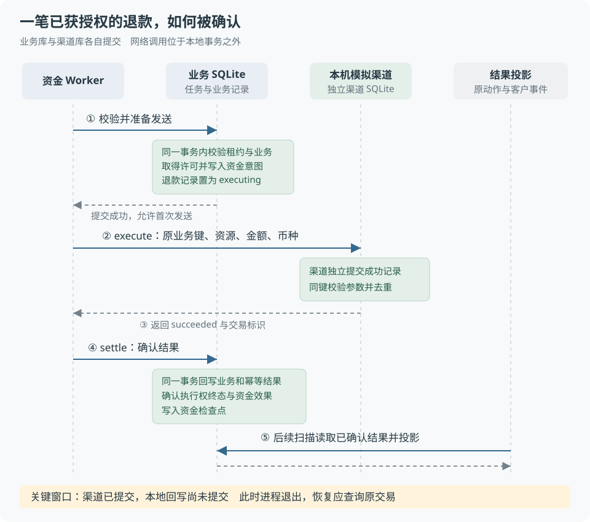
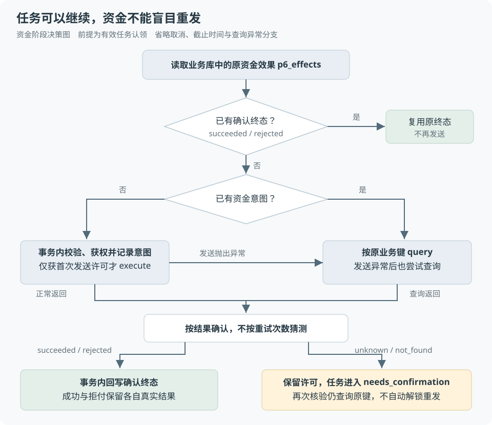

# 第 14 章 退款幂等与结果未知

客户申请退款，页面却一直没有收到成功结果。这时有两种可能：请求没有到达渠道；或者渠道已经退款，只是响应没有传回来。**相同的超时现象，可能对应完全不同的资金事实。**

本章说明系统如何区分“可以首次发送”与“只能查询核验”，以及怎样在重启后保留这一判断依据。

> **阅读前提**：理解事务的提交与回滚、条件更新，以及后台任务与 HTTP 请求的区别。建议先读[第 06 章](../02-后端必要基础/06-事务唯一约束与条件更新.md)、[第 07 章](../02-后端必要基础/07-状态机与异步任务.md)和[第 13 章](13-从售后申请到审批与执行.md)。

## 实现思路

### 先确定需要保证什么

设计需要同时满足三个要求：同一退款不能因为重复请求多执行一次；进程退出后还能继续核验原交易；客户看到的成功必须有业务结果支撑。

困难在于，业务库与渠道分别保存数据，不能用一个本地事务让两边同时提交。**本地没有成功记录，可能只是尚未来得及写入，不能证明渠道没有退款。**

因此，发送前就需要留下可恢复的依据，不能只在成功之后记录结果。

### 将要求落实到四个设计决定

1. **用业务单确定身份，不用请求次数确定身份。** 业务层先检查重复售后，再从原售后单生成 `refund:<售后单号>`，同时绑定退款资源、金额和币种。请求重放返回原命令；换了请求入口，也不能给同一退款换一个资金键。执行权、资金意图和渠道记录都用这个业务键关联，恢复时才能找到同一笔交易。
2. **把检查资格和占用许可做成原子操作。** `beginPayment` 在同一事务中检查任务资格和原业务授权，将执行权从 `ready` 改为 `sending`，并写入资金意图。执行权记录“谁被允许发送”，资金意图记录“哪笔动作可能已经发出”。其中一步失败就共同回滚；只有成功提交的调用能获得首次发送许可，再去请求渠道。
3. **让持久记录决定恢复分支。** Worker 先读取原资金效果：已有确认终态就复用结果；已有未确认意图就按原业务键查询；没有意图才进入首次发送准备。这样即使进程丢失了全部内存，也不必让模型重新规划退款。这里的关键是区分“没有成功记录”和“没有发送意图”，前者不能作为重新发送的依据。
4. **先确认业务结果，再生成客户结果。** `settle` 收到明确成功或拒付后，将退款状态、执行权终态、资金效果与检查点共同提交；成功分支还保存幂等结果并完成售后单。后续扫描把结果回填给原工具调用，再形成客户事件。若进程在回写后、投影前退出，恢复只需补投影；未知结果则保留许可、暂停核验，不能伪造成功收尾。

四个决定分别解决**身份、并发、恢复和展示依据**的问题。渠道同键去重仍作为一道保护，但本地不能因为渠道能够去重，就放弃记录自己是否已经发送。



图 14-1 按从上到下的顺序阅读。蓝色实线表示调用或数据库操作，灰色虚线表示返回，绿色区域表示提交的持久事实。HTTP 受理和任务调度发生在图示之前。**渠道提交与本地结果回写之间的空隙，是恢复设计必须处理的故障窗口。**

正常路径中，发送意图、渠道结果、本地确认依次形成。故障恢复时，系统读取这些记录，识别当前停在哪个边界。**可以重新获得的是任务处理资格，不能随重启重新获得的是同一资金动作的发送许可。**

## 业务身份与重复请求

幂等性（idempotency）要求同一业务动作重复到达时，不额外产生业务效果。第一次返回“受理中”、后来返回“已完成”并不违背幂等；重复请求导致多退一笔钱才是需要避免的问题。

项目用售后单号生成退款业务键，例如 `refund:RT-2026-0002`。生成规则来自 [idempotency.ts](../../../packages/contracts/src/idempotency.ts)：

```ts
export function refundIdempotencyKey(returnNo: string): string {
  return `refund:${returnNo}`
}
```

`runId`、`commandId`、`taskId` 分别标识运行、受理命令和调度任务。它们描述处理过程，**不能替代退款业务身份**。否则新建运行就可能得到新键，绕开原退款记录。

请求层则用“客户 + 请求键 + 请求指纹”识别重放：

- **同键同参**：返回原命令，不重复受理。
- **同键异参**：拒绝冲突，不能拿原请求键申请另一笔金额。
- **换请求键**：仍需接受业务层重复售后检查，不能只靠请求去重防止重复退款。

这里还有一个前提：同一诉求不能任意创建新的售后单。若每次都生成新单号，每个退款键都会不同。当前入口复用领域的重复售后检查，并保存原会话与业务动作的关联，资金键在此基础上约束已经确定的退款。

## 发送许可与事务边界

### 批准不等于可以重复执行

审批决定这笔业务是否允许执行；发送许可决定当前执行路径能否发出资金请求。即使业务已批准，旧执行器和持久执行器也不能各发送一次。

执行权仓储通过下面的条件更新取得许可。只有业务键、执行路径、命令持有者与原状态同时匹配，更新才可能成功：

```sql
UPDATE execution_ownership SET state = 'sending', token = ?
WHERE business_key = ? AND owner = ? AND holder = ? AND state = 'ready'
```

代码要求受影响行数恰好为一。判断资格和改变状态由同一次数据库更新完成，避免两个调用先后读到 `ready`，再分别发送的竞争窗口。这里的 `token` 是**资金发送许可标识**，与人工审批的一次性令牌不同。

### 本地事务负责哪些事实

`beginPayment` 把发送前准备放在受租约保护的事务内：核验任务资格，检查原业务与授权，取得许可，将退款置为执行中，并写入资金意图。**渠道调用发生在事务提交之后**，不能把网络等待包在这个本地事务里。

收到明确结果后，`settle` 再事务性回写业务结果、执行权终态、资金效果和检查点。检查点记录已确认的处理步骤，供恢复时复用。回写失败时这些本地变化一起回滚，但渠道已发生的退款不会随之撤销，后续需要查询并补齐记录。

当前资金执行路径不重新调用模型决定金额。业务结果确认之后，才通过原动作关联生成客户可见结果。

## 结果未知与故障恢复

### 渠道已退款，本地尚未确认

以历史实验中的 299 元退款为例。渠道成功返回后，进程在本地资金检查点提交前退出。渠道有成功记录，业务库仍保留未确认的资金意图。

恢复后的处理顺序是：

1. 新 Worker 领取原任务，读取已有资金意图。
2. 按原业务键查询渠道，不再次提交退款。
3. 查询确认成功后，补齐本地回写与客户结果投影。

Worker 中的关键选择只有“发送”与“查询”两种。下面是核心处理，`shouldSend` 来自事务内的 `beginPayment`：

```ts
result = shouldSend
  ? await this.call(signal, (s) => this.ports.payment.execute(payment, s))
  : await this.call(querySignal, (s) =>
      this.ports.payment.query(payment.businessKey, s),
    )
```

**租约到期只影响谁可以继续处理任务，不会撤销渠道已经发生的动作。** 因此任务执行资格可以交给新 Worker，资金发送许可仍必须保留。发送抛出异常时，Worker 同样尝试查询原交易；查询失败不能成为释放许可的理由。



图 14-2 展示资金阶段的决策，省略认领、取消、截止时间与查询异常处理。右侧查询路径始终保留原业务键，底部黄色区域没有自动返回首次发送的路径。图中的人工核验不代表项目已经实现自动对账或自动解冻。

### 查询未找到，为什么仍不重发

当前实现将 `not_found` 视为尚未确认的资金结果。**一次查询未找到，不足以授权再次发送。** 系统没有定义更强的渠道契约，证明该结果意味着原请求永远不可能生效。

这种保守策略会牺牲部分自动恢复能力。进程若在“意图已提交、请求尚未发出”时退出，实际上可能没有退款，但系统仍可能停在待核验状态。它优先保留资金风险的处理边界，不能据此宣称任何故障都能自动恢复。

“结果未知”也不能直接写成“退款失败”。前者表示缺少终态证据，后者必须有对应的业务或渠道依据。

### 未知结果在数据库中的表示

各表记录的对象不同，不要求所有状态都叫 `unknown`。正式持久退款的未知结果用例中，以下记录可以同时成立：

| 位置 | 典型状态 | 含义 |
| --- | --- | --- |
| `execution_ownership` | `owner=p6`、`state=sending` | 许可已取得，不能再次从 ready 获权 |
| `p6_effects` | `unknown` | 资金终态尚未确认 |
| `p6_tasks` | `needs_confirmation` | 常规执行暂停，等待核验 |
| `refunds` | `executing` | 不能写成已成功或明确拒付 |

未知结果不会进入执行权终态回调，因此许可继续保留 `sending`。更早的进程退出窗口还可能让资金效果也停在 `sending`，不能把它理解为“渠道已确认正在处理”。

人工接管不会清除这些事实。手动触发 `reconcile` 后，任务仍根据原意图查询。客户取消也不等于资金回滚：如果核验发现渠道已退款，必须保留成功事实。

## 验证依据

**是否重复提交，与是否重复发生资金动作，要分别检查。** 模拟渠道的 `submissions` 记录收到的提交次数，`charges` 记录成功资金动作次数。两次提交、一次动作只能说明渠道去重有效，不能说明 Worker 没有重发。

2026-09-26 的[进程实验摘要](../../experiments/p6-conversation-refund-evidence/final-summary.json)记录了 `after-payment-response` 场景：退款金额 29900 分，提交一次、资金动作一次、查询一次、客户完成事件一次。它支持“在这个退出点通过查询恢复”的结论，条件是脚本模型与本机模拟渠道。

| 验证问题 | 测试与记录 |
| --- | --- |
| 渠道成功、本地未落账时能否恢复 | [HTTP 进程测试](../../../apps/api/test/conversation-refund-process.test.ts)、[历史实验说明](../../experiments/p6-conversation-refund.md)与上述摘要 |
| 手动恢复后查询未找到，是否重发 | [持久任务测试](../../../packages/runtime/test/p6-durable.test.ts)：发送一次、查询一次，仍待核验 |
| 人工接管是否错误释放未知许可 | [客户退款测试](../../../apps/api/test/conversation-refund.test.ts)：许可保留，渠道计数不增加 |
| 两个进程能否同时取得执行权 | [执行权竞争测试](../../../packages/persistence/test/execution-ownership-repository.test.ts)、[模块实验记录](../../experiments/execution-ownership.md) |

2026-09-27 核查了当前持久退款路径的源码和已有记录，未重新运行这些测试。摘要所指的该次原始进程目录当前未找到，不能宣称已复核当次数据库副本。上述证据不代表真实支付渠道或生产规模验证。

## 源码参考

按业务键、装配、执行流程、事务与渠道的顺序阅读：

| 顺序 | 文件 | 核心处理 |
| --- | --- | --- |
| 1 | [idempotency.ts](../../../packages/contracts/src/idempotency.ts) | 售后单与退款键的绑定 |
| 2 | [durable-business.ts](../../../packages/runtime/src/durable-business.ts) | 资金 Worker 的实际守卫装配 |
| 3 | [p6-worker.ts](../../../packages/runtime/src/p6-worker.ts) | 发送、查询、终态复用与暂停核验 |
| 4 | [p6-task-repository.ts](../../../packages/persistence/src/p6-task-repository.ts) | `fenced`、`beginPayment`、`settle` 的事务边界 |
| 5 | [execution-ownership-repository.ts](../../../packages/persistence/src/execution-ownership-repository.ts)与[适配](../../../packages/persistence/src/execution-ownership-p6.ts) | 条件获权、命令绑定、许可确认 |
| 6 | [p6-business-adapter.ts](../../../packages/persistence/src/p6-business-adapter.ts)与[渠道模拟器](../../../packages/persistence/src/p6-payment-simulator.ts) | 业务回写、渠道参数校验与去重 |

## 设计取舍

这套机制的成立条件，是相关执行入口遵守同一业务身份和执行权协议，并保留必要记录。绕过守卫直接发送、删除未知记录或换业务键重试，都会破坏这些条件。

当前选择**保留未知、限制重发**，代价是部分退款需要进一步核验。若将来接入真实渠道，更主动的恢复至少需要确认：

- **幂等契约**：键的有效期、同键异参行为和重放语义。
- **查询契约**：结果何时可见，未找到与终态分别保证什么。
- **核验机制**：如何获得权威证据并安全补齐本地记录。

这些是替代方案的前提，不是当前已完成能力。项目尚未验证真实渠道，也没有交付完整自动对账闭环。

---

本章学习衔接：[渐进重建练习四与五](../09-练习与自测/渐进重建练习.md) · [集中自测第 14 组](../09-练习与自测/集中自测.md) · [返回导学](../导学-有据售后.md)

业务对照：[B04-仅退款的完整业务实现](../03-业务逻辑详解/B04-仅退款的完整业务实现.md)。
