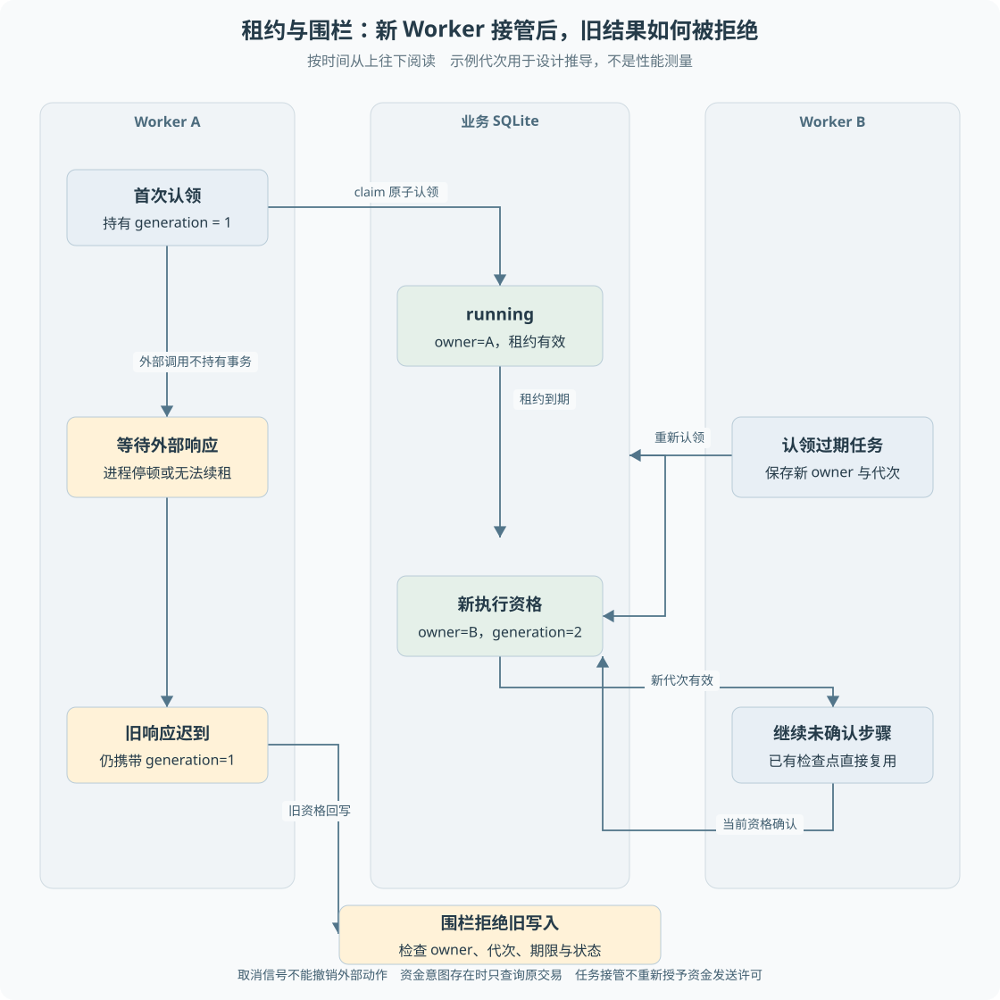

# 第 15 章 Worker、租约与检查点

一个 Worker 正在等模型响应，进程突然失去调度。租约到期后另一个 Worker 接管，原响应却又返回了。此时哪个执行者可以写结果？只记录“任务正在运行”无法区分两代执行资格。

> **阅读前提**：先读[第 06 章](../02-后端必要基础/06-事务唯一约束与条件更新.md)、[第 07 章](../02-后端必要基础/07-状态机与异步任务.md)和[第 14 章](14-退款幂等与结果未知.md)，理解条件更新、任务状态与资金意图。

## 实现思路

### 从一个锁到可接管的执行资格

永久锁可以阻止并发执行，却会在持锁进程退出后阻塞任务。给锁加到期时间可以允许接管，但旧 Worker 未必立即停止。当前设计在时间之外增加执行代次，并把每次结果写入都放在资格检查之后。

1. **受理先保存任务。** 调度对象存在于 SQLite，不依赖内存队列能否保存到下次启动。
2. **事务认领并核算配额。** 选择 queued 或已过期 running，检查任务类型、受理凭据和并发限制，再更新 owner、generation、leaseUntil、attempt。
3. **心跳续租并传递取消。** 执行期间定期续租，失败或发现取消请求时触发 AbortSignal，让底层调用尽快停止。
4. **结果确认使用围栏。** 写检查点、释放任务、完成任务和资金准备都重新核对当前 owner、代次、状态及期限。迟到响应不能只凭手中旧 task 对象提交。
5. **恢复复用已确认步骤。** 检查点存在就跳过该步；资金意图存在则优先核验，不重新调用模型规划付款。

这套设计同时解决“任务能被接管”和“旧执行者不能继续确认”两个问题。租约是临时资格，代次是该次资格的身份，检查点是已确认进度，三者不能替代。

图 15-1 是按时间展开的双 Worker 场景。新认领改变代次，旧响应回写时被围栏拒绝。图中的时间点用于设计推导，不是某次性能测试的耗时。

## 认领事务如何限制并发

`claim` 不只是取第一条 queued。它同时检查 availableAt、过期 running、支持的工具类型、可选受理事件，以及同运行没有有效运行任务。

配额还按全局、客户、提供商和工具四个维度统计有效租约任务。检查与认领放在一个写事务中，避免两个连接都读到“还有一个名额”，随后各领取一个导致超额。

数据库中的并发上限限制允许在运行的任务数，但不会自动创建同样数量的并行执行线程。当前会话和业务执行器各自使用串行扫描循环，多进程竞争由仓储协议协调。是否达到更高吞吐仍需实际调度方式与测量，不能从 limits 配置直接推算。

受理凭据也很重要。资金 Worker 要求任务有对应的业务受理记录，避免自动领取来源不明的历史任务。迁移后的旧记录缺少当前协议依据时，需要核验而不是强行改状态。

## owner、generation 与 leaseUntil

owner 表示当前执行者，generation 每次认领增加，leaseUntil 表示这次资格何时到期。一个合法认领引用必须与数据库中的三者及 running 状态一致。

教学示例：

1. Worker A 认领任务，得到 generation=1。
2. A 暂停，租约到期，Worker B 认领同一任务，generation 变为 2。
3. A 收到迟到模型响应，仍持有 generation=1 的引用。
4. A 进入确认事务，发现代次不匹配，写入被拒绝。

如果只检查 owner 字符串，进程重用名称或旧上下文残留可能造成误判；如果只检查时间，新旧调用也难以明确关联。代次让每次认领成为可比较的执行资格。

## 心跳与调用超时的职责

Worker 心跳大约按租约时长的三分之一续租，并检查取消标记。当前实现对心跳间隔还有最小值限制。续租失败时发出取消信号，不继续相信原资格有效。

`call` 对单次外部调用设置超时，并将上层取消传播给内部 AbortController。它使用竞速结束本地等待，即使底层稍后返回，也不能直接写检查点。

但取消信号是协作协议，不是保证外部系统没有执行的证据。渠道已经收到请求时，本地超时只能终止等待；资金路径仍需要按原业务键查询。模型调用的未知费用也由 P7 账本保留，不能因 Promise 被取消就记作零成本。

因此三种时间限制必须分开：

- **租约时间**：当前 Worker 何时失去写入资格。
- **调用超时**：一次外部等待持续多久。
- **任务截止时间**：整个任务允许推进到何时。

它们作用对象不同，不应该只配置一个统一 timeout 并假定所有问题都解决。

## 检查点保存已确认步骤

通用资金任务使用 model、read、payment 等步骤；持久会话使用 turn 与 tool 的细粒度键。检查点写入与相关事件或业务写回共同提交，避免一边认为已完成、另一边却没有对应结果。

模型轮次未完成时不写成功检查点。只读工具响应到达但确认前退出，恢复可能再执行未确认步骤；已经确认的轮次则复用，减少重复模型决策及费用。

这并不等于承诺每个模型请求恰好调用一次。进程在外部完成与本地确认之间退出时，可能无法知道供应商是否处理过；检查点只说明本地确认到了哪里，费用与不确定性另有账本记录。

资金步骤的规则更严格。已有意图时，恢复不重新执行 model 和 read，再按原交易查询。这保证重新认领不会把原资金操作变成另一份新计划。

## attempt 与业务发送次数

attempt 每次任务认领增加，用于限制累计尝试。进程强退也会消耗新的认领，不能通过每次重启重新从一开始绕过上限。

它不等于模型供应商尝试数，也不等于渠道提交次数。一次 Worker 执行可能包含多轮模型交互，每轮由 P7 处理自己的尝试；一个恢复后的资金任务可能 attempt 增加，但只进行了查询，没有新的提交。

所以实验应分别统计任务尝试、模型逻辑调用与渠道 submissions。把其中任意一个计数当成另一个，会误判恢复是否重复产生副作用。

## 故障案例与保证边界

正常情况是 A 持续续租，在确认事务中保存结果。异常情况是 B 接管后 A 回来：`renew` 返回 false，完成、释放、检查点和资金准备写入均应拒绝。

还有一个容易忽略的窗口：A 取得资金发送许可后退出。B 可以接管任务，却不能重置发送许可。它恢复的是核验责任，不是重新付款权。这个事实由资金意图与业务执行权保留，不由 Worker 心跳决定。

当前协议依赖访问同一业务库并遵守相同守卫。绕过仓储直接写表、删除许可或让未受控旧执行器同时运行，都超出保证前提。租约也不等于已经完成跨机器数据库协调部署。

## 一次认领循环的输入输出

理解 Worker 时，可以暂时忽略业务名，只看它接收和交出的数据。认领输入是执行者身份、租约时长、支持的工具集合及配额；认领输出是带当前代次的任务快照。执行器据任务计划选择专用处理器，处理器通过端口调用模型、只读服务或渠道，再通过仓储确认步骤。执行器不应该接受任意文本代码并直接执行。

这里的任务快照有使用期限。A 认领时取得的 owner、generation 和 leaseUntil 只描述当时资格，不能在长网络等待后仍当作最终事实。因此写回入口以数据库当前值为准，快照则提供要比较的资格身份。这个模式把“我曾经获得资格”与“我现在仍有资格”分开。

一次正常执行可以按五个观察点阅读：认领是否成功，心跳是否持续续租，外部调用是否完整返回，结果是否通过围栏确认，任务最终是完成、释放还是待核验。若没有认领到任务，不一定是队列空，也可能是执行时间未到、类型不支持、同运行已有有效任务或配额不足。定位时需读取这些条件，而不能把所有空返回都当成数据丢失。

### 失去资格后如何收尾

如果 A 在调用期间失去租约，心跳会尝试中断后续等待，但取消并不能保证底层马上停止。正确性不能依赖“应该不会再返回”，必须允许迟到响应出现，然后在写回时拒绝它。即使取消接口失灵，本地确认边界仍有代次核验；对外部资金则还要依赖发送协议，两个保护面都需要。

拒绝旧写回后，也不应由 A 擅自把任务标成失败。当前记录可能已经由 B 合法推进，A 再写 call_failed 会覆盖新进度。资格丢失应结束这一代执行者的工作，后续状态由当前持有者确认。这个细节比只在成功路径加一次 generation 比较更重要。

同理，释放任务供重试也属于受保护写入。如果没有资格核验，旧执行者可以在新执行者工作时把任务重新排队，导致第三代并发出现。checkpoint、finish、release 和资金准备都经过相应守卫，才能让代次协议覆盖完整生命周期。

### 检查点值的复用条件

已确认检查点需要属于同一任务和同一步骤，不能把其他运行中相同工具名的结果拿来复用。模型轮次、只读结果与资金终态的恢复语义也不同：模型结果保存原调用意图，只读结果保存观察，资金终态保存原外部动作确认。替换计划、配置或证据版本后，不能默认仍是同一步工作。

[练习四](../09-练习与自测/渐进重建练习.md)可以让 A 暂停、B 接管，然后分别尝试 A 的成功确认、失败确认和释放任务。全部被拒绝才说明围栏覆盖关键写入口，而不只是 happy path。再结合[练习五](../09-练习与自测/渐进重建练习.md)观察已经保存资金意图的任务，确认“重获任务资格”没有变成“重新获得首次发送资格”。

## 源码参考与验证依据

| 入口 | 内容 |
| --- | --- |
| [p6-task-repository.ts](../../../packages/persistence/src/p6-task-repository.ts) | claim、renew、assertOwned、fenced 与 checkpoint |
| [p6-worker.ts](../../../packages/runtime/src/p6-worker.ts) | 心跳、调用取消、时间上限与恢复分支 |
| [conversation-journal.ts](../../../packages/persistence/src/conversation-journal.ts) | 会话步骤与事件共同确认 |
| [p6-durable.test.ts](../../../packages/runtime/test/p6-durable.test.ts) | 旧代次各类写入口、并发限制与事务回滚 |
| [p6-process.test.ts](../../../packages/runtime/test/p6-process.test.ts) | 双进程认领、旧响应迟到及命名故障边界 |
| [P6 恢复实验](../../experiments/p6-recovery.md) | 当时模块装配和故障矩阵，不能替代后续客户入口证据 |

租约让失联任务继续前进，围栏拒绝旧执行者确认，检查点保留已完成工作。对于外部资金，还必须与原业务键、发送许可和查询协议一起使用，不能单独宣称实现全局 exactly-once。

---

本章学习衔接：[渐进重建练习四与五](../09-练习与自测/渐进重建练习.md) · [集中自测第 15 组](../09-练习与自测/集中自测.md) · [返回导学](../导学-有据售后.md)

业务对照：[B05-退货后退款的完整业务实现](../03-业务逻辑详解/B05-退货后退款的完整业务实现.md)。
