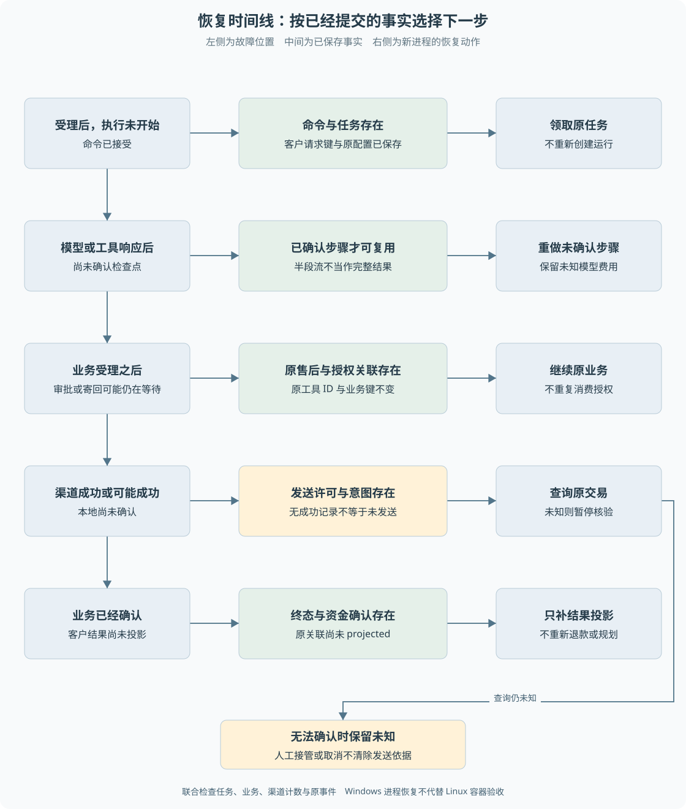

# 第 16 章 跨进程恢复与人工核验

同一个函数抛错后再次调用，不能证明进程崩溃后也能恢复。真正的跨进程实验必须丢失原内存，再由新进程依据数据库继续。**恢复能力要按退出位置验证，不能只用一个“重启成功”覆盖全部故障。**

> **阅读前提**：先读[第 13 章](13-从售后申请到审批与执行.md)、[第 14 章](14-退款幂等与结果未知.md)和[第 15 章](15-Worker租约与检查点.md)，理解授权、资金意图与确认点。

## 实现思路

### 把恢复问题拆成明确的故障窗口

最小恢复方案是重新启动服务，再运行未完成任务。它只有在能区分“未执行”和“已执行但未确认”时才安全。项目通过命名边界注入退出，使每个窗口对应具体的持久事实。

1. **受理已提交，执行未开始。** 新 Worker 找到原命令与任务，不重新创建业务。
2. **模型或工具已返回，检查点未确认。** 根据是否存在确认记录决定复用或重做；未确认模型调用可能产生未知费用。
3. **业务已受理，资金未发送。** 保留原售后、审批和执行权，继续已批准方案。
4. **资金可能已发送，结果未确认。** 只查询原交易，不能重跑前面的规划或生成新业务键。
5. **业务已确认，投影未完成。** 补齐原工具结果与客户事件，不重复执行资金。
6. **仍无法确认事实。** 保留 needs_confirmation，允许受控核验，但不为恢复率好看而伪造成功。

实验因此需要同时读取任务、业务、渠道和事件。只看恢复后页面显示“完成”，不能证明中间没有重复退款或重复工具结果。

图 16-1 沿时间线标明已经提交的事实，下面对应新进程的动作。退出点越晚，越不应该从头重跑；进入外部资金不确定区后，恢复重点变为核验。

## 两类进程实验的范围

仓库包含早期 P6 通用持久任务实验和后续普通客户退款实验。前者验证底层任务、租约、渠道与检查点；后者从正式客户 HTTP 发起两类退款，验证原会话与业务的完整关联。

它们不能合并成一组“当前全部场景”。早期模块报告中的待接入说明反映当时状态，后续接入结果需要对应新的交接和测试。

当前客户退款进程测试覆盖六个边界：业务受理前、受理后、审批受理后、渠道响应后、本地业务投影前和退货等待。多数故障点使用子进程明确退出，等待退货场景则停止后重新启动。

| 退出位置 | 已保存的关键事实 | 恢复应做什么 |
| --- | --- | --- |
| before-business-accept | 原模型动作已确认 | 重用原动作受理业务，不重新调用模型生成另一方案 |
| after-business-accept | 售后与原工具关联已提交 | 继续原业务任务 |
| after-approval-accept | 授权已转为持久命令 | 不再次消费审批令牌 |
| after-payment-response | 渠道可能成功，本地未落账 | 按原业务键查询并确认 |
| before-business-projection | 业务终态已提交 | 只补工具结果与客户事件 |
| return-wait | 原退货等待与授权存在 | 接受合法寄回与收货，继续原退款 |

## 为什么需要独立渠道事实

模拟渠道在自己的数据库记录交易状态、submissions 和 charges，并支持按原业务键查询。响应丢失故障在渠道事务提交后销毁连接，调用方不能通过正常响应知道结果。

恢复成功时，业务库应补齐结果，渠道提交与资金动作计数不增加。对于 2026-09-26 客户实验摘要中的 after-payment-response 场景，记录是提交一次、资金动作一次、查询一次。它证明的是指定条件下通过查询恢复，不是所有生产渠道的行为。

如果模拟器与业务库共用同一个“成功字段”，实验就无法真正区分外部已发生与本地未确认。独立记录是这个故障设计的必要条件，而不是为了让架构显得分布式。

当前 main 的内嵌模拟器与独立进程实验在进程布局上不同。文档必须按具体运行方式表述，不能因使用两个数据库就宣称所有部署都有独立渠道进程。

## 结果投影为什么也需要恢复

业务成功后，客户可能仍停留在等待页面。原因可能是进程在写业务结果后、写原工具结果前退出，而不是渠道失败。

`P6ConversationRefundRepository.project` 扫描尚未投影的原关联，检查退款、售后、资金效果与执行权。只有成功事实彼此匹配才生成成功结果；未知状态只发布待核验进度，不把原工具强行标为成功。

投影通过原工具调用 ID 回填，并以事件键和 projected 标记限制重复。恢复只补这一阶段，不重新运行模型或资金。实验同时检查原工具结果与客户完成事件各一次，避免“钱只退一次但消息发很多次”的体验问题。

这不是宣称所有事件在任意消费端 exactly-once。服务端确认与前端重放仍有各自协议，客户端也需要按事件身份处理重复。

## 人工核验不是直接修改数据库

结果未知时，人工需要确认真实业务与渠道事实。当前项目提供保守阻塞、任务核验重排和人工接管，但没有完整真实渠道对账与自动解冻系统。

受控 reconcile 只把待核验任务重新排队，保留发送标记，所以恢复后仍查询原业务键。它不是一键重试退款，也不应通过删除效果表记录实现。

人工结案还有独立检查。`closureBlockers` 为不同资源定义允许结束的状态，未知资金、未确认任务或缺失关联会阻止结案。审批已经 approved 不能抵消退款仍 executing；任务 call_failed 也不能让未确认业务自动满足结案条件。

正常人工处理需要先定位阻塞项，再取得相应证据。仅在聊天里写“已处理”不改变资金事实，主管角色也不能凭权限大小免除核验。

## 取消与恢复的顺序

发送前取消，可以让任务停止而不发起资金。发送后取消，必须先确认动作是否已经发生，再决定停止后续步骤。

因此 task cancelled 与业务 succeeded 可以同时出现，含义是资金已确认成功，系统随后停止其他工作。把它视为数据必然矛盾，会诱导错误补偿或重发。

同样，运行时间上限并不意味着已经在途的资金请求可以遗忘。时间控制限制计算与等待，但不能替代外部事实核验。

## 如何阅读恢复证据

每个场景至少要核对：故障点是否真的到达、旧进程是否退出、新进程是否启动、使用的业务和渠道库是否相同、原业务键是否保留，以及终态和计数是否满足断言。

测试源码说明实验如何设计，日志和摘要说明某次运行观察到了什么。若原始数据库副本已不在当前目录，只能引用保留下来的摘要，不宣称重新完成了库级核验。已确认样章引用的早期进程目录就存在这一可用性限制。

本机 Windows 子进程退出与 Linux 容器 SIGTERM 收尾也不同。前者证明持久恢复窗口，不能替代后者对信号、卷权限、原生模块和浏览器同源 SSE 的验收。

## 怎样构造一个有区分力的故障实验

最容易得到的假阳性是：测试声称杀过进程，实际资金步骤还没开始；重启后第一次执行成功，于是被报告成“支付成功后恢复通过”。因此故障实验必须先确认到达目标边界，再终止进程，且边界记录与业务身份要能相互定位。

以支付响应后退出为例，先建立独立业务库与渠道库，由旧进程通过正常受理进入资金步骤。渠道已经提交其交易事实，旧进程在本地确认之前退出。新进程加载相同库并恢复原任务，最终应看到原退款成功、原业务键不变、渠道提交与动作次数没有增加。若只看到最终 succeeded，无法排除新进程又付一次的错误实现。

如果目标是投影恢复，故障位置则必须更晚：业务确认已保存，原动作客户结果尚未补齐。新进程只需要补关联和事件，渠道查询也不是这个窗口的必要目标。把所有故障都随机杀一次，会混合不同前置状态，难以解释哪个机制真正被验证。

一个完整证据表可以记录故障点、旧进程标识、退出结果、新进程标识、库路径、原运行与业务键、恢复动作及联合断言。这里提供的是检查方法，不表示历史每份摘要都保存了所有原库；具体可用材料仍以对应实验记录为准。

### 核验完成与反向补偿操作不同

核验的目标是查清已经发生什么。例如查询原交易得到明确成功，将本地记录推进到一致终态。补偿则是在已知原动作结果后执行另一个业务动作，例如后续另行撤销或调整；它有自己的授权、身份和失败风险。不能把“不知道是否退款”直接映射成“先补偿一次”。

这里讨论的是恢复设计中的补偿操作，不是 [B08](../03-业务逻辑详解/B08-补偿价保与换货.md) 的客户现金安抚补偿服务。名字相似，前者讨论如何处理已发生动作的后果，后者是项目独立业务类型；当前没有实现通用自动反向补偿系统。

人工同样需要证据链。如果渠道仍不明确，主管权限更高并不会使事实更确定。当前系统保留待核验与结案阻塞，是为了避免用管理操作抹去风险，而不是已经提供完整的自动对账。未来接入真实渠道时，需要规定什么查询结果具有权威性、在途多久、如何定位原交易及谁能确认最终处理。

### 恢复结果应允许保留未知

恢复实验的成功定义不总是业务 completed。对持续 unknown 的故障，正确结果就是保留原资金意图、停止盲目发送并公开待核验进度。若验收脚本要求所有情况最后都变绿，它反而会奖励错误清理或重发。

因此应同时设计一个可查询成功的响应丢失场景和一个始终未知的场景。前者证明系统能前进，后者证明它知道何时不能前进。重建任务见[练习五](../09-练习与自测/渐进重建练习.md)，观察时不要重置数据；保留下来的阻塞记录也是需要解释的产物。

## 源码参考与验证依据

| 入口 | 内容 |
| --- | --- |
| [conversation-refund-process.test.ts](../../../apps/api/test/conversation-refund-process.test.ts) | 六个客户 HTTP 故障窗口与联合断言 |
| [进程夹具](../../../apps/api/test/fixtures/conversation-refund-process.ts) | 命名边界退出与恢复装配 |
| [p6-process.test.ts](../../../packages/runtime/test/p6-process.test.ts) | 通用任务与独立渠道的更底层矩阵 |
| [p6-conversation-refund.ts](../../../packages/persistence/src/p6-conversation-refund.ts) | 原动作结果投影及未知保留 |
| [case-closure.ts](../../../packages/domain/src/case-closure.ts)、[结案仓储](../../../packages/persistence/src/case-closure-repository.ts) | 人工结案的阻塞事实 |
| [客户退款实验](../../experiments/p6-conversation-refund.md)、[P6 模块恢复实验](../../experiments/p6-recovery.md) | 分时期的故障条件与验证范围 |

恢复设计的价值在于退出后仍能解释每条事实，知道哪些步骤可以继续、哪些只能查询、哪些必须停下。对无法确认的业务保留未知，是正确性的一部分，而不是需要从报告中抹去的失败状态。

---

本章学习衔接：[渐进重建练习四与五](../09-练习与自测/渐进重建练习.md) · [集中自测第 16 组](../09-练习与自测/集中自测.md) · [返回导学](../导学-有据售后.md)

业务对照：[B07-人工接管与结案](../03-业务逻辑详解/B07-人工接管与结案.md)。
