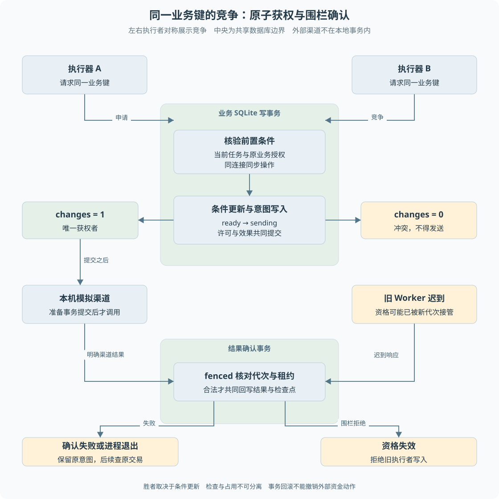

# 第 06 章 事务、唯一约束与条件更新

两位主管几乎同时点击批准，或者两个 Worker 同时看到一条待执行任务，程序为什么不能把同一个动作做两遍？“先检查一下”只有在检查和执行之间没有竞争时才可靠。**并发正确性需要把前置条件和写入结果放到数据库能够保证的边界内。**

> **阅读前提**：理解 SQL 的查询和更新，先读[第 05 章](05-数据建模与SQLite持久化.md)。本章重点是本项目用到的原子性，不展开完整数据库理论课程。

## 实现思路

### 最小方案的竞争窗口

假设程序先查退款记录，发现尚未执行，然后调用渠道。两个请求可能依次完成查询，都得到“尚未执行”，再各自发送。给每个函数加 `await` 不会阻止另一个请求进入相同逻辑，更不能协调另一个进程。

当前项目按需要保护的事实使用三种机制：

1. **唯一约束保护身份。** 一位客户的同一请求键只能对应一条命令，同一业务键只能对应一条资金效果。程序利用原记录处理重放，而不是重复插入。
2. **条件更新保护迁移。** 获得资金许可、消费审批凭据和续租等动作，只有数据库当前值符合预期时才成功。受影响行数告诉调用者自己是否真正取得资格。
3. **事务保护关联变化。** 受理时命令与任务共同提交，资金准备时许可与意图共同提交，确认时业务结果与检查点共同提交。任一步失败，不能留下其他步骤已经成功的假象。

对长时间运行的任务，还需要租约代次限制旧 Worker 写入。它不是把整个模型调用放进事务，而是在每次确认结果的短事务中检查当前执行资格。



图 6-1 左右执行者竞争中央数据库中的资格，绿色区域划出准备和确认两个事务。图以 A 获权为例，实际胜者由条件更新决定。下半部分单独画出旧 Worker 的迟到响应，并不表示竞争失败的 B 可以调用渠道。网络调用位于准备事务之后，本地回滚无法撤销外部资金动作。

### 事务边界由不变量决定

不变量是无论正常还是异常都必须成立的关系。例如“有一个已受理命令，就必须存在它的执行任务”“同一发送许可不能归两个命令持有”。先写出这些关系，才能决定哪些写入必须放在一起。

如果只是把现有代码随意包一层事务，内部仍调用另一个连接或返回异步 Promise，就可能失去预期边界。本项目的关键仓储回调要求同步使用传入连接，并拒绝部分异步回调形式。

## 事务如何保证本地原子性

`better-sqlite3` 的事务包装执行一组同步数据库操作，成功后提交，抛错时回滚。项目在竞争敏感的受理和认领路径使用 `.immediate()`，在事务开始时取得写入意图，协调读取条件与后续写入。

以持久受理为例，事务中会检查既有请求、写入运行或验证原运行、创建命令和任务。若任务插入失败，前面的新命令和新运行不能残留成一个“已受理但永远无任务”的对象。

但事务保证的是**本地数据库操作的整体性**。调用渠道、发送邮件或请求模型都是数据库之外的动作。即使事务回滚，外部系统已做的事也不会自动撤销。因此当前资金发送采用“短事务准备 → 网络调用 → 短事务确认”的结构。

这个结构留下了两个阶段之间的故障窗口，也正是持久意图与查询恢复存在的原因。事务没有消灭外部不确定性，而是让本地记录在每个确认点保持可解释。

## 唯一约束与请求重放

只在程序里查询“有没有同一请求键”，不能替代数据库唯一约束。另一个连接可能在查询后插入同一身份。唯一约束让数据层拒绝两条冲突记录，程序再根据原记录决定返回既有结果还是报告同键异参。

`p6_commands` 的 `(customer_id, request_key)` 是一个复合唯一键。两位客户可以拥有相同字符串请求键，但同一客户的相同请求键不能代表不同命令。

指纹比较是约束之外的语义层。唯一约束只能说“已经有这条身份”，不能说第二次内容是否相同。受理仓储保存请求内容或规范化指纹，以便区分：

- 同一请求的网络重试，应该返回原结果。
- 错误复用请求键的另一条输入，应该拒绝。

检查点和任务事件也使用唯一身份防止重复确认。但 `ON CONFLICT DO NOTHING` 并非所有写入都适合：如果两次输入语义不同却静默忽略冲突，就可能掩盖错误。应先确认调用协议保证它们属于同一已确认步骤。

## 条件更新与 CAS

CAS（Compare-And-Swap，比较并交换）表达的是“只有值仍满足预期才更新”。本项目不需要先在内存里加一个全局布尔锁，再相信所有进程都看到它；条件直接写进 SQL。

资金许可的核心条件包括业务键、执行路径、命令持有者和 `state='ready'`。租约续期还包括所有者、代次和原租约未过期。受影响行数为零表示条件不成立，不能继续假装自己拥有资格。

```sql
UPDATE p6_tasks SET lease_until = ?
WHERE task_id = ? AND status = 'running'
  AND owner = ? AND generation = ? AND lease_until > ?
```

这段代码来自任务仓储的续租逻辑。它不只检查 owner，因为一个旧执行上下文可能已经过期；代次标识本次认领，期限约束当前资格。旧 Worker 即使恢复运行，也不能用过期认领续租。

**CAS 不是一个单独的数据库产品功能名称，而是一种有条件地改变状态的协议。** 在这个项目中，它通过 SQL 条件、事务与返回行数共同实现。

## 围栏写入保护什么

租约到期后，新 Worker 可以认领任务，但旧 Worker 未必立刻停止。它可能正在等待一个无法及时取消的外部调用，稍后才收到响应。如果直接写入结果，就会覆盖新执行者的进度。

`fenced` 在同一个写事务里执行 `assertOwned` 再写业务。检查内容包括运行状态、owner、generation 和租约时间。这里的围栏指拒绝已失效执行资格的写入，不是网络隔离或容器沙箱。

正常案例是当前 Worker 续租成功，确认工具结果并保存检查点。异常案例是旧代次在新 Worker 接管后尝试完成任务，仓储抛出资格丢失错误，不接受其确认。

这种围栏只约束经过该仓储的本地写入，不能让已经发出的渠道请求消失。外部副作用还需要业务键和发送许可协议，不能把“旧 Worker 写不进去”说成“旧 Worker 绝不可能产生外部动作”。

## 同步数据库与异步代码的边界

Node 的异步执行并不意味着数据库事务可以任意跨 `await`。本项目采用同步数据库接口，事务回调应在当前调用栈内完成。不应在回调中调用网络，再等 Promise 返回后继续使用已经不符合预期的事务边界。

因此，业务准备回调与确认回调只读取和写入传入的数据库连接。模型、渠道调用在事务之外执行。这样既缩短锁持有时间，也让失败条件明确：准备失败没有发送授权，网络失败进入核验，确认失败保留原意图等待恢复。

嵌套仓储操作还需要注意连接一致性。相同文件的另一个连接并不自动加入当前事务。项目通过传入同一连接协调授权、受理与检查点，而不是只要求它们最终写到同一路径。

## 反例与判断方法

| 做法 | 缺口 | 当前机制 |
| --- | --- | --- |
| 先 SELECT 再无条件 UPDATE | 两个执行者都可能读到旧状态 | 条件更新并核对 changes |
| 仅用进程内 Map 防重 | 重启与另一个进程看不到该锁 | 数据库持久状态与唯一约束 |
| 支付成功后才写幂等结果 | 成功与落账之间退出会丢依据 | 发送前意图与原渠道查询 |
| 租约到期就清理资金许可 | 不知道原渠道动作是否发生 | 任务资格与资金许可分开 |
| 所有错误都事务回滚后重试 | 外部副作用不随本地回滚 | 分类处理并保留未知事实 |

## 两个连接竞争时怎样推导结果

可以用一个教学时间线检查“查了就不会重复”的错误。A 读到 ready，B 也读到 ready；A 随后写 sending，B 又写 sending。如果写入没有前置条件，两次写入都可能被应用当成成功授权。这不是 JavaScript 是否单线程能够解决的问题，因为两个请求可能来自不同连接、进程或前后两次执行。

条件更新把“我看到过 ready”改成“提交这一刻仍是 ready 才允许修改”。应用必须检查受影响行数：一行才表示本次拿到许可，零行要重新判断现有事实，而不是继续执行网络动作。唯一约束则阻止另一种路径通过插入新记录绕过同一业务身份。二者处理的是不同竞争面。

事务还保护多条写入的关系。假设先取得许可，再写资金意图，第二步失败时必须撤销许可变化。否则恢复只看到许可被占，却没有用于查询的原意图；反过来，只有意图没有相应持有者也无法证明谁有权发。故障测试应在第二条写入处主动制造异常，确认整个提交边界回滚，而不只测正常事务返回。

读到冲突后的处理也属于设计。请求重放可能应该返回原结果，另一位主管重复决定可能应该返回已决定，资金已在途则应该转查询；它们不能一律作为“数据库忙”重试。数据库错误类型提供存储事实，应用还要根据业务身份与状态选择动作。

这套推导不承诺跨数据库和远端付款的原子性。即使本地事务完全正确，提交后到发送、远端成功到本地确认之间仍存在窗口。第 14 章通过持久意图和原交易查询处理这些窗口。可在[练习二、四](渐进重建练习.md)分别观察唯一竞争、条件更新和回滚，不需要一开始接入完整 Agent。

## 源码参考与验证依据

| 入口 | 对应机制 |
| --- | --- |
| [p6-task-repository.ts](../../packages/persistence/src/p6-task-repository.ts) | accept、claim、renew、fenced 与确认事务 |
| [execution-ownership-repository.ts](../../packages/persistence/src/execution-ownership-repository.ts) | 获权和接管条件更新 |
| [execution-ownership-p6.ts](../../packages/persistence/src/execution-ownership-p6.ts) | 同事务受理与业务回写适配 |
| [审批并发测试](../../packages/persistence/test/approval-concurrency.test.ts) | 审批与一次性凭据竞争 |
| [执行权竞争测试](../../packages/persistence/test/execution-ownership-repository.test.ts) | 独立进程连接竞争 |
| [持久任务测试](../../packages/runtime/test/p6-durable.test.ts) | 受理回滚、旧代次写入与资金回写回滚 |
| [执行权实验记录](../experiments/execution-ownership.md) | 具体竞争与故障条件，不代表压力容量结论 |

事务、唯一约束与条件更新分别负责整体提交、身份约束和状态竞争。它们组合起来才能保护本地事实；跨系统资金一致性还要依靠下一层的执行协议。迁移数据库时，应重测这些竞争和回滚性质，不能只把 SQL 语法转换成功视为迁移完成。

---

本章学习衔接：[渐进重建练习二与四](渐进重建练习.md) · [集中自测第 06 组](集中自测.md) · [返回导学](导学-有据售后.md)
