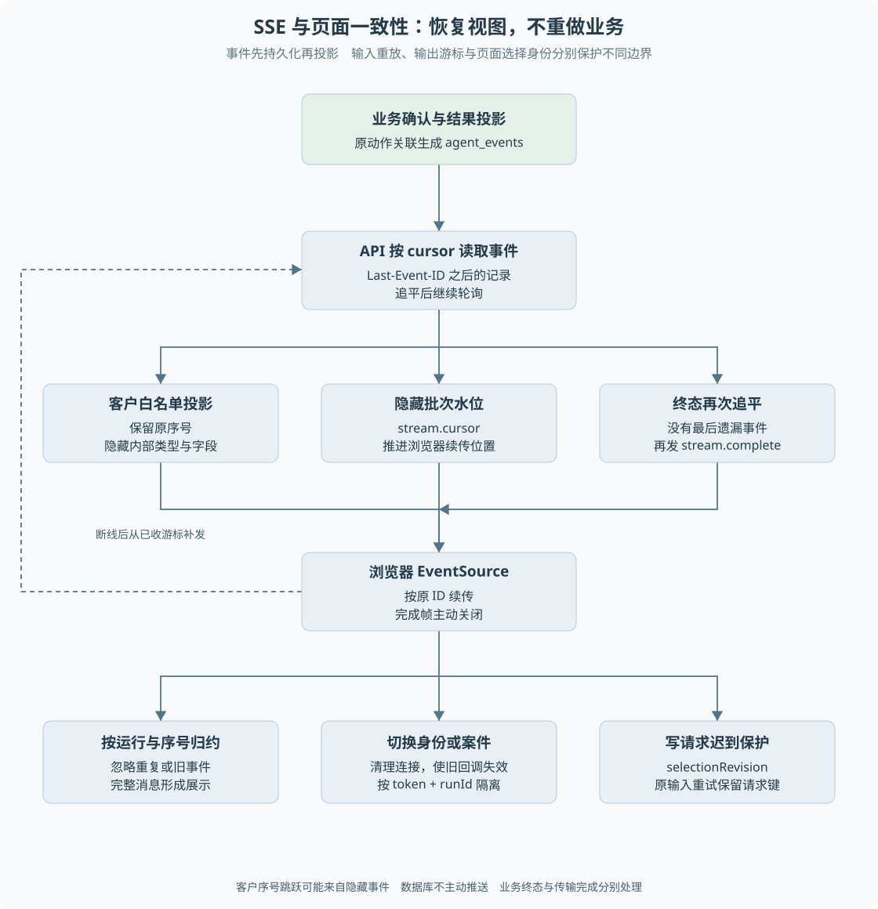
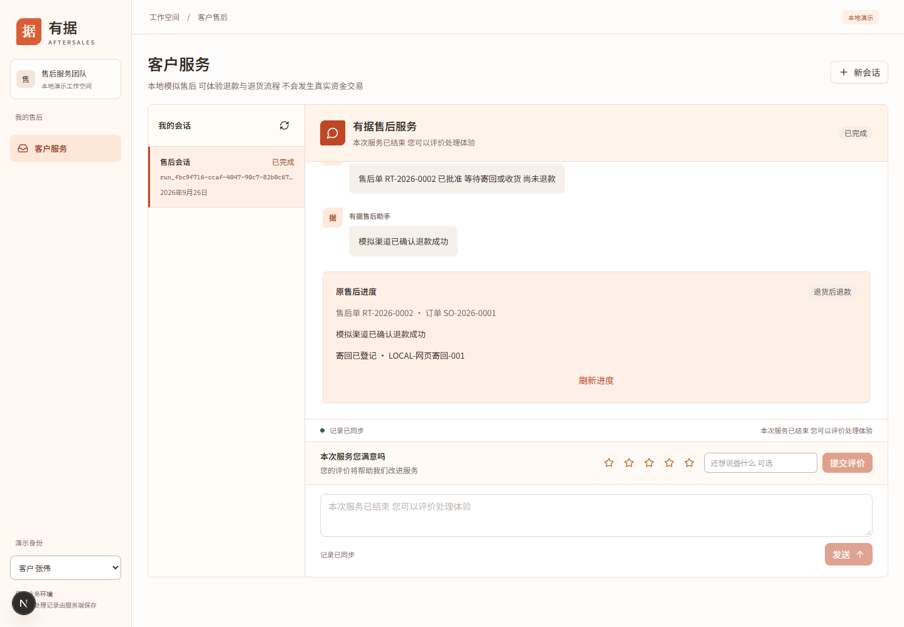

# 第 17 章 SSE、事件投影与前端状态

客户页面断线后重新连接，应该补齐进度，而不是让后台重新退款。身份切换后旧请求才返回，也不能把上一位客户的状态写到新页面。**前端可靠性来自事件身份、连接生命周期和请求归属的共同约束。**

> **阅读前提**：熟悉 React effect、异步请求和状态更新，先读[第 02 章](../01-项目全貌/02-一次退款请求的全景.md)、[第 04 章](../02-后端必要基础/04-HTTP接口与身份边界.md)与[第 16 章](../05-资金执行与恢复/16-跨进程恢复与人工核验.md)。

## 实现思路

### 从一次响应到可重建视图

普通 HTTP 适合提交消息、审批和查询快照，但无法只靠最初响应表达后续长流程。SSE 提供服务器到浏览器的连续事件，适合传递售后状态变化。

项目没有把事件只放在内存广播中，而是先保存，再由 SSE 查询交付：

1. **业务写入形成持久事件。** 会话消息和业务投影各自确认后写入 `agent_events`，每个运行内序号递增。
2. **连接从游标之后补发。** 服务端读取 Last-Event-ID 之后的事件，追平后继续轮询，不重新执行模型或工具。
3. **客户事件在服务端投影。** 白名单筛选类型与字段，保留原序号；隐藏批次通过水位帧推进浏览器游标，不泄露内部内容。
4. **前端按运行与序号归约。** 相同或更旧的事件忽略，完整消息修正展示状态，避免重连重复消息。
5. **身份与选择切换隔离旧异步结果。** 每个订阅有独立状态和清理标记，写请求还用选择版本防止迟到结果覆盖新页面。
6. **传输结束与业务终态分别处理。** 服务端追平后发完成帧，客户端收到后主动关闭，而不是看见某个业务终态事件就截断剩余消息。

这套结构把“是否连接着”“业务处于什么状态”“当前页面属于谁”分开。断线是传输事实，不是退款失败；后台完成也不保证页面已经收到最后一条事件。

图 17-1 从业务确认到客户归约，另画隐藏事件水位、终态追平与页面切换三个分支。客户序号可能跳跃，不能把所有跳号都解释为丢失事件。

## 持久事件与公开事件

内部事件包含模型轮次、工具结果、诊断和业务状态。客户只需要可理解的进度与消息，不能直接得到内部配置、工具参数和任意错误细节。

`customerEvent` 对事件类型逐个构造新 payload，未列出的类型返回 null。保留原 runId、sequence 与时间，因此公开事件流只是内部事件的投影，不是重新编号的一套历史。

例如内部序号 10、11 是工具诊断，12 是客户消息，客户只收到 12 并不构成错误。若整批都是隐藏事件，服务端发送 `stream.cursor`，只带 sequence；浏览器的 SSE 游标可以前进，但页面不把这个水位帧加入业务消息列表。

这个设计避免每次重连反复扫描相同隐藏尾部，同时不需要公开隐藏事件的类型或内容。它也说明传输游标与可见消息条数不是同一指标。

## 服务端如何追平和结束

`createEventStream` 初始发送连接注释，让客户端及时收到响应。之后按游标读取数据库事件，一批处理完再交给消费端继续读取，空批次时按轮询间隔等待。

终态处理有一个竞争窗口：第一次读到没有新事件后，检查运行终态的过程可能让出执行权，此时最后一条事件刚好提交。实现会再查询一次，确认仍没有尾部事件才发送 `stream.complete`。

因此前端不能单凭 `run.completed` 立即断流。它还可能需要接收其他同事务或后续已提交的公开内容。完成帧表达的是服务端已经追平并结束这一连接，业务终态表达的是领域或运行事实。

轮询错误会结束当前流，客户端再重连。关闭页面或服务停止也会取消连接。事件来源是持久表，所以传输失败不需要重新运行产生事件的业务。

连接还受存活时长约束。当前实现默认单身份最多四条事件流，约十五分钟后服务端只发送 `: server-refresh` 注释并关闭连接，**不发送** `stream.complete`。完成帧表示这一运行已经追平并结束传输；刷新注释只表示当前连接该换一条，浏览器应携带 Last-Event-ID 重连，从原序号之后继续补发。把到期关闭当成业务终态，会让页面误显示咨询已经结束。

## 前端如何避免重复与迟到

`useRunEvents` 以 token 和 runId 组成订阅身份。身份变化时立即返回空视图，新 effect 建立独立归约状态；旧连接清理后，已经排队的回调也因 active 标记失效而不能写入。

收到事件时，先确认 runId 匹配，并忽略不大于 lastSequence 的事件。这个判断依赖服务端在单个流中按序交付，不应扩展成任意乱序消息都能自动补洞的通用消息系统。

普通写请求还存在另一种迟到：用户发送消息后切换会话，旧请求返回并试图清空新草稿。`CustomerWorkspace` 用 `selectionRevision` 判断结果属于哪次选择；离开再回到同一会话也增加版本，所以不能仅比较 runId 字符串。

请求键则覆盖网络重试：同一内容和同一运行的失败重试保留原键，真正的新消息使用新键。这与事件序号去重是两个方向的防重，分别保护输入受理和输出展示。

## 进度卡为什么还要读业务快照

事件用于重建会话，退款进度则需要综合原售后、退款、审批、资金效果和执行权。`customerRefundProgress` 在一致读取中检查这些关联，再生成客户允许看到的字段。

确认成功要求多项事实一致；若某张表已成功而其他记录尚未确认，进度会保守显示未知。不能让前端只看到一句“模拟退款成功”就将所有业务状态标成完成。

寄回面板也依据实际进度开放操作。人工接管后普通留言与结构化寄回不同，API 拒绝后者时前端不能把它显示成登记成功。

## 正常与异常案例

正常案例是客户在等待审批时刷新，页面按原运行重新获取进度和事件，保留真实等待状态。重连只恢复视图，不再申请一笔退款。

异常案例包括：

- SSE 断开但业务继续执行，页面提示连接状态并等待补发，不宣布业务失败。
- 切换客户后旧订阅收到消息，active 与订阅身份使其被忽略。
- 发消息失败后重试，同请求键返回原受理，避免重复消息触发任务。
- 运行终态事件先到，客户端继续接收直到完成帧，避免截断尾部内容。
- 事件流因存活时长关闭，页面仍显示原等待状态，重连后从原游标补发，不把刷新注释当成结案。

错误提示应对应用户能采取的动作。内部异常详情不直接显示给客户，通用“请重试”也不能用于未知资金这种不允许重发的状态。

## 按一次身份切换分析浏览器竞争

假设页面当前显示客户 A 的运行 X，同时有一条消息请求和一个 SSE 连接在途。用户切换到客户 B，页面开始读取运行 Y，随后 X 的旧请求才返回。若回调只做 setMessages，B 的页面就可能显示 A 的结果；若旧回调还清空输入框，B 正在编辑的草稿也会丢失。服务端鉴权正确并不能自动解决这一客户端竞争。

订阅身份需要包含认证上下文和运行，变化时立即清空不属于新身份的视图并使旧回调失效。对写请求，还要保存发出时的选择版本，返回时核对版本仍一致。版本不仅区分 X 和 Y，也区分离开 X 后重新进入 X：此时 runId 相同，用户操作上下文却已经改变。

取消请求和忽略结果是两个动作。AbortSignal 可以减少不再需要的工作，但请求可能已经完成、回调已经排队，所以仍需要归属判断。不能把“调用了 abort”当成旧响应一定不会出现。前端的这一原则与 Worker 拒绝迟到结果类似，但它保护展示状态，不承担资金安全职责。

### 重连时需要保存哪些身份

重连需要原运行身份和服务端事件游标。用户真正新发消息使用新的请求键，网络重试原消息则保留原键；这两个键不能与 SSE 序号混为一谈。请求键标识输入操作，序号标识输出事件，运行身份把两者放回同一业务上下文。

客户端处理新事件时先验证运行，再检查是否比已应用序号更新。单连接按序交付是这里的前提。若将来改成多个通道并行传输，简单丢弃较小序号可能隐藏乱序消息，需要额外重排或补洞协议，不能直接宣称现有 reducer 是通用消息队列消费者。

隐藏事件水位也值得单独观察。假设客户已经看到序号 8，之后内部产生若干诊断但没有新公开消息；服务端让游标前进，可以避免每次重连都扫描同一段隐藏尾部。这个水位不应在聊天区渲染为系统消息，更不应含内部事件名称。它解决的是交付进度，不是业务进度。

在[练习六](../09-练习与自测/渐进重建练习.md)中，应同时断开连接、切换身份和重放事件，核对页面与服务端记录。单纯截图正常页面只能证明当时看起来正确，无法验证迟到竞争；相反，逻辑测试通过也不能证明长文本、窄屏和错误提示都清楚易读，视觉仍需独立检查。

## 界面证据

下图来自 2026-09-26 的客户寄回网页验收，使用正式前端源码、独立本地 API、离线协议与模拟渠道。它说明当时桌面进度展示，不代表本轮重新进行了浏览器业务验收。

来源：[客户寄回网页实验记录](../../experiments/customer-return-shipment-ui.md)。窄屏有历史布局问题与修正记录，本教材不据一张桌面图或某次窄屏结果宣称全端完全通过；移动端视觉疑点与 P10 容器浏览器验证仍需按对应环境复核。

## 源码参考与设计取舍

| 入口 | 内容 |
| --- | --- |
| [服务端 SSE](../../../apps/api/src/sse.ts) | 补发、水位、终态二次追平、存活时长与关闭 |
| [customer-view.ts](../../../apps/api/src/customer-view.ts) | 客户白名单投影，含 `run.expired` |
| [event-stream.ts](../../../apps/web/src/lib/event-stream.ts) | EventSource 生命周期与完成帧 |
| [前端 SSE hook](../../../apps/web/src/lib/sse.ts)、[runReducer.ts](../../../apps/web/src/lib/runReducer.ts) | 订阅身份与事件归约 |
| [CustomerWorkspace.tsx](../../../apps/web/src/components/customer/CustomerWorkspace.tsx) | 请求键与迟到结果隔离 |
| [重连测试](../../../apps/api/test/p6-sse-reconnect.test.ts)、[客户事件测试](../../../apps/api/test/customer-events.test.ts)、[存活时长测试](../../../apps/api/test/sse.test.ts) | 传输恢复、信息边界与到期不发完成帧 |

数据库轮询易于本机复现，不需要额外消息设施，但连接数增长会放大轮询与序列化成本。未来若引入发布订阅，它可以降低通知延迟，却不应替代持久事件作为补发来源。需要保留的核心是事件身份、权限投影和恢复协议，而不只是换一条传输通道。

---

本章学习衔接：[渐进重建练习六](../09-练习与自测/渐进重建练习.md) · [集中自测第 17 组](../09-练习与自测/集中自测.md) · [返回导学](../导学-有据售后.md)

业务对照：[B10-从业务事实到客户页面](../03-业务逻辑详解/B10-从业务事实到客户页面.md)。
