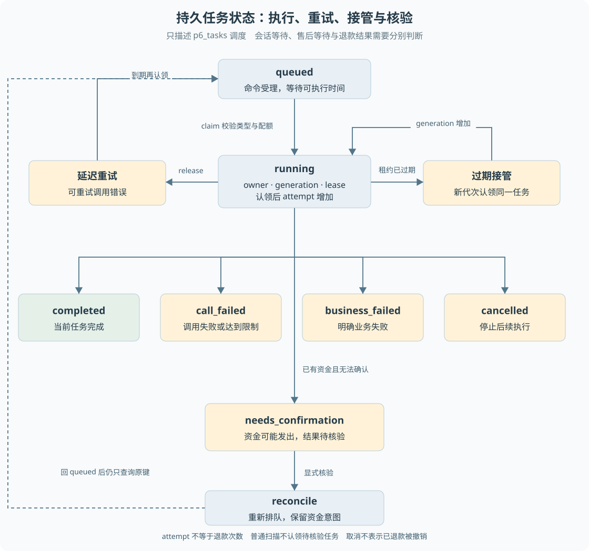

# 第 07 章 状态机与异步任务

客户补问、等待主管审批和等待寄回，都可能使一次售后持续很久。服务器不适合为每个等待永久保留一个内存函数。系统需要保存“现在是什么状态、什么事件可以继续、已经确认过什么”，让后续请求和进程恢复有明确依据。

> **阅读前提**：先读[第 05 章](05-数据建模与SQLite持久化.md)和[第 06 章](06-事务唯一约束与条件更新.md)，理解命令、任务与事务。

## 实现思路

### 把等待从调用栈移到数据中

最小方案可以让退款函数顺序执行所有步骤，但它无法直接等待几小时后的客户寄回。把 Promise 留在内存里只适用于当前进程仍然活着的短等待，重启后没有足够信息恢复。

当前设计将长流程拆成多次受理与短期执行：

1. **命令描述一次已接受的输入。** 客户消息、批准或收货都需要关联原业务，受理后生成可以执行或已记录完成的任务。
2. **任务状态描述调度进度。** 任务在 queued 和 running 之间领取、执行与重试，完成或失败时保存终态；未知资金单独进入 needs_confirmation。
3. **会话和业务各自保存状态。** 会话可能等待输入，售后可能等待寄回，某个记录补充的任务却已经完成。不能用一套状态代替所有对象。
4. **恢复从确认点继续。** 模型轮次和工具结果确认后保存步骤；新的执行者先读已有步骤，跳过已完成部分，再判断是否仍允许推进。
5. **重新调度不等于重新发送副作用。** reconcile 可以把待核验任务排回队列，但原资金意图仍在，执行器因此只能查询原交易。

这套结构让业务等待与进程执行分离。Worker 处理一次可执行片段后释放资源，业务可以持续停留在等待状态，直到合法输入到达。

图 7-1 以 running 为中心展开正常完成、失败、取消和待核验，左右回路分别表达延迟重试与过期接管。reconcile 是触发重排的操作，不是新增任务状态。它不会删除原资金意图，因此回到 queued 也不会自动获得再次发送许可。

## 状态机不只是一个枚举

枚举告诉程序有哪些状态，迁移规则告诉程序从哪个状态可以走到哪个状态。售后单、审批、退款和会话都有各自的迁移语义。

例如“主管批准”不能发生在一张已经明确拒绝的审批上；“确认收货”不能被解释成任意售后状态都可以触发退款。领域状态迁移表和服务校验负责这些条件，数据库的 CHECK 主要限制合法取值。

当前持久仓储还使用条件 SQL 保护关键写入，因此不能仅阅读 `state-machines.ts` 就认为已经看到所有状态变化。应同时检查迁移表、领域服务与持久映射。

**状态名表达的是某个对象的事实，而不是整个系统的总体成败。** 一个等待退货任务 completed，只表示该任务完成了“建立等待”这一工作，售后仍可能 waiting，资金仍未发送。

## 会话状态与任务状态

普通会话补问时，模型产生 `ask_user`，系统保存原工具调用和等待事件，然后结束当前可执行片段。下一条客户消息关联原补问，受理后继续运行。

退款流程开始后，补充信息可能只需要记入原业务，并不应该再次驱动模型生成另一个退款方案。`ConversationJournal.accept` 对已有退款关联采用专门分支，保留原授权和配置，记录补充任务及客户消息。

| 场景 | 当前任务可能表示什么 | 业务仍需等待什么 |
| --- | --- | --- |
| 模型向客户补问 | 当前轮确认并暂停 | 客户回复原问题 |
| 建立退货等待 | 等待任务已完成 | 客户寄回、运营收货 |
| 记录一条寄回补充 | 补充任务已完成 | 原售后后续处理 |
| 资金结果未知 | 任务待核验 | 渠道终态或人工证据 |

因此，前端不能把任意 `task.status=completed` 映射成“退款成功”。客户进度需要根据原退款与售后事实投影。

## Worker 如何选择任务

`claim` 在写事务内选择已到执行时间的 queued 任务，或租约已经过期的 running 任务。同时检查任务类型、可选受理凭据及运行、客户、提供商、工具等并发限制。

认领成功后更新 owner、租约截止时间，增加 generation 和 attempt。generation 表示执行资格的代次，attempt 记录累计认领尝试；两者虽然一起增加，语义不同，不能把它们当作退款发送次数。

会话 Worker 只领取 conversation 类型任务，资金 Worker 领取自己支持且具有受理凭据的业务任务。这避免一个通用调度器看到任何记录就执行自己并不理解的计划。

默认每个执行器有自己的串行扫描循环，数据库层还负责跨连接竞争。存在并发配额不代表单进程扫描循环已经同时执行到配额上限，也不能据此推算吞吐量。

## 重试、取消与待核验

可重试调用错误可以使任务重新 queued，并设置下一次可执行时间。重试仍受累计尝试和截止时间限制，进程强退后的认领也不能重置累计次数来绕过限制。

但资金意图已存在时，处理逻辑不同：**即使模型重试额度已尽，也不能丢弃尚未确认的资金事实。** 此时恢复应查询，而不是重新规划或简单结束为未执行。

取消请求保存为标记，执行器在安全边界检查。发送前取消可以阻止资金意图形成；发送后取消不能撤销已发生的退款，系统仍需要核验原交易。用户想停止后续交互，与外部系统是否已经执行是两个事实。

待核验不是一个不断自动重试的状态。常规扫描不会直接认领 needs_confirmation，显式 reconcile 将其重新排队后，原意图仍约束执行。这样保留了人工介入点，也避免后台无休止地尝试未知动作。

## 正常案例与失败案例

正常案例是客户先说“我要退款”，系统补问订单号，客户回复后继续查询和申请。原问题的 toolCallId 保存在事件中，新回复成为其结果，后续轮次不需要猜这条消息回答了什么。

失败案例是旧 Worker 在模型请求中停顿，租约过期后新 Worker 接管。旧响应迟到时，确认步骤必须检查代次；不匹配则拒绝写入。否则可能出现两个不同模型轮次共同推进同一会话。

另一个反例是恢复时直接重新执行整个 `execute` 函数而不读检查点。模型可能给出不同工具和参数，即使最后资金层挡住重复退款，也可能造成工具结果错配或用户收到重复完成事件。恢复质量不仅取决于最终资金次数，还取决于原动作关联和已确认步骤是否保留。

## 退货等待怎样拆成可执行片段

将退货申请写成一个从头到尾的异步函数时，最容易遗漏“等待期间谁还在运行”。批准后等待客户寄回，可能没有任何 Worker 正在执行这个售后；真正持续存在的是业务状态、原授权与后续动作条件。任务调度器此时没有工作可做，不代表业务丢失。

可以把教学流程拆成三个片段。第一个片段验证申请并建立审批或退货等待，第二个片段接受合法寄回信息，第三个片段由收货事实触发原退款执行。每个片段都应说明输入来自谁、前置状态是什么、写入哪些记录、成功后下一步由哪个事件触发。它们不必共享同一个内存函数，更不能共享一个没有归属的全局“当前订单”。

这里有一个重要区分：**业务状态决定某个动作是否允许，任务状态决定某个执行片段能否被调度。** 待寄回售后可以没有 running 任务；一个 running 任务也可能正在核验尚未确定的资金，而不是执行新付款。客户页面应该展示业务语义，操作台诊断才进一步展示任务状态。

状态迁移需要防止旧输入推进新状态。客户重复登记同一运单属于原操作重放，换一个运单或在人工处理中登记则可能冲突。操作员收货也必须指向原售后和已授权退款，不能因为目标状态名看起来正确，就跳过身份与关联检查。状态机的边还需要输入条件，仅有源状态和目标状态两个字符串不够。

设计错误通常会表现为两类问题。一类是允许了不该发生的边，例如未知退款重新回到“可首次发送”；另一类是遗漏了合法等待之后的入口，例如审批成功却没有持久执行意图。前者破坏安全，后者破坏活性。验收应分别检查“不能发生什么”和“条件满足后能否继续”，不只检查终态枚举是否齐全。

任务重排也应按这个原则解释。reconcile 只恢复核验工作的调度资格，不能更改资金语义。将 needs_confirmation 改为 queued 后，仍须读原意图走查询分支；如果重排顺便清掉意图，状态机表面更简洁，真实业务却可能重付。对应[练习四、五](渐进重建练习.md)可以分开检查调度恢复与资金恢复。

## 源码参考与验证依据

| 入口 | 内容 |
| --- | --- |
| [p6-durable.ts](../../packages/contracts/src/p6-durable.ts) | 任务状态、认领身份与计划契约 |
| [enums.ts](../../packages/contracts/src/enums.ts)、[state-machines.ts](../../packages/domain/src/state-machines.ts) | 领域状态与合法迁移 |
| [p6-task-repository.ts](../../packages/persistence/src/p6-task-repository.ts) | 认领、释放、完成、取消和核验重排 |
| [conversation-journal.ts](../../packages/persistence/src/conversation-journal.ts) | 补问与业务补充的不同受理方式 |
| [p6-worker.ts](../../packages/runtime/src/p6-worker.ts) | 调用超时、累计上限和资金优先核验 |
| [持久任务测试](../../packages/runtime/test/p6-durable.test.ts)、[会话进程测试](../../apps/api/test/conversation-process.test.ts) | 旧代次、重放与跨进程确认点 |

持久任务比单个长函数更复杂，增加了状态、租约和关联维护。但对于审批、寄回和资金未知这类长流程，它提供了可检查的执行依据。后续恢复章节会沿命名故障点验证这些机制组合起来的行为，而不是仅证明每个状态字符串存在。

---

本章学习衔接：[渐进重建练习二与四](渐进重建练习.md) · [集中自测第 07 组](集中自测.md) · [返回导学](导学-有据售后.md)
