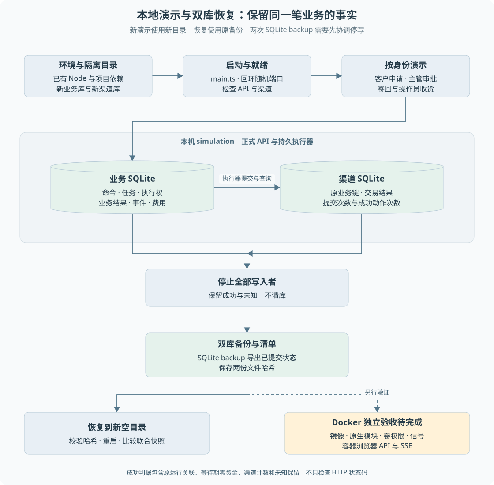

# 第 21 章 本地演示、双库备份与恢复

能够在开发服务器里点通页面，不等于换一个目录、重启进程或恢复备份后仍然正确。学习与面试演示需要明确环境、身份、数据位置和成功判据，否则一次操作可能误改原业务库，或者把历史结果误认成本次运行。

> **阅读前提**：先读[第 05 章](../02-后端必要基础/05-数据建模与SQLite持久化.md)、[第 16 章](../05-资金执行与恢复/16-跨进程恢复与人工核验.md)和[第 20 章](20-测试L1L2与Judge.md)。精确操作命令见[本地离线演示手册](../../runbooks/p11-local-offline-demo.md)。

## 实现思路

### 从能启动到可复现

最小启动方式是直接运行开发命令并使用默认 data/app.db。它适合已有开发环境，却不适合反复演示：上次已经退款的订单可能影响本次结果，清库又会破坏原数据。

本教材采用独立演示根目录，业务库与渠道库分别保存，启动显式 simulation，使用本机端口和演示令牌。每次新的演示建立新目录；同一次演示恢复则复用原目录与数据库，不能换库冒充恢复。

可复现流程分为五步：

1. **确认运行前提。** 使用项目已有依赖，核对 Node、pnpm 和原生 SQLite 模块，不默认重新安装或 build。
2. **隔离数据与身份。** 显式指定业务与渠道路径，使用固定演示客户与主管，避免读写默认业务库。
3. **从正式入口触发业务。** 使用客户 HTTP 创建会话，审批与收货同样走正式接口，不直接修改退款状态来制造成功。
4. **核对联合结果。** 检查客户进度、原运行事件与渠道提交次数，而不是仅看 HTTP 200。
5. **停止写入后备份与恢复。** 两库一起形成备份，恢复到新的空目录，再核对状态和未知占位是否保持。

图 21-1 区分新演示与同一次业务恢复。备份前需要协调停写；恢复目标必须是新目录，不能覆盖已有业务文件。容器实测位于独立分支，不由本机进程结果代替。

## 当前进程怎样装配

`main.ts` 先解析 `P6_BUSINESS_MODE`，再打开数据库。不是 simulation 的显式模式会被拒绝，避免真实模式请求先触发业务迁移或播种。

`DB_PATH` 相对路径锚定项目根目录，减少不同 cwd 写出不同业务库的问题。教材仍采用绝对独立路径，便于演示后定位证据。渠道库不能与业务库相同。

内嵌模拟器在当前 main 进程启动本机 HTTP 服务，使用独立渠道库。它与独立进程故障实验不是完全相同的拓扑，文档分别说明。运行时离线表示不调用真实模型或真实支付，不代表首次安装依赖或容器构建不需要网络。

服务同时提供存活与就绪概念。存活说明进程能够响应，`/api/ready` 还检查离线能力、渠道健康与必要数据。只看到进程打印端口，不足以认定整条链路可以演示。

## 初始化与重复启动

演示初始化需要区分空库、已有完整数据和部分数据。正常重启不应重新生成全部夹具，更不能清理执行权与账本来让页面恢复初始样子。

`initializeDemo` 的对应测试覆盖首次、重复、部分数据与失败回滚。本教材默认采用新目录，是为了让第一次业务结果可预期；如果用户选择恢复原演示，应保留它已经发生的退款和等待状态。

`db:reset` 是特殊重置操作，不是启动前置。`docker compose down -v` 会移除卷，也不能当作普通停止服务的方法。演示材料应告诉读者如何保留数据停止，而不是用清空状态掩盖幂等冲突。

## 为什么双库备份必须协调

业务库保存发送许可与结果确认，渠道库保存模拟交易。若业务库备份在发送之前，渠道库备份在发送之后，恢复后的组合可能缺少原发送依据。反过来，也可能出现本地成功而渠道备份没有交易。

因此现有脚本要求调用方先停写，再分别使用 SQLite backup API 导出两库。这个 API 能包含 WAL 中已提交内容，但**两次 backup 调用本身不自动构成跨库原子快照**，停写条件仍然必要。

备份清单保存两份文件的哈希，恢复时核对文件完整性。哈希可以发现意外变化，不等于证明备份来源可信或已经满足异地灾备要求。

恢复使用新的空目录，核对订单、运行、任务、原业务关联、退款、执行权、事件、模型费用及渠道状态。未知资金和未知费用也应该保留，不能只比较成功记录。

## 本机已验证与容器待验证

现有 P10 记录表明，本机正式 main 进程已经做过两类退款、退出重启与双库备份恢复；无 Git 的正式评测入口也通过来源清单修复。全仓 692/692 与 HTTP L1 124/124 是 2026-09-26 对应记录，不是本轮新增实测。

容器需要另外确认：镜像构建、Linux 原生 SQLite 加载、非 root 用户卷权限、Compose 健康依赖、容器重建、新卷恢复、SIGTERM 收尾与浏览器同源 API/SSE。

截至本轮可追溯记录，P10 容器运行验收未完成。本教材不因 P11 编写完成改变这个状态，也不把历史“Docker CLI 不可用”的描述当作本机当前安装状态实测。是否已安装 Docker 与 daemon 是否可用是不同事实。

## 无 Git 部署的来源身份

镜像不携带整个 .git，但离线评测仍需要知道它测的是哪份代码。P10 在构建时生成受控内容清单，运行时重新枚举并核验文件哈希。

清单缺失或不一致时，正式评测端点返回明确不可用，不能静默编一个 clean HEAD。部署来源的 head 和 dirty 可以为空，表示实际代码内容可以核验，但原 Git 提交身份无法由镜像内独立确认。

这使来源可追溯要求不依赖镜像安装 Git，也避免将宿主未提交状态随意伪装成已发布版本。内容清单仍不是签名供应链证明。

## 常见演示失败

| 现象 | 优先检查 | 不应采取的捷径 |
| --- | --- | --- |
| 创建会话返回不可用 | simulation 模式、就绪与渠道 | 填入真实密钥尝试解锁 |
| 端口无法绑定 | 是否被已有服务占用 | 杀掉不属于本次演示的进程 |
| 订单已处理或冲突 | 是否复用了旧演示库 | 删除幂等与许可记录 |
| 页面请求到错误端口 | API_BASE、代理与身份 | 只用静态页面代替接口验证 |
| 重启后未知仍存在 | 原渠道事实与费用记录 | 清零 unknown 来获得全绿 |
| 恢复哈希不匹配 | 两库与 manifest 是否来自同一备份 | 忽略错误继续覆盖现有库 |

## 从演示输出还原一次执行

演示脚本结束后，第一步不是再次启动，而是阅读本次 summary。ready 步骤指出本次监听地址和独立目录，后续步骤给出原运行与售后身份，backup-restore 指出原库、备份和恢复位置。它们组成同一次实验的关联，不能把另一轮临时目录里的数据库拿来解释当前摘要。

检查自动仅退款时，先定位客户原请求与受理身份，再看业务进度和渠道记录。检查退货后退款时，要额外确认批准、寄回和收货前没有资金提交。检查 unknown 时，成功判据是恢复后仍保留不确定性，而不是最后把所有状态变成 succeeded。脚本同时检查原完成事件次数，避免后台只做一次但对客户反复宣布完成。

输出中的渠道 charges 是模拟器计数，不是真实银行流水；process.log 是本机进程日志，不是容器运行日志。证据解释应跟随生成它的环境。即使文件名叫“acceptance”，仍要读取 scope、模式和实际步骤，不能由名称推导验收范围。

### 备份前如何判断真的停写

停止最初的 API 进程不一定意味着所有写入者都已停止，独立 Worker 或其他演示窗口也可能打开相同数据库。当前手册要求调用者确认写入者范围，再执行双库备份。自动脚本能够管理自己启动的进程，不能替用户保证未知外部进程不存在。

同一 SQLite 库的 backup API 能得到一致导出，但业务库与渠道库之间没有一个自动跨库事务。备份完成后保存两个哈希，可以发现文件损坏或混用；它不能倒推备份期间没有写入。因此停写条件、文件完整性和恢复后联合快照是三个不同检查点。

恢复到新空目录既保护原数据，也让前后比较有依据。若把备份覆盖到运行中的默认库，可能同时破坏现场和恢复目标；若启动时重新播种已有数据，又会掩盖恢复是否真的保留原事实。教材的普通启动和停止因此不包含清库命令。

### 手动观察与自动判据的关系

自动脚本适合重复核对联合断言，手动启动恢复后的 API 适合查看原运行与事件。两者使用同一份 summary 定位路径。网页观察还需要单独确定前端 API 地址及身份，不能看到页面能打开就认为业务链路完成。

对应[练习八](../09-练习与自测/渐进重建练习.md)，应先完成一次带成功与未知的备份恢复，再写出失败时查看哪个文件、保留哪份数据和如何停止本次进程。可复现材料的质量不只在“一条命令能跑”，也在失败后能否解释发生了什么。

## 源码参考与证据

| 入口 | 内容 |
| --- | --- |
| [main.ts](../../../apps/api/src/main.ts) | 模式、路径、渠道、就绪和停止顺序 |
| [initialize-demo.ts](../../../packages/persistence/src/initialize-demo.ts) | 演示初始化行为 |
| [p10-data.ts](../../../scripts/p10-data.ts) | 两库检查、备份和恢复限制 |
| [compose.yaml](../../../compose.yaml)、[Dockerfile](../../../infra/docker/Dockerfile) | 已交付配置，不等于容器实测通过 |
| [P10 实验](../../experiments/p10-offline-deployment.md)、[来源修复](../../handoffs/p10-source-manifest-fix.md) | 本机验证与容器待验收边界 |
| [部署手册](../../runbooks/offline-deployment.md) | 现有完整 Compose 操作与验收命令 |

本地隔离演示证明读者能够重复观察机制，容器验收证明指定部署环境能运行，生产可靠性则还需要真实认证、渠道、容量和运维实践。三个目标应逐层验证，不能互相替代。

---

本章学习衔接：[渐进重建练习八](../09-练习与自测/渐进重建练习.md) · [集中自测第 21 组](../09-练习与自测/集中自测.md) · [返回导学](../导学-有据售后.md)

业务对照：[B04-仅退款的完整业务实现](../03-业务逻辑详解/B04-仅退款的完整业务实现.md) · [B05-退货后退款的完整业务实现](../03-业务逻辑详解/B05-退货后退款的完整业务实现.md)。
