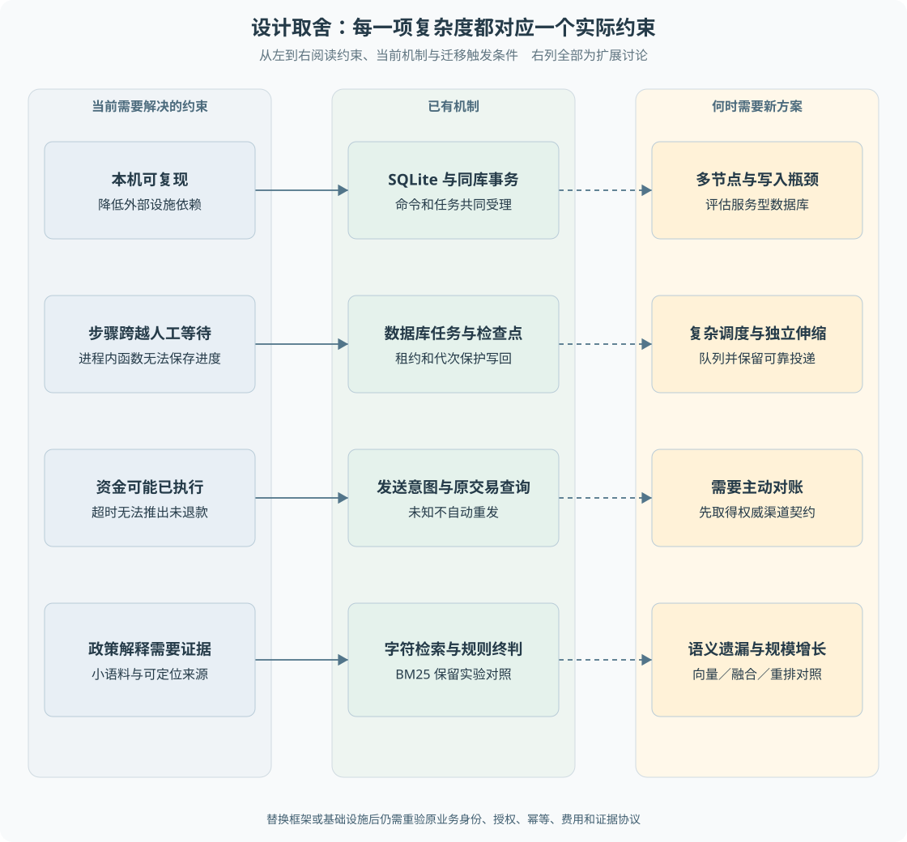

# 第 22 章 设计取舍、局限与迁移条件

项目采用 SQLite、模拟订单与渠道、可配置的模型传输、受控两类退款和有限调查。离线复现使用脚本模型，本机也可显式启用真实模型传输。这些选择是否合理，取决于需要解决的问题和已经承担的约束。**解释方案的价值，需要同时说明它为什么适合当前目标，以及什么变化会使它不再合适。**

> **阅读前提**：完成前面的主线章节，尤其是[第 14 章](../05-资金执行与恢复/14-退款幂等与结果未知.md)、[第 18 章](../06-交互与运行治理/18-模型预算与费用账本.md)和[第 20 章](20-测试L1L2与Judge.md)。

## 设计推导

### 最小闭环优先解决高风险边界

如果从零重建精简版，不必一开始实现全部工作台、多 Agent 和复杂检索。可以先实现查单、补问和一种退款，建立业务键、权限与结果确认，再增加审批、持久任务、恢复和评测。

这是教学推导，不是宣称项目真实历史恰好按这个顺序展开。它的判断标准是，每增加一个机制都对应具体缺口：

1. 自然语言不完整，引入模型查询与补问。
2. 模型不应决定金额，引入确定性领域方案。
3. 人工等待跨越请求生命周期，引入持久命令与任务。
4. 进程退出导致结果不明，引入检查点、发送意图和原交易查询。
5. 多调用与重试难以控制费用，引入统一预算账本。
6. 变更效果无法凭演示判断，引入固定数据、逐例证据和可比性规则。

这样的递进把复杂度花在可解释的问题上。若某个新增组件不能说明解决哪个缺口，就应该先停下来比较更小的方案。

图 22-1 以当前方案为中心，两侧对照它解决的约束和未来迁移条件。扩展路径是设计讨论，不是项目已经采用的架构。

## SQLite 与服务型数据库

SQLite 便于本机运行、独立测试与文件备份，也提供本项目需要的事务和唯一约束。它降低了学习演示对外部设施的依赖。

但多连接竞争测试不等于多节点部署验证。随着并发写入、运维隔离和共享存储需求增长，需要评估服务型数据库。迁移不能只导入 DDL，还要重测：

- 请求与业务唯一约束是否保持。
- 条件更新和受影响行数的语义是否一致。
- 命令、授权、执行权和检查点是否仍共同提交。
- 锁等待、隔离级别与失败重试是否引入新窗口。

仓储接口有助于替换，但持久业务映射依赖具体事务行为，不能承诺只换一个驱动就完成迁移。

## 数据库任务与消息队列

当前任务、业务和授权在同一库内受理，减少了“数据库提交成功但消息未发出”的跨系统交接。引入队列后，吞吐和调度能力可能更丰富，但必须重新处理数据库与消息之间的可靠投递。

队列不会自动解决资金幂等，至少一次投递也不能直接保证业务只发生一次。即使采用其他调度设施，业务键、发送意图、查询恢复和消费者授权仍然需要保留。

迁移触发条件可以是大量异构任务、独立伸缩、多节点运维或更复杂的调度策略。单纯因为面试题提到 Redis，不构成项目必须接入的理由。

## 原生循环与框架

当前原生循环便于直接观察消息协议、确认点与工具边界。代价是需要自行维护提供商适配、循环与恢复接口，不能忽略维护成本。

若团队需要更复杂图编排、生态组件或标准化运维，可以比较框架。比较重点应是取消、持久化、工具结果配对、预算接入和副作用协议能否保持，而不是泛化断言“框架一定隐藏关键能力”或“一周就能迁移”。

旧 ADR 和面试稿记录了早期判断，部分措辞过于绝对。新的教材保留约束分析，不沿用“其他框架不可能实现”“内部函数调用零开销”等无法严谨证明的表述。

## 检索升级与模型升级

当前小语料检索的可追溯性比组件数量更重要。BM25 有可测的部分改善，也有指标下降；向量、融合和重排是否值得加入，应先定位是词面匹配、证据容量还是生成忠实性问题。

更换模型也不只是换一个名称。相似 API 路径不保证工具协议、并行调用、参数流、停止原因、usage 和取消语义兼容。模型升级至少需要协议契约回归与同条件质量比较两类证据。

本机真实模型对话入口已可显式配置 Anthropic Messages 或 OpenAI 兼容 Chat 协议，仍只保留进程内 Key，业务支付继续模拟。连接测试与本地模拟提供商回归不等于多供应商生产验证；真实模型质量、价格和容器运行还需分别验收。

## 更主动恢复与资金保守性

当前未知资金不自动重发，保留了安全边界，也使某些实际上未发送的任务需要核验。更主动恢复需要更强的渠道契约：稳定幂等键、权威终态查询、明确在途语义和可审计对账。

如果外部动作没有幂等键，也无法查询结果，不能通过本地重试凭空获得相同保证。可考虑人工确认、业务补偿或改变操作协议，但每种方案都需要说明可能重复、漏执行或暂时不一致的代价。

“exactly-once”应限定对象和边界。本项目可以给出特定用例中渠道仅提交一次的证据，但不能据此声称跨任意网络、数据库与真实支付的全局恰好一次。

## 前端与部署的继续工作

客户事件投影和身份隔离已有明确代码与测试，移动端仍需按真实阅读与操作场景复核。某一次窄屏截图通过，不覆盖所有设备、输入法与长内容。

Docker 配置已交付但 P10 容器运行验收未完成。本机已有按身份的内存限流、请求超时和空闲会话收尾，也有会话到 OTLP JSON 的离线导出；它们证明治理边界可以落在现有事件表和 API 上，仍不等于生产认证、分布式限流、外部监控或容器运行通过。部署工作应按失败风险分层验证，不能为简历完整而将待验收内容写成已上线。

## 用一项迁移检查方案是否完整

以“改成消息队列调度”为例，简单画一个队列方框还不构成方案。先定义触发条件：是数据库轮询成本高、需要独立伸缩，还是任务类型变多？如果没有测量，先记录假设和计划，不直接声称现有 SQLite 已成为瓶颈。

随后检查新增边界。业务命令提交之后，消息可能没有发出；消息发出之后，消费者可能重复收到；消费者执行后，确认消息可能失败。因此候选设计需要可靠投递记录、稳定任务身份、幂等消费和原资金协议。队列提供交付语义，并不会知道这笔退款已经在渠道发生。

原来同库事务能够一起提交的命令、任务与授权，拆分后怎样保持关系是迁移的核心。如果采用事务发件箱等模式，应说明写入者、投递者、重复处理及清理条件，并设计退出窗口。这里属于替代方案讨论，当前项目没有实际实现消息队列与发件箱，不能把设计术语直接写入成果清单。

迁移验收也要包括反向结果：队列临时不可用时，已经受理的业务是否仍可解释；消息重复时，渠道是否增加提交；旧 Worker 迟到时，围栏是否仍有效；取消之后，未知费用和资金是否被错误释放。只有正常路径更快而这些条件退化，不足以称作有效升级。

### 什么情况下应先简化

如果只有一条固定退款表单，完全不需要动态语言理解，可以减少模型参与。如果政策语料很小且更新简单，可以保留可追溯的词面基线，而不立刻引入向量服务。如果任务只有两个明确独立步骤，固定有界并行可能比通用规划更易验证。

简化并不意味着删除身份、授权和证据。应减少的是没有对应问题的复杂度，而不是把业务安全约束合并成一句提示词。反过来，一旦真实约束变化，例如跨节点共享、长时间对账和多供应商费用，当前最小方案也需要重新评估，不能把“本地跑通”当成永恒选型依据。

### 如何组织最终技术讲述

选一条真实主线，先说输入不确定在哪里，再说哪些事实必须由代码保证，随后展示正常与故障分支，最后指出实验与未验证部分。不要从工具清单开始，也不要把每章术语全部压进一次回答。一个退款未知例子可以串联身份、事务、租约、渠道、事件和费用，但每层都应说清自己的保护对象。

[面经](../../interview/面经-有据售后.md)按这一方式组织回答；[渐进重建练习](../09-练习与自测/渐进重建练习.md)帮助把讲述变成小型实现。个人贡献核实后，才把其中真实承担的决策和改动转成简历，不能由“能够解释”反推“曾经独立完成”。

## 六个可讲清的工程支柱

项目可以围绕以下机制组织解释，它们是项目事实候选，不自动归属为本人独立贡献：

- **受控业务执行**：模型提出意图，领域核验方案，资金执行有独立许可。
- **持久恢复**：命令、租约、检查点和原动作关联支撑命名故障窗口恢复。
- **费用治理**：所有用途共享预算，逐尝试预占与未知保留。
- **证据检索**：内容快照、分块来源和独立资格判定。
- **全栈一致性**：事件持久化、客户白名单、游标与迟到请求隔离。
- **可追溯评测**：分层判定、版本化来源、失败分类与可比性约束。

每个支柱都应能举一个正常案例、一个边界条件和一项验证。没有真实用户量、线上事故或成本收益，不补造数字；个人职责另行核实。

## 源码与决策参考

| 材料 | 用途 |
| --- | --- |
| [ADR](../../adr/DECISIONS.md) | 原始选型背景，保留历史语境 |
| [组合根](../../../packages/runtime/src/compose.ts) | 当前实际装配 |
| [P10 交接](../../handoffs/p10-offline-deployment.md) | 本地部署与未完成容器验收 |
| [P8 修复交接](../../handoffs/p8-fixes.md) | 有限调查与运行记忆边界 |
| [P9 修复交接](../../handoffs/p9-fixes.md) | 离线质量机制与真实 Judge 未校准 |
| [P12 交接](../../handoffs/p12-observability-and-platform.md) | 导出、草稿回流、限流与空闲收尾的实现边界 |

读完主线后，重建练习应从小型可验证闭环开始，保持身份、状态、事务和证据关系。理解复杂机制为何必要，比原样复制整个仓库更接近能够独立设计系统的目标。

---

本章学习衔接：[渐进重建练习八](../09-练习与自测/渐进重建练习.md) · [集中自测第 22 组](../09-练习与自测/集中自测.md) · [返回导学](../导学-有据售后.md)

业务对照：[B08-补偿价保与换货](../03-业务逻辑详解/B08-补偿价保与换货.md)。
