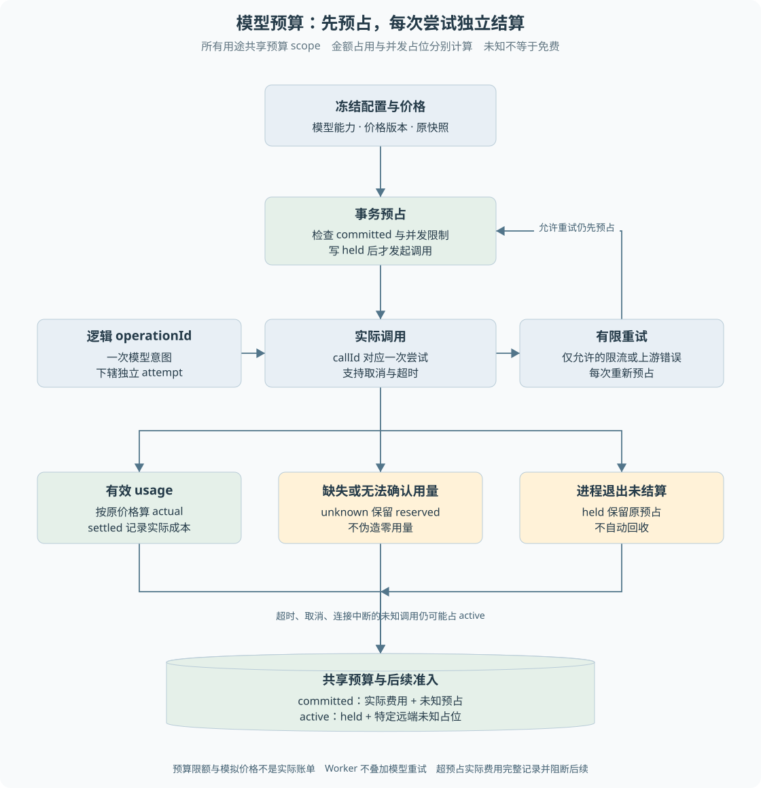

# 第 18 章 模型预算与费用账本

一个模型请求超时了，程序是否可以把费用记为零，再免费重试？供应商可能已经开始处理，只是本地没有拿到 usage。**调用失败、业务失败和未产生费用没有必然等价关系。**

> **阅读前提**：先读[第 06 章](06-事务唯一约束与条件更新.md)、[第 09 章](09-原生工具调用与Agent循环.md)和[第 15 章](15-Worker租约与检查点.md)，理解事务、逻辑调用与重试。

## 实现思路

### 从事后统计到调用前约束

最小方案在模型返回后累加 token 成本。它能生成报表，却不能防止同时发出的请求共同超过余额，也无法处理进程退出后没有结果的在途调用。

P7 把配置快照、预占、调用和结算组成统一协议：

1. **冻结配置和价格。** 提供商、模型、协议能力、知识与工具版本、价格、超时、尝试次数等形成可校验快照。恢复使用原快照，不悄悄换价格和模型。
2. **调用前事务预占。** 根据声明的上下文上限与输出上限计算保守费用，检查共享预算及并发占位，再写入 held 记录。
3. **每次供应商尝试单独记账。** 同一逻辑 operationId 下，每个 attempt 有自己的 callId 和预占，重试不覆盖先前失败的费用风险。
4. **有有效用量才结算实际值。** 使用版本化价格和整数换算计算费用；缺失 usage、超时或异常不能伪造零用量。
5. **未知继续占用额度。** unknown 与进程退出遗留 held 保留预占；可能仍在远端运行的未知调用还保留并发槽。
6. **限制重试入口。** 网关只对允许的错误作有限尝试，Worker 不再叠加一层同类模型重试，避免次数相乘。

预算因此是执行前的约束，不只是任务结束后的仪表盘。代价是未知调用可能占住额度，需要核验后才能安全处理，当前不自动回收。

图 18-1 区分共享预算、逻辑调用与逐尝试记录。金额是否仍占用与并发槽是否保留分别判断；不能为了让 active 归零而删除未知费用。

## 快照保存什么

P7 快照包含模型协议、能力声明、价格版本与来源、汇率有理数、输出上限、用途约束相关配置和版本哈希。它保存引用而不是读取或保存真实密钥。

`restoreP7Snapshot` 从内容重新计算哈希，拒绝只有版本号却内容不符的输入。这防止恢复时根据当前全局配置解释旧命令，导致原运行中途改变工具能力或费用口径。

能力声明包括工具调用、并行工具、参数流、结构化输出、取消和 usage 等。声明不是供应商实测的替代品，当前协议实验使用人工构造的线协议事件，不能证明真实服务行为完全一致。

正式网关目前只接受 simulation。配置里有 live 枚举不代表入口已开放；真实传输与价格核验仍需独立工作，P5 保持锁定。

## 预占怎样防止并发超额

预占使用模型声明的整个上下文 token 上限与允许输出上限，套用价格计算最大保守费用，不依赖聊天字符长度估计。

`reserve` 在同一个 immediate 事务内读取预算汇总、检查余额和有效并发，再保存调用记录。若先在内存中读余额、网络发送后才记账，两个进程都可能认为余额足够，这就是需要事务的原因。

当前预算 scope 由 mode 和固定 budgetRef 组成，所有 purpose 共用累计预算。主 Agent、子 Agent、模拟用户与 Judge 只是归因标签，不能各自获得另一份相同总额的预算。

实现中的限额为 100000000 人民币微元，即 100 元。这里是代码中的预算单位与限制，不表示本轮进行了真实付费调用，也不能将模拟价格当作供应商报价。

## 费用单位与结算

账本统一使用人民币微元，一元是一百万微元。价格包含输入、输出与固定调用成本，外币通过版本化有理数汇率转换，使用整数运算向上取整，避免小额费用被浮点与截断丢掉。

有效 usage 到达后计算 actual，调用从 held 转为 settled。如果实际费用超过预占，代码仍记录全部实际值并阻断后续调用，不能通过截断费用来制造没有超额的报表。

缺失 usage 时，ChatModel 边界会拒绝生成伪造的零用量完成事件，账本保存 unknown。**得到一段可读文本，也不等于计费证据完整。** 协议成功与费用可核验需要同时满足。

## held、unknown 与 active 的区别

| 字段或状态 | 含义 | 当前汇总方式 |
| --- | --- | --- |
| held | 调用已预占，尚未完成结算 | 计入 reserved，并保留 active |
| settled | 已得到可计算用量 | 计入 actual |
| unknown | 无法确认实际费用 | 继续计入 reserved |
| committed | 已承担的费用与风险总额 | settled 用 actual，其他用 reserved |
| active | 当前占用的并发额度 | held，加超时、取消、连接错误等未知占位 |

不是所有 unknown 都以相同方式计入 active。实现特别保留 TIMEOUT、CANCELLED、CONNECTION 的未知并发占位，因为远端可能仍在运行。429 或上游错误的未知费用仍保留，但并发统计依据对应规则处理。

所以 active 不等于本地当前有多少协程。Judge 已经被取消并完成本地收尾，账本仍可能 active=1；这不自动说明取消失败。验证应分别检查取消传播、迟到结果是否被拒绝以及费用是否保留。

## 谁负责重试

网关只对 RATE_LIMITED 与 UPSTREAM 等允许错误有限重试，每次尝试都先预占并记录。超时和连接中断可能意味着远端在途，当前不自动重试这些未知任务。

如果供应商 SDK、Agent 循环、Worker 和评测套件各自都重试三次，总调用数可能大于任何单层观察到的上限。项目因此把逐尝试控制收敛到 P7，持久会话遇到相应网关错误后停止，不再让 Worker 重新包一轮模型请求。

这并不阻止正常的多轮 Agent 循环。下一轮是新的逻辑行动，不是对上一供应商尝试的透明重试，应该具有明确的 operationId 归因。

## 正常与异常案例

正常调用先预占，模型返回完整协议和 usage，账本结算为 actual，释放相应在途占位。输出结果随后交给业务循环，预算账本不直接驱动退款。

异常调用超时后，本地取消等待并保留未知。迟到 usage 不能偷偷改写已经确定的未知账本；进程重启也不把 held 当成从未调用。重置业务夹具同样不能清空累计模型账本来绕过限额。

在 P10 历史恢复验收中，独立探针保留了一条 1234 微元未知预占和 active=1。恢复后运行正式离线 L1，新增模拟费用与原未知占位一起汇总。这个数字说明未知记录没有被清掉，不是实际供应商收费 1234 微元的凭证。

## 用两次并发调用推导预占

假设某个教学预算只剩下足够一笔最大调用的额度，A、B 几乎同时进入网关。若先发请求、响应后才加费用，两者都可能消费成功，系统只能事后发现超额。预占的意义就是在外部调用之前作出是否允许承担这笔风险的决定，而不只是预估最终报表。

事务内，A 读取累计承诺、检查额度并写入 held。B 随后读取时能看到 A 的占用，因此不能再次把同一份余额分配出去。这里使用的是共享 scope，换一个 purpose、子 Agent 或运行名称不能重置总账。并发槽同样在受控条件下核算，不是各个协程分别维护一个本地计数。

正常返回时，A 根据有效 usage 结算实际值。预占中多出来的保守差额不再计入承诺；实际值若超过声明上界，则完整记录并阻断后续，而不是压回上界假装预算从未被突破。预占限制依赖价格与能力声明可信，外部违反契约时也要留下真实风险。

### 重试的费用与逻辑身份

同一逻辑请求遇到允许重试的上游错误时，每次尝试都有自己的调用身份与预占。不能复用同一行覆盖第一次错误，否则报表只留下最后成功的一次，累计费用和风险被抹去。逻辑 operationId 用于把尝试串起来，callId 用于区分具体一次请求。

任务重新认领又是另一层身份。Worker 崩溃后恢复未确认轮次，可能产生新的模型尝试，但已经确认的轮次应复用。账本可以说明哪些调用曾进入预占，并不能仅凭它存在就恢复出完整对话结果。反过来，模型文本存在也不能自动推定 usage 完整。两类记录需要关联，却不能互相伪造。

### 为什么不按时间清空 unknown

等待很久只能降低“仍在运行”的主观可能性，不能证明实际费用为零。当前系统没有供应商对账，所以 held 与 unknown 保守保留。若自动设置十分钟过期释放额度，进程退出或断连就会变成绕过累计预算的方式：旧费用未确认，新调用又占用原余额。

未来对账应引入权威用量证据与受控更正记录，说明原调用身份、费用来源、处理者及变更原因，而不直接删除旧账。并发槽是否还占用与费用是否承担也可能需要不同结论，不能使用一条“任务已取消”同时解决两者。

这些推导中的余额和调用次数是教学场景，不新增项目实测结果。[练习七](渐进重建练习.md)可以使用很小的模拟预算复现两路竞争、缺 usage 和进程退出，检查的是占用与结算协议，而不是实际供应商价格。

## 源码参考与验证依据

| 入口 | 内容 |
| --- | --- |
| [p7-model-gateway.ts](../../packages/contracts/src/p7-model-gateway.ts) | 配置、能力、价格、用途与错误契约 |
| [p7-snapshot.ts](../../packages/runtime/src/p7-snapshot.ts) | 快照哈希、费用整数计算与保守预占 |
| [p7-ledger.ts](../../packages/persistence/src/p7-ledger.ts) | 事务预占、结算、汇总与占位保留 |
| [p7-gateway.ts](../../packages/runtime/src/p7-gateway.ts) | 调用、取消、迟到用量与有限重试 |
| [P7 模块实验](../experiments/p7-model-gateway-v1.md) | 人工协议事件、坏流与费用边界 |
| [入口收口记录](../experiments/p7-entry-closure.md) | 正式离线消费者与裸模型入口限制 |
| [P9 修复交接](../handoffs/p9-fixes.md) | Judge 本地收尾与未知并发占位的区别 |
| [P10 来源修复与恢复](../handoffs/p10-source-manifest-fix.md) | 恢复后原未知费用继续保留 |

当前策略保守、可追溯，但没有真实供应商对账和自动回收。未来若增加这些能力，必须根据权威用量证据更新账本，不能用“已经等了很久”推断调用免费。

---

本章学习衔接：[渐进重建练习七](渐进重建练习.md) · [集中自测第 18 组](集中自测.md) · [返回导学](导学-有据售后.md)
