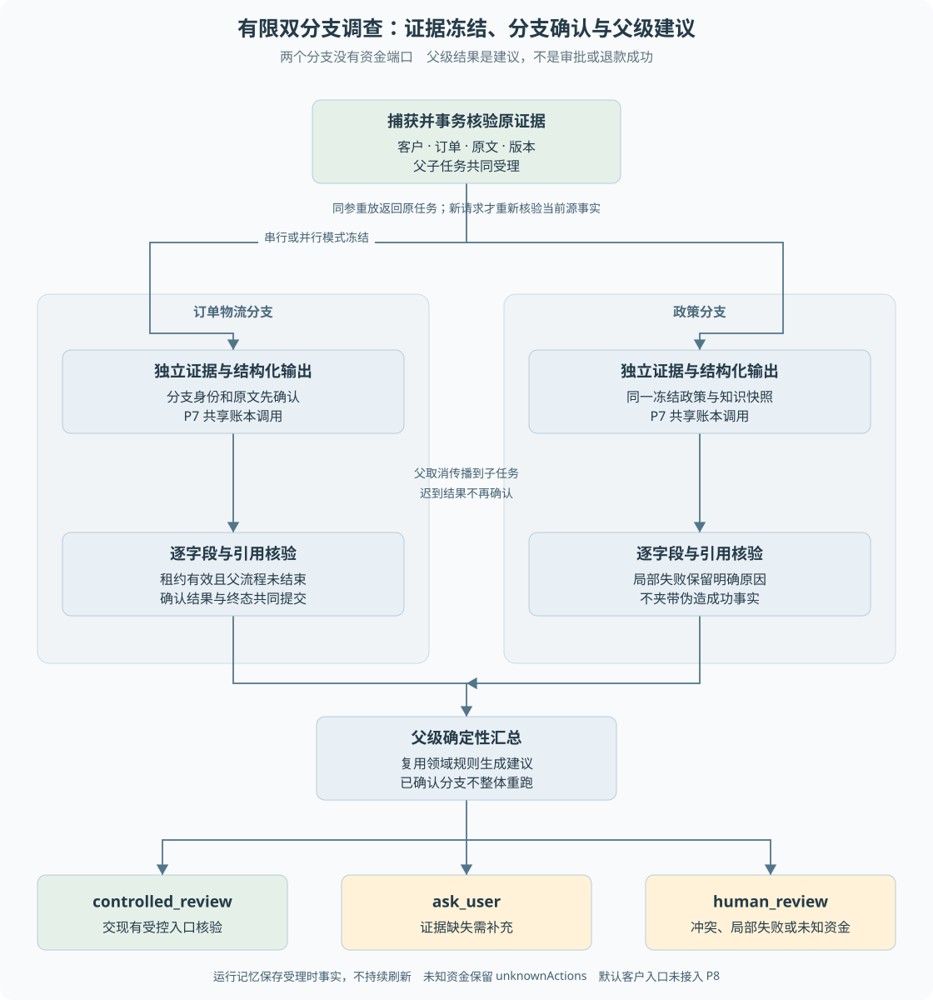

# 第 19 章 有限双分支调查与运行记忆

一笔物流争议需要核对订单物流，也需要阅读政策。这两类证据可以分别调查，再合并判断。问题是：拆成两个分支是否真的更好，部分失败时保留什么，调查建议是否会越过资金授权？

> **阅读前提**：先读[第 12 章](12-政策检索引用与确定性判定.md)、[第 15 章](15-Worker租约与检查点.md)和[第 18 章](18-模型预算与费用账本.md)。

## 实现思路

### 从串行调查到有限并行

最小方案先查订单物流，再查政策，最后汇总。只有两组调查确实可以独立开展、且汇总能够验证结果时，并行才可能缩短等待。不能因为模型可以扮演角色，就默认多 Agent 必然优于一个循环。

P8 使用固定的两个调查分支，而非开放式自动拆解任意 DAG：

1. **捕获原文与业务引用。** 按客户和订单读取事实，保存来源版本、知识快照、内容哈希及原业务关联。
2. **事务核验并受理父子任务。** 新请求重新核对当前源记录，父任务与两个子任务共同提交。配置和实验身份冻结，不能接受后再随意换证据。
3. **分支分别调查。** 订单物流分支与政策分支各使用自己的受控证据和结构化输出，复用 P6 租约及 P7 共享账本。
4. **核验结果再确认。** 模型字段与引用逐项对照原文，不能把自由生成的结论直接记成事实。分支确认检查自身资格及父流程是否仍允许接收。
5. **父流程确定性汇总。** 两侧完成或形成失败事实后，复用领域规则生成有限建议；已确认分支不因另一侧失败全部重跑。
6. **生成运行记忆。** 保存本次调查的证据、已确认事实、未决问题和未知业务动作，供检查与后续讨论，不形成跨客户长期记忆。

两个分支没有资金执行端口，建议也不修改审批、退款或业务状态。P8 是独立离线模块，**没有接入默认客户会话入口**。

图 19-1 对称展示两个分支，但它们只在取证阶段并行。汇总依赖已确认结果，取消、未知资金和证据冲突进入保守建议，而不是追加资金动作。

## 原始证据为什么先冻结

如果订单分支读取上午状态，政策分支读取下午版本，而报告只写一个“当前结果”，就难以解释结论由哪些事实产生。

`capture` 取得订单、物流和政策原文，构造带客户、订单、类型、版本和哈希的引用。`accept` 在同步事务中再次校验，避免捕获之后事实已变却仍当作同一条件受理。

但原请求的幂等重放要先返回原身份，不应因后来源事实变化而拒绝原请求。当前修复后的顺序是：验证基础身份和快照，查找原请求并比较冻结输入；同参重放返回原任务，只有新请求才重新校验当前源事实。

这区分了“重新读取当前世界”和“查询已接受请求的原结果”。把两者混在一起，会让本应幂等的网络重试在数据变化后突然失败。

## 父子任务与调用身份

父子都复用原 P6 任务表，不另建一套没有围栏的调度机制。分支表按父任务和角色唯一关联，每个分支有独立运行、命令和任务身份。

模型逻辑调用使用稳定的分支调用身份，网关 attempt 则仍由 P7 管理。父子共享同一数据库中的账本和预算 scope，不能每个子 Agent 各拿一份预算。

串行基线与并行模式都有子任务用于同等持久确认，但模型身份不同：串行使用父运行的 main_agent 归因，并行使用相应子运行的 sub_agent。两边原文和分工相同，才能比较调度方式，而不是同时改变任务难度和证据。

当前 `run` 是有界驱动接口，不是新建永久后台扫描器。遇到其他 Worker 持有租约或配额不足时，调用者需要读取原任务状态并按协议继续，不能认为方法返回就代表调查已经全部完成。

## 结果汇总与局部失败

分支结果需要带身份、状态、事实和引用。失败结果不能夹带已经被当作成功确认的事实；相同结果重复确认不产生第二条结果，冲突结果明确拒绝。

父流程依据有限状态形成建议：

- **ask_user**：证据缺失，需要补充信息。
- **human_review**：事实矛盾、分支失败或原业务存在未知，需要人工核验。
- **controlled_review**：可交现有受控领域入口进一步检查，不等于审批通过或退款成功。

一个正常案例是物流确认为丢件，政策也有对应条款，两边引用一致。异常案例是订单显示已签收而物流证据指向丢件；系统不能强行挑一边生成成功结论，应保留冲突。

部分失败不需要抹掉另一侧已确认事实。它们仍有价值，但调查完整性不能因此标成 true。父任务 completed 只说明建议流程结束，不保证调查得到了完整可执行答案。

## 运行记忆与未知业务

运行记忆是单次父运行内的确定性投影，包含客户与订单、原话、来源引用、分支事实、未决问题、等待原因和原业务动作。它不是用户画像，也没有向量检索或自动跨会话写回。

业务引用必须来自原业务表，并检查资金效果、执行权、任务及客户关联。真实 P6 未知退款可能同时表现为退款 executing、效果 unknown、许可 sending、任务 needs_confirmation。只检查退款表是否 succeeded，会遗漏这种未知风险。

P8 修复后将它保留在 unknownActions，建议为 human_review，调查完整性为 false。它不会再次调用资金渠道，也不因为客户自称主管而改变审批状态。

记忆保存受理时冻结的事实，**不持续同步后来发生的资金变化**。需要新鲜信息时，应设计新的可信读取与版本关系，而不是把旧快照称为实时记忆。

## 恢复中的费用空窗

已确认分支在重启后可以跳过。如果模型调用已经入账、分支结果却尚未确认，重新调用可能重复消耗费用并产生不同结果。当前模块保守转人工核验，不自动对账或回收 held、unknown。

取消由父流程同事务传播到子任务，Worker 心跳传递信号。父流程已经结束后，迟到分支不能再提交确认结果。这些机制复用 P6/P7，但仍需要 P8 自己的身份和证据验证，不能仅靠通用 Worker 保证调查正确。

## 串并行实验能证明什么

2026-09-26 的修复后对照包含四组相同证据的串并行运行。每个正常对照模式两次模拟调用、20 人民币微元，八次运行共 16 次调用、160 模拟微元。并发峰值从一变二，受控等待可以展示并行调度。

报告明确每次离线调用人为等待 50ms。由此观察到的本机时间差不能写成真实供应商延迟改善，也不能证明两个模型角色比一个角色更准确。`realProviderCost` 保留为 `not_measured`。

对照的价值是保持证据与政策条件相同，检查建议兼容、引用可核验、预算归因和局部失败行为。真实质量收益需要新的真实模型实验，当前 P5 未开启。

## 一次局部失败怎样形成有限建议

用物流争议说明父子协作：订单物流分支已经确认某个状态，政策分支却返回缺失引用的结构化结果。父流程不应只因为 JSON 能解析，就把政策分支当成完成；它需要核对字段与冻结原文，失败后保留失败事实。订单分支的有效结果仍有价值，但不能推导调查完整。

输入契约让这个判断可执行。每个分支知道自己服务哪个客户、订单和角色，消费哪些原文版本，输出哪些事实与引用。父流程知道两侧对应哪次调查，才可以确认是否能汇总。若只传递两段自然语言摘要，无法可靠判断引用冲突、缺失字段或结果属于另一位客户。

这里还需要区分“缺少证据”和“证据矛盾”。前者可能通过 ask_user 补充，后者往往需要 human_review。若原业务已经存在未知资金，即使两个调查分支都完整，也不能给出可直接执行退款的成功结论。unknownActions 必须从原业务、效果与执行权关联读取，不能只依赖模型是否主动提到风险。

### 父流程结束后的迟到结果

父任务取消或已经结束后，子任务可能仍在外部等待。仅通知子任务取消不够，确认时还需要检查父状态。否则父流程已经返回“调查未完成”，迟到分支却又把记忆改成完整成功，报告与持久状态就会互相矛盾。

取消后的处理不能清空已经确认的事实。它们属于这次调查的历史证据，可用于审查；但是否能用于下一次调查要重新判断输入版本和客户范围。当前运行记忆没有自动跨次更新，不能把旧结果当成最新业务快照。父子状态和结果确认共同表达的是本次工作，而不是无限期有效的知识。

### 串行基线为什么仍然需要相同证据

比较串行与并行时，若并行模式提前获得更多政策或额外订单字段，结果差异就不只是调度方式。P8 对照冻结输入与角色分工，串行和并行都保存子任务确认，使比较有共同基础。即便如此，人为等待和固定模拟输出仍只能验证机制，真实模型可能有不同 token、长尾和错误模式。

扩展到一般 DAG 时，还需要定义动态依赖、节点失效、部分结果复用和终止传播，不能把两路 Promise 并行直接推广成完整编排系统。具体推导见[编排扩展](扩展-编排协议与记忆.md)。在[练习七](渐进重建练习.md)完成费用归因后，再尝试双分支，比先让多个模型聊天更容易解释成本从哪里来。

## 源码参考与证据

| 入口 | 内容 |
| --- | --- |
| [p8-investigation.ts](../../packages/runtime/src/p8-investigation.ts) | capture、受理核验、分支执行与父汇总 |
| [P8 仓储](../../packages/persistence/src/p8-investigation-repository.ts) | 父子关联、重放、确认和运行记忆 |
| [p8-business-references.ts](../../packages/persistence/src/p8-business-references.ts) | 原资金事实与归属绑定 |
| [P8 契约](../../packages/contracts/src/p8-investigation.ts) | 结构化结果、证据和建议类型 |
| [修复实测](../experiments/p8-fixes.md)、[对照报告](../experiments/p8-fix-evidence/comparison/report.json) | 未知遗漏修复与受控串并行实验 |

当前模块展示了有限分支协作的持久化与证据约束。是否扩成更复杂任务图，应由依赖结构、失败恢复成本和质量实验决定，不应从“两条支路可以并行”直接推导企业级多 Agent 编排已经完成。

---

本章学习衔接：[渐进重建练习七](渐进重建练习.md) · [集中自测第 19 组](集中自测.md) · [返回导学](导学-有据售后.md)
