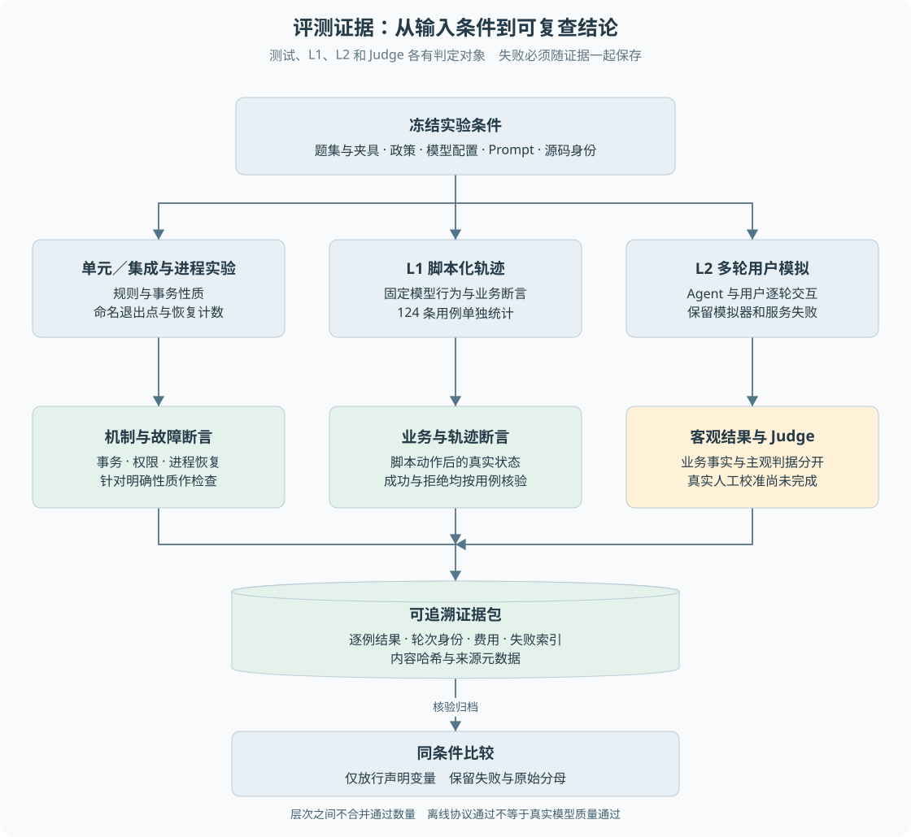

# 第 20 章 测试、L1、L2 与 Judge

“测试全部通过”和“客户任务成功率很高”不是同一个结论。一个系统可能严格阻止重复退款，却经常让模型误解客户；也可能回复自然，却在超时后重复执行资金。**质量证据必须说明测量对象、输入条件、成功定义和分母。**

> **阅读前提**：先读[第 09 章](09-原生工具调用与Agent循环.md)、[第 16 章](16-跨进程恢复与人工核验.md)和[第 18 章](18-模型预算与费用账本.md)。

## 实现思路

### 从几个成功演示到可追溯评测

最小验证是手动输入一条退款请求，看到结果正确。它有助于检查流程，但无法持续比较变更，也难以覆盖权限、协议、预算与崩溃窗口。

项目将证据分成不同层：

1. **单元与集成测试**检查规则、事务、协议、接口和前端状态等明确性质。
2. **进程实验**在指定边界退出，检查新进程如何依据持久记录恢复。
3. **L1 脚本化评测**用固定夹具和脚本模型驱动业务，检查系统治理与回归。
4. **L2 用户模拟**由模拟用户多轮交互，观察 Agent 是否完成任务；当前正式入口是显式离线模式，历史真实模型另有版本记录。
5. **Judge 主观判定**补充解释完整性等不能简单由数据库字段表达的标准，不能覆盖或篡改客观业务事实。

P9 在这些结果外增加来源元数据、逐例证据包、失败分类与可比性检查。报告中的每个 case 与 repeat 都能定位到具体输入、业务结果、模型调用和费用，而不只有一张汇总表。

图 20-1 从受控输入到不同判定，再到证据包与比较。模拟器和 Judge 也是可能失败的参与者；不能把它们的失败全部解释成 Agent 的业务能力不足。

## L1 证明什么

L1 使用脚本化模型，使行为轨迹可控。它适合验证：某工具输出后能否正确推进、越权请求是否被拒绝、审批和幂等是否成立、异常是否形成预期状态。

数据库终态断言检查退款、审批等事实；轨迹断言检查必需或禁止的动作；渠道计数检查是否重复产生副作用。固定时钟与独立夹具有助于保持条件一致。

当前正式 L1 数据集为 124 个用例。历史记录中 124/124 表示这些固定用例通过，不代表模型对任意客户请求都能正确处理。脚本已经告诉系统模型将发出哪些动作，主要检验的是动作被宿主如何执行和治理。

也不能把全仓 692 项测试与 L1 124 条相加成“816 条智能问答准确率”。两者检查对象和分母不同，定向测试通常又包含在全仓运行中。

## L2 的多轮不确定性

L2 模拟客户与 Agent 交互，允许模型决定下一步。失败可能来自 Agent 选错动作，也可能来自模拟用户没有按场景提供信息、供应商故障或裁判误判。

因此需要保存原始对话与工具轨迹，不能只根据最终一句答复判定。项目有历史真实模型实验，但数据集规模、Prompt 和环境不完全相同，不能把不同比较条件下的百分比直接写成单一改动的收益。

当前离线 L2 可以检验角色协议、预算归因和判定机制，不提供当前真实模型能力成绩。P5 未开启，真实质量与真实 Judge 校准没有因为离线通过而自动完成。

## 业务成功与综合通过

客观业务断言通过而 Judge 失败时，系统应保留“业务做对、主观判据未通过”的区别。综合端到端通过可以更严格，但业务成功率不能被悄悄改成同一个分子。

P9 将失败分为业务断言、模型协议、服务异常、超时取消、预算阻断、证据缺失和 Judge 失败。一条用例可以同时有多种失败，分类计数不能相加后当作独立用例总数。

报告还区分可评分样本与整体输入分母。遇到协议失败或证据缺失，不能简单删除后再声称“成功率提高”。若展示排除环境故障的条件口径，必须同时保留原始总体口径和排除理由。

## 稳定性指标不能混用

一次尝试的成功率说明一次运行的结果。多轮测试还可以关心“至少一次成功”与“每次都成功”。它们回答不同问题：

- **Pass@k**侧重多次机会中是否至少成功一次。
- **Pass^k**在本项目语境下强调重复尝试连续全过的稳定性。

即使 Pass@3 很高，也可能每次结果波动，不能据此承诺客户只尝试一次就可靠完成。具体公式、样本聚合与报告实现需要一致，不能只根据符号名称猜测。

项目报告使用 Wilson 区间表达部分成功率的不确定性，但置信区间并不会自动证明样本独立、代表真实用户分布或模型随机过程稳定。小型构造数据集的统计外推仍然有限。

还需检查空样本。`metrics.ts` 中部分兼容比例在分母为零时返回 1，另由 `metricDenominators` 显式提供实际分母；Wilson 的零样本区间为 `[0, 1]`。所以报表或口述不能只读取数值字段，将“没有观察”解释为“100% 可靠”。应同时展示分母，零样本标为无证据。Pass@k 在这里用于概念对照，项目明确提供的是按同一用例跨轮全部通过的 `computePassPowerK`，不能把它当作另一种指标的已实现估计器。

## Judge 如何避免形式上的假通过

Judge 接收判据和对话，返回结构化结论。它的输出本身也要校验：JSON 必须完整，判据不能缺失、重复或出现未知项目，结果必须是真正的布尔值，并需要完整完成标记。

超时之后，支持取消的调用要传播 AbortSignal 并等待网关与观察器收尾，避免报告导出后调用记录还在变化。迟到结果不能重新改变判定。未知费用继续保留，不为了验证取消成功强行把 active 清零。

这些机制证明裁判协议有约束，**不证明裁判判断与人类一致**。校准需要真实标注样本、证据哈希、判据版本和标注者身份。当前准备中的合成标签只测试统计函数，真实校准总数为零时 agreement 应为 null，而不是 100%。

## 证据包为什么要保存来源

公平比较要求条件可解释。P9 元数据保存数据集、夹具、政策、模型配置、Prompt、源码内容清单及实验变量。每个用例还有重复轮次身份与证据哈希。

`verifyQualityBundle` 不只确认文件存在，还核对内容、引用身份与失败索引。清空 failures.json 不能让失败报告看起来全绿；修改某条结果后，相关哈希和汇总必须一致，否则拒绝。

比较只允许显式声明 model、prompt、fault 等变量。没有声明却改变模型或故障设置时，不输出貌似精确的改进差值。声明一个变量也不能顺便夹带超时等其他配置变化。

P10 对无 Git 部署增加内容清单，允许核验镜像实际源码；其中 head 与 dirty 为 null 时必须保留这个事实，不能伪造原提交号。内容一致性也不等于签名与外部供应链信任。

## 一组故障对照怎样解读

2026-09-26 P9 修复后的离线记录中，正常两轮各运行同一 124 条 L1，用例观察总计 248/248；受控第二轮协议故障时总计 124/248，按预期失败。

这里没有获得 248 个独立新问题，而是 124 个问题各重复两次。正常与故障是两个实验，不能合并为一个“496 条”的成功率。故障实验费用降低也不是同质量省钱，因为第二轮没有完成相同工作，还留下未知费用。

这个对照证明报告能够保留故障并拒绝错误比较，属于离线评测机制验证。它不证明真实模型准确率，也不应作为生产故障率。

## 怎样设计一条不会被文案骗过的用例

以未知资金为例，如果预期只写“回答请稍后”，模型生成相同文字就可能通过，但后台也许已经重复提交。更可靠的用例应同时声明业务输入、初始状态、故障方式和允许结果：原退款身份保留、渠道没有新增发送、任务进入待核验、客户得到合适进度。自然语言表达是其中一层，不能覆盖资金断言。

对于正常退款，也不必强制所有工具调用顺序完全相同。若任务允许两种等价取证顺序，最终授权和金额一致且没有禁用动作，就应明确是否接受。轨迹检查应围绕必要与禁止行为设计；只有协议或业务依赖确实要求顺序时，才把顺序写成强断言。

一条样本的记录最好能够回答四件事：给了什么，执行了什么，最终事实是什么，为什么判通过或失败。模型响应、工具事件、数据库状态和 Judge 输出分别支持不同答案。只保存汇总比例会让失败无法复查；只保存长日志没有稳定样本身份，也很难对应题集和重复轮次。

### 失败分类如何影响后续动作

假设某轮因为协议缺少 usage 被拒绝，它与模型误判退款资格不同。前者应先核对提供商适配和费用协议，后者应检查模型输入、工具结果或规则。如果将它们都归成“Prompt 不够好”，反复改提示可能无法改善，还会引入新的混杂变量。

类似地，模拟用户没有按场景补充订单号，可能导致 Agent 合理等待却没有最终完成。报告需要保留对话并区分模拟器行为，不应仅根据超时把系统判成业务逻辑错误。Judge 与人工意见不一致时，也要定位到具体判据及证据，而不是只给一个总分让读者猜。

对比实验因此要在运行前写清允许变化的变量，保存基线和候选的逐例结果，成功与失败都归档。若同时换模型、Prompt、超时和题集，即使结果更好也难以归因。P9 的比较约束保护的是这一解释前提，不是替实验者自动判断样本是否代表真实用户。

[练习七](渐进重建练习.md)要求故意制造业务成功但 Judge 失败、零样本类别和失败索引被篡改三种情况。它们分别检查指标分离、证据不足的展示和归档完整性，不需要调用真实模型，也不应算成真实校准样本。

## 源码参考与证据

| 入口 | 内容 |
| --- | --- |
| [cases.ts](../../packages/eval/src/cases.ts)、[metrics.ts](../../packages/eval/src/metrics.ts) | 数据集与指标聚合 |
| [judge.ts](../../packages/eval/src/judge.ts) | 主观判定输出校验和取消 |
| [p9-calibration.ts](../../packages/eval/src/p9-calibration.ts) | 合成与人工标注的状态区分 |
| [p9-metadata.ts](../../packages/eval/src/p9-metadata.ts) | 条件与源码身份 |
| [p9-report.ts](../../packages/eval/src/p9-report.ts)、[p9-cli.ts](../../packages/eval/src/p9-cli.ts) | 归档校验、失败分类和比较 |
| [P9 修复实测](../experiments/p9-fixes.md)、[归档摘要](../experiments/p9-validation-summary.md) | 最终离线结果与证据保存范围 |

评测的目标是让错误可以归因和复查，而不是让表格看起来漂亮。新增能力时应先定义成功证据与失败分类，再考虑增加模型或调整 Prompt。

---

本章学习衔接：[渐进重建练习七](渐进重建练习.md) · [集中自测第 20 组](集中自测.md) · [返回导学](导学-有据售后.md)
