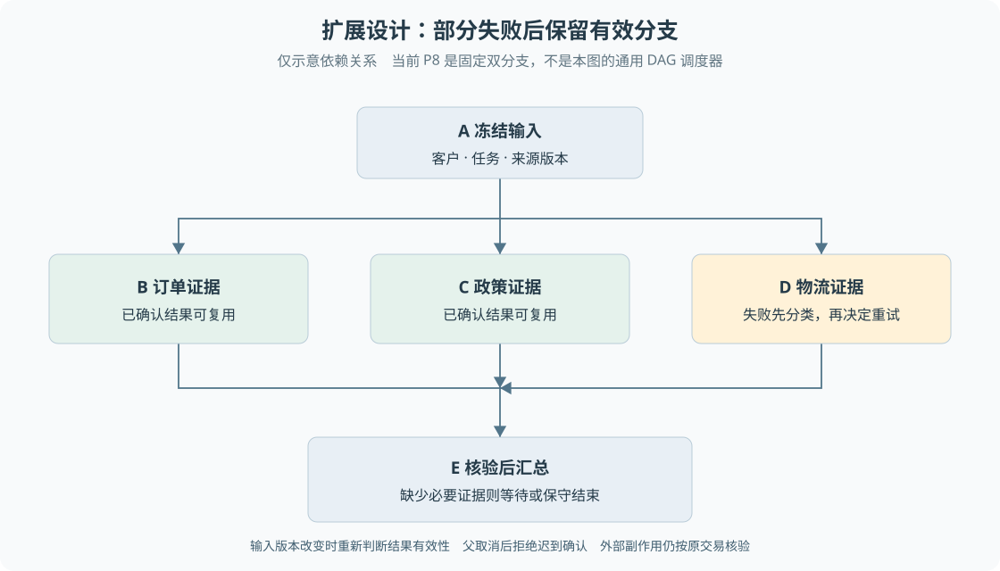

# 扩展：编排、协议与记忆

本专题承接[第 19 章](19-有限双分支调查与运行记忆.md)和[第 22 章](22-设计取舍局限与迁移条件.md)。它回答面试中超出当前实现的问题。**LangGraph、MCP、业务 Skill 运行器、任意 DAG 和跨会话长期记忆都不是本项目已实现能力。** 以下结合已有约束推导候选设计，官方概念于 2026-09-27 至 28 日查阅。

## 从固定流程到图编排

Pipeline 是预先确定阶段的流水线，例如解析、检索、生成、核验；阶段内部可以用模型，但下一阶段不必由模型自由选择。行动与观察交替的循环适合下一步依赖查询结果的任务。Plan-Execute 先形成计划，再按依赖执行，适合相对稳定且能核验子任务完成情况的问题。计划不是天然正确的，事实变化后仍要重新判断有效性。

售后退款同时含有不同性质的工作。查询顺序可能变化，金额和权限规则却应确定；人工审批又会跨越长时间。不能为了归类，把全部过程都塞进一种模式。当前系统选择原生会话循环与持久业务执行配合，P8 只增加固定的订单物流、政策两分支。

### 如果引入 LangGraph

先区分 LangChain 与 LangGraph 的层次。当前官方把 LangChain Agent 定位为可配置的模型循环与工具运行封装，并提供模型接口和中间件；LangGraph 更侧重底层状态与编排，LangChain Agent 本身也建立在 LangGraph 之上。它们不是“简单任务与复杂任务”之间绝对互斥的两套选择，应按需要控制哪一层来判断。[LangChain 官方概览](https://docs.langchain.com/oss/javascript/langchain/overview)

LangGraph 用共享状态、节点和边表示流程；节点可运行模型，也可执行普通代码。节点返回状态更新，字段的 reducer 决定更新如何与旧值合并，未显式指定的普通字段通常按覆盖处理。这里的 reducer 是状态合并规则，不自动等于去重、事务或授权机制。[官方 Graph API](https://docs.langchain.com/oss/javascript/langgraph/graph-api)

以售后调查为例，可以设计以下状态。这是迁移提案，不是仓库里的框架 Schema。

| 状态内容 | 作用 | 合并或更新要求 |
| --- | --- | --- |
| 客户、订单和运行身份 | 确定任务归属 | 创建后固定，节点不得改成另一个客户 |
| 原文引用与版本 | 让分支解释同一组事实 | 按稳定引用身份去重，冲突不覆盖 |
| 分支结果与确认状态 | 支撑汇总和局部恢复 | 按分支身份写入，重复相同结果可接受，冲突显式拒绝 |
| 未决问题 | 表达缺少什么 | 来源可定位，解决后有明确变化记录 |
| 业务状态引用 | 指向当前授权与资金事实 | 不让模型副本代替业务库 |
| 费用调用引用 | 关联共享账本 | 保留原尝试，不能合并成一次免费调用 |

状态中不应直接塞密钥、全库内容和无限历史。若两个分支都把事实追加到数组，简单 concat 可能在重放后产生重复；可以按“来源身份＋版本”合并，并对同键不同内容报冲突。这个合并规则属于应用设计，框架不会知道哪条物流证据应被信任。

checkpointer 保存单个任务线程的图状态，store 则用于线程之外的数据。内存 checkpointer 随进程退出丢失，跨进程恢复要配置持久存储。框架的持久状态和当前项目的任务检查点有可比较职责，但不是可直接一一替换的表结构。[官方持久化说明](https://docs.langchain.com/oss/javascript/langgraph/persistence)

迁移需要回答：节点确认和业务受理能否共享事务？恢复会不会重做未确认的外部动作？中断后恢复是否仍使用原配置和原授权？流式输出是否暴露内部状态？框架默认流式行为不能自动代替当前客户事件白名单。外部付款完成、本地确认未保存的空窗依然需要业务幂等和渠道查询。

## DAG 部分失败的具体推导

DAG 是有向无环图，用依赖表示哪些步骤必须先完成。考虑 A 完成后并行执行 B、C、D，E 需要三者结果：

图扩-1 是五个节点的依赖示例，箭头只表示前置依赖，不表达当前项目已实现三分支调度。图中的 D 没有成功时，E 是否允许执行应由业务契约决定。

最小实现需要一张节点状态表、一组依赖和一个汇总条件。若只用 `Promise.all`，虽然能并行等待，却没有保存谁已确认，也无法在进程退出后恢复。增加持久状态后，每个节点保存输入版本、尝试身份、结果引用与完成状态；调度只领取依赖已满足的节点，写回也验证执行代次。

假设 B、C 已确认而 D 超时，按下面顺序处理：

1. 保留 B、C 的确认结果，判断其输入版本是否仍有效。
2. 判断 D 是安全只读失败、协议错误还是外部副作用未知，再选择重试、停止或核验。
3. 如果 E 要求全部证据，继续等待或失败；若允许部分答案，显式传递 D 缺失，禁止输出依赖 D 的业务承诺。
4. 父任务取消后传播到未完成节点，并拒绝迟到的结果确认。已经发生的外部动作仍需独立核验。
5. 输入 A 改变时重新计算失效范围，不能盲目复用旧 B、C。

当前 P8 可以用于理解父子身份、租约与确认，但没有任意图依赖调度器。它的分支费用已记录而结果未确认时会保守转人工，不能声称已有任意失败自动重试。重建练习应先实现固定依赖并注入一个退出点，再考虑动态规划。

## Function Calling、MCP 与 API 的分层

普通 API 定义服务能够接受的操作。Function Calling 让模型返回结构化工具意图，宿主仍负责执行。MCP 则定义应用和能力提供方之间的交互协议：Host 管理客户端，Client 与 Server 交互，Server 提供工具、资源或提示模板。模型本身不是直接连接所有服务器的执行者。[MCP 官方架构](https://modelcontextprotocol.io/docs/2026-07-28/learn/architecture)

一个候选只读政策工具的调用链可以是：模型选择检索工具 → 宿主校验当前客户和工具范围 → MCP Client 发起调用 → Server 再次验证身份与数据范围 → 返回版本化片段 → 宿主检查结果并回填原工具调用。此链路是接入设计，项目目前仍使用本地工具和服务。

“标准化接入”不能推出“自动安全”。工具描述、返回文字和外部文档都可能含有不可信指令；服务端必须约束可访问资源，宿主不能让模型传入的客户号替换真实会话身份。第一阶段适合只读能力，输入包含查询与允许范围，输出包含内容、出处、版本和明确错误，不提供任意 SQL 或直接资金写接口。

MCP 协议会演进，本专题只使用上面已查阅版本的角色和职责，不把旧版握手流程当作永恒接口。实际接入前应按选定 SDK 与协议版本验证发现、调用、取消、身份传递和错误映射，不把能列出工具当成端到端集成通过。

## Skill 组织过程，宿主控制权限

Agent Skills 以包含 `SKILL.md` 的目录组织元数据和说明，可以附脚本、参考资料及资源。渐进加载通常先提供名称和描述，匹配任务后再读取完整说明，需要时加载附属材料。[Agent Skills 官方概览](https://agentskills.io/what-are-skills)

若为售后调查设计一个 Skill，最小契约应包含：何时触发、必须给出的客户与订单身份、允许的只读工具、调查步骤、输出证据格式、失败如何结束及验收标准。一个“先查物流，再查政策，冲突时列出未决问题”的说明可以复用工作方法；但禁止付款必须同时体现为宿主没有授予付款工具，不能只写在文本中。

Skill 可以调用由 MCP 暴露的检索能力，也可以调用本地工具。前者组织过程，后者提供能力接入，鉴权仍在可信运行时与服务端。相同 Skill 在不同宿主上的行为取决于加载和执行机制，不能仅凭文件存在推断整个应用支持插件化业务运行。

## 从运行记忆到长期记忆

当前 P8 保存一次父运行的事实、引用、未决问题和未知业务动作，不自动跨运行累积客户画像。若确实需要记住“客户偏好短信通知”，应先判断该内容是否适合保存、来自谁、作用到哪个客户、何时失效，以及客户如何更正。一次模型猜测不是可信偏好。

候选记录可以包含主体、事实类型、值、证据引用、来源角色、确认时间、有效期和版本。读取必须在客户范围内，冲突写入按版本比较，不能简单让最后一次模型输出覆盖旧事实。过期和删除也要传播到摘要、索引及缓存，而非只删主表。

相对稳定的偏好可以长期保存；订单是否已退款是变化中的业务事实，应从权威记录核验。即使把它写入摘要，也应带时间和原记录引用，使用前检查新鲜度。跨客户隔离测试、冲突更新测试和遗忘测试比“向量库能搜到历史聊天”更能说明长期记忆设计是否成立。

## 讨论完成的判据

能够画出框架节点怎样读写状态、指出外部副作用空窗、解释 D 失败为何不重做 B/C，并说清 MCP 与 Skill 谁负责什么，才算理解这些扩展。它们可以进入面试的方案讨论，但项目事实仍以[证据索引](核心结论与证据索引.md)为准。
