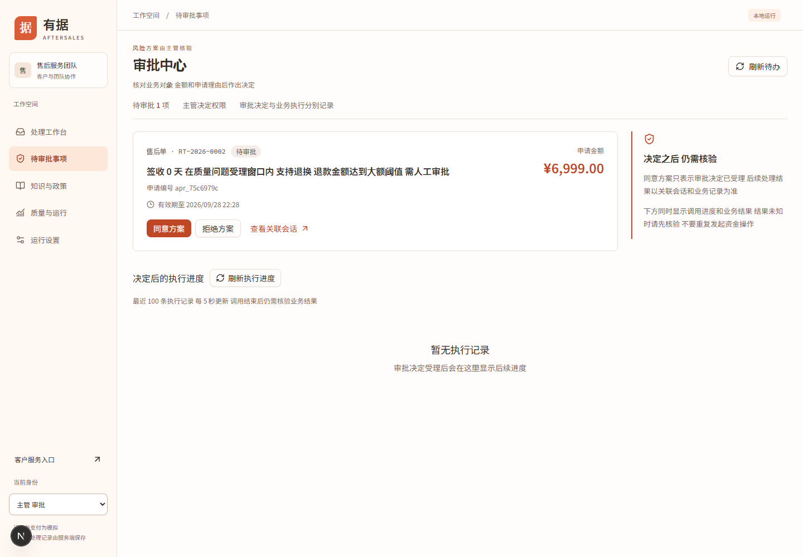
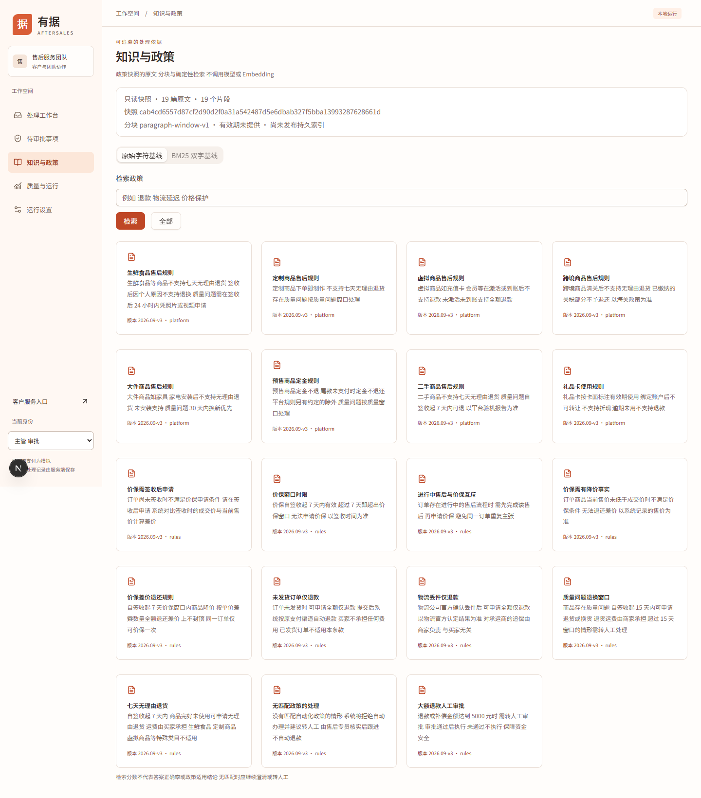
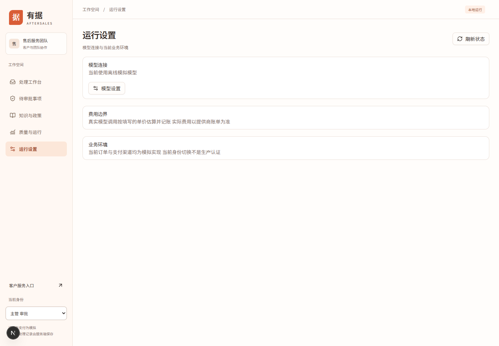

# 主管与管理员操作手册

本项目的主管角色是 `supervisor`，没有独立 admin 角色。账号和权限不是可编辑后台功能；当前通过演示令牌识别客户、专员和主管。主机启动、备份和文件权限由开发运维人员负责。

## 审批与执行核验

选择左下角“主管 审批”，进入 `/approvals`。专员能查看审批，但不能作审批决定。

1. 找到待处理申请，核对业务类型、客户、关联会话、金额和申请原因。
2. 信息不足时先查看关联会话和政策，不因为模型建议而直接批准。
3. 决定同意或拒绝后，观察“决定后的执行进度”。审批受理和业务完成是两个阶段，不能只看按钮消失。
4. 退货申请批准后可能仍需客户寄回、仓库收货；结果未知或执行失败时保留原审批号和运行号，交给维护人员排查。

图 1：2026-09-28，独立演示中的 6999 元质量退货申请。

该页最近执行记录定时更新，可用“刷新执行进度”重新核验。加载失败时，旧数据显示的成功不能当作当前核验结果。多人处理同一申请产生冲突时，刷新确认已有决定，不反复提交相反决定。当前大额退款阈值是退款金额达到 500000 分；它不是页面可调整的设置项。

操作示例见[审批案例](examples.md)。

## 查询知识与政策

进入 `/policies`，页面展示政策快照、原文和片段。先输入 `退款 质量 审批`，点击“检索”，查看结果及原文；使用“全部”清空查询。

图 2：2026-09-28，本次独立环境的只读政策库。

可切换“原始字符基线”和“BM25 双字基线”。BM25 是按词项及文档长度计算相关性的一类检索方法，本项目使用双字切分；两种方案都不调用模型或 Embedding。分数只说明该方案内的相关性，不表示政策适用概率，也不能跨方案直接比较数值大小。

打开结果后核对原文、来源、版本、片段边界与业务条件。界面明确提示只读快照、有效期未提供、尚未发布持久索引。没有新增、删除、上传或发布政策操作。正式改政策需作为开发变更处理，并重新执行[检索评测](../devops/evaluation.md)。

## 模型连接设置

在本机浏览器通过 `127.0.0.1` 或 localhost 打开 `/settings`，选择主管。专员只能看运行状态，配置需要额外的本机模型管理口令；局域网地址不开放付费模型配置。

图 3：2026-09-28，未启用真实模型时的设置页。截图未填写密钥，也未调用供应商。

1. 从本次 API 启动终端取得管理口令；已配置 `MODEL_LOCAL_TOKEN` 时使用相应值，不将其写入手册或截图。
2. 打开模型设置，按供应商接口选择 Anthropic Messages 或 OpenAI 兼容 Chat Completions。
3. 填写 Base URL、模型 ID、API Key、输入和输出每百万 token 的人民币价格。协议、路径和模型 ID 必须与所用服务匹配；公网地址要求 HTTPS。
4. 点击“测试连接”。该操作会产生一次真实模型调用，最多 32 输出 token，可能计费。
5. 测试通过后“保存并启用”，切换客户并**新建会话**。历史会话冻结原配置，不随设置自动改变。
6. 不再使用时停用真实模型。已有真实模型会话缺少凭据后会明确失败，不自动切换成离线回复。

累计预算上限按估算为 100 元，真实模型并发限制为 1；填写价格未经系统向供应商核验，实际账单可能与估算不同。API Key 不写数据库或浏览器存储；重启 API 后页面填写的 Key 失效，需重新配置或由进程环境提供，再测试启用。

连接测试成功只验证文本和用量返回，不保证所有工具调用正确。订单与资金仍为模拟。**此设置不会解锁网页 L2，也不会把 `pnpm eval:sim` 切为真实模型评测。** 协议、连接测试和凭据生命周期按本章步骤核对；供应商特有兼容问题交给维护人员依据实际错误排查。

## 质量检查与日常管理

主管和专员都可在 `/eval` 运行 L1。按[评测操作手册](../devops/evaluation.md)核对模型标识、样本数、失败明细和门禁，不仅看绿色百分比。网页旧摘要含固定样本数，实际报告才是本次运行依据。

日常核查依次看服务状态、待审批、决定后执行、未知结果和失败报告。当前没有统一日志下载、账号管理、预算编辑或政策发布页面；这些不能写成管理员点击按钮即可完成的操作。

| 异常               | 处理                                                                      |
| ------------------ | ------------------------------------------------------------------------- |
| 审批按钮不可用     | 核对主管身份和申请是否仍待处理                                            |
| 模型设置 403       | 核对本机地址、主管身份及管理口令                                          |
| 模型设置 404       | 可能是 API 仍运行旧代码；按原环境停止并重启 API，前端热更新不能更新旧 API |
| 测试连接失败       | 核对协议、Base URL、模型 ID、密钥与返回错误，勿重复无目的付费测试         |
| 审批同意后仍未退款 | 核对等待寄回、收货或未知状态，审批不等于到账                              |
| 政策查不到或不适用 | 更换明确关键词并读原文，无法确定时人工核验，不强行套用命中条款            |
