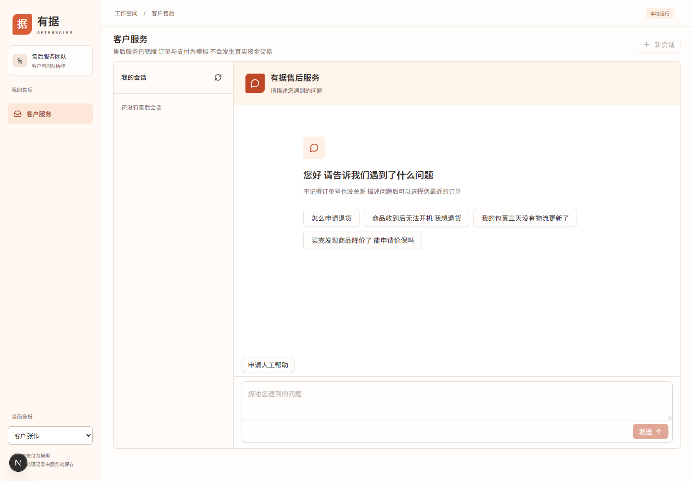
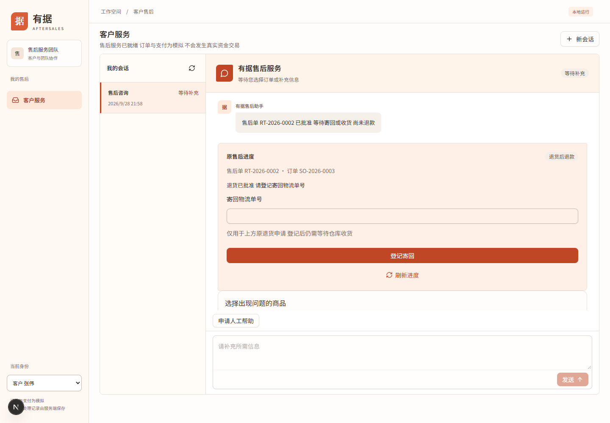
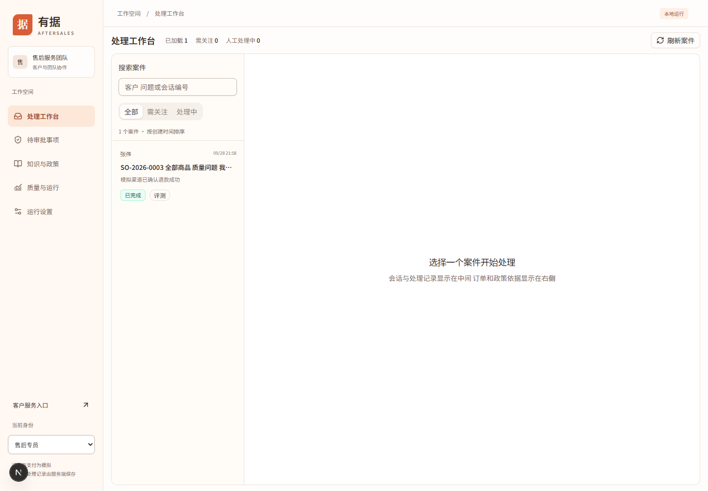

# 业务操作手册

适用客户与售后专员。先由开发人员启动系统，使用终端打印的地址；以下路径均相对此地址。演示客户张伟对应 C1001，李娜对应 C1002。身份切换会刷新数据权限，操作前先核对左下角身份。

## 客户发起咨询与售后

### 新会话与订单选择

1. 选择“客户 张伟”，进入 `/workbench` 的“客户服务”。确认页面显示服务已就绪。
2. 输入具体诉求。例如 `SO-2026-0001 未发货 我要退款`；不知道订单号时可先输入 `商品有质量问题 我要退货退款`。
3. 点击发送或按 Enter。发送后先出现自己的消息与处理进度；这仅表示受理，等待系统回复及原售后进度。
4. 出现订单卡片时，核对商品、订单号和实付金额，点击“选择此商品”。多商品订单退整单时选择“选择全部商品”；只退部分商品则选对应商品，不以整单金额预期退款。
5. 系统要求补充原因时，在同一会话说明质量问题、损坏、未发货等实际原因。不要不断创建新会话重复提交同一售后。

图 1：2026-09-28，本次独立模拟环境的客户入口。左侧是本人会话，右侧是消息输入与结果区域。

找不到订单时使用“查看更多订单”或“重新查询订单”；确认当前客户是否正确。仍找不到时选择“没有我要找的订单”请求人工协助。订单号存在也不代表当前身份有访问权，另一客户的订单不可借用。

当前离线模型使用固定逻辑，适合本手册的明确输入。补偿、价保、换货会转人工；不能用自由问答流畅程度评价离线模型能力。客户政策咨询也不保证得到完整自然语言解释，需要专员按原文核对。

### 历史会话与状态

“我的会话”展示最近 50 条本人会话。选择记录后，消息与进度从服务端重建；刷新会话列表不会重新发起退款。新问题使用“新会话”，原售后补充信息继续使用原会话。

| 页面情况             | 含义                     | 下一步                             |
| -------------------- | ------------------------ | ---------------------------------- |
| 正在处理             | 后台正在查询或执行       | 等待，避免重复提交                 |
| 等待补充             | 缺少订单、原因或其他信息 | 在原会话补充                       |
| 等待确认             | 审批尚未作决定           | 等待主管处理                       |
| 等待寄回             | 售后允许寄回，尚未退款   | 实际寄出后登记运单                 |
| 等待仓库收货         | 已登记物流，仓库尚未确认 | 等待收货核验                       |
| 等待人工、人工处理中 | 已交给专员或已接管       | 继续在原会话沟通                   |
| unknown 或结果待核验 | 无法确认原资金结果       | 请专员核验原单，不另开退款         |
| 已完成               | 会话处理结束             | 对退款仍以原售后进度及资金核验为准 |

会话状态和退款状态不是同一个字段。自然语言说“已受理”或主管点了同意，都不等于资金成功。

### 登记退货物流

前置条件是原售后已经允许寄回，页面出现“寄回物流单号”。从原会话核对订单和售后单号，填入实际运单号后点击“登记寄回”。单号去除首尾空白后需为 1–100 个字符。完整案例使用虚构单号 `MANUAL-RETURN-001`。

图 2：2026-09-28，主管批准后的原售后卡片。运单只能登记到卡片关联的原单。

提交成功后应显示“寄回已登记”并进入等待仓库收货。**登记物流不会触发立即退款。** 运单提交期间网络失败时，使用页面的“使用原请求重试”，先刷新原进度，避免换单号或新建售后掩盖未知结果。已登记后需要更改运单时联系专员，当前页面没有任意编辑已登记运单的入口。

### 人工帮助、结束咨询与评价

需要人工时使用页面人工帮助操作，或在输入区明确说“转人工”。系统接管后仍可在原会话留言。若涉及尚未确定的退款，专员可能需要先核验，不能承诺立即结案。

只读咨询已回答且页面允许时点击“结束咨询”。退款正在处理、等待审批或等待寄回时，不把结束咨询当取消退款按钮。出现满意度评价后选择 1–5 星，可补充文字，再点击“提交评价”；以页面回显为准，刷新仍能读取原评价。满意度只表达服务体验，不证明退款正确。

## 售后专员处理案件

### 查询、备注与回复

1. 切换“售后专员”，打开 `/console` 的“处理工作台”。
2. 按状态筛选，或输入客户、问题、会话编号搜索。列表按页加载，使用“加载更多”；页面统计描述当前已加载记录，不代表全库总量。
3. 选中案件，核对客户与会话，再查看会话、工具记录、内部备注和右侧案件依据。
4. 在“内部备注”填写核查内容，例如 `客户已说明商品无法开机 待核对寄回进度`，点击“保存备注”。应回显保存成功并出现在内部备注页签。
5. 需要对客回复时，先按页面提示“接管案件并回复客户”。接管成功后切到回复客户，填写说明并“发送回复”，核对消息出现在会话中。

图 3：2026-09-28，本次独立环境处理工作台。选择案件后才显示该案件详情。

内部备注客户不可见，也不会加入模型上下文；对客回复和结案摘要客户可见。写备注不触发退款、收货或审批。切换案件后重新核对标题和客户，不能把上一个案件的内容发给新客户。

### 人工结案与收货

人工处理完成后选择“人工结案”，先看系统列出的阻塞项。存在未完成退款、补偿、价保、审批执行或未知结果时，先处理对应事项。只有允许结案时，填写对客户可见的摘要并“确认结案”。结案不会执行资金动作，不能用它修复未知资金。

仓库已经真实核验商品后，由专员或主管通过[收货接口](../devops/examples.md)提交售后单号。当前没有独立仓库收货页面；不要在客户输入框打“已收货”冒充内部确认。提交后回到客户原售后进度，确认最终状态。

代客户登记寄回同样走内部接口，按该章给出的请求体操作。人工接管与持久业务仍在执行发生冲突时，保留原运行号，先核对任务状态，不强行重复操作。

## 政策、运行与运营分析

“知识与政策”用于查证原文，具体步骤见[管理手册](../admin/README.md)。检索命中不等于业务条件满足，时限、商品类别和已退金额仍需核对。

团队可进入 `/runs` 查看运行列表，再进入详情查看事件和工具记录。主导航没有独立“运行记录”项，可直接输入路径。工程操作说明见[开发接入](../devops/development.md)。

团队也可直接访问 `/analytics`，选择近 7、14 或 30 天，查看会话趋势、完成及人工升级情况、满意度等。此聚合只纳入 `source=customer`，离线模拟和评测会话不计入；演示后图表为空不表示数据库丢失。CSAT 是客户满意度，不是评测任务成功率。

## 常见问题

| 问题                   | 检查与处理                                                               |
| ---------------------- | ------------------------------------------------------------------------ |
| 无法发送               | 核对客户身份、服务就绪及会话是否允许继续；已完成会话改用新会话           |
| 选单后没有立即退款     | 查看是否需要原因、商品选择、审批或寄回，逐步完成前置条件                 |
| 页面加载或连接失败     | 保留原会话，网络恢复后刷新；仍失败让维护人员检查 API                     |
| SSE 长时间 Pending     | SSE 是服务器推送事件的长连接，Pending 本身正常；核对消息和进度是否更新   |
| 显示权限不足           | 使用有权限的客户或团队身份，不通过切换订单号绕过归属校验                 |
| 审批后仍在等待         | 查看决定后的业务进度，退货通常还需寄回及收货                             |
| 退货被拒绝             | 核对商品类别、签收日期、原因及原有售后；普通库的历史订单不保证仍在时限内 |
| 没有退款成功的确定证据 | 保留原单交给专员核验，不能仅凭回复文案认定成功                           |
