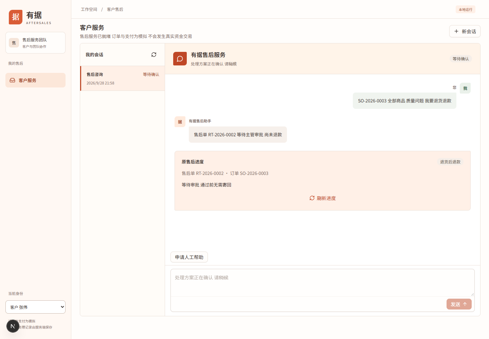
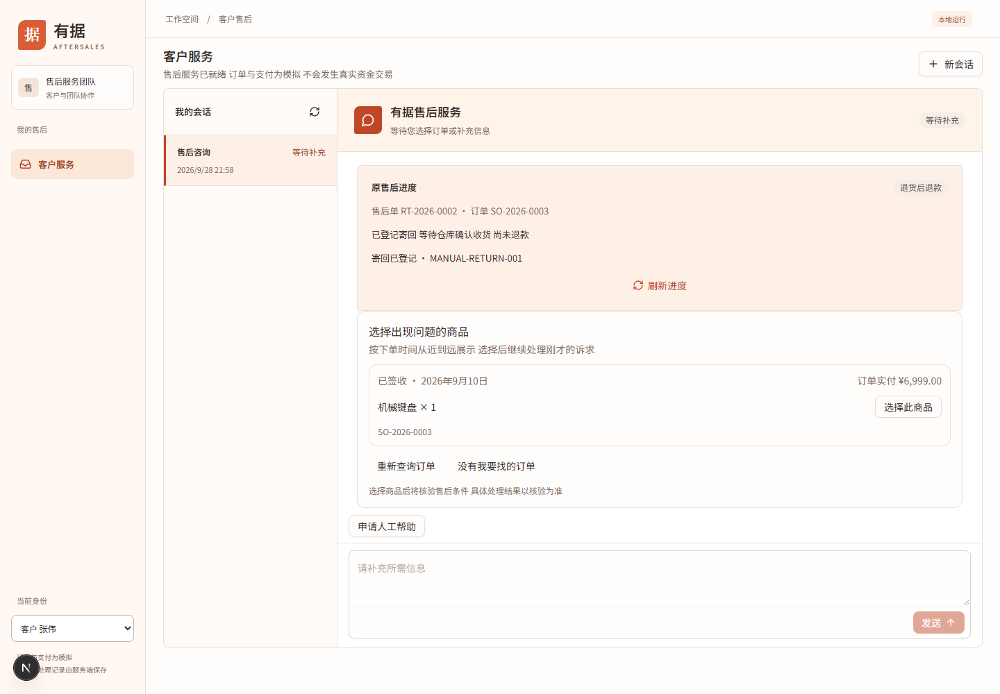
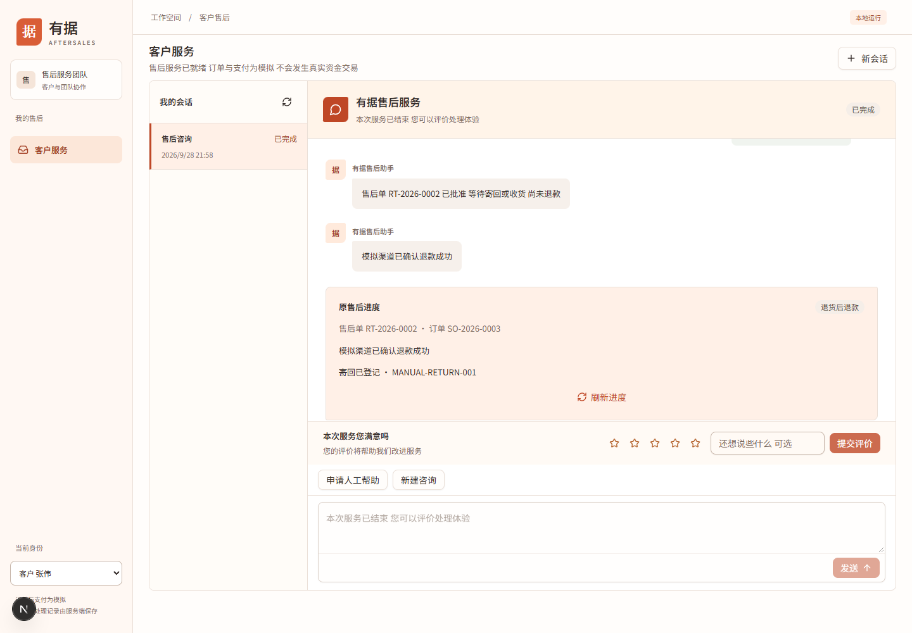

# 完整示例：从申请到退款与恢复

本案例使用客户张伟 C1001、主管和售后专员。订单与运单全部是演示数据，金额是专用夹具设置，不是实际商品售价。可复现脚本会同步商品明细价格与订单实付，避免只改订单总额而未达到审批条件。

## 数据与环境

在 `D:\project\agent-new\aftersales` 执行：

```powershell
node --import tsx docs/manual/devops/demo.ts
```

前提是 Node 22 及项目依赖已安装。脚本不读取 `.env` 和供应商密钥，每次创建新的临时目录，启动独立 API 和模拟支付渠道，结束时关闭本次进程；不启动网页，不 build。它验证 HTTP 业务闭环，网页截图是另一次独立页面操作，两者不共用运行编号。

| 订单         | 初始条件                                                 | 目标                         |
| ------------ | -------------------------------------------------------- | ---------------------------- |
| SO-2026-0001 | C1001，未发货，29900 分，即 299 元                       | 小额仅退款和同请求重放       |
| SO-2026-0003 | C1001，已签收，699900 分，即 6999 元，签收时间为本次运行 | 主管审批、寄回、收货后退款   |
| SO-2026-0005 | C1001，未发货，29900 分                                  | 模拟渠道结果未知，保持待核验 |

普通 `pnpm dev:offline` 使用原基线库，数据和日期可能不同。不要直接期待相同订单号一定自动通过或进入审批；要原样复现请运行上面的隔离脚本。

## 案例一：未发货仅退款

客户提交 `SO-2026-0001 未发货 我要退款`。系统查单和核验政策后受理原售后，等待原进度 `succeeded`。脚本使用同一个请求键重发一次相同请求，要求 `runId` 与 `taskId` 相同，模拟渠道仅有一次提交和一次成功资金动作。

再用客户李娜访问这条客户进度，预期 HTTP 403。这个失败是权限隔离的成功验证，不是退款失败。

操作结果应同时满足：退款成功、原请求身份未变、渠道 `submissions=1` 与 `charges=1`。文字“将原路退回”不能替代这些检查。

## 案例二：主管审批后寄回退款

手工操作网页前，先按[隔离 API 与网页准备步骤](../devops/examples.md)执行 `--prepare-only` 并启动两个服务；不要先运行自动演示消费相同订单。该章提供完整 Web 启动命令和收货请求，打开页面后再执行下面的客户操作。

1. 客户发送 `SO-2026-0003 全部商品 质量问题 我要退货退款`。如果自己操作其他多商品订单，需要明确选定要退的商品。
2. 等待 `awaiting_approval`。本案例申请 6999 元，达到当前大额退款阈值 5000 元，需要主管审批。客户此时没有寄回提交入口。
3. 主管进入“待审批事项”，找到对应客户、金额和会话，点击同意。具体核对步骤见[审批案例](../admin/examples.md)。
4. 客户刷新原会话，等待 `awaiting_shipment`，填写 `MANUAL-RETURN-001` 并登记寄回。
5. 等待 `awaiting_receipt`。此时模拟渠道不能出现这笔退款的资金提交，不能向客户说已退款。
6. 仓库核验商品后，专员通过内部收货接口提交**实际返回的售后单号**。
7. 等待 `succeeded`，核对模拟渠道提交与成功次数均为 1，以及客户完成事件只有一次。



图 1：2026-09-28，本次独立网页演示等待主管确认。



图 2：2026-09-28，已登记运单但尚未收货，退款不能提前执行。



图 3：2026-09-28，正式收货接口推进后，客户原会话展示模拟退款结果。

脚本在批准后、客户登记运单前停止并重启原 API，再从同一双库继续操作；同键重放寄回请求也只能保留一次业务登记。这说明已验证原流程在该中断点可恢复，不代表任意崩溃位置均已验证。

## 案例三：渠道结果未知

脚本只在本次独立渠道设置下一笔返回 unknown，再提交 `SO-2026-0005 未发货 我要退款`。客户进度应为 `unknown`，渠道提交一次，成功计数为零。这里的零仅是本次模拟渠道记录，不能外推为生产渠道一定没有扣款。

预期操作是保留原退款身份并核验；不得换请求键重复发款，不使用旧“断点恢复”作为退款重发开关。等待核验不是通过清空数据库来解决的问题。

## 备份恢复与成功判断

脚本停止写入，成对备份业务库和渠道库，再恢复到新空目录。恢复后两笔成功退款和一笔未知退款必须保持原状态，渠道计数不增加，整体业务快照一致。

成功时终端打印“演示通过”和 `summary.json` 路径，退出码为 0。查看该文件中的 `ready`、`refund-and-replay`、`approval-and-wait`、`restart-and-receipt`、`unknown-preserved`、`backup-restore` 六段记录。

失败时保留 `failure.json` 与 `process.log`。依赖加载失败可能发生在创建失败记录之前，不能以没有失败文件认定成功。再次运行会产生新目录，是新一轮演示，不是恢复旧演示。

本次实际结果和旧脚本差异见[验证记录](../devops/verification.md)。需要手动请求时使用[接口示例](../devops/examples.md)，需要迁移日常数据时使用[运维手册](../devops/operations.md)。
