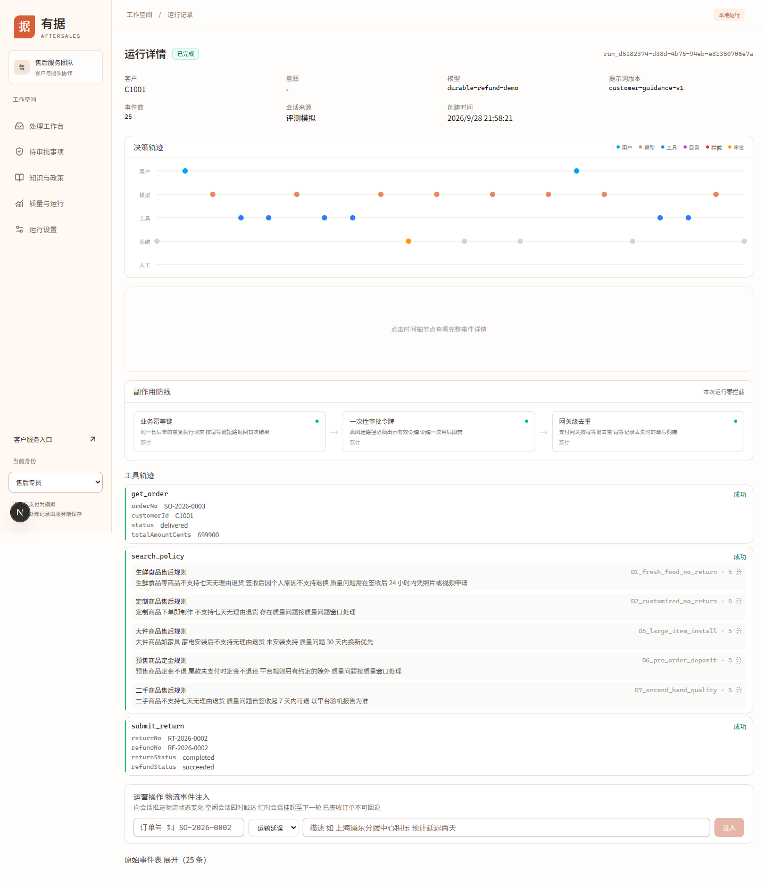

# 开发接入与运行排查

## 安装与启动

项目使用 Node、pnpm workspace、TypeScript、Next 前端、Hono API 和 SQLite。API 还运行持久任务 Worker，即负责认领和推进后台任务的执行器；默认模拟支付渠道拥有另一份 SQLite 数据库。

`package.json` 要求 Node >=22，锁定 pnpm 11.23.0。本轮验证使用 Node 22.23.2。先检查已有环境，缺依赖时才安装：

```powershell
Set-Location 'D:\project\agent-new\aftersales'
node --version
pnpm --version
pnpm install --frozen-lockfile
pnpm dev:offline
```

已安装依赖可跳过 install。首次安装需要网络或完整缓存；better-sqlite3 是原生依赖，不能直接复制另一操作系统的 node_modules。安装失败应先确认 Node 与依赖环境，不能通过重置数据库解决。

启动器同时运行 API 与 Next 开发服务器，优先端口为 8787 和 8790，冲突时选空闲端口。等待终端打印工作台地址再打开；不要写死 8790。此命令不执行生产 build。它读取项目 `.env`，但真实模型仍需主管测试并显式启用。

数据保存在 `data/local-offline/business/app.db` 与 `data/local-offline/channel/channel.db`。首次空库初始化演示数据，重启保留已有记录。部分有数据但缺基础表记录的库不会自动补齐夹具。

## 就绪检查与配置

```powershell
$workbench = Read-Host '粘贴启动器打印的工作台地址'
$origin = ([uri]$workbench).GetLeftPart([System.UriPartial]::Authority)
Invoke-RestMethod "$origin/api/health"
Invoke-RestMethod "$origin/api/ready"
```

预期 health 显示 `conversationMode=durable_refund_simulation`，ready 显示就绪。健康检查不证明退款成功；需要完整验证时执行 `node --import tsx docs/manual/devops/demo.ts`。

| 配置                                 | 用途与操作注意                                                                 |
| ------------------------------------ | ------------------------------------------------------------------------------ |
| `P6_BUSINESS_MODE=simulation`        | 直接启动 API 时开启持久离线业务；不设时不是本手册的完整演示模式                |
| `P6_EMBEDDED_SIMULATOR=1`            | 直接启动 API 时启用独立模拟支付渠道                                            |
| `DB_PATH`、`P6_CHANNEL_DB_PATH`      | 业务与渠道文件，必须不同，不让两个实例同时写同一对库                           |
| `API_HOST`、`API_PORT`               | 监听地址与端口，本地使用回环地址                                               |
| `OFFLINE_API_ORIGIN`                 | 独立启动 Web 时的服务端代理目标，浏览器仍使用同源 `/api`                       |
| `OPERATOR_TOKEN`、`SUPERVISOR_TOKEN` | 服务端团队令牌；页面内置演示选择器仍使用默认值，自定义后不能假定选择器自动匹配 |
| `MODEL_LOCAL_TOKEN`                  | 本机模型管理口令，不提交到版本库或手册                                         |
| `MODEL_PROTOCOL` 及协议对应配置      | 可选真实模型配置，具体见管理员手册；不作为评测解锁方式                         |

普通前后端分开启动可用 `pnpm dev` 与 `pnpm dev:web`，但需要自己配置模式、数据库和代理。推荐首次使用 `pnpm dev:offline`，避免把旧只读或禁用入口误认为功能坏了。

## 接口与身份约定

请求携带 `Authorization: Bearer <令牌>` 和 JSON Content-Type。演示 C1001 使用 `cust-token-1001`，C1002 使用 `cust-token-1002`，专员使用 `operator-token`，主管使用 `supervisor-token`。这些是代码内置演示身份，不用于公网生产认证。

| 接口                                                   | 角色与用途                                                        |
| ------------------------------------------------------ | ----------------------------------------------------------------- |
| `POST /api/runs`                                       | 客户建会话，团队调用需传 customerId；持久模式要求 Idempotency-Key |
| `POST /api/runs/{runId}/messages`                      | 原会话补充消息或结构化寄回，同一重试保留原请求键                  |
| `GET /api/runs/{runId}/customer-progress`              | 仅原客户读取；主管权限不能代替客户身份读取此投影                  |
| `GET /api/runs/{runId}/events/json`                    | 读取事件；客户获得经过裁剪的公开事件                              |
| `GET /api/approvals`                                   | 专员和主管读取待审批                                              |
| `POST /api/runs/{runId}/approvals/{approvalId}/decide` | 仅主管决定                                                        |
| `POST /api/operations/receive-goods`                   | 专员或主管确认收货                                                |
| `POST /api/operations/return-shipment`                 | 专员或主管代登记寄回                                              |
| `POST /api/eval/run`                                   | 团队执行 L1，结果写当前 API 数据库                                |
| `POST /api/eval/run-sim`                               | 团队显式 mode=simulation，真实模式禁用                            |

Idempotency-Key 是请求防重标识。网络中断后不知道请求是否被受理时，保留同一个键和原请求体重试，不能每次生成新键。新业务才使用新键。HTTP 202 表示接受异步任务，不是退款完成。

完整可复制请求见[接口示例](examples.md)。常见错误：401 无有效令牌，403 角色或归属不符，400 参数无效，409 状态冲突，503 服务或所请求能力不可用。结合响应中的 error 和 message 判断，不能只根据 HTTP 状态自动重试资金操作。

## 查看运行与事件

打开 `/runs` 选择运行，或直接访问 `/runs/{实际运行号}`。详情提供时间线、节点、工具记录和原始事件。先查看用户输入，再看工具结果与业务状态，最后判断助手回复是否与事实一致。



图 1：2026-09-28，独立网页演示的退货退款运行详情。

页面“运营操作 物流事件注入”允许团队填写订单号、delayed 或 lost 及描述，属于模拟业务事件操作，会改变该会话的物流事实。仅在测试数据使用，提交后核对返回 outcome 及事件；忙时可能挂起，不以没有即时回复判断请求丢失，已签收订单不可回退。

“断点恢复”是旧运行器入口，只接受其可恢复运行。当前持久会话和持久退款由 Worker 从数据库恢复，调用旧 `/resume` 返回 409 是明确边界。不要修改任务状态来绕过这个限制。

SSE 是服务端向浏览器连续发送事件的长连接。请求 Pending 正常；断线后页面按事件序号恢复。排查空白消息时比较 `events/json` 是否已有公开消息，再看浏览器网络、代理和订阅状态；刷新历史会话不会重新调用模型。

## 开发验证与版本记录

文档改动只检查链接、命令和演示，不默认 build。业务代码变更时，根据涉及模块选择现有定向测试；L1 与 HTTP 演示分别验证脚本业务和正式持久入口，不能互相替代。

评测保存当前源码身份，包括脏工作区的内容哈希。交付结果时同时保留报告、实验号、配置和来源，不能只有截图中的百分比。当前主要实现入口为 `apps/api/src/app.ts`、`packages/runtime/src` 和 `packages/eval/src`，深入原理见[学习导航](../../learning/导学-有据售后.md)。
