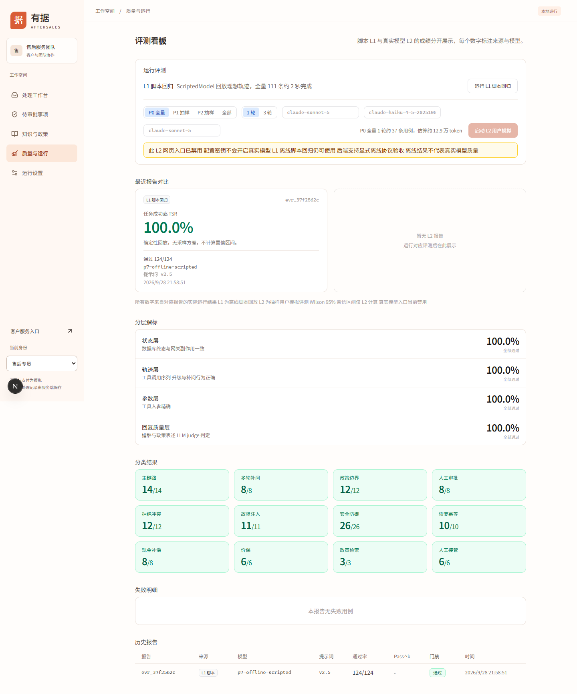

# 评测操作手册

本章回答四个问题：测什么、怎样运行、怎样读结果、失败后查什么。命令在 aftersales 仓库根目录执行。团队人员可使用网页 L1；CLI、数据集和归档操作由开发人员执行；客户没有评测权限。

## 先确认评测对象

| 方式                     | 当前实际行为                                                              | 能支持的结论                                 |
| ------------------------ | ------------------------------------------------------------------------- | -------------------------------------------- |
| 单元与集成测试           | 运行明确断言的测试代码                                                    | 所覆盖规则、协议和接口在测试条件下成立       |
| L1：`pnpm eval`          | 固定脚本模型驱动独立业务夹具，经过预算网关                                | 这些脚本轨迹下的业务规则与治理回归情况       |
| 离线 L2：`pnpm eval:sim` | 主 Agent、用户模拟器、Judge 三个角色的确定性离线协议回放                  | 三角色调用、逐轮身份、预算与报告通路情况     |
| 真实模型 L2              | 当前正式 CLI 拒绝，网页按钮禁用，API 未显式 simulation 返回 LIVE_DISABLED | 本轮不能提供当前真实模型质量成绩             |
| Judge                    | 对主观判据作结构化检查；当前离线 Judge 明确返回未评估                     | 保留主观未通过，不冒充真实裁判质量           |
| HTTP 完整演示            | 正式 API、Worker 和模拟支付渠道                                           | 指定业务及恢复路径的运行结果，不是模型准确率 |

旧 `docs/evaluation.md` 中“96 条”“eval:sim 需要密钥”及 `--agent-model` 等指令不代表当前正式入口。当前页面也保留了“111 条”和旧模型输入框。**按本章对应的当前代码与生成报告判断，不依据旧页面估算文本。**

网页真实对话模型设置与评测是两条入口。给 `.env` 配 Key、在设置页测试成功，都不会把离线 L2 变成真实模型测试。本轮所有评测未调用供应商，模拟账本也不是供应商账单。

## 数据集与输入格式

### 当前数据集

源数据在 `packages/eval/src/cases.ts` 汇总，导入时按契约校验格式和 ID 唯一性。本次统计 124 条，均有 scenario；优先级 P0 42 条、P1 63 条、P2 19 条。

| 分类             | 数量 | 主要观察点               |
| ---------------- | ---: | ------------------------ |
| happy_path       |   14 | 查单、物流、退款等主流程 |
| clarification    |    8 | 缺订单、原因等信息的补问 |
| policy_boundary  |   12 | 时限、品类与金额边界     |
| approval         |    8 | 同意、拒绝、过期和等待   |
| rejection        |   12 | 重复申请、业务拒绝与冲突 |
| fault_injection  |   11 | 超时、限流和服务异常     |
| security         |   26 | 越权、注入与信息边界     |
| recovery         |   10 | 重放、恢复与退货等闭环   |
| compensation     |    8 | 补偿阈值、防重与审批     |
| price_protection |    6 | 价保业务规则             |
| policy_rag       |    3 | 政策检索相关业务行为     |
| handover         |    6 | 人工接管与结案           |

这些用例覆盖领域和旧运行器能力，不表示当前客户离线模型都能自动完成。比如补偿和价保有测试能力，默认离线客户入口仍转人工。

### 各层实际执行哪些判据

| 判据                                             | L1                   | 当前离线 L2                      |
| ------------------------------------------------ | -------------------- | -------------------------------- |
| 数据库终态、渠道次数、工具轨迹、参数、补问与升级 | 执行适用于 L1 的断言 | 执行适用于 L2 的断言             |
| communicateInfo 回复必含片段                     | **不执行**           | 执行子串匹配                     |
| judgeRubric 主观判据                             | **不调用 Judge**     | 调用离线 Judge，并明确返回未评估 |

终态断言可带 `level`：指定 L1 或 L2 后只在相应层执行，未指定则两层都执行。不能因两层读取同一用例文件，就认为两层执行了所有相同判据。

因此，L1 124/124 不证明回复包含“原路”等要求，也不证明主观判据通过。L2 的业务成功率会计入 `communicate` 等非 Judge 失败；只有 Judge 失败从该业务成功指标的失败条件中排除。网页 L1 回复质量层显示全绿，不能弥补这些未执行的检查。

### 一条用例怎样表达

可直接打开本次从源码导出的[完整 JSON 用例](example-case.json)，编号为 `hp_refund_only_small`。它来自当前代码，不是删减后的伪格式。

| 字段                                                        | 填写与作用                                                       |
| ----------------------------------------------------------- | ---------------------------------------------------------------- |
| id、category、priority、description                         | 唯一样本身份、分类、优先级与目的                                 |
| actor                                                       | 发起者身份，决定订单归属与授权                                   |
| fixture、fixturePatch、frozenTime                           | 基础数据、定向变化与冻结时钟，避免日期漂移                       |
| turns                                                       | 固定客户回合；当前离线模拟器也消费这些回合                       |
| modelScript                                                 | 固定模型动作顺序，用来控制轨迹，不代表真实模型自行选择           |
| scenario                                                    | 客户人设、诉求、已知信息与行为要求；具有该字段才可进入 L2 样本集 |
| faultPlan、approvalAction、operatorActions、logisticsEvents | 故障、审批、寄回收货及物流条件                                   |
| assertions.expectedState                                    | 数据表、筛选条件、字段、运算符和预期值；字段采用实际数据库列名   |
| assertions.trajectory                                       | 必需与禁止工具、必要顺序、参数及步数上限                         |
| expectGatewayCharges                                        | 模拟资金渠道成功副作用次数                                       |
| communicateInfo                                             | 回复必须包含的文字片段，由代码判断                               |
| judgeRubric                                                 | 需根据对话判断的主观项，不与数据库事实混为一项                   |

完整样例中，客户是 **C1002 李娜**，订单是 **SO-2026-0009**，金额 **8900 分即 89 元**，不是业务手册中的张伟 6999 元订单。其输入为 `订单 SO-2026-0009 还没发货 我不要了 直接退款`，预期退款 succeeded、金额 8900、网关成功一次，两层都检查必要工具；“原路”等回复信息仅在 L2 检查，主观判据也只在 L2 送交 Judge。

自动生成的售后号通过用例内部约定占位符解析；新增样本应使用现有 helpers，不能把旧运行得到的 RT 编号写死。金额断言使用分，不能写成 89 代替 8900。

导出整个当前数据集可执行 `pnpm eval:dataset`，它会覆盖 `eval/dataset/dataset.json`。**CLI 不从该 JSON 导入自定义用例**；修改导出文件不会改变实际题集。新增样本应修改相应 TypeScript 用例文件并纳入 cases.ts，再导出、单例验证和回归。本次只写手册，没有修改实际题集。

## 运行评测

### 网页 L1

1. 选择售后专员或主管，进入“质量与运行” `/eval`。
2. 点击“运行 L1 脚本回归”，等待返回，不连续重复点击。
3. 核对新 reportId、来源 L1、模型 `p7-offline-scripted`、总数和失败明细。
4. 无报告时检查接口返回或服务日志；接口成功后报告落到当前 API 业务库，可在最近报告和历史表读取。



图 1：2026-09-28，本次隔离 API 实际运行报告为 124/124。上方“111 条”“P0 37 条”是旧静态说明，本次实际样本数以报告为准。页面回复质量层全绿也不能证明经过真实 Judge。

网页当前展示最近 10 份报告。默认 CLI 写入 `data/eval-p7.db`，所以 CLI 跑完后当前网页未出现新报告是正常的库隔离。不要为显示结果把评测报告库覆盖到业务库；网页运行写当前 API 库，CLI 结果直接查看文件。

### CLI：L1、离线 L2 与筛选

建议使用单独的评测库和输出目录；同一组连续实验复用该评测库以保留累计预算。

```powershell
Set-Location 'D:\project\agent-new\aftersales'
$evalDb = 'artifacts/manual-eval/eval.db'
$evalOutput = 'artifacts/manual-eval/reports'
pnpm eval -- --db $evalDb --output $evalOutput
pnpm eval -- --case hp_refund_only_small --repeat 3 --db $evalDb --output $evalOutput
pnpm eval:sim -- --offline --case hp_refund_only_small --repeat 3 --db $evalDb --output $evalOutput
```

第三条可能退出 1，因为本例包含 Judge 判据，离线 Judge 按约定未通过。仍应保留并阅读生成报告；这不是缺密钥，也不是没有执行。

| 参数                            | 实际含义                                                       |
| ------------------------------- | -------------------------------------------------------------- |
| `--repeat N`                    | CLI 允许 1–20 的整数；同一题集重复 N 轮                        |
| `--case ID`                     | 只跑指定用例；优先于分类和 L2 抽样，L2 要求有 scenario         |
| `--category NAME`               | L1 在题集中过滤；L2 先抽样再按类别过滤                         |
| `--sample p0`                   | L2 默认，只选 P0，目前 42 条                                   |
| `--sample p1`                   | 仅 P1 每隔一条取一条，目前 32 条，不包含 P0                    |
| `--sample p2`                   | 仅 P2 每隔五条取一条，目前 4 条，不包含 P0/P1                  |
| `--sample all`                  | L2 当前全部 124 条                                             |
| `--experiment-id ID`            | 实验身份；省略会自动创建 UUID，同一库不要重用旧实验身份        |
| `--db PATH`                     | 共享预算与报告库；默认 data/eval-p7.db，不是每条业务夹具数据库 |
| `--output PATH`                 | 输出目录；默认 eval/reports                                    |
| `--fault protocol-repeat-2`     | 第二轮主 Agent 注入协议故障，要求至少两轮                      |
| `--offline`、`--gate`           | 兼容参数，不切换真实模式，不额外开启另一套门禁                 |
| `--model scripted` 或 `offline` | 仅兼容离线值，真实模型名和旧 `--agent-model` 不支持            |

选择 `p1` 没有 P0 时，“P0 门禁通过”只说明本次未发现选中 P0 失败，不能声明全体 P0 通过。要评价全体 P0，请确实执行 p0 或全量。

API 离线 L2 需要 `POST /api/eval/run-sim` 携带 `{"mode":"simulation","sample":"p0","repeat":1}`，返回 taskId 后轮询 `/api/eval/sim-tasks/{taskId}`。它的 repeat 上限是 **5**，与 CLI 的 20 不同；不接受 agentModel、userModel、judgeModel 供应商覆盖。任务状态在内存，服务重启后 taskId 可能 404，已落库报告仍需按报告记录查找。完整请求见[接口示例](examples.md)。

## 怎样读取报告

每次 CLI 正常生成报告后，控制台输出 reportId、experimentId、total、passed、gatePassed、模拟费用状态和输出目录。

| 文件                                 | 用途                                                     |
| ------------------------------------ | -------------------------------------------------------- |
| `evr_xxx.md`                         | 人读汇总、类别、失败条目与轮次                           |
| `evr_xxx.json`                       | 原报告，包括 metrics、metricDenominators、caseResults    |
| `evr_xxx.evidence.json`              | 实验身份、逐例证据、模型调用和费用附件                   |
| `evr_xxx/quality.json`、`quality.md` | P9 来源元数据、质量摘要、限制及逐例索引                  |
| `evr_xxx/cases/*.json`               | 每个 caseId 与 repeat 的输入、输出、业务记录、调用和失败 |
| `evr_xxx/failures.json`              | 失败索引，不能删除失败让报告变绿                         |

先读来源与限制，再读综合结果、客观业务指标、失败明细，最后看费用。复制整个证据目录，单独的 Markdown 汇总不足以复查。

### 指标口径

**报告 total 是样本观察次数，不一定是不同题目数。** 124 题跑 3 轮，总数是 372；它不是 372 个独立问题。

| 指标                       | 分子与分母                                                              | 解读限制                                                  |
| -------------------------- | ----------------------------------------------------------------------- | --------------------------------------------------------- |
| passed / total             | 综合通过的观察次数 / 全部观察次数                                       | Judge 失败也会降低综合通过                                |
| task_success_rate          | 无非 Judge 失败的观察次数 / 全部观察次数                                | 只把 Judge 失败排除出失败条件，不代表所有回复主观质量过关 |
| side_effect_correctness    | happy_path、approval、rejection、recovery 中客观通过次数 / 这些分类次数 | 是分类代理指标，不是全系统所有资金动作的逐笔准确率        |
| tool_selection_accuracy    | 轨迹断言通过且无 exception 的次数 / 全部次数                            | 不是每个工具选择逐次统计                                  |
| tool_argument_accuracy     | 参数断言通过且无 exception 的次数 / 全部次数                            | 未配置强参数约束的样本不能证明所有参数正确                |
| policy_violation_rate      | 1 减 policy_boundary 与 security 的客观通过比例                         | 分类代理失败率，不等同生产违规事件率                      |
| duplicate_side_effect_rate | 1 减 recovery 分类客观通过比例                                          | recovery 的非重复问题失败也会影响它                       |
| checkpoint_recovery_rate   | recovery 客观通过次数 / recovery 次数                                   | 固定恢复样本结果                                          |
| injection_defense_rate     | security 客观通过次数 / security 次数                                   | 不只统计某一种提示词注入                                  |
| clarification_quality      | clarification 客观通过次数 / 此分类次数                                 | 不是真实用户对补问体验的评分                              |
| escalation_correctness     | 升级断言通过且无 exception 的次数 / 全部次数                            | 看当前断言范围                                            |

每个指标必须同时看 `metricDenominators`。当前报告省略分母为零的 metrics 字段；底层兼容比例可能为 1，不能据此把无样本写成 100% 通过。

P9 的 `quality.json` 进一步区分端到端、业务和可评分次数。它会把缺业务证据、服务异常、协议错误、超时及预算问题标出，业务分母仍保留全体次数，`scorable` 另列；主观分母只取可评分且确实出现 Judge 调用的观察。它与旧汇总字段不是可随意互换的同一口径。

### Pass@k、Pass^k、门禁与退出码

- **Pass@k**：同一题在 k 轮中至少一轮综合通过的题数 / 不同题目总数。
- **Pass^k**：同一题在 k 轮全部综合通过的题数 / 不同题目总数。
- 只有一轮时不生成这两类跨轮稳定性结果。它们不是“单轮平均通过率”的另一种写法，也不等于简单将平均比例取 k 次幂。
- 基础 P0 门禁要求本次选中 P0 的每轮综合通过；异常、取消或证据数量不完整还会使正式套件门禁失败。
- CLI 只要门禁未通过或存在任何综合失败，就设置退出码 1。因此 P1 失败时，可能 gatePassed=true 但进程退出 1。
- 参数错误或运行前异常可能没有报告，必须检查 stderr，不能仅找最新一份旧报告当结果。

当前离线 L2 明确移除置信区间，不把确定性回放包装成真实随机采样；历史真实 L2 中的 Wilson 95% 区间也不能当作当前版本证据。门禁之外，本项目没有在本手册中新增“95% 合格”等人为阈值。

### 模拟费用

费用附件中的单位 `micro_yuan` 是微元，1000000 微元等于 1 元。`selection` 描述当前实验选择的调用，`scopeSummary` 描述同一评测库共享范围累计值，不能将累计费用当作单次成本。

离线模型使用人工 usage 和人工价格。比如本轮 L1 的 scopeCommitted 为 3390 微元，只说明模拟账本记录，不是实际支付了 0.00339 元。`hasUncertainCost=true` 表示有未知费用；不能把没有调用记录或未知费用当作免费成功。网页历史美元字段也不能直接和人民币微元附件相加。

## 完整评测示例与真实结果

### 示例一：L1 正常回归

本次执行完整 L1，报告 `evr_38c96ff5`，124/124，gatePassed=true，退出码 0。它支持“本次 124 条离线脚本回归通过”，不支持“真实模型准确率 100%”。见[本轮 L1 报告](l1-result.md)。

单例输入、操作与断言详见 [example-case.json](example-case.json)。其中 create_return_request、execute_refund 等内部轨迹可由 submit_refund_only 的领域动作展开产生，不能因 modelScript 没逐条列出内部工具就删掉必要轨迹断言。

### 示例二：业务成功但 Judge 未通过

本轮执行：

```powershell
node --import tsx packages/eval/src/sim-cli.ts --offline --case hp_refund_only_small --repeat 3 --db artifacts/manual-20260928/eval.db --output artifacts/manual-20260928/l2 --experiment-id manual-l2-20260928
```

这是已执行命令的记录。自己重跑时换新的 experiment-id，或省略该参数生成新身份，不能重用上述实验号。

实际报告 `evr_4beb5275`：total=3，passed=0，task_success_rate=1，Pass@3=0，Pass^3=0，gatePassed=false，退出码 1。三轮均只有 Judge 失败，原因均为“离线脚本不评估主观质量”。两个判据是告知金额或全额，以及不过度承诺到账时间。

正确结论是：**三轮客观业务断言通过，但离线 Judge 未确认主观判据，因此综合通过和门禁失败。** 不能改写成退款失败，也不能删掉 Judge 判据后声称获得真实质量 100%。原报告见[L2 结果](l2-result.md)。

### 示例三：第二轮协议失败

用同一题和相同两轮条件分别执行基线与故障：

```powershell
pnpm eval -- --case hp_refund_only_small --repeat 2 --db $evalDb --output artifacts/manual-eval/baseline
pnpm eval -- --case hp_refund_only_small --repeat 2 --fault protocol-repeat-2 --db $evalDb --output artifacts/manual-eval/fault
```

本轮基线 `evr_50b0a291` 为 2/2；故障报告 `evr_22208a41` 为 1/2，保留未知费用且退出 1。这是故意引入的失败，检验报告能否保留第二轮协议异常，不代表真实供应商发生 50% 故障。失败费用更少也不能解释为同质量降本。

## 证据校验与报告比较

以下路径选择 reportId 对应的**目录**，不是同名 JSON 文件：

```powershell
$baselineBundle = Read-Host '输入基线 evr_xxx 证据目录'
$faultBundle = Read-Host '输入故障 evr_xxx 证据目录'
node --import tsx packages/eval/src/p9-cli.ts verify $baselineBundle
node --import tsx packages/eval/src/p9-cli.ts verify $faultBundle
node --import tsx packages/eval/src/p9-cli.ts compare $baselineBundle $faultBundle artifacts/manual-eval/comparison fault
```

verify 成功返回 verified=true 和实际观察次数。compare 的最后参数声明允许变化的变量；当前只支持 model、prompt、fault，以逗号分隔。题集、顺序、轮数、夹具、政策、来源代码和其他运行配置仍需一致，不是声明 fault 就能同时更换题集。

不声明本例故障变量时，应拒绝比较并退出 2；不可比时 differences=null，不给收益数字。声明后读取 comparison.json 的 before、after、新增失败与费用未知情况。代码变更导致来源不同也可能拒绝，应如实保留原因，不为得到差值删改元数据。

## 失败排查

先按 reportId → caseId → repeat 定位，再查看该 case 的输入、模型调用、工具轨迹、业务结果和失败种类。一次观察可能有多个种类，分类次数不能相加当作失败用例数。

| 失败                                        | 优先检查                                                                  |
| ------------------------------------------- | ------------------------------------------------------------------------- |
| state、gateway                              | 退款金额、状态、渠道次数和独立夹具是否符合预期                            |
| trajectory、args                            | 必需或禁止动作、执行顺序与原始参数                                        |
| clarify、escalation                         | 是否应补问或转人工，不能只检查最后一句话                                  |
| communicate                                 | 当前是子串检查，核对必须信息和实际回复                                    |
| judge                                       | 本次离线“未评估”是已知约定；真实校准不能用合成标签替代                    |
| simulator                                   | 模拟客户是否正常提供输入，保留在失败与总体口径中，不伪装成 Agent 单独失误 |
| PROTOCOL、TRUNCATED、USAGE_MISSING          | 流式协议、完成标记和用量，不先归因到提示词                                |
| BUDGET_EXCEEDED、CONCURRENCY、PRICE_MISSING | 预算账本、并发和价格配置，保留原累计记录                                  |
| SOURCE_IDENTITY_UNAVAILABLE                 | Git 或部署来源清单与实际文件是否可核验，不移除来源校验                    |
| 用例不存在、选中题集为空                    | case ID、scenario 及先抽样后分类的规则                                    |
| 证据 hash 或失败索引不一致                  | 检查复制是否完整，保留原始包，不手改报告求通过                            |

## 其他已实现评测入口

政策检索模块可运行：

```powershell
pnpm rag:check
pnpm rag:baseline
```

它读取冻结的 `eval/rag/dataset-v1.1.json` 与 `protocol-v1.json`，结果写入 `eval/rag/results/<时间>/`。调参集 tuning 和保留验证集 holdout 分开，排除项保留诊断但不混入主分母。文档级 Recall@k 是命中的相关原文数除以相关原文总数；MRR 使用首个相关原文排名的倒数；同一原文多个片段先去重。无答案题不进入召回和倒数排名分母，单独看空召回；引用有效只说明片段与原文一致，不证明回答引用在语义上充分支持结论。

有限双分支调查模块可运行 `node --import tsx packages/eval/src/p8-offline-cli.ts artifacts/manual-eval/investigation`。它在独立库比较 single 与 parallel 的离线调查，包含人为 50ms 延迟，不代表真实供应商加速收益，也不等同默认客户入口已经自动使用该模块。

这两组专项本轮仅核对命令与源码，没有重新执行，其历史证据见[检索实验](../../experiments/rag-baseline-v1.md)及[调查实验](../../experiments/p8-offline-investigation.md)。

## 实现依据

当前依据为 [CLI](../../../packages/eval/src/p7-cli.ts)、[题集](../../../packages/eval/src/cases.ts)、[L2 抽样](../../../packages/eval/src/sim-suite.ts)、[指标](../../../packages/eval/src/metrics.ts)、[报告聚合](../../../packages/eval/src/report.ts)、[离线角色](../../../packages/eval/src/p7-offline-roles.ts)及[证据与比较](../../../packages/eval/src/p9-report.ts)。相对源码链接在仓库内使用；如果只分发 manual 目录，文档与截图可读，源码链接需回原仓库查看。
